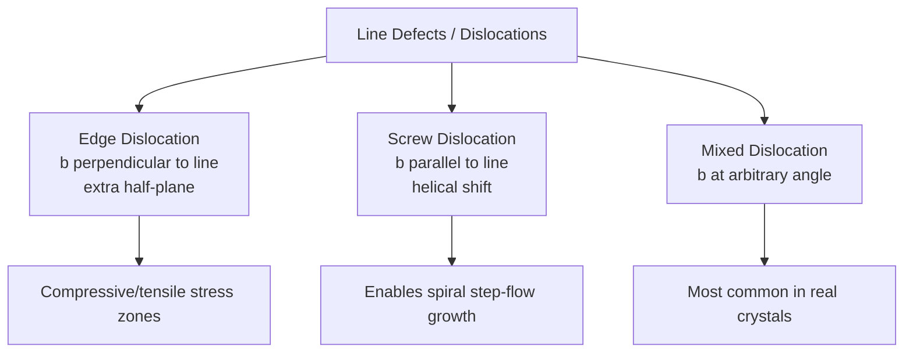

## Point, Line, and Planar Crystal Defects


### Overview

Real semiconductor crystals inevitably deviate from perfect periodic lattice arrangements. These deviations, or **crystallographic defects**, are classified by dimensionality: zero-dimensional (point defects), one-dimensional (line defects/dislocations), and two-dimensional (planar defects). Defects critically influence carrier lifetime, mobility, diffusion behavior, mechanical strength, and device yield.

### Point Defects (0-Dimensional)

**Vacancies**

A vacancy is a missing atom at a normal lattice site.

**Key Points**

- Denoted using Kröger-Vink notation, e.g., $V_{Si}$ for a silicon vacancy
- Thermodynamically favored at any temperature above 0 K due to entropy gain, with equilibrium concentration:

$$n_v = N \exp\left(-\frac{E_v}{k_B T}\right)$$

where $N$ is the total lattice site density, $E_v$ is the vacancy formation energy, $k_B$ is Boltzmann's constant, and $T$ is absolute temperature.

- In silicon, $E_v \approx 3$–4 eV depending on charge state [Unverified — formation energy is charge-state and Fermi-level dependent, with a spread of reported DFT and experimental values]

**Interstitials**

An interstitial is an extra atom occupying a non-lattice position within the crystal structure.

- **Self-interstitial**: a host atom (e.g., $Si_i$) in an interstitial site
- **Foreign interstitial**: an impurity atom occupying an interstitial position without displacing a lattice atom (common for small atoms like Cu, Fe, Li in Si)

**Frenkel and Schottky Defects**

- **Frenkel defect**: an atom displaces from its lattice site into an interstitial position, creating a vacancy-interstitial pair. Common in ionic and compound semiconductors (e.g., cation Frenkel defects in II-VI compounds)
- **Schottky defect**: a stoichiometric set of vacancies (e.g., one cation vacancy + one anion vacancy in a compound) forms without any interstitials, preserving charge neutrality and stoichiometry

**Substitutional and Antisite Defects**

- **Substitutional impurity**: a dopant atom (P, B, As) replaces a host atom at a normal lattice site — the basis of intentional doping
- **Antisite defect**: in compound semiconductors, one sublattice atom occupies the other sublattice's site (e.g., $As_{Ga}$ in GaAs, a well-known deep-level defect responsible for semi-insulating behavior in undoped GaAs)

**Example**

The $As_{Ga}$ antisite defect (also called EL2) in semi-insulating GaAs pins the Fermi level near mid-gap, enabling high-resistivity substrates used for microwave and RF device isolation.

**Point Defect Diagram (svg_diagram)**



```
<svg xmlns="http://www.w3.org/2000/svg" viewBox="0 0 500 200" width="500" height="200">
  <title>Point Defect Types (svg_diagram)</title>
  <rect width="500" height="200" fill="#ffffff" />
  
  <g stroke="#a0aec0" stroke-width="1">
    <line x1="20" y1="40" x2="480" y2="40" />
    <line x1="20" y1="100" x2="480" y2="100" />
    <line x1="20" y1="160" x2="480" y2="160" />
  </g>
  
  <circle cx="60" cy="40" r="8" fill="#2b6cb0" />
  <circle cx="60" cy="100" r="8" fill="#2b6cb0" />
  <circle cx="60" cy="160" r="8" fill="#2b6cb0" />
  <text x="60" y="185" font-size="11" text-anchor="middle">Perfect</text>

  
  <circle cx="160" cy="40" r="8" fill="#2b6cb0" />
  <circle cx="160" cy="160" r="8" fill="#2b6cb0" />
  <circle cx="160" cy="100" r="8" fill="none" stroke="#e53e3e" stroke-width="2" stroke-dasharray="3,2" />
  <text x="160" y="185" font-size="11" text-anchor="middle">Vacancy</text>

  
  <circle cx="260" cy="40" r="8" fill="#2b6cb0" />
  <circle cx="260" cy="100" r="8" fill="#2b6cb0" />
  <circle cx="260" cy="160" r="8" fill="#2b6cb0" />
  <circle cx="285" cy="70" r="6" fill="#38a169" />
  <text x="270" y="185" font-size="11" text-anchor="middle">Interstitial</text>

  
  <circle cx="370" cy="40" r="8" fill="#2b6cb0" />
  <circle cx="370" cy="100" r="8" fill="#d69e2e" />
  <circle cx="370" cy="160" r="8" fill="#2b6cb0" />
  <text x="370" y="185" font-size="11" text-anchor="middle">Substitutional</text>

  
  <circle cx="450" cy="40" r="8" fill="#2b6cb0" />
  <circle cx="450" cy="100" r="8" fill="#805ad5" />
  <circle cx="450" cy="160" r="8" fill="#2b6cb0" />
  <text x="450" y="185" font-size="10" text-anchor="middle">Antisite</text>
</svg>
```

### Line Defects (1-Dimensional): Dislocations

**Edge Dislocations**

An edge dislocation results from an extra half-plane of atoms inserted into the crystal lattice.

**Key Points**

- Characterized by the **Burgers vector** $\vec{b}$, which quantifies the magnitude and direction of lattice distortion
- For an edge dislocation, $\vec{b}$ is perpendicular to the dislocation line
- The region around the dislocation core is under compressive stress above the extra plane and tensile stress below it
- Denoted using the "⊥" symbol in crystallography diagrams

**Screw Dislocations**

A screw dislocation forms when one part of the crystal is shifted relative to another along a helical path around the dislocation line.

- Burgers vector $\vec{b}$ is **parallel** to the dislocation line
- Creates a helicoidal (spiral ramp) surface topology on cleavage
- Important in vapor-phase crystal growth: **screw dislocations enable step-flow growth** at defect-free surfaces via the spiral growth mechanism (Burton-Cabrera-Frank theory)

**Mixed Dislocations**

Most real dislocations have both edge and screw character, with the Burgers vector oriented at an arbitrary angle to the dislocation line.

**Dislocation Density and Device Impact**

- Measured in dislocations per cm² (etch pit density, EPD)
- High-quality Czochralski (CZ) silicon: typically < 1 dislocation/cm² (dislocation-free growth achievable via Dash necking technique)
- Compound semiconductor substrates (GaAs, GaN on sapphire) often show $10^3$–$10^9$ dislocations/cm² depending on growth method and lattice mismatch [Unverified — highly dependent on specific growth process, substrate, and epitaxial technique]
- Dislocations act as non-radiative recombination centers, reducing minority carrier lifetime and LED/laser diode efficiency
- In power devices, dislocations can propagate and multiply under high current stress, causing long-term reliability degradation

**Threading Dislocations in Heteroepitaxy**

When epitaxial layers are grown on lattice-mismatched substrates (e.g., GaN on sapphire, SiGe on Si), **misfit dislocations** form at the interface to relieve strain, and **threading dislocations** propagate vertically through the epilayer to the surface, degrading device performance.

**Mermaid Diagram: Dislocation Types**



### Planar Defects (2-Dimensional)

**Grain Boundaries**

A grain boundary is the interface between two crystallites (grains) of differing crystallographic orientation.

- **Low-angle grain boundary**: misorientation < ~10-15°, modeled as an array of edge dislocations
- **High-angle grain boundary**: misorientation beyond that threshold, with more disordered atomic packing at the interface
- Common in polycrystalline silicon (poly-Si) used in thin-film transistors and solar cells; grain boundaries act as recombination centers and carrier trapping sites, degrading solar cell efficiency and TFT mobility

**Stacking Faults**

A stacking fault is a local disruption in the normal stacking sequence of close-packed atomic planes.

- In diamond cubic/zinc blende structures, the normal stacking sequence along $\langle 111 \rangle$ is ABCABC...
- **Intrinsic stacking fault**: a missing plane (e.g., ABC_ABC → ABCBCABC, effectively removing a layer)
- **Extrinsic stacking fault**: an extra inserted plane
- Bounded by **partial dislocations** (Shockley partials) with Burgers vectors smaller than a full lattice translation
- Common in silicon processing: **oxidation-induced stacking faults (OISF)** nucleate from surface damage or contamination during thermal oxidation

**Twin Boundaries**

A twin boundary is a planar defect where the crystal structure on one side is a mirror reflection of the other side across the boundary plane.

- Common in compound semiconductor epitaxy (e.g., GaAs, InP grown on mismatched or misoriented substrates)
- Twin boundaries are generally lower in energy than random grain boundaries and can propagate through the entire crystal thickness if nucleated early in growth

**Antiphase Boundaries (APBs)**

Specific to compound semiconductors (particularly polar-on-nonpolar heteroepitaxy, such as GaAs on Si or GaN on Si):

- APBs occur when the sublattice ordering is disrupted, so that on one side of the boundary, Ga atoms occupy sites where As "should" be, and vice versa
- Arise commonly from atomic steps on the non-polar substrate surface during nucleation
- Electrically active and detrimental to device performance; mitigated using off-cut substrates or specialized nucleation layers

### Comparison Table

| Defect Type | Dimensionality | Examples | Primary Device Impact |
| --- | --- | --- | --- |
| Vacancy/Interstitial | 0D | $V_{Si}$, $Si_i$ | Diffusion, trap states |
| Antisite | 0D | $As_{Ga}$ (EL2) | Deep levels, Fermi pinning |
| Edge/Screw Dislocation | 1D | Threading dislocations | Non-radiative recombination |
| Grain Boundary | 2D | Poly-Si boundaries | Carrier trapping, mobility loss |
| Stacking Fault | 2D | OISF | Leakage current, local strain |
| Twin Boundary | 2D | III-V epitaxy twins | Optical/electronic discontinuity |
| Antiphase Boundary | 2D | GaAs/Si, GaN/Si | Electrically active scattering |

### Characterization Techniques

**Next Steps for Analysis**

- **Etch pit density (EPD)**: chemical etching reveals dislocation termination points at the surface as visible pits under optical microscopy
- **Transmission electron microscopy (TEM)**: direct imaging of dislocations, stacking faults, and grain boundaries at atomic resolution
- **X-ray topography**: non-destructive mapping of dislocation networks over large wafer areas
- **Deep-level transient spectroscopy (DLTS)**: electrical characterization of point defect trap levels within the bandgap
- **Photoluminescence (PL) mapping**: identifies regions of non-radiative recombination correlated with extended defects

### Conclusion

Crystal defects span the full range of dimensionality—point defects (vacancies, interstitials, antisites), line defects (edge, screw, and mixed dislocations), and planar defects (grain boundaries, stacking faults, twins, and antiphase boundaries). Each defect class introduces localized electronic states or structural discontinuities that affect carrier transport, recombination, and long-term device reliability, making defect engineering and control a central concern throughout semiconductor crystal growth and device fabrication.

**Related Topics**

- Czochralski and float-zone crystal growth techniques
- Epitaxial growth methods (MOCVD, MBE) and lattice-mismatch strain relief
- Getter techniques and defect passivation in IC fabrication
- Deep-level transient spectroscopy (DLTS) methodology
- Dislocation-related yield loss in power semiconductor devices
- Kröger-Vink notation for defect chemistry