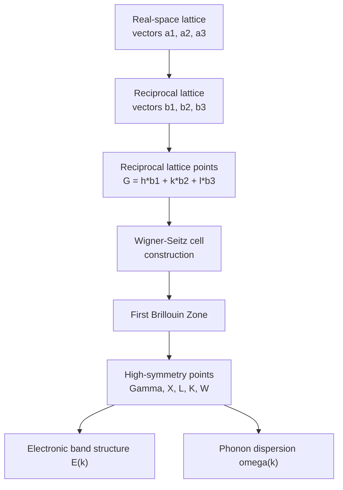

## Reciprocal Lattice and Brillouin Zones

### Overview

The reciprocal lattice is a mathematical construction that transforms real-space periodicity into a dual space (momentum/wavevector space) essential for analyzing wave propagation, X-ray diffraction, and electronic band structure in crystalline semiconductors. The **Brillouin zone**, defined as the Wigner-Seitz primitive cell of the reciprocal lattice, is the natural domain for describing electron and phonon dispersion relations.

### Real-Space Lattice Foundation

A crystal lattice is defined by primitive lattice vectors $\vec{a}_1$, $\vec{a}_2$, $\vec{a}_3$, such that any lattice point can be reached via:

$$\vec{R} = n_1\vec{a}_1 + n_2\vec{a}_2 + n_3\vec{a}_3$$

where $n_1, n_2, n_3$ are integers.

### Reciprocal Lattice Vectors

**Definition**

The reciprocal lattice vectors $\vec{b}_1$, $\vec{b}_2$, $\vec{b}_3$ are constructed from the real-space primitive vectors as:

$$\vec{b}_1 = 2\pi\frac{\vec{a}_2 \times \vec{a}_3}{\vec{a}_1 \cdot (\vec{a}_2 \times \vec{a}_3)}$$


$$\vec{b}_2 = 2\pi\frac{\vec{a}_3 \times \vec{a}_1}{\vec{a}_1 \cdot (\vec{a}_2 \times \vec{a}_3)}$$


$$\vec{b}_3 = 2\pi\frac{\vec{a}_1 \times \vec{a}_2}{\vec{a}_1 \cdot (\vec{a}_2 \times \vec{a}_3)}$$

**Key Points**

- Reciprocal lattice vectors have units of inverse length ($m^{-1}$)
- Orthogonality relation: $\vec{a}_i \cdot \vec{b}_j = 2\pi\delta_{ij}$, where $\delta_{ij}$ is the Kronecker delta
- Any reciprocal lattice vector: $\vec{G} = h\vec{b}_1 + k\vec{b}_2 + l\vec{b}_3$, where $(h,k,l)$ are integers — these are precisely the **Miller indices**
- A plane wave $e^{i\vec{G}\cdot\vec{r}}$ has the same periodicity as the direct lattice

**Physical Significance**

The reciprocal lattice directly encodes diffraction conditions. The **Laue condition** for constructive interference states that diffraction occurs when the scattering wavevector change equals a reciprocal lattice vector:

$$\vec{k}' - \vec{k} = \vec{G}$$

This is mathematically equivalent to the more commonly cited **Bragg condition**:

$$n\lambda = 2d\sin\theta$$

### Reciprocal Lattices of Common Semiconductor Structures

**FCC Real Lattice → BCC Reciprocal Lattice**

The diamond cubic and zinc blende structures (used by Si, Ge, GaAs) are based on an **FCC (face-centered cubic) Bravais lattice** with a two-atom basis. The reciprocal lattice of an FCC lattice is a **BCC (body-centered cubic)** lattice, and vice versa.

**Key Points**

- Real-space FCC lattice constant $a$ → reciprocal BCC lattice constant $\frac{4\pi}{a}$
- This inversion (FCC ↔ BCC) is a general crystallographic duality, not specific to semiconductors, but is essential for constructing the semiconductor Brillouin zone correctly

### The Brillouin Zone

**Definition**

The **first Brillouin zone (FBZ)** is the Wigner-Seitz primitive cell constructed in reciprocal space: it is the set of points closer to the origin ($\Gamma$ point) than to any other reciprocal lattice point.

**Construction Method**

1. Draw vectors from the origin to all nearby reciprocal lattice points
2. Construct perpendicular bisector planes at the midpoint of each vector
3. The smallest enclosed volume bounded by these planes is the first Brillouin zone

**Key Points**

- Contains exactly one reciprocal lattice point (at $\Gamma$, the zone center)
- All physically distinct electron wavevectors $\vec{k}$ can be mapped into the first Brillouin zone (the **reduced zone scheme**)
- Zone boundaries correspond to Bragg reflection conditions — waves at zone boundaries satisfy the diffraction condition and form standing waves

### The Truncated Octahedron: FCC Brillouin Zone

Since Si, Ge, GaAs, and most zinc blende/diamond semiconductors have an FCC Bravais lattice, their reciprocal lattice is BCC, and the resulting first Brillouin zone has the shape of a **truncated octahedron**.

**High-Symmetry Points**

| Point | Location | Description |
| --- | --- | --- |
| $\Gamma$ | $(0,0,0)$ | Zone center |
| $X$ | $(2\pi/a)(1,0,0)$ | Zone boundary, ⟨100⟩ direction |
| $L$ | $(\pi/a)(1,1,1)$ | Zone boundary, ⟨111⟩ direction |
| $K$ | $(2\pi/a)(3/4,3/4,0)$ | Zone boundary, ⟨110⟩ direction |
| $W$ | $(2\pi/a)(1,1/2,0)$ | Corner point |

**Example**

Silicon and germanium have their conduction band minima located near (Si) or exactly at (Ge) specific high-symmetry points: Si's conduction band minimum lies along the $\Gamma$-X direction (about 85% toward X), producing six equivalent conduction band valleys, while Ge's conduction band minimum sits precisely at the L point, producing eight half-valleys (four full equivalent valleys). This directly explains why both are **indirect bandgap** semiconductors — their conduction band minima do not coincide in $\vec{k}$-space with the valence band maximum at $\Gamma$.

**Brillouin Zone Diagram (svg_diagram)**



```
<svg xmlns="http://www.w3.org/2000/svg" viewBox="0 0 400 350" width="400" height="350">
  <title>FCC Brillouin Zone High-Symmetry Points (svg_diagram)</title>
  <rect width="400" height="350" fill="#ffffff" />
  
  <polygon points="200,40 320,110 320,240 200,310 80,240 80,110" fill="none" stroke="#4a5568" stroke-width="2" />
  <circle cx="200" cy="175" r="6" fill="#2b6cb0" />
  <text x="210" y="170" font-size="14" fill="#2b6cb0">Γ (center)</text>

  <circle cx="320" cy="175" r="6" fill="#e53e3e" />
  <text x="330" y="180" font-size="14" fill="#e53e3e">X</text>

  <circle cx="200" cy="40" r="6" fill="#38a169" />
  <text x="205" y="30" font-size="14" fill="#38a169">L</text>

  <circle cx="320" cy="110" r="6" fill="#805ad5" />
  <text x="330" y="105" font-size="14" fill="#805ad5">K</text>

  <circle cx="320" cy="240" r="6" fill="#d69e2e" />
  <text x="330" y="250" font-size="14" fill="#d69e2e">W</text>

  <text x="200" y="330" font-size="14" text-anchor="middle" fill="#1a202c" font-weight="bold">Truncated Octahedron (schematic 2D projection)</text>
</svg>
```

### Band Structure Representation in the Brillouin Zone

**Reduced vs. Extended vs. Periodic Zone Schemes**

- **Extended zone scheme**: each band plotted in its own separate Brillouin zone in $\vec{k}$-space
- **Reduced zone scheme**: all bands folded back into the first Brillouin zone (most common representation in textbooks)
- **Periodic zone scheme**: band structure repeated periodically across all of $\vec{k}$-space, reflecting the true periodicity of $E(\vec{k})$

**E-k Diagrams**

Band structure diagrams (E vs. k plots) for semiconductors are conventionally plotted along a path connecting high-symmetry points: typically $L \to \Gamma \to X \to U,K \to \Gamma$. This path samples the most physically relevant directions where band extrema occur.

### Brillouin Zones and Phonon Dispersion

The Brillouin zone framework applies equally to lattice vibrations (phonons):

- Phonon dispersion relations $\omega(\vec{k})$ are also periodic in reciprocal space and are conventionally plotted within the first Brillouin zone
- Zone boundary phonons in diamond-structure semiconductors correspond to specific high-symmetry points ($X$, $L$) where acoustic and optical branches show characteristic behavior
- The maximum phonon wavevector at the zone boundary sets the upper limit for Umklapp scattering processes relevant to thermal conductivity

### Higher Brillouin Zones

While the first Brillouin zone is used almost universally in semiconductor physics, higher-order Brillouin zones (second, third, etc.) exist and represent successive shells of reciprocal space beyond the first zone boundary — relevant in some advanced electron diffraction and Fermi surface analyses, though rarely needed for standard semiconductor device physics.

### Mermaid Diagram: Reciprocal Space Concept Flow



### Conclusion

The reciprocal lattice provides the natural mathematical framework for describing periodic phenomena in crystals — diffraction, electronic states, and lattice vibrations. The first Brillouin zone, as the primitive cell of the reciprocal lattice, defines the complete set of physically distinct wavevectors and hosts the high-symmetry points ($\Gamma$, $X$, $L$, $K$, $W$) that determine critical semiconductor properties such as direct vs. indirect bandgap character, conduction band valley degeneracy, and effective mass anisotropy.

**Related Topics**

- Miller indices and crystallographic plane notation
- Direct vs. indirect bandgap semiconductors (Si, Ge vs. GaAs, GaN)
- Effective mass theory and constant-energy surfaces
- Phonon dispersion and Umklapp scattering in thermal transport
- X-ray diffraction and the Bragg/Laue diffraction conditions
- k·p perturbation theory for band structure near high-symmetry points