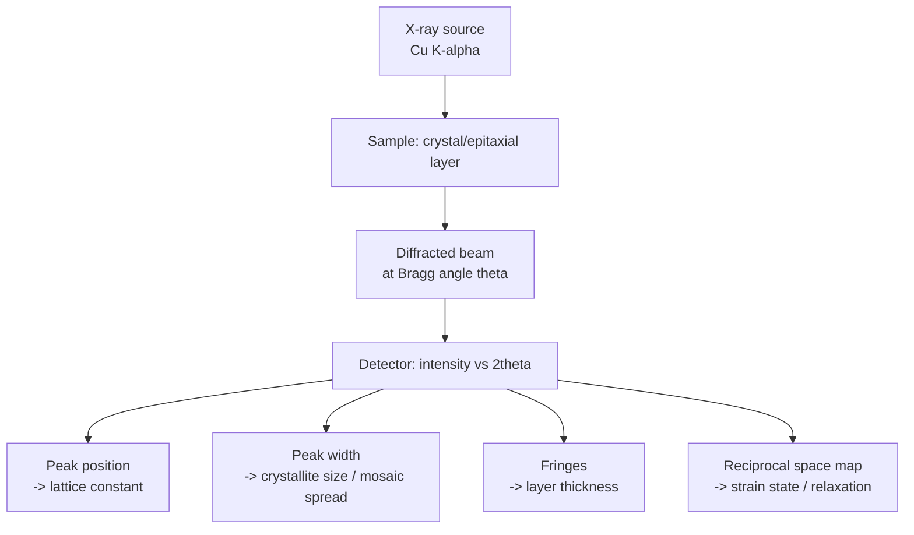

## X-Ray Diffraction and Crystal Characterization


### Overview

X-ray diffraction (XRD) is the primary experimental technique for determining crystal structure, lattice constants, strain, defect density, and crystalline quality in semiconductor materials. It exploits the interference of X-rays scattered by the periodic array of atoms in a crystal lattice, providing non-destructive, quantitative structural characterization essential throughout semiconductor material development and process control.

### Physical Principles

**Bragg's Law**

X-ray diffraction occurs when X-rays reflecting off parallel atomic planes interfere constructively. This condition is captured by Bragg's Law:

$$n\lambda = 2d\sin\theta$$

where $n$ is the diffraction order (integer), $\lambda$ is the X-ray wavelength, $d$ is the interplanar spacing, and $\theta$ is the angle of incidence measured from the crystal plane.

**Key Points**

- Common X-ray sources: Cu K$\alpha$ radiation ($\lambda \approx 1.5406$ Å), Mo K$\alpha$ ($\lambda \approx 0.7107$ Å)
- Diffraction only occurs at discrete angles satisfying Bragg's condition for a given $d$-spacing
- Equivalent to the Laue diffraction condition in reciprocal space: $\vec{k}' - \vec{k} = \vec{G}$

**Interplanar Spacing and Miller Indices**

For a cubic crystal system (relevant to Si, Ge, GaAs, and most zinc blende/diamond semiconductors):

$$d_{hkl} = \frac{a}{\sqrt{h^2+k^2+l^2}}$$

where $a$ is the lattice constant and $(h,k,l)$ are Miller indices of the diffracting plane.

**Structure Factor**

Not all $(h,k,l)$ reflections produce observable diffraction peaks. The **structure factor** $F_{hkl}$ determines relative intensity:

$$F_{hkl} = \sum_j f_j \exp\left[2\pi i(hx_j + ky_j + lz_j)\right]$$

where $f_j$ is the atomic scattering factor and $(x_j, y_j, z_j)$ are fractional atomic coordinates within the unit cell basis.

**Example**

For the diamond cubic structure (Si, Ge), the structure factor calculation shows that reflections are forbidden unless $h, k, l$ are either all even or all odd, and further restricted such that $h+k+l = 4n$ is forbidden when all indices are even but not divisible appropriately — the net result is that only specific reflections like (111), (220), (311), (400) appear, while (200) and (222) are systematically absent or weak due to destructive interference between the two-atom diamond basis.

### XRD Instrumentation and Geometries

**Powder XRD (Bragg-Brentano Geometry)**

Used for polycrystalline or powder samples; the sample is rotated through a range of $\theta$ while the detector tracks at $2\theta$.

- Produces a diffractogram (intensity vs. $2\theta$) with peaks corresponding to allowed $(hkl)$ reflections
- Used for phase identification, average grain size (via Scherrer equation), and approximate lattice constant determination

**Scherrer Equation (Crystallite Size)**

$$D = \frac{K\lambda}{\beta\cos\theta}$$

where $D$ is crystallite size, $K$ is a shape factor (~0.9), $\beta$ is the full width at half maximum (FWHM) of the diffraction peak (in radians, corrected for instrumental broadening), and $\theta$ is the Bragg angle.

**High-Resolution XRD (HRXRD)**

Used extensively for single-crystal semiconductor wafers and epitaxial layers, employing a monochromator (e.g., a 4-crystal Bartels monochromator) to achieve angular resolution on the order of arcseconds.

**Key Points**

- Enables precise lattice constant measurement (to ~$10^{-4}$–$10^{-5}$ Å precision)
- Rocking curve measurements ($\omega$-scans) quantify mosaic spread and dislocation density in epitaxial layers
- Reciprocal space mapping (RSM) resolves both in-plane and out-of-plane lattice parameters simultaneously, distinguishing strain relaxation from composition variation

### Applications in Semiconductor Characterization

**Lattice Constant and Alloy Composition Determination**

For ternary/quaternary alloy semiconductors (e.g., $Al_xGa_{1-x}As$, $In_xGa_{1-x}N$), lattice constant varies with composition, often approximated by **Vegard's Law**:

$$a_{alloy}(x) = x \cdot a_A + (1-x) \cdot a_B$$

Measuring the precise lattice constant via HRXRD allows extraction of alloy composition $x$, critical for bandgap engineering. [Inference: Vegard's Law is a linear approximation; real alloys often show small bowing deviations from strict linearity depending on the specific material system.]

**Epitaxial Strain and Relaxation Analysis**

When an epitaxial layer is grown on a lattice-mismatched substrate (e.g., SiGe on Si, InGaAs on GaAs), the film is initially **pseudomorphically strained** to match the substrate in-plane lattice constant. Reciprocal space mapping around asymmetric reflections (e.g., (224)) distinguishes:

- **Fully strained (pseudomorphic)** layers: in-plane lattice constant matches substrate
- **Partially relaxed** layers: intermediate in-plane lattice constant, indicating misfit dislocation formation
- **Fully relaxed** layers: in-plane lattice constant matches the bulk (unstrained) value of the epilayer material

**Rocking Curve FWHM and Crystalline Quality**

A narrower rocking curve FWHM indicates fewer dislocations and better crystalline perfection. Typical high-quality epitaxial GaN on sapphire might show (002) rocking curve FWHM values in the range of 200–400 arcsec, while bulk-like Si wafers show FWHM values below 20 arcsec [Unverified — specific FWHM benchmarks vary substantially with growth technique, buffer layer engineering, and measurement conditions].

**Thickness Fringes (Pendellösung Fringes)**

For thin epitaxial layers (typically <1 μm), interference fringes appear around the main diffraction peak in HRXRD scans. Fringe spacing is inversely related to layer thickness:

$$t = \frac{\lambda}{2\Delta\theta\cos\theta}$$

where $\Delta\theta$ is the angular spacing between adjacent fringes.

### X-Ray Topography

A complementary imaging technique that maps spatial variation in diffracted X-ray intensity across a sample surface, revealing individual dislocations, stacking faults, and strain fields non-destructively over wafer-scale areas — useful for mapping defect distributions that point XRD measurements (which sample a small beam spot) cannot resolve.

### Other Related X-Ray Techniques

**Key Points**

- **X-ray reflectivity (XRR)**: measures thin-film thickness, density, and interface roughness using X-rays at grazing incidence angles below the critical angle for total external reflection
- **Energy-dispersive X-ray spectroscopy (EDS/EDX)**: though based on X-ray emission rather than diffraction, often used alongside XRD for elemental composition analysis
- **X-ray photoelectron spectroscopy (XPS)**: surface-sensitive technique for chemical state and composition analysis, distinct from diffraction-based structural methods

### Diffraction Geometry Diagram (svg_diagram)



```
<svg xmlns="http://www.w3.org/2000/svg" viewBox="0 0 450 250" width="450" height="250">
  <title>Bragg Diffraction Geometry (svg_diagram)</title>
  <rect width="450" height="250" fill="#ffffff" />
  
  <line x1="50" y1="150" x2="400" y2="150" stroke="#4a5568" stroke-width="2" />
  <line x1="50" y1="190" x2="400" y2="190" stroke="#4a5568" stroke-width="2" />
  <text x="410" y="155" font-size="12">Plane 1</text>
  <text x="410" y="195" font-size="12">Plane 2</text>

  
  <line x1="120" y1="60" x2="200" y2="150" stroke="#2b6cb0" stroke-width="2" />
  <line x1="160" y1="60" x2="240" y2="190" stroke="#2b6cb0" stroke-width="2" />

  
  <line x1="200" y1="150" x2="280" y2="60" stroke="#e53e3e" stroke-width="2" />
  <line x1="240" y1="190" x2="320" y2="60" stroke="#e53e3e" stroke-width="2" />

  
  <text x="185" y="130" font-size="13" fill="#1a202c">θ</text>
  <text x="225" y="170" font-size="13" fill="#1a202c">θ</text>

  
  <line x1="200" y1="150" x2="200" y2="190" stroke="#38a169" stroke-width="1.5" stroke-dasharray="3,2" />
  <text x="205" y="172" font-size="12" fill="#38a169">d</text>

  <text x="225" y="20" font-size="15" text-anchor="middle" font-weight="bold" fill="#1a202c">nλ = 2d sinθ</text>
</svg>
```

### Mermaid Diagram: XRD Characterization Workflow



### Conclusion

X-ray diffraction remains the cornerstone technique for quantitative crystal structure and quality assessment in semiconductor materials science, providing direct measurement of lattice constants, alloy composition, strain state, crystalline defect density, and epitaxial layer thickness. High-resolution XRD techniques, particularly rocking curve analysis and reciprocal space mapping, are indispensable in modern epitaxial growth process development and wafer quality control.

**Related Topics**

- Reciprocal lattice and Brillouin zone theory
- Epitaxial growth techniques (MOCVD, MBE) and lattice-mismatch strain
- Miller indices and crystallographic plane notation
- Transmission electron microscopy (TEM) for direct defect imaging
- Vegard's Law and ternary/quaternary alloy composition engineering
- Wafer metrology and in-line process control techniques