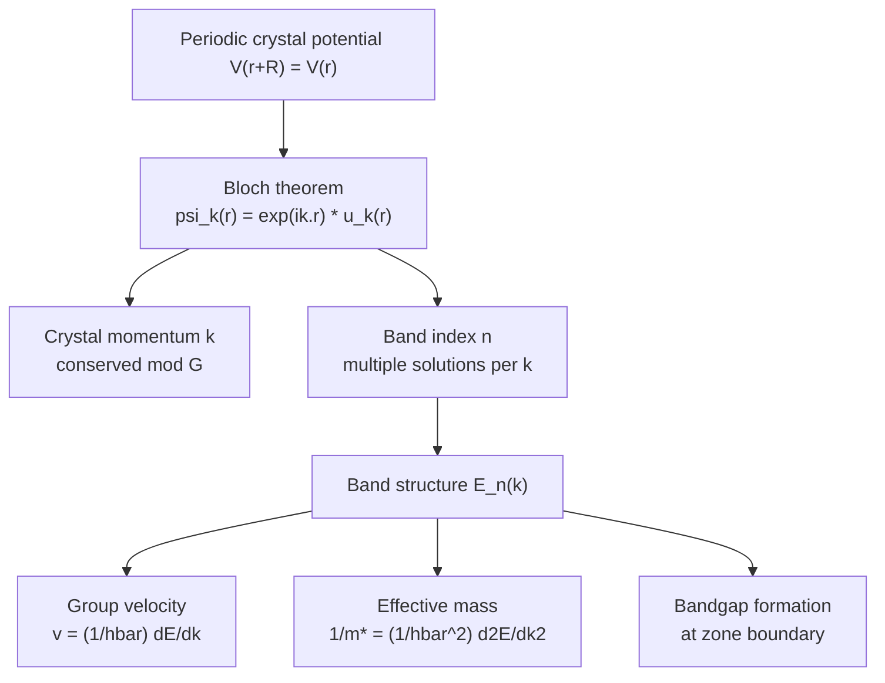

## Bloch's Theorem and Periodic Potentials

### Overview

Bloch's theorem is the foundational mathematical result of solid-state physics that describes how electron wavefunctions behave in a crystalline solid with a periodic potential. It establishes that electrons in a perfect crystal exist as extended wave-like states rather than localized states, providing the theoretical basis for band theory, effective mass, and semiconductor conduction/valence band structure.

### The Periodic Potential Problem

**Physical Setup**

In a crystal, the ionic cores form a periodic array, so an electron experiences a potential energy $V(\vec{r})$ that repeats with the periodicity of the underlying Bravais lattice:

$$V(\vec{r} + \vec{R}) = V(\vec{r})$$

for all lattice vectors $\vec{R} = n_1\vec{a}_1 + n_2\vec{a}_2 + n_3\vec{a}_3$.

**Key Points**

- This periodicity arises from the regular arrangement of atomic cores in the crystal lattice
- The single-electron Schrödinger equation in this potential is:

$$\left[-\frac{\hbar^2}{2m}\nabla^2 + V(\vec{r})\right]\psi(\vec{r}) = E\psi(\vec{r})$$

- This is a mean-field/independent-electron approximation; full many-body electron-electron interactions are approximated via the periodic effective potential

### Statement of Bloch's Theorem

**Formal Statement**

For an electron moving in a periodic potential, the eigenstates of the Schrödinger equation can be written as the product of a plane wave and a function with the same periodicity as the lattice:

$$\psi_{\vec{k}}(\vec{r}) = e^{i\vec{k}\cdot\vec{r}} u_{\vec{k}}(\vec{r})$$

where $u_{\vec{k}}(\vec{r} + \vec{R}) = u_{\vec{k}}(\vec{r})$ for all lattice vectors $\vec{R}$.

**Key Points**

- $\vec{k}$ is the **crystal momentum** (or Bloch wavevector), a quantum number labeling the electronic state
- $u_{\vec{k}}(\vec{r})$ is the periodic (cell-periodic) part of the wavefunction, varying on the scale of the unit cell
- $e^{i\vec{k}\cdot\vec{r}}$ is a plane-wave envelope modulating the periodic part over the macroscopic crystal
- $\hbar\vec{k}$ is NOT the true electron momentum but rather the crystal momentum — a distinct, conserved quantity in the periodic potential (conserved modulo a reciprocal lattice vector $\vec{G}$)

**Equivalent Formulation**

An equivalent statement of Bloch's theorem: applying a lattice translation operator to the wavefunction produces only a phase factor:

$$\psi_{\vec{k}}(\vec{r} + \vec{R}) = e^{i\vec{k}\cdot\vec{R}}\psi_{\vec{k}}(\vec{r})$$

This means $|\psi_{\vec{k}}(\vec{r})|^2$ is periodic with the lattice — the probability density of finding the electron is identical in every unit cell, consistent with the delocalized nature of Bloch states.

### Derivation Sketch

**Proof via Translation Operator Symmetry**

Since the Hamiltonian commutes with the lattice translation operator $\hat{T}_{\vec{R}}$ (because $V(\vec{r})$ is periodic), $\hat{H}$ and $\hat{T}_{\vec{R}}$ share simultaneous eigenstates.

**Key Points**

- Translation operators for different lattice vectors commute with each other: $[\hat{T}_{\vec{R}_1}, \hat{T}_{\vec{R}_2}] = 0$
- Eigenvalues of $\hat{T}_{\vec{R}}$ must have unit modulus (to preserve wavefunction normalization over an infinite/periodic crystal), so they take the form $e^{i\vec{k}\cdot\vec{R}}$
- This directly leads to the Bloch form of the wavefunction

### Physical Consequences of Bloch's Theorem

**Crystal Momentum and Band Index**

For a given $\vec{k}$, there are generally multiple solutions to the Schrödinger equation, labeled by a **band index** $n$: $E_n(\vec{k})$. This gives rise to the band structure $E_n(\vec{k})$ central to semiconductor physics.

**Periodicity in k-space**

$E_n(\vec{k})$ is periodic in reciprocal space:

$$E_n(\vec{k} + \vec{G}) = E_n(\vec{k})$$

for any reciprocal lattice vector $\vec{G}$. This periodicity is why all physically distinct states can be represented within the first Brillouin zone (reduced zone scheme).

**Group Velocity**

The velocity of a Bloch electron (wave packet) is given by the gradient of the band energy with respect to $\vec{k}$:

$$\vec{v}_n(\vec{k}) = \frac{1}{\hbar}\nabla_{\vec{k}}E_n(\vec{k})$$

This is fundamental to understanding carrier transport: electrons at band extrema ($\nabla_k E = 0$) have zero group velocity, while electrons away from extrema move with velocity determined by the local band curvature.

**Effective Mass**

Near a band extremum, expanding $E_n(\vec{k})$ in a Taylor series gives rise to the **effective mass** concept:

$$\frac{1}{m^*} = \frac{1}{\hbar^2}\frac{\partial^2 E}{\partial k^2}$$

This allows electrons and holes in a semiconductor to be treated as quasi-free particles with a modified mass that encapsulates the effect of the periodic lattice potential — the basis for the effective mass approximation used throughout device physics.

### Approximate Models Built on Bloch's Theorem

**Nearly Free Electron Model**

Treats the periodic potential as a weak perturbation on free electron plane waves. Produces band gaps at Brillouin zone boundaries where Bragg reflection condition is satisfied, due to degenerate perturbation theory mixing $+\vec{k}$ and $-\vec{k}$ plane wave states.

**Tight-Binding (LCAO) Model**

Treats electrons as largely localized to atomic orbitals, with Bloch states constructed as a linear combination of atomic orbitals (LCAO) across all lattice sites:

$$\psi_{\vec{k}}(\vec{r}) = \sum_{\vec{R}} e^{i\vec{k}\cdot\vec{R}} \phi(\vec{r} - \vec{R})$$

This model is often more appropriate for semiconductors like Si and Ge, where valence electrons retain significant atomic-like character, and directly connects to the $sp^3$ hybridization picture used in covalent bonding descriptions.

**Kronig-Penney Model**

A simplified 1D exactly-solvable model using a periodic square-well/barrier potential, illustrating explicitly how Bloch's theorem produces allowed energy bands separated by forbidden gaps — a common pedagogical bridge between free-electron and real periodic-potential band structure.

### Example: Application to Band Gap Formation

**Example**

At the Brillouin zone boundary (e.g., $k = \pi/a$ in a 1D chain), the nearly-free-electron treatment shows that the periodic potential couples forward and backward traveling waves ($e^{ikx}$ and $e^{-ikx}$), producing two standing-wave solutions with different energies. This energy splitting is the origin of the **bandgap**: one standing wave concentrates electron probability density near the ion cores (lower energy), while the other concentrates it between ion cores (higher energy). In real semiconductors, this simplified picture is refined by pseudopotential and tight-binding calculations to give quantitatively accurate bandgaps like Si's 1.12 eV.

### Bloch Wavefunction Structure Diagram (svg_diagram)



```
<svg xmlns="http://www.w3.org/2000/svg" viewBox="0 0 450 220" width="450" height="220">
  <title>Bloch Wavefunction Components (svg_diagram)</title>
  <rect width="450" height="220" fill="#ffffff" />
  
  <path d="M 20 60 Q 60 20, 100 60 T 180 60 T 260 60 T 340 60 T 420 60" stroke="#2b6cb0" stroke-width="2" fill="none" />
  <text x="225" y="20" font-size="13" text-anchor="middle" fill="#2b6cb0">Plane wave envelope: exp(ik·r)</text>

  
  <path d="M 20 140 Q 35 120, 50 140 Q 65 160, 80 140 Q 95 120,110 140 Q 125 160,140 140 Q 155 120,170 140 Q 185 160,200 140 Q 215 120,230 140 Q 245 160,260 140 Q 275 120,290 140 Q 305 160,320 140 Q 335 120,350 140 Q 365 160,380 140 Q 395 120,410 140" stroke="#e53e3e" stroke-width="2" fill="none" />
  <text x="225" y="180" font-size="13" text-anchor="middle" fill="#e53e3e">Periodic part: u_k(r), period = lattice constant</text>

  
  <g stroke="#a0aec0" stroke-dasharray="2,2">
    <line x1="50" y1="100" x2="50" y2="200" />
    <line x1="110" y1="100" x2="110" y2="200" />
    <line x1="170" y1="100" x2="170" y2="200" />
    <line x1="230" y1="100" x2="230" y2="200" />
    <line x1="290" y1="100" x2="290" y2="200" />
    <line x1="350" y1="100" x2="350" y2="200" />
    <line x1="410" y1="100" x2="410" y2="200" />
  </g>
  <text x="225" y="210" font-size="12" text-anchor="middle" fill="#1a202c">ψ_k(r) = exp(ik·r) · u_k(r)</text>
</svg>
```

### Mermaid Diagram: Conceptual Flow from Periodicity to Band Structure



### Conclusion

Bloch's theorem provides the essential mathematical framework establishing that electrons in a periodic crystal potential exist as delocalized wave-like states characterized by a crystal momentum $\vec{k}$ and band index $n$. This theorem underlies the entire band structure formalism of semiconductor physics — from group velocity and effective mass to the formation of bandgaps at Brillouin zone boundaries — and is the conceptual starting point for computational band structure methods (tight-binding, pseudopotential, DFT) used throughout semiconductor materials engineering.

**Related Topics**

- Reciprocal lattice and Brillouin zone theory
- Kronig-Penney model and 1D periodic potential problems
- Effective mass theory and k·p perturbation methods
- Nearly-free-electron vs. tight-binding band structure models
- Direct vs. indirect bandgap semiconductors
- Density functional theory (DFT) for band structure calculation