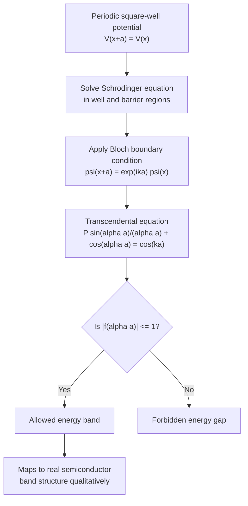

## The Kronig-Penney Model

### Overview

The Kronig-Penney model is a simplified, exactly-solvable quantum mechanical model that demonstrates how a periodic potential gives rise to allowed energy bands separated by forbidden energy gaps. Introduced by Ralph Kronig and William Penney in 1931, it serves as the standard pedagogical bridge between the free-electron model and the full band theory of real crystalline semiconductors, providing direct, closed-form insight into the origin of bandgaps consistent with Bloch's theorem.

### Model Setup

**The Periodic Square-Well/Barrier Potential**

The model represents the one-dimensional periodic potential of a crystal lattice as an infinite series of rectangular potential barriers (or wells) with period $a = a_1 + a_2$:

- Region of width $a_1$: potential $V = 0$ (representing the region near/between ion cores where the electron is relatively free)
- Region of width $a_2$: potential $V = V_0$ (representing the potential barrier, an idealized stand-in for the ionic core repulsive potential)

**Key Points**

- This is a drastic simplification of the true periodic potential (which is smooth, e.g., Coulombic in nature), but it captures the essential physics of periodicity-induced bandgaps
- The potential satisfies $V(x + a) = V(x)$, consistent with Bloch's theorem
- The model is exactly solvable via the time-independent Schrödinger equation in each region, matched at boundaries

### Mathematical Formulation

**Schrödinger Equation in Each Region**

In the well region ($0 < x < a_1$, $V=0$):

$$-\frac{\hbar^2}{2m}\frac{d^2\psi}{dx^2} = E\psi \implies \psi(x) = Ae^{i\alpha x} + Be^{-i\alpha x}, \quad \alpha = \sqrt{\frac{2mE}{\hbar^2}}$$

In the barrier region ($-a_2 < x < 0$, $V = V_0$), for $E < V_0$:

$$-\frac{\hbar^2}{2m}\frac{d^2\psi}{dx^2} + V_0\psi = E\psi \implies \psi(x) = Ce^{\beta x} + De^{-\beta x}, \quad \beta = \sqrt{\frac{2m(V_0-E)}{\hbar^2}}$$

**Applying Bloch's Theorem and Boundary Conditions**

Matching $\psi$ and $\frac{d\psi}{dx}$ at the boundaries, and applying the Bloch periodicity condition $\psi(x+a) = e^{ika}\psi(x)$, yields the central Kronig-Penney dispersion relation.

### The Kronig-Penney Dispersion Relation

**Delta-Function Limit (Simplified Form)**

The most commonly taught version takes the limit $a_2 \to 0$ and $V_0 \to \infty$ while keeping the product $V_0 a_2$ finite, converting the barriers into a series of Dirac delta functions. This produces the compact transcendental equation:

$$P\frac{\sin(\alpha a)}{\alpha a} + \cos(\alpha a) = \cos(ka)$$

where $P = \frac{mV_0a_2 a}{\hbar^2}$ is a dimensionless parameter representing the "strength" of the periodic potential (sometimes written as the scattering strength), $\alpha = \sqrt{2mE/\hbar^2}$, $a$ is the lattice period, and $k$ is the Bloch wavevector.

**Key Points**

- The left-hand side of this equation is a function purely of energy $E$ (through $\alpha$)
- The right-hand side, $\cos(ka)$, is bounded between $-1$ and $+1$ for real $k$
- **Allowed energy bands** exist only where the left-hand side falls within $[-1, +1]$
- **Forbidden gaps** occur wherever the left-hand side exceeds this range — no real $k$ satisfies the equation, so no propagating Bloch state exists at that energy

### Physical Interpretation

**Origin of Band Gaps**

**Key Points**

- As $\alpha a$ increases (i.e., as energy $E$ increases), the function $P\frac{\sin(\alpha a)}{\alpha a} + \cos(\alpha a)$ oscillates with decreasing amplitude envelope (since the $P\sin(\alpha a)/\alpha a$ term decays as $1/\alpha$) but still repeatedly exceeds $\pm 1$ near multiples of $\pi$
- This produces alternating bands of allowed and forbidden energies — directly analogous to the allowed/forbidden band structure of real 3D semiconductors
- Regions where the graph exceeds $|{\pm}1|$ correspond exactly to Bragg-reflection conditions ($\alpha a$ near integer multiples of $\pi$, i.e., $k$ near the zone boundary $\pi/a$)

**Limiting Cases**

- **$P \to 0$** (vanishing potential): the equation reduces to $\cos(\alpha a) = \cos(ka)$, giving $\alpha = k$ — the free electron dispersion $E = \hbar^2k^2/2m$ is recovered, with no bandgaps
- **$P \to \infty$** (very strong potential): allowed bands narrow to discrete points, approaching the isolated/localized atomic energy levels — consistent with the tight-binding limit

### Graphical Solution Method

**Standard Textbook Approach**

The transcendental equation is typically solved graphically:

1. Plot $f(\alpha a) = P\frac{\sin(\alpha a)}{\alpha a} + \cos(\alpha a)$ versus $\alpha a$
2. Identify regions where $-1 \le f(\alpha a) \le 1$ — these map to allowed energy bands
3. For each allowed $\alpha a$ value, the corresponding $k$ is found via $\cos(ka) = f(\alpha a)$
4. Regions where $|f(\alpha a)| > 1$ are forbidden gaps with no corresponding real $k$

**Kronig-Penney Graphical Solution Diagram (svg_diagram)**



```
<svg xmlns="http://www.w3.org/2000/svg" viewBox="0 0 500 300" width="500" height="300">
  <title>Kronig-Penney Graphical Solution (svg_diagram)</title>
  <rect width="500" height="300" fill="#ffffff" />
  
  <line x1="40" y1="150" x2="480" y2="150" stroke="#1a202c" stroke-width="1.5" />
  <line x1="40" y1="30" x2="40" y2="270" stroke="#1a202c" stroke-width="1.5" />
  <text x="485" y="155" font-size="12">αa</text>
  <text x="20" y="30" font-size="12">f(αa)</text>

  
  <line x1="40" y1="100" x2="480" y2="100" stroke="#a0aec0" stroke-dasharray="4,3" />
  <line x1="40" y1="200" x2="480" y2="200" stroke="#a0aec0" stroke-dasharray="4,3" />
  <text x="45" y="95" font-size="11" fill="#4a5568">+1</text>
  <text x="45" y="215" font-size="11" fill="#4a5568">-1</text>

  
  <path d="M 40 30 C 80 250, 120 250, 150 100 C 180 20, 220 20, 250 150 C 280 260, 320 260, 350 130 C 380 60, 420 60, 450 150 C 460 170, 470 175, 480 178" stroke="#2b6cb0" stroke-width="2" fill="none" />

  
  <rect x="95" y="100" width="45" height="100" fill="#38a169" opacity="0.15" />
  <rect x="235" y="100" width="45" height="100" fill="#38a169" opacity="0.15" />
  <rect x="375" y="100" width="45" height="100" fill="#38a169" opacity="0.15" />

  <text x="115" y="285" font-size="10" text-anchor="middle" fill="#38a169">Allowed</text>
  <text x="255" y="285" font-size="10" text-anchor="middle" fill="#38a169">Allowed</text>
  <text x="200" y="285" font-size="10" text-anchor="middle" fill="#e53e3e">Forbidden gap</text>
</svg>
```

### Connection to Real Semiconductor Band Structure

**Example**

While the Kronig-Penney model uses an unphysical square-well potential in 1D, it correctly reproduces the qualitative and topological features of real semiconductor band structure: (1) existence of allowed bands separated by forbidden gaps, (2) band narrowing/localization in the strong-potential limit (connecting to tight-binding), (3) free-electron-like behavior in the weak-potential limit (connecting to nearly-free-electron model), and (4) bandgap opening precisely at Brillouin zone boundaries where Bragg reflection occurs. Real 3D pseudopotential and DFT calculations for Si, Ge, and GaAs reproduce this same qualitative band/gap alternation, but with quantitatively accurate energies obtained from realistic 3D periodic Coulomb-derived potentials rather than the idealized square wells.

### Limitations of the Model

**Key Points**

- One-dimensional; real crystals require 3D treatment with anisotropic effective mass and multiple band extrema at different k-points
- The square-well/delta-function potential is not physically representative of the smooth, long-range Coulombic potential in real crystals
- Does not capture electron-electron interactions or realistic atomic orbital character (addressed instead by tight-binding or ab initio pseudopotential/DFT methods)
- Provides no quantitative prediction of real semiconductor bandgap values (e.g., cannot predict Si's 1.12 eV without empirical fitting)

### Mermaid Diagram: Kronig-Penney Model Logic Flow



### Conclusion

The Kronig-Penney model, despite its simplified one-dimensional square-well potential, provides an exactly-solvable demonstration of how periodicity in a crystal potential — as required by Bloch's theorem — inevitably produces alternating bands of allowed and forbidden electron energies. It remains a cornerstone pedagogical tool connecting free-electron behavior, tight-binding behavior, and the qualitative origin of semiconductor bandgaps, forming a conceptual foundation before progressing to realistic 3D band structure methods.

**Related Topics**

- Bloch's theorem and periodic potential fundamentals
- Nearly-free-electron model and Bragg reflection at zone boundaries
- Tight-binding (LCAO) model for realistic band structure
- Reciprocal lattice and Brillouin zone construction
- Effective mass theory near band extrema
- Pseudopotential and DFT methods for quantitative bandgap calculation