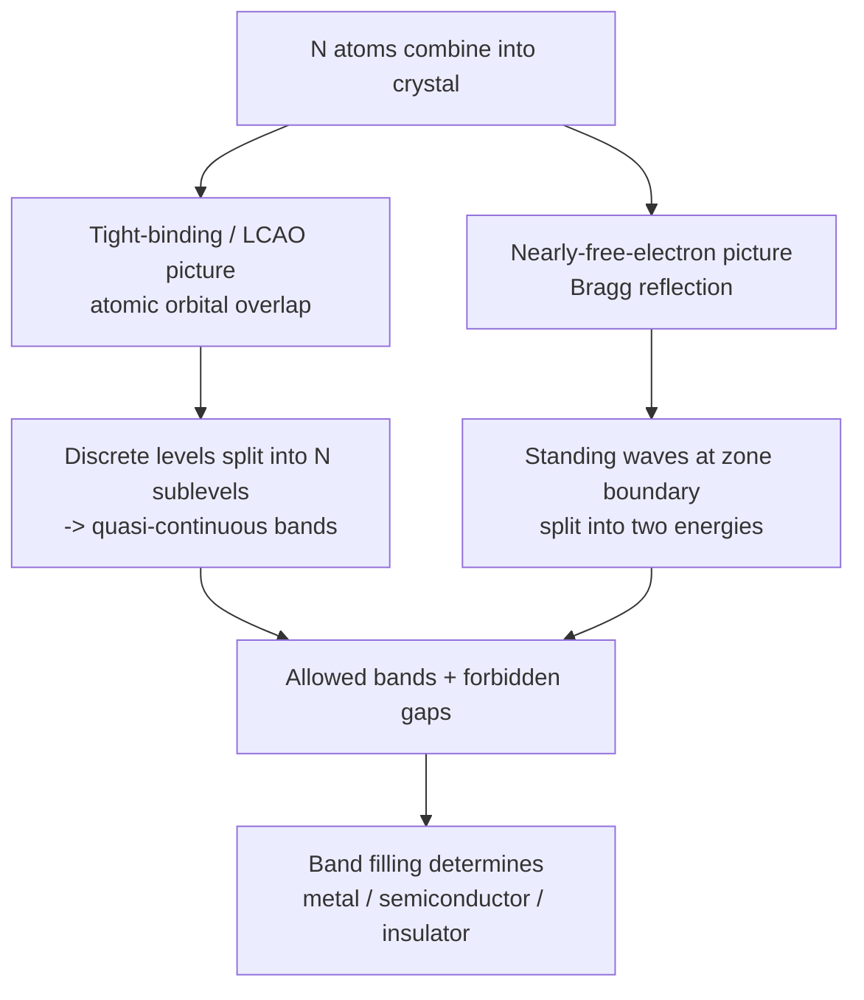

## Formation of Allowed and Forbidden Bands

### Overview

The formation of allowed energy bands and forbidden bandgaps is the central result of solid-state band theory, explaining why crystalline solids behave as conductors, semiconductors, or insulators. This phenomenon emerges naturally when isolated atomic energy levels interact in a periodic crystal lattice, and can be understood through complementary physical pictures: the atomic-orbital-overlap (tight-binding) perspective and the electron-wave Bragg-reflection (nearly-free-electron) perspective.

### From Isolated Atoms to Solids: The Overlap Picture

**Single Atom Energy Levels**

An isolated atom has discrete, sharply defined energy levels (e.g., $1s$, $2s$, $2p$, $3s$, $3p$ for silicon) due to the confining Coulomb potential of the nucleus.

**Bringing Atoms Together**

**Key Points**

- As $N$ atoms are brought together to form a crystal, the Pauli exclusion principle forbids identical electronic states from having the same quantum numbers
- Each discrete atomic level splits into $N$ closely spaced sublevels (where $N$ is the number of atoms, typically $\sim 10^{22}$–$10^{23}$ per cm³)
- With $N$ extremely large and level spacing extremely small, the discrete sublevels merge into a quasi-continuous **energy band**
- Inner-shell (core) electron levels, which are tightly bound and experience minimal wavefunction overlap between neighboring atoms, remain essentially unsplit (narrow bands, nearly atomic-like)
- Outer valence electron levels experience strong wavefunction overlap and split into wide bands

**Equilibrium Lattice Constant**

At the actual interatomic spacing of the crystal ($a_0$), the split energy levels form specific bands separated by gaps — the width of each band and gap depends sensitively on the degree of orbital overlap, which in turn depends on interatomic distance.

### Silicon Band Formation: A Detailed Example

**Example**

For silicon, as isolated atoms are brought together from large separation to the equilibrium lattice constant, the $3s$ and $3p$ atomic orbitals (8 states per atom: 2 from 3s, 6 from 3p, holding a total of 8 valence electrons per 2-atom basis when hybridized) undergo $sp^3$ hybridization and split into two distinct bands separated by a gap:

- **Valence band**: the lower band, formed from bonding $sp^3$ hybrid combinations, completely filled with electrons at 0 K (4 electrons per atom)
- **Conduction band**: the upper band, formed from antibonding $sp^3$ hybrid combinations, empty at 0 K
- **Forbidden gap** ($E_g = 1.12$ eV at 300 K): the energy region between these two bands where no allowed electron states exist

This hybridization-then-splitting picture directly connects the covalent bonding character of silicon (tetrahedral $sp^3$ bonds) to its electronic band structure.

**Energy Level Splitting Diagram (svg_diagram)**



```
<svg xmlns="http://www.w3.org/2000/svg" viewBox="0 0 500 320" width="500" height="320">
  <title>Energy Level Splitting vs Interatomic Distance (svg_diagram)</title>
  <rect width="500" height="320" fill="#ffffff" />
  
  <line x1="60" y1="20" x2="60" y2="280" stroke="#1a202c" stroke-width="1.5" />
  <line x1="60" y1="280" x2="470" y2="280" stroke="#1a202c" stroke-width="1.5" />
  <text x="20" y="20" font-size="12">Energy</text>
  <text x="420" y="300" font-size="12">Interatomic distance</text>

  
  <line x1="420" y1="60" x2="460" y2="60" stroke="#2b6cb0" stroke-width="3" />
  <line x1="420" y1="180" x2="460" y2="180" stroke="#e53e3e" stroke-width="3" />
  <text x="465" y="65" font-size="11" fill="#2b6cb0">3p level</text>
  <text x="465" y="185" font-size="11" fill="#e53e3e">3s level</text>

  
  <path d="M 420 55 C 300 50, 200 40, 130 30 L 130 90 C 200 70, 300 60, 420 65 Z" fill="#2b6cb0" opacity="0.25" />
  <path d="M 420 175 C 300 190, 200 210, 130 230 L 130 170 C 200 150, 300 165, 420 185 Z" fill="#e53e3e" opacity="0.25" />

  
  <line x1="80" y1="30" x2="130" y2="30" stroke="#2b6cb0" stroke-width="2" />
  <line x1="80" y1="90" x2="130" y2="90" stroke="#2b6cb0" stroke-width="2" />
  <rect x="80" y="30" width="50" height="60" fill="#2b6cb0" opacity="0.1" />
  <text x="30" y="55" font-size="11" fill="#2b6cb0">Conduction band</text>

  <line x1="80" y1="170" x2="130" y2="170" stroke="#e53e3e" stroke-width="2" />
  <line x1="80" y1="230" x2="130" y2="230" stroke="#e53e3e" stroke-width="2" />
  <rect x="80" y="170" width="50" height="60" fill="#e53e3e" opacity="0.1" />
  <text x="30" y="200" font-size="11" fill="#e53e3e">Valence band</text>

  <text x="105" y="130" font-size="11" text-anchor="middle" fill="#1a202c">Eg</text>
  <line x1="105" y1="95" x2="105" y2="165" stroke="#1a202c" stroke-width="1" stroke-dasharray="2,2" />

  <line x1="105" y1="280" x2="105" y2="270" stroke="#38a169" stroke-width="2" />
  <text x="105" y="295" font-size="10" text-anchor="middle" fill="#38a169">a0 (equilibrium)</text>
</svg>
```

### Alternative Picture: Bragg Reflection and the Nearly-Free-Electron Model

**Physical Mechanism**

**Key Points**

- Treats valence electrons as nearly free, with the periodic ionic potential as a weak perturbation
- Electron waves traveling through the lattice are Bragg-reflected when their wavevector satisfies $k = n\pi/a$ (Brillouin zone boundaries)
- At these special $k$-values, forward-traveling ($e^{ikx}$) and backward-traveling ($e^{-ikx}$) waves combine to form standing waves
- Two possible standing-wave combinations exist, with electron probability density concentrated either near the ion cores (lower potential energy, lower total energy) or between ion cores (higher potential energy, higher total energy)
- This energy splitting between the two standing-wave solutions at the zone boundary is precisely the bandgap

**Consistency with Kronig-Penney and Bloch's Theorem**

This is mathematically consistent with the Kronig-Penney model's forbidden-gap regions and is a direct consequence of Bloch's theorem — both frameworks agree that gaps open specifically at Brillouin zone boundaries.

### Band Filling and Material Classification

**Key Points**

The way allowed bands are filled with the available valence electrons — subject to the Pauli exclusion principle — determines electrical behavior:

- **Metals**: highest occupied band is only partially filled, OR a filled band overlaps in energy with an empty band (band overlap), allowing electrons to move into adjacent empty states under an applied field with no energy threshold
- **Insulators**: valence band completely filled, conduction band completely empty, separated by a large bandgap (typically $E_g > 4$ eV, e.g., diamond at 5.5 eV) — thermal excitation across the gap is negligible at room temperature
- **Semiconductors**: same band-filling structure as insulators (filled valence band, empty conduction band at 0 K) but with a smaller bandgap (typically $E_g$ < ~3-4 eV) — Si: 1.12 eV, Ge: 0.66 eV, GaAs: 1.42 eV — allowing significant thermal carrier generation at room temperature and strong sensitivity to doping

**Comparison Table**

| Material Class | Band Filling | Typical $E_g$ | Room-Temp Conductivity |
| --- | --- | --- | --- |
| Metal | Partially filled band or band overlap | 0 eV (no gap) | High ($10^6$–$10^8$ S/m) |
| Semiconductor | Filled valence, empty conduction, small gap | 0.1–3.4 eV | Intermediate, tunable via doping |
| Insulator | Filled valence, empty conduction, large gap | >4 eV | Very low ($<10^{-10}$ S/m) |

### Band Structure and Density of States

**Key Points**

- Within an allowed band, the density of states $g(E)$ is not uniform — it typically follows a form related to $\sqrt{E}$ near band edges in the effective mass (parabolic band) approximation for 3D bulk semiconductors
- Van Hove singularities occur at critical points in the band structure (where $\nabla_k E = 0$ but not at absolute band extrema), producing characteristic features in the density of states and optical absorption spectra
- The number of states within a band is finite and quantized: each band can hold exactly $2N$ electrons (accounting for spin degeneracy), where $N$ is the number of unit cells/primitive cells in the crystal

### Mermaid Diagram: Two Complementary Pictures of Band Formation



### Conclusion

The formation of allowed and forbidden energy bands arises fundamentally from the periodicity of the crystal lattice acting on electron wavefunctions, understandable through either the atomic-orbital-splitting picture (tight-binding) or the electron-wave Bragg-reflection picture (nearly-free-electron), both consistent with Bloch's theorem. The resulting band structure — specifically the size of the forbidden gap and how available electrons fill the allowed bands — is what fundamentally distinguishes metals, semiconductors, and insulators, and forms the theoretical foundation for all semiconductor device physics.

**Related Topics**

- Bloch's theorem and periodic potentials
- The Kronig-Penney model
- Tight-binding (LCAO) band structure calculations
- Direct vs. indirect bandgap semiconductors
- Density of states and Van Hove singularities
- Effective mass theory near band extrema