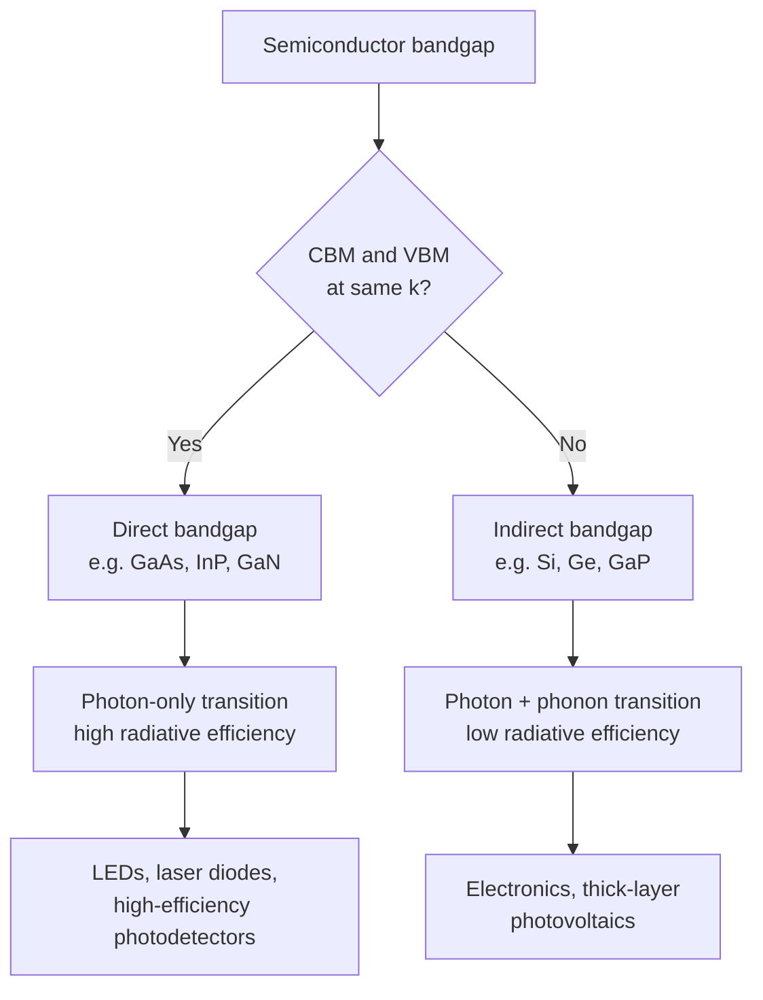

## Direct Versus Indirect Bandgap Materials

### Overview

The distinction between direct and indirect bandgap semiconductors is one of the most technologically consequential concepts in semiconductor physics, governing whether a material can efficiently absorb and emit light. This classification depends on the relative positions in $\vec{k}$-space (crystal momentum space) of the conduction band minimum and valence band maximum, and directly determines a material's suitability for optoelectronic devices such as LEDs, laser diodes, and photodetectors.

### Fundamental Definitions

**Direct Bandgap**

A semiconductor has a **direct bandgap** when the conduction band minimum (CBM) and valence band maximum (VBM) occur at the **same** wavevector $\vec{k}$ in the Brillouin zone — typically at the zone center, $\Gamma$ ($\vec{k}=0$).

**Indirect Bandgap**

A semiconductor has an **indirect bandgap** when the CBM and VBM occur at **different** wavevectors in the Brillouin zone.

**Key Points**

- The bandgap energy $E_g$ is defined as the energy difference between CBM and VBM regardless of direct/indirect character
- The distinction is purely about the $\vec{k}$-space location of these extrema, not the magnitude of $E_g$ itself

### Physical Origin of the Distinction

**Optical Transition Selection Rules**

**Key Points**

- A photon carries very little momentum compared to the crystal momentum scale of the Brillouin zone: $k_{photon} = 2\pi/\lambda \approx 10^4$–$10^5$ cm⁻¹, while the Brillouin zone boundary is on the order of $10^8$ cm⁻¹
- Photon absorption/emission is therefore an essentially **vertical transition** in an E-k diagram — it conserves crystal momentum to an excellent approximation ($\Delta k \approx 0$)
- In a **direct** semiconductor, an electron can transition directly from VBM to CBM by absorbing/emitting a single photon, since both states share the same $\vec{k}$
- In an **indirect** semiconductor, a transition between VBM and CBM requires a change in crystal momentum $\Delta k \neq 0$, which a photon alone cannot supply

**Phonon-Assisted Transitions**

For indirect semiconductors, the required momentum change is supplied by a **phonon** (lattice vibration quantum), making the transition a second-order (three-particle) process:

$$E_{photon} = E_g \pm E_{phonon}$$


$$\vec{k}_{phonon} = \vec{k}_{CBM} - \vec{k}_{VBM}$$

- The $+$ sign corresponds to phonon absorption; the $-$ sign corresponds to phonon emission
- Because this requires simultaneous photon absorption/emission AND phonon absorption/emission, it is a much lower-probability process than a direct transition
- Radiative recombination efficiency in indirect semiconductors is therefore orders of magnitude lower than in direct semiconductors [Inference: exact efficiency ratios are material- and temperature-dependent, but the qualitative several-orders-of-magnitude difference is well established]

### E-k Diagram Comparison (svg_diagram)



```
<svg xmlns="http://www.w3.org/2000/svg" viewBox="0 0 500 300" width="500" height="300">
  <title>Direct vs Indirect Bandgap E-k Diagrams (svg_diagram)</title>
  <rect width="500" height="300" fill="#ffffff" />

  
  <line x1="40" y1="260" x2="220" y2="260" stroke="#1a202c" stroke-width="1.5" />
  <line x1="130" y1="20" x2="130" y2="260" stroke="#1a202c" stroke-width="1.5" />
  <path d="M 60 100 Q 130 60, 200 100" stroke="#2b6cb0" stroke-width="2.5" fill="none" />
  <path d="M 60 220 Q 130 180, 200 220" stroke="#e53e3e" stroke-width="2.5" fill="none" />
  <line x1="130" y1="80" x2="130" y2="190" stroke="#38a169" stroke-width="2" marker-end="url(#arrow)" />
  <text x="130" y="15" font-size="12" text-anchor="middle" font-weight="bold">Direct (e.g., GaAs)</text>
  <text x="135" y="135" font-size="11" fill="#38a169">photon</text>
  <text x="45" y="280" font-size="11">k</text>
  <text x="130" y="280" font-size="10" text-anchor="middle">Γ</text>

  
  <line x1="280" y1="260" x2="460" y2="260" stroke="#1a202c" stroke-width="1.5" />
  <line x1="330" y1="20" x2="330" y2="260" stroke="#1a202c" stroke-width="1.5" />
  <path d="M 300 100 Q 420 70, 440 130" stroke="#2b6cb0" stroke-width="2.5" fill="none" />
  <path d="M 300 220 Q 370 180, 440 220" stroke="#e53e3e" stroke-width="2.5" fill="none" />
  <line x1="330" y1="80" x2="420" y2="130" stroke="#38a169" stroke-width="2" stroke-dasharray="4,2" />
  <text x="375" y="95" font-size="10" fill="#805ad5">phonon Δk</text>
  <text x="370" y="15" font-size="12" text-anchor="middle" font-weight="bold">Indirect (e.g., Si)</text>
  <text x="285" y="280" font-size="11">k</text>
  <text x="330" y="280" font-size="10" text-anchor="middle">Γ</text>
  <text x="420" y="280" font-size="10" text-anchor="middle">X</text>
</svg>
```

### Classification of Common Semiconductors

**Indirect Bandgap Materials**

| Material | $E_g$ (eV, 300K) | CBM Location | VBM Location |
| --- | --- | --- | --- |
| Silicon (Si) | 1.12 | Near X (along Γ-X, ~85% to X) | Γ |
| Germanium (Ge) | 0.66 | L | Γ |
| AlAs | 2.16 | X | Γ |
| GaP | 2.26 | X | Γ |

**Direct Bandgap Materials**

| Material | $E_g$ (eV, 300K) | CBM/VBM Location |
| --- | --- | --- |
| GaAs | 1.42 | Γ |
| InP | 1.35 | Γ |
| GaN | 3.4 | Γ |
| InGaN (alloy, x-dependent) | 0.7–3.4 (composition-dependent) | Γ |
| CdTe | 1.5 | Γ |

[Unverified — precise bandgap values vary slightly by measurement technique, temperature, and source; the table reflects commonly cited textbook reference values.]

### Device Implications

**Light-Emitting Applications**

**Key Points**

- LEDs and laser diodes require efficient radiative recombination, making **direct bandgap materials essential** (GaAs, GaN, InP, and their alloys dominate commercial optoelectronics)
- Silicon and germanium, despite their dominance in electronics, are historically very poor light emitters due to their indirect gap — this is the core motivation behind "silicon photonics" research seeking indirect workarounds (e.g., strained Ge, GeSn alloys, or hybrid III-V-on-Si integration)

**Photodetector and Solar Cell Applications**

- Direct bandgap materials have a much sharper, stronger optical absorption edge, allowing thinner active layers (important for thin-film solar cells like CdTe, CIGS)
- Indirect bandgap materials like silicon require much thicker absorption layers (typically hundreds of micrometers) because phonon-assisted absorption is weaker, though silicon's abundance, mature processing, and adequate absorption still make it the dominant solar cell material commercially

**Example**

A silicon photodiode requires a much greater active layer thickness than a comparable GaAs photodiode to absorb the same fraction of incident light near the bandgap energy, precisely because Si's indirect absorption process (requiring phonon participation) has a smaller absorption coefficient near the band edge compared to GaAs's direct absorption process.

### Direct-Indirect Crossover in Alloys

**Key Points**

- Some alloy semiconductor systems transition from direct to indirect bandgap character as composition changes
- $Al_xGa_{1-x}As$: direct bandgap for $x \lesssim 0.45$, becoming indirect (X-valley minimum drops below $\Gamma$-valley) for higher Al content [Unverified — exact crossover composition varies slightly across literature sources depending on measurement/calculation method]
- This crossover behavior is exploited and must be carefully managed in heterostructure laser and LED design, where cladding layers must remain direct-gap or at minimum avoid degrading carrier confinement

### Temperature Dependence

Bandgap energies in both direct and indirect semiconductors decrease with increasing temperature, commonly modeled by the **Varshni equation**:

$$E_g(T) = E_g(0) - \frac{\alpha T^2}{T+\beta}$$

where $\alpha$ and $\beta$ are material-specific empirical fitting parameters. This temperature dependence applies to both direct and indirect gap materials, though it does not itself change the direct/indirect classification except in rare crossover cases near a composition/temperature boundary.

### Mermaid Diagram: Direct vs. Indirect Transition Pathways



### Conclusion

The direct versus indirect bandgap classification hinges on whether the conduction band minimum and valence band maximum align at the same crystal momentum, fundamentally governed by crystal momentum conservation in optical transitions. This distinction dictates whether a semiconductor can support efficient single-photon radiative transitions, making it one of the most important material-selection criteria in optoelectronic device engineering — direct materials for light emission and efficient thin-film absorption, and indirect materials predominantly for electronic devices and cost-effective, thicker-layer photovoltaics.

**Related Topics**

- Reciprocal lattice and Brillouin zone high-symmetry points
- Radiative vs. non-radiative recombination mechanisms
- LED and laser diode operating principles
- Effective mass and constant-energy surface anisotropy
- Alloy bandgap engineering and the Varshni equation
- Silicon photonics and strain engineering for indirect-to-direct transitions