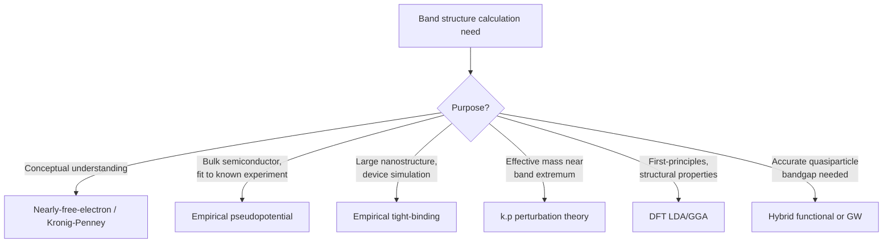

## E-k Diagrams and Band Structure Calculations


### Overview

The E-k diagram (energy versus crystal momentum) is the primary graphical representation of a semiconductor's electronic band structure, plotting allowed energy states $E_n(\vec{k})$ as a function of wavevector along high-symmetry directions of the Brillouin zone. Computing these band structures accurately requires solving the many-electron Schrödinger equation in a periodic potential using approximate but tractable computational methods, ranging from empirical models to first-principles quantum mechanical calculations.

### Structure and Convention of E-k Diagrams

**Plotting Convention**

**Key Points**

- The horizontal axis represents crystal momentum $\vec{k}$, typically plotted along a path connecting high-symmetry points of the Brillouin zone (e.g., $L \to \Gamma \to X \to U,K \to \Gamma$ for FCC-based zinc blende/diamond semiconductors)
- The vertical axis represents electron energy $E$, usually referenced to the valence band maximum (set to $E=0$) or vacuum level
- Multiple bands are plotted simultaneously: several valence bands (heavy hole, light hole, split-off) below $E=0$, and one or more conduction bands above
- The diagram is presented in the **reduced zone scheme**, where all bands are folded into the first Brillouin zone

**Reading Key Information from E-k Diagrams**

- **Bandgap** $E_g$: vertical energy separation between the valence band maximum (VBM) and conduction band minimum (CBM)
- **Direct vs. indirect character**: whether VBM and CBM align at the same $\vec{k}$ (see related topic)
- **Effective mass**: inversely related to the curvature ($d^2E/dk^2$) of a band near its extremum — sharper curvature means lighter effective mass
- **Band degeneracy**: multiple bands touching or nearly overlapping at a given $\vec{k}$ (e.g., heavy-hole and light-hole bands degenerate at $\Gamma$ in most zinc blende semiconductors)

### Valence Band Structure Detail

**Key Points**

Near the valence band maximum at $\Gamma$, zinc blende and diamond-structure semiconductors typically exhibit three closely related valence bands due to spin-orbit coupling:

- **Heavy-hole (HH) band**: larger effective mass, smaller curvature
- **Light-hole (LH) band**: smaller effective mass, larger curvature
- **Split-off (SO) band**: separated from HH/LH by the spin-orbit splitting energy $\Delta_{SO}$ at $\Gamma$ due to relativistic spin-orbit interaction

**Example**

In GaAs, the spin-orbit splitting energy is $\Delta_{SO} \approx 0.34$ eV, meaning the split-off band lies about 0.34 eV below the degenerate HH/LH band maximum at $\Gamma$. This splitting is large enough that the split-off band contributes negligibly to room-temperature hole transport, but it becomes relevant in certain Auger recombination pathways in laser diodes.

### Empirical/Semi-Empirical Band Structure Methods

**Nearly-Free-Electron and Empirical Pseudopotential Method (EPM)**

**Key Points**

- Treats the true ionic potential as replaced by a smoother, weaker "pseudopotential" that reproduces the correct valence electron behavior outside the atomic core while avoiding the computationally expensive rapid oscillations near the nucleus
- Pseudopotential form factors are empirically fit to reproduce known experimental bandgaps and optical transition energies
- Was historically (1960s-70s) the primary method for calculating realistic semiconductor band structures (e.g., Cohen and Bergstresser's classic EPM calculations for group IV and III-V semiconductors)

**Tight-Binding (Empirical TB) Method**

- Constructs Bloch states as linear combinations of atomic-like orbitals (LCAO) with empirically fitted hopping/overlap parameters
- Computationally efficient; widely used for large-scale device simulation (e.g., nanostructures, quantum wells, superlattices) where full ab initio methods are too costly
- Common basis sets: $sp^3$, $sp^3s^*$ (with an extra excited s-orbital to better fit conduction band curvature), or $sp^3d^5s^*$ for improved accuracy

**k·p Perturbation Theory**

- An effective method for describing band structure **near a specific point** (typically $\Gamma$) using perturbation theory, expanding in powers of $\vec{k}$
- Particularly effective for extracting effective masses and valence band warping/anisotropy near band extrema
- Basis for the widely used **Luttinger-Kohn Hamiltonian** describing coupled heavy-hole/light-hole/split-off valence bands in III-V semiconductors

### First-Principles (Ab Initio) Methods

**Density Functional Theory (DFT)**

**Key Points**

- Solves the many-electron problem by mapping it onto an effective single-particle problem via the Kohn-Sham equations, using an exchange-correlation functional to approximate electron-electron interaction effects
- Standard approximations: Local Density Approximation (LDA), Generalized Gradient Approximation (GGA)
- **Known limitation**: standard DFT-LDA/GGA systematically **underestimates bandgaps**, often by 30-50% or more compared to experiment [Unverified — the degree of underestimation is material-dependent and varies with the specific functional used] — this is the well-known "DFT bandgap problem," attributed to the derivative discontinuity of the exact exchange-correlation functional not being captured by LDA/GGA
- More accurate (but far more computationally expensive) approaches include hybrid functionals (e.g., HSE06) and many-body perturbation theory (GW approximation), which substantially improve bandgap accuracy

**GW Approximation**

- A many-body perturbation theory approach that computes quasiparticle energies using the electron self-energy, approximated as the product of the Green's function ($G$) and the screened Coulomb interaction ($W$)
- Provides significantly improved bandgap accuracy over standard DFT, at substantially higher computational cost
- Often combined with the Bethe-Salpeter equation (BSE) to additionally capture excitonic effects in optical absorption spectra

### Comparison of Band Structure Methods

| Method | Accuracy | Computational Cost | Typical Use Case |
| --- | --- | --- | --- |
| Nearly-free-electron | Low (qualitative only) | Very low | Pedagogical/conceptual |
| Empirical pseudopotential (EPM) | Moderate-high (fit to experiment) | Low-moderate | Classic bulk semiconductor band structure |
| Empirical tight-binding | Moderate-high (fit to experiment) | Low | Nanostructures, large-scale device simulation |
| k·p perturbation theory | High near band extrema only | Low | Effective mass, valence band mixing |
| DFT (LDA/GGA) | Poor bandgap, good structural properties | Moderate | Total energy, structural, and trend studies |
| DFT (hybrid functionals) | Good | High | Bandgap-sensitive predictions |
| GW/GW-BSE | Very high | Very high | Benchmark quasiparticle and optical properties |

### E-k Diagram Schematic for Zinc Blende Semiconductor (svg_diagram)



```
<svg xmlns="http://www.w3.org/2000/svg" viewBox="0 0 500 320" width="500" height="320">
  <title>Schematic E-k Diagram for III-V Semiconductor (svg_diagram)</title>
  <rect width="500" height="320" fill="#ffffff" />
  <line x1="50" y1="280" x2="470" y2="280" stroke="#1a202c" stroke-width="1.5" />
  <line x1="260" y1="20" x2="260" y2="300" stroke="#a0aec0" stroke-dasharray="2,2" />

  
  <path d="M 80 100 Q 260 40, 440 110" stroke="#2b6cb0" stroke-width="2.5" fill="none" />
  <text x="260" y="30" font-size="11" text-anchor="middle" fill="#2b6cb0">Conduction band</text>

  
  <path d="M 80 230 Q 260 180, 440 235" stroke="#e53e3e" stroke-width="2.5" fill="none" />
  
  <path d="M 80 200 Q 260 180, 440 205" stroke="#d69e2e" stroke-width="2" fill="none" />
  
  <path d="M 80 260 Q 260 250, 440 262" stroke="#805ad5" stroke-width="2" fill="none" />

  <text x="445" y="240" font-size="10" fill="#e53e3e">HH</text>
  <text x="445" y="210" font-size="10" fill="#d69e2e">LH</text>
  <text x="445" y="266" font-size="10" fill="#805ad5">SO</text>

  
  <line x1="260" y1="45" x2="260" y2="180" stroke="#38a169" stroke-width="2" />
  <text x="270" y="115" font-size="12" fill="#38a169">Eg</text>

  <text x="80" y="300" font-size="11">L</text>
  <text x="260" y="300" font-size="11" text-anchor="middle">Γ</text>
  <text x="440" y="300" font-size="11" text-anchor="end">X</text>
  <text x="20" y="150" font-size="12">E</text>
</svg>
```

### Applications of Computed Band Structures

**Next Steps for Device Modeling**

- **Effective mass extraction**: fitting parabolic approximations near band extrema for use in drift-diffusion and Monte Carlo device simulations
- **Optical absorption/emission spectra**: computing joint density of states and matrix elements for direct/indirect transitions
- **Strain engineering**: predicting how mechanical strain (via deformation potential theory) shifts and splits band extrema, critical for strained-Si and strained-SiGe CMOS technology
- **Heterostructure band alignment**: determining conduction/valence band offsets at semiconductor interfaces, essential for quantum well and HEMT device design
- **Alloy band structure interpolation**: virtual crystal approximation (VCA) or supercell methods for predicting band structure of compositionally graded alloys

### Mermaid Diagram: Band Structure Calculation Method Selection



### Conclusion

E-k diagrams provide the essential visual and quantitative representation of a semiconductor's allowed electronic states across the Brillouin zone, encoding bandgap size and character, effective masses, and valence band structure details like heavy-hole/light-hole/split-off splitting. Computing these band structures accurately requires selecting an appropriate method — ranging from computationally cheap empirical pseudopotential and tight-binding approaches to first-principles DFT and GW calculations — based on the required accuracy, system size, and whether bulk or nanostructured behavior is being modeled.

**Related Topics**

- Direct versus indirect bandgap materials
- Effective mass theory and k·p perturbation methods
- Reciprocal lattice and Brillouin zone high-symmetry points
- Strain engineering and deformation potential theory
- Heterostructure band alignment and offsets
- Density functional theory fundamentals for materials science