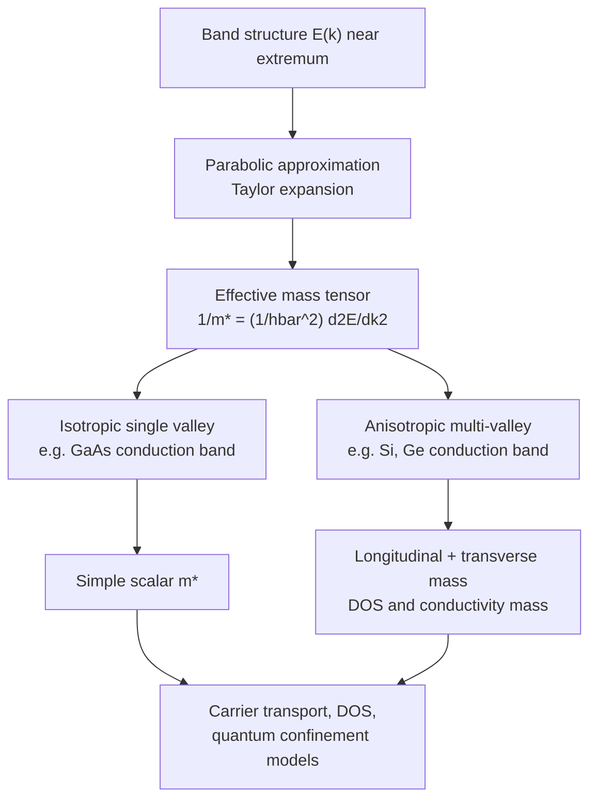

## Effective Mass Approximation

### Overview

The effective mass approximation is a foundational simplification in semiconductor physics that allows electrons and holes moving through a crystal's periodic potential to be treated as quasi-classical free particles, but with a modified ("effective") mass that encapsulates the influence of the crystal lattice. This approximation dramatically simplifies the analysis of carrier transport, quantum confinement, and device behavior without requiring explicit solution of the full periodic-potential Schrödinger equation for every problem.

### Theoretical Foundation

**Origin from Band Curvature**

Near an extremum (minimum or maximum) of a band $E_n(\vec{k})$, a Taylor expansion gives a parabolic approximation:

$$E(\vec{k}) \approx E(\vec{k}_0) + \frac{\hbar^2}{2}\sum_{i,j}\left(\frac{1}{m^*}\right)_{ij}(k_i - k_{0,i})(k_j - k_{0,j})$$

For an isotropic, simple parabolic band, this reduces to the familiar free-electron-like form:

$$E(\vec{k}) = E(\vec{k}_0) + \frac{\hbar^2 k^2}{2m^*}$$

**Key Points**

- The effective mass tensor is formally defined as the inverse of the band curvature:

$$\left(\frac{1}{m^*}\right)_{ij} = \frac{1}{\hbar^2}\frac{\partial^2 E}{\partial k_i \partial k_j}$$

- A **sharper (more curved)** band near its extremum corresponds to a **smaller** effective mass
- A **flatter** band corresponds to a **larger** effective mass
- Effective mass can be anisotropic (direction-dependent) if the constant-energy surfaces are non-spherical (ellipsoidal, as in Si and Ge conduction band valleys)

### Physical Interpretation

**Semiclassical Equation of Motion**

Under an applied electric field $\vec{E}$ (or more generally, external force $\vec{F}$), a Bloch electron obeys a semiclassical equation of motion analogous to Newton's second law:

$$\hbar\frac{d\vec{k}}{dt} = -e\vec{E} = \vec{F}$$


$$\vec{F} = m^*\vec{a}$$

**Key Points**

- This allows carriers to be treated using familiar classical mechanics and Drude-like transport equations, but with $m^*$ replacing the free electron mass $m_0$
- The effective mass absorbs the complex effects of the periodic lattice potential (Bragg reflection, band structure curvature) into a single, band-structure-derived parameter
- Group velocity: $\vec{v} = \frac{1}{\hbar}\nabla_{\vec{k}}E(\vec{k})$, consistent with treating the electron as a wave packet

### Effective Mass in Real Semiconductors

**Conduction Band Effective Mass**

**Key Points**

- **Silicon**: six equivalent ellipsoidal conduction band valleys along $\langle 100 \rangle$ directions near the X points, each characterized by two effective masses: longitudinal $m_l^* \approx 0.98\, m_0$ and transverse $m_t^* \approx 0.19\, m_0$
- **Germanium**: eight half-ellipsoidal valleys at the L points (equivalent to four full valleys), with $m_l^* \approx 1.59\, m_0$ and $m_t^* \approx 0.082\, m_0$
- **GaAs**: single, nearly isotropic and spherical conduction band minimum at $\Gamma$, with a small, isotropic effective mass $m_e^* \approx 0.067\, m_0$ — this small mass contributes to GaAs's high electron mobility

[Unverified — precise effective mass values vary slightly across measurement techniques (cyclotron resonance, optical, magnetotransport) and literature sources; the values given are commonly cited textbook references.]

**Valence Band Effective Mass**

Due to the near-degeneracy of heavy-hole, light-hole, and split-off bands at $\Gamma$ (see related E-k diagram topic), holes exhibit multiple effective masses:

- **Heavy-hole mass** $m_{hh}^*$: larger, corresponding to the flatter heavy-hole band
- **Light-hole mass** $m_{lh}^*$: smaller, corresponding to the more curved light-hole band
- For GaAs: $m_{hh}^* \approx 0.5\, m_0$, $m_{lh}^* \approx 0.076\, m_0$ [Unverified — literature values show some spread depending on measurement method]

**Density-of-States vs. Conductivity Effective Mass**

For materials with multiple anisotropic valleys or multiple bands (like Si, Ge, and the valence bands of most semiconductors), two distinct averaged effective masses are used depending on the application:

$$m_{DOS}^* = \left(m_l^* (m_t^*)^2\right)^{1/3} \times (\text{valley degeneracy factor})^{2/3}$$

- **Density-of-states effective mass** ($m_{DOS}^*$): used for calculating carrier concentration and Fermi level position, incorporates valley/band degeneracy
- **Conductivity effective mass** ($m_c^*$): used for calculating mobility and conductivity, weighted differently (harmonic-mean-like averaging over the ellipsoidal valleys) since transport properties depend differently on the mass components than does density of states

### Effective Mass and Ellipsoidal Constant-Energy Surfaces (svg_diagram)



```
<svg xmlns="http://www.w3.org/2000/svg" viewBox="0 0 450 260" width="450" height="260">
  <title>Anisotropic Constant Energy Surfaces (svg_diagram)</title>
  <rect width="450" height="260" fill="#ffffff" />
  
  <circle cx="110" cy="120" r="60" fill="none" stroke="#2b6cb0" stroke-width="2" />
  <text x="110" y="200" font-size="12" text-anchor="middle">Isotropic (GaAs)</text>
  <text x="110" y="220" font-size="10" text-anchor="middle" fill="#4a5568">single spherical valley</text>

  
  <ellipse cx="330" cy="120" rx="90" ry="40" fill="none" stroke="#e53e3e" stroke-width="2" />
  <line x1="240" y1="120" x2="420" y2="120" stroke="#a0aec0" stroke-dasharray="3,2" />
  <text x="330" y="80" font-size="10" fill="#e53e3e">m_l* (longitudinal)</text>
  <text x="330" y="170" font-size="10" fill="#e53e3e">m_t* (transverse)</text>
  <text x="330" y="200" font-size="12" text-anchor="middle">Ellipsoidal (Si, Ge)</text>
  <text x="330" y="220" font-size="10" text-anchor="middle" fill="#4a5568">multiple equivalent valleys</text>
</svg>
```

### Applications of Effective Mass Theory

**Carrier Concentration and Density of States**

The effective mass directly enters the 3D density of states formula for a parabolic band:

$$g(E) = \frac{1}{2\pi^2}\left(\frac{2m^*}{\hbar^2}\right)^{3/2}\sqrt{E - E_c}$$

This is used to derive carrier concentration expressions (via Fermi-Dirac statistics) essential for calculating Fermi level position, intrinsic carrier concentration $n_i$, and doping-dependent carrier statistics.

**Mobility and Transport**

The conductivity effective mass directly determines drift mobility:

$$\mu = \frac{e\tau}{m_c^*}$$

where $\tau$ is the scattering relaxation time. A smaller effective mass generally yields higher mobility for a given scattering time — explaining why GaAs (small isotropic $m^*$) exhibits substantially higher electron mobility than silicon at comparable doping levels.

**Quantum Confinement (Effective Mass Approximation in Nanostructures)**

**Example**

In quantum well, quantum wire, and quantum dot structures, the effective mass approximation is extended to solve an envelope-function Schrödinger equation, treating the confining potential (e.g., a heterojunction band offset) using the bulk effective mass of each material region. For a simple 1D infinite quantum well of width $L$, the confined energy levels are approximated as:

$$E_n = \frac{\hbar^2\pi^2n^2}{2m^*L^2}$$

This envelope-function/effective-mass framework underlies the design of quantum well lasers, HEMTs, and other heterostructure devices, though it becomes less accurate for very thin layers (a few atomic monolayers) where the approximation's underlying assumption of slowly-varying envelope functions breaks down.

### Limitations of the Effective Mass Approximation

**Key Points**

- Valid only near band extrema where the parabolic approximation holds; breaks down at higher energies or for non-parabolic bands (relevant for narrow-gap semiconductors like InSb, or high-field/hot-carrier transport)
- Non-parabolicity corrections are often needed for accurate modeling in narrow-bandgap materials or at high carrier energies, sometimes incorporated via the Kane model
- Does not capture inter-band or inter-valley scattering processes directly; these require explicit consideration of the full band structure (e.g., in Monte Carlo device simulations)
- Breaks down at abrupt heterointerfaces or ultra-thin layers where atomic-scale variations invalidate the slowly-varying envelope function assumption

### Mermaid Diagram: Effective Mass Concept Flow



### Conclusion

The effective mass approximation transforms the complex quantum mechanical problem of an electron in a periodic crystal potential into a tractable quasi-classical particle picture, with the band curvature encoding all lattice effects into a single (possibly anisotropic and multi-valued) mass parameter. This approximation underlies essentially all practical semiconductor device modeling — from carrier statistics and mobility calculations to quantum well energy level design — making it one of the most widely applied simplifications in semiconductor physics and engineering.

**Related Topics**

- E-k diagrams and band structure calculations
- Direct versus indirect bandgap materials and valley degeneracy
- Density of states and carrier statistics
- k·p perturbation theory and non-parabolicity (Kane model)
- Quantum well and heterostructure envelope-function theory
- Carrier mobility and scattering mechanisms