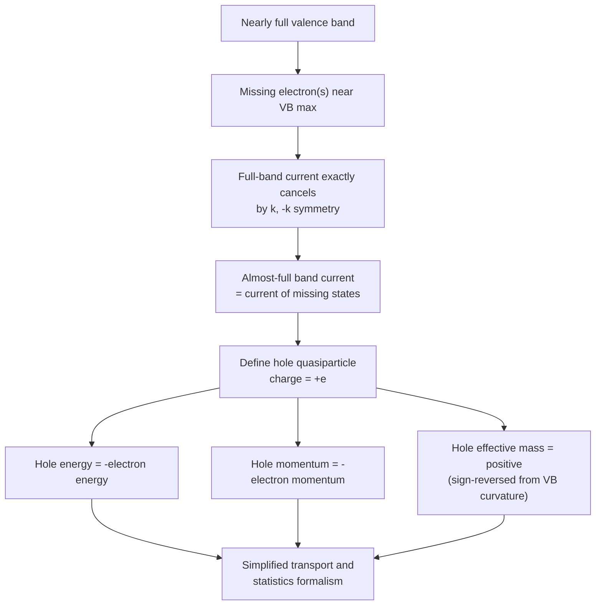

## Holes as Quasiparticles

### Overview

The hole is a quasiparticle concept that dramatically simplifies the description of a nearly full valence band by replacing the collective, complex motion of a vast number of electrons with a single, positively charged fictitious particle. This conceptual tool is essential throughout semiconductor physics, appearing in carrier statistics, transport equations, and virtually all p-type and bipolar device analysis.

### Motivation: The Problem of a Nearly Full Band

**The Full-Band Difficulty**

**Key Points**

- A completely filled valence band carries **zero net current**, even under an applied electric field, because for every occupied state $\vec{k}$ contributing velocity $\vec{v}(\vec{k})$, there is an equally occupied state at $-\vec{k}$ contributing $-\vec{v}(\vec{k})$ — these cancel exactly by symmetry
- When a valence band is **almost** full (missing only a few electrons near the band maximum, as occurs via thermal excitation or acceptor doping), the current no longer cancels, since the "missing" states break the symmetric cancellation
- Directly tracking $N-1$ (or more) remaining valence electrons to compute this small net current is computationally and conceptually cumbersome

**The Hole Solution**

Rather than tracking all the remaining electrons in an almost-full band, it is mathematically equivalent and vastly simpler to track just the small number of **missing electron states (empty states)** as if they were themselves real, positively charged particles — these are **holes**.

### Formal Properties of the Hole

**Charge**

**Key Points**

- A hole carries an effective charge of $+e$ (positive elementary charge), opposite to the electron's $-e$
- This follows because the current contributed by all the actual electrons in the almost-full band is exactly equal to the current that would be contributed by a single positive charge occupying the empty state(s)

**Energy**

The hole energy is defined as the **negative** of the missing electron's energy, with an appropriate sign/reference convention:

$$E_h(\vec{k}_h) = -E_e(\vec{k}_e)$$

**Key Points**

- This inversion means that as electron energy in the valence band *decreases* (moving toward more negative energies, deeper into the band), hole energy *increases*
- Consequently, the valence band maximum (highest electron energy) corresponds to the **hole energy minimum** — holes naturally seek the lowest available energy, just like electrons in the conduction band, but this minimum sits at the valence band maximum in the electron-energy picture

**Crystal Momentum**

$$\vec{k}_h = -\vec{k}_e$$

The hole's crystal momentum is the negative of the crystal momentum of the missing electron state.

**Velocity**

$$\vec{v}_h(\vec{k}_h) = \vec{v}_e(\vec{k}_e)$$

Despite the charge and momentum sign reversals, the hole's group velocity equals that of the missing electron — a consequence of the two sign reversals (in both energy and momentum definitions) canceling in the velocity relation $\vec{v} = \nabla_k E/\hbar$.

**Effective Mass**

**Key Points**

- Since the valence band curves *downward* near its maximum ($\partial^2 E_e/\partial k^2 < 0$ for electrons), and hole energy is the negative of electron energy, the hole's effective mass is **positive**:

$$m_h^* = -m_e^*|_{VB}$$

- This sign convention ensures holes behave like ordinary positive-mass particles responding normally to forces ($\vec{F} = m_h^*\vec{a}$), rather than the awkward negative-mass electrons would otherwise represent near a band maximum

### Hole Concept Consistency Table

| Property | Missing Electron (raw picture) | Hole (quasiparticle picture) |
| --- | --- | --- |
| Charge | $-e$ absent → net $+e$ | $+e$ |
| Energy | Near VB max (high electron energy) | Near hole energy minimum |
| Crystal momentum | $\vec{k}_e$ | $-\vec{k}_e$ |
| Effective mass | Negative (band curves down) | Positive |
| Group velocity | $\vec{v}_e$ | Same as $\vec{v}_e$ |
| Response to E-field | Complex (whole-band bookkeeping) | Simple: $\vec{F}=+e\vec{E}=m_h^*\vec{a}$ |

### Physical Picture: Bubble Analogy

**Example**

A useful analogy is a nearly full glass of water with a single air bubble near the top. Tracking the motion of every water molecule to describe the system's evolution is complex, but tracking the single bubble — which appears to rise and move as if it were itself a distinct, buoyant object — is vastly simpler and physically equivalent. Similarly, tracking one hole moving through a nearly full valence band captures the same physics (net current, energy states) as tracking all the remaining electrons, but is far more tractable analytically.

### Holes in Multiple Valence Bands

As discussed in the E-k diagram topic, real semiconductors have multiple valence bands near $\Gamma$ (heavy-hole, light-hole, split-off), each contributing its own hole population with distinct effective mass:

**Key Points**

- **Heavy holes**: associated with the flatter (heavy-hole) valence band, larger effective mass, generally the majority carrier type by density of states weight
- **Light holes**: associated with the more curved (light-hole) band, smaller effective mass, higher mobility per carrier
- **Split-off holes**: generally negligible contribution to room-temperature transport in wide-enough spin-orbit-split materials like GaAs, due to the additional $\Delta_{SO}$ energy separation
- Total hole concentration/transport properties are the combined contribution of all populated valence sub-bands, weighted by their respective density of states and mobility

### Hole Diagram: Missing Electron vs. Hole Picture (svg_diagram)



```
<svg xmlns="http://www.w3.org/2000/svg" viewBox="0 0 500 260" width="500" height="260">
  <title>Hole as Missing Electron in Valence Band (svg_diagram)</title>
  <rect width="500" height="260" fill="#ffffff" />

  
  <line x1="60" y1="150" x2="440" y2="150" stroke="#4a5568" stroke-width="1.5" />
  <text x="30" y="155" font-size="12">VB</text>

  <g id="electrons">
    <circle cx="90" cy="150" r="8" fill="#2b6cb0" />
    <circle cx="140" cy="150" r="8" fill="#2b6cb0" />
    <circle cx="190" cy="150" r="8" fill="#2b6cb0" />
    <circle cx="290" cy="150" r="8" fill="#2b6cb0" />
    <circle cx="340" cy="150" r="8" fill="#2b6cb0" />
    <circle cx="390" cy="150" r="8" fill="#2b6cb0" />
  </g>
  
  <circle cx="240" cy="150" r="9" fill="none" stroke="#e53e3e" stroke-width="2.5" stroke-dasharray="3,2" />
  <text x="240" y="185" font-size="12" text-anchor="middle" fill="#e53e3e">Missing electron<br /></text>
  <text x="240" y="200" font-size="11" text-anchor="middle" fill="#e53e3e">= "hole" (+e)</text>

  
  <line x1="150" y1="90" x2="330" y2="90" stroke="#38a169" stroke-width="2" marker-end="url(#arrow2)" />
  <text x="240" y="75" font-size="12" text-anchor="middle" fill="#38a169">Equivalent net current direction</text>
</svg>
```

### Applications in Device Physics

**Key Points**

- **Carrier statistics**: hole concentration $p$ in the valence band is calculated analogously to electron concentration $n$, using the hole density of states and Fermi-Dirac (or Boltzmann) statistics with $(E_F - E)$ sign conventions reversed relative to electrons
- **p-n junction physics**: hole injection/diffusion into the n-side, and electron injection/diffusion into the p-side, together constitute the total diode current — both carrier types treated symmetrically using the electron-hole quasiparticle formalism
- **Bipolar transistor operation**: minority carrier (hole or electron) injection and diffusion across the base region is the central operating mechanism, directly relying on the hole-as-particle simplification
- **Ambipolar transport**: in the presence of both carrier types, coupled electron-hole transport equations (ambipolar diffusion equation) describe recombination-limited carrier dynamics under excess carrier injection, such as under illumination or forward bias

### Mermaid Diagram: Hole Quasiparticle Derivation Logic



### Conclusion

The hole is a rigorously justified quasiparticle construction that replaces the complex collective behavior of nearly all the electrons in an almost-full valence band with a single, simply-behaving positive charge carrier. By correctly inverting the sign conventions for energy, momentum, and effective mass relative to the missing electron, the hole picture allows p-type semiconductors, p-n junctions, and bipolar devices to be analyzed with the same straightforward classical-transport formalism used for electrons, making it one of the most practically indispensable simplifications in semiconductor device physics.

**Related Topics**

- Effective mass approximation and valence band curvature
- E-k diagrams: heavy-hole, light-hole, and split-off bands
- Carrier statistics and Fermi-Dirac distribution
- p-n junction physics and minority carrier injection
- Ambipolar transport and the ambipolar diffusion equation
- Bipolar junction transistor operation