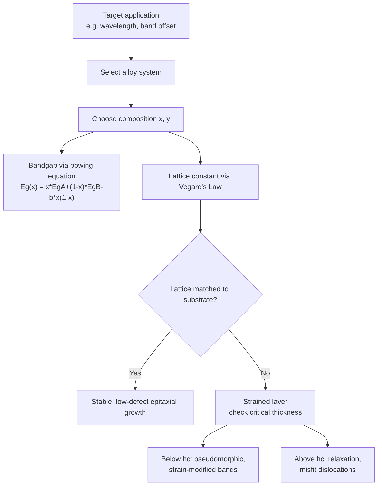

## Bandgap Engineering in Alloy Semiconductors

### Overview

Bandgap engineering is the deliberate manipulation of semiconductor alloy composition to tailor the bandgap energy, band alignment, lattice constant, and other electronic/optical properties for specific device applications. By mixing two or more binary semiconductor compounds into ternary, quaternary, or higher-order alloys, engineers can continuously tune material properties across a range bounded by the constituent binaries, enabling precise design of optoelectronic and high-speed electronic devices.

### Fundamental Alloy Composition Framework

**Ternary and Quaternary Alloys**

**Key Points**

- **Ternary alloys**: mix three elements, typically substituting on one sublattice, e.g., $Al_xGa_{1-x}As$ (Al substitutes for Ga in a fraction $x$ of sites) or $In_xGa_{1-x}As$
- **Quaternary alloys**: mix four elements, offering two independent composition parameters, e.g., $In_xGa_{1-x}As_yP_{1-y}$, allowing simultaneous independent control of bandgap and lattice constant
- Composition is denoted by a mole fraction $x$ (and $y$ for quaternaries), interpolating continuously between the constituent binary compounds

**Vegard's Law: Lattice Constant Interpolation**

$$a_{alloy}(x) = x \cdot a_A + (1-x) \cdot a_B$$

This linear interpolation approximates the alloy lattice constant between the binary endpoint values.

**Key Points**

- Widely used as a first-order approximation for lattice matching calculations
- [Inference: real alloys often show small deviations (bowing) from strict linearity depending on the specific material system and degree of size/bond-length mismatch between constituent atoms]

### Bandgap Bowing

**The Bowing Parameter**

Unlike lattice constant, the bandgap of an alloy does **not** interpolate linearly between the binary endpoints. Instead, it is modeled with a quadratic **bowing parameter** $b$:

$$E_g(x) = x \cdot E_g^A + (1-x) \cdot E_g^B - b \cdot x(1-x)$$

**Key Points**

- The bowing parameter $b$ is empirically determined (and can be predicted with varying accuracy by theory) for each alloy system
- A larger $b$ indicates a stronger downward deviation (bowing) from the naive linear interpolation
- Physical origins of bowing include: (1) volume deformation effects from lattice mismatch, (2) charge-transfer/electronegativity differences between the substituting atoms, and (3) structural relaxation effects
- Example bowing parameters: $Al_xGa_{1-x}As$ has a relatively small bowing parameter ($b \approx 0.37$–$1.3$ eV, direct gap regime) [Unverified — reported bowing parameters vary noticeably across the literature depending on measurement method and composition range]; $In_xGa_{1-x}N$ has a notably larger and more disputed bowing parameter, historically reported anywhere from ~1 to ~3 eV depending on sample quality and growth method

### Key Alloy Systems in Semiconductor Technology

**AlGaAs System**

**Key Points**

- $Al_xGa_{1-x}As$ is nearly perfectly lattice-matched to GaAs across the entire composition range (Al and Ga have very similar atomic/ionic radii), making it one of the most widely used heterostructure material systems
- Direct bandgap for $x \lesssim 0.45$, transitioning to indirect (X-valley) for higher Al content
- Bandgap tunable from 1.42 eV (GaAs, $x=0$) up to about 2.16 eV (AlAs, $x=1$, indirect)
- Foundational to early laser diodes, HEMTs, and heterojunction bipolar transistors (HBTs)

**InGaAsP/InP System**

- Quaternary $In_xGa_{1-x}As_yP_{1-y}$ lattice-matched to InP substrates by satisfying a specific relationship between $x$ and $y$
- The independent tunability of bandgap (via one compositional degree of freedom) while maintaining lattice match to InP (via the other) makes this system central to long-haul fiber-optic telecommunications lasers and detectors operating at 1.3 μm and 1.55 μm wavelengths — the low-loss and low-dispersion windows of silica optical fiber
- Bandgap range covers approximately 0.75 eV (InGaAs, matched to InP) to 1.35 eV (InP itself)

**InGaN System**

- $In_xGa_{1-x}N$ spans an exceptionally wide bandgap range: from InN (~0.7 eV) to GaN (3.4 eV), covering nearly the entire visible spectrum
- Central to blue and green LEDs and laser diodes (enabling white LED lighting via blue LED + phosphor conversion)
- Significant lattice mismatch between InN and GaN limits achievable In content in high-quality epitaxial films, and large piezoelectric/spontaneous polarization fields in the wurtzite structure complicate quantum well design (quantum-confined Stark effect)

**SiGe System**

- $Si_{1-x}Ge_x$ alloys used extensively in silicon-compatible heterojunction bipolar transistors (SiGe HBTs) and strained-channel CMOS
- Ge has a larger lattice constant than Si (~4.2% mismatch), so SiGe layers grown on Si substrates are typically compressively strained, which itself further modifies the band structure (strain-induced band splitting) beyond the simple alloy bandgap bowing effect
- Enables bandgap and band-offset engineering fully compatible with existing silicon CMOS fabrication infrastructure

### Bandgap vs. Composition Diagram (svg_diagram)



```
<svg xmlns="http://www.w3.org/2000/svg" viewBox="0 0 500 320" width="500" height="320">
  <title>Bandgap vs Lattice Constant for III-V Alloys (svg_diagram)</title>
  <rect width="500" height="320" fill="#ffffff" />
  <line x1="60" y1="280" x2="470" y2="280" stroke="#1a202c" stroke-width="1.5" />
  <line x1="60" y1="20" x2="60" y2="280" stroke="#1a202c" stroke-width="1.5" />
  <text x="250" y="305" font-size="12" text-anchor="middle">Lattice constant (Å)</text>
  <text x="20" y="150" font-size="12">Bandgap (eV)</text>

  
  <circle cx="100" cy="60" r="5" fill="#2b6cb0" />
  <text x="105" y="55" font-size="11">GaP (2.26 eV)</text>

  <circle cx="180" cy="90" r="5" fill="#2b6cb0" />
  <text x="185" y="85" font-size="11">AlAs (2.16 eV, indirect)</text>

  <circle cx="200" cy="150" r="5" fill="#e53e3e" />
  <text x="205" y="150" font-size="11">GaAs (1.42 eV)</text>

  <circle cx="260" cy="180" r="5" fill="#e53e3e" />
  <text x="265" y="180" font-size="11">InP (1.35 eV)</text>

  <circle cx="340" cy="240" r="5" fill="#38a169" />
  <text x="345" y="240" font-size="11">InGaAs (~0.75 eV)</text>

  <circle cx="400" cy="270" r="5" fill="#38a169" />
  <text x="405" y="270" font-size="11">InAs (0.36 eV)</text>

  
  <line x1="180" y1="90" x2="200" y2="150" stroke="#a0aec0" stroke-dasharray="3,2" />
  <line x1="200" y1="150" x2="260" y2="180" stroke="#a0aec0" stroke-dasharray="3,2" />
  <line x1="260" y1="180" x2="340" y2="240" stroke="#a0aec0" stroke-dasharray="3,2" />
  <line x1="340" y1="240" x2="400" y2="270" stroke="#a0aec0" stroke-dasharray="3,2" />
</svg>
```

### Strain and Critical Thickness

**Key Points**

- When alloy composition is chosen for bandgap engineering without matching the substrate lattice constant, the epitaxial layer accumulates strain energy
- Below a **critical thickness** $h_c$, the layer remains pseudomorphically strained (coherent with substrate lattice) — this is exploited intentionally in **strained-layer** devices (e.g., strained InGaAs channels, strained-Si CMOS) to further modify band structure and carrier mobility beyond composition alone
- Above $h_c$, misfit dislocations form to relax the strain, generally degrading material quality and device performance (see related topic on line defects)
- Matthews-Blakeslee theory provides a widely used, though approximate, framework for estimating critical thickness as a function of lattice mismatch

### Quantum Well and Superlattice Engineering

**Example**

Beyond bulk alloy composition, bandgap engineering extends to nanoscale heterostructures: alternating thin layers of different-bandgap materials (e.g., GaAs wells with AlGaAs barriers) create quantum wells where confined energy levels are determined by both the bulk bandgaps/band offsets and the well width via the effective mass approximation. This allows further fine-tuning of the effective transition energy beyond what bulk alloy composition alone permits, and is the operating principle behind quantum well lasers, multiple-quantum-well (MQW) modulators, and quantum cascade lasers.

### Comparison Table of Major Alloy Systems

| Alloy System | Bandgap Range (eV) | Substrate | Primary Application |
| --- | --- | --- | --- |
| $Al_xGa_{1-x}As$ | 1.42–2.16 | GaAs | Laser diodes, HBTs, HEMTs |
| $In_xGa_{1-x}As_yP_{1-y}$ | 0.75–1.35 | InP | Telecom lasers/detectors (1.3–1.55 μm) |
| $In_xGa_{1-x}N$ | 0.7–3.4 | Sapphire, GaN, SiC | Blue/green/UV LEDs, laser diodes |
| $Si_{1-x}Ge_x$ | 0.66–1.12 (roughly) | Si | SiGe HBTs, strained CMOS |
| $Cd_xHg_{1-x}Te$ | ~0–1.5 | CdZnTe, sapphire | Infrared detectors |

[Unverified — exact bandgap endpoints and ranges depend on specific composition limits achievable with high material quality; the table reflects commonly cited approximate ranges.]

### Mermaid Diagram: Bandgap Engineering Design Flow



### Conclusion

Bandgap engineering through alloy composition control provides semiconductor designers with a powerful, continuously tunable parameter space spanning bandgap energy, lattice constant, and band alignment, enabling the precise material design required for telecommunications lasers, LEDs, high-speed transistors, and infrared detectors. Successful bandgap engineering requires simultaneously managing bandgap bowing effects, lattice-matching constraints (or intentional strain engineering within critical thickness limits), and, at the nanoscale, quantum confinement effects in heterostructure designs.

**Related Topics**

- X-ray diffraction and strain/composition characterization
- Direct versus indirect bandgap materials
- Heterostructure band alignment and offsets
- Epitaxial growth techniques (MOCVD, MBE)
- Quantum well and superlattice device physics
- Point, line, and planar crystal defects (misfit dislocations)