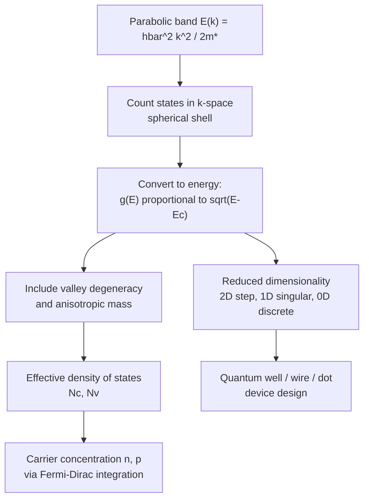

## Density of States in Conduction and Valence Bands

### Overview

The density of states (DOS) function $g(E)$ quantifies the number of available quantum states per unit energy per unit volume at a given energy in a semiconductor's conduction or valence band. It is a central quantity bridging the microscopic band structure $E(\vec{k})$ to macroscopic carrier statistics, enabling calculation of equilibrium carrier concentrations, Fermi level position, and optical transition rates.

### Derivation of the 3D Density of States

**Counting States in k-Space**

**Key Points**

- In a crystal of volume $V$ with periodic (Born-von Kármán) boundary conditions, allowed $\vec{k}$-states are uniformly distributed in k-space with density $\frac{V}{(2\pi)^3}$ per unit k-space volume
- Including spin degeneracy (factor of 2), the number of states in a spherical shell between $k$ and $k+dk$ is:

$$dN = 2 \cdot \frac{V}{(2\pi)^3} \cdot 4\pi k^2 \, dk$$

- Converting from $k$-space to energy using the parabolic (effective mass) band approximation $E = \frac{\hbar^2k^2}{2m^*}$ (measured from the band edge) yields the density of states per unit volume

**Resulting 3D Density of States Formula**

**Conduction band** (states above $E_c$):

$$g_c(E) = \frac{1}{2\pi^2}\left(\frac{2m_e^*}{\hbar^2}\right)^{3/2}\sqrt{E - E_c}, \quad E \geq E_c$$

**Valence band** (states below $E_v$):

$$g_v(E) = \frac{1}{2\pi^2}\left(\frac{2m_h^*}{\hbar^2}\right)^{3/2}\sqrt{E_v - E}, \quad E \leq E_v$$

**Key Points**

- The characteristic $\sqrt{E - E_c}$ (or $\sqrt{E_v - E}$) dependence is a direct consequence of the parabolic (isotropic effective mass) band approximation in three dimensions
- $g(E) = 0$ within the forbidden gap ($E_v < E < E_c$), since no allowed states exist there
- The density of states effective mass $m_e^*$ (or $m_h^*$) incorporates band degeneracy and anisotropy corrections (see below)

### Density of States Diagram (svg_diagram)



```
<svg xmlns="http://www.w3.org/2000/svg" viewBox="0 0 450 300" width="450" height="300">
  <title>Density of States vs Energy (svg_diagram)</title>
  <rect width="450" height="300" fill="#ffffff" />
  <line x1="60" y1="270" x2="420" y2="270" stroke="#1a202c" stroke-width="1.5" />
  <line x1="60" y1="20" x2="60" y2="270" stroke="#1a202c" stroke-width="1.5" />
  <text x="230" y="295" font-size="12" text-anchor="middle">g(E)</text>
  <text x="20" y="150" font-size="12" transform="rotate(-90 20 150)">Energy E</text>

  
  <path d="M 60 200 Q 100 180, 150 100 Q 170 60, 180 30" stroke="#e53e3e" stroke-width="2.5" fill="none" transform="scale(-1,1) translate(-450,0)" />
  <text x="330" y="60" font-size="11" fill="#e53e3e">Valence band g_v(E)</text>

  
  <rect x="55" y="200" width="370" height="60" fill="#a0aec0" opacity="0.15" />
  <text x="230" y="235" font-size="11" text-anchor="middle" fill="#4a5568">Forbidden gap: g(E) = 0</text>
  <line x1="60" y1="200" x2="420" y2="200" stroke="#4a5568" stroke-dasharray="3,2" />
  <line x1="60" y1="260" x2="420" y2="260" stroke="#4a5568" stroke-dasharray="3,2" />
  <text x="425" y="203" font-size="10">Ec</text>
  <text x="425" y="263" font-size="10">Ev</text>

  
  <path d="M 60 200 Q 100 150, 150 90 Q 200 40, 250 20" stroke="#2b6cb0" stroke-width="2.5" fill="none" />
  <text x="150" y="60" font-size="11" fill="#2b6cb0">Conduction band g_c(E)</text>
</svg>
```

### Effective Mass Considerations in DOS

**Multi-Valley Density of States Effective Mass**

For semiconductors with multiple equivalent conduction band valleys (e.g., silicon's six $\langle 100 \rangle$ valleys, germanium's eight half-valleys at L), the density-of-states effective mass must incorporate both the valley degeneracy $M_c$ and the anisotropic longitudinal/transverse masses:

$$m_{DOS,e}^* = M_c^{2/3}\left(m_l^* (m_t^*)^2\right)^{1/3}$$

**Key Points**

- Silicon: $M_c = 6$ equivalent valleys
- Germanium: $M_c = 4$ (eight half-valleys at zone boundary, each shared between two adjacent zones, equivalent to 4 full valleys)
- GaAs: $M_c = 1$ (single, nearly isotropic valley at $\Gamma$), so $m_{DOS,e}^* = m_e^*$ directly

**Valence Band DOS with Multiple Bands**

Since heavy-hole and light-hole bands are typically both populated (and nearly degenerate at $\Gamma$), the total valence band density of states effective mass combines both contributions:

$$m_{DOS,h}^* = \left[(m_{hh}^*)^{3/2} + (m_{lh}^*)^{3/2}\right]^{2/3}$$

Because $m_{hh}^* \gg m_{lh}^*$ typically, heavy holes dominate the total valence band DOS despite light holes having higher mobility per carrier.

### Effective Density of States: $N_c$ and $N_v$

**Definition**

Rather than working with the full energy-dependent DOS function directly in carrier concentration integrals, an extremely useful simplification defines the **effective density of states** at the band edge, obtained by integrating the DOS weighted by the Maxwell-Boltzmann approximation to Fermi-Dirac statistics:

$$N_c = 2\left(\frac{2\pi m_{DOS,e}^* k_B T}{h^2}\right)^{3/2}$$


$$N_v = 2\left(\frac{2\pi m_{DOS,h}^* k_B T}{h^2}\right)^{3/2}$$

**Key Points**

- $N_c$ and $N_v$ represent the "effective number" of states concentrated conceptually at $E_c$ and $E_v$ respectively, such that Boltzmann carrier statistics can be written simply as:

$$n = N_c \exp\left(-\frac{E_c - E_F}{k_B T}\right), \quad p = N_v \exp\left(-\frac{E_F - E_v}{k_B T}\right)$$

- At room temperature (300 K), typical values: $N_c \approx 2.8 \times 10^{19}$ cm⁻³ for Si, $N_v \approx 1.04 \times 10^{19}$ cm⁻³ for Si [Unverified — precise values depend on which effective mass values and temperature convention are used, with modest variation across textbook sources]
- $N_c$ and $N_v$ scale as $T^{3/2}$, reflecting the temperature dependence of the thermally accessible energy range

### Reduced Dimensionality: 2D, 1D, and 0D Density of States

**Key Points**

Bandgap engineering in nanostructures modifies the DOS functional form dramatically:

- **3D (bulk)**: $g(E) \propto \sqrt{E}$ (continuous parabolic dependence, as derived above)
- **2D (quantum well)**: $g(E)$ is a **step function**, constant within each quantized subband and jumping at each subband edge — reflecting confinement in one dimension
- **1D (quantum wire)**: $g(E) \propto (E-E_n)^{-1/2}$ for each 1D subband, producing characteristic van Hove singularities (diverging DOS at each subband onset)
- **0D (quantum dot)**: $g(E)$ collapses into discrete delta functions, analogous to atomic energy levels, since all three dimensions are quantized

**Example**

In a GaAs/AlGaAs quantum well laser, the step-function 2D density of states (compared to bulk's smooth $\sqrt{E}$ dependence) concentrates carriers more efficiently near the band edge for a given carrier density, contributing to lower threshold current density and improved temperature stability compared to bulk double-heterostructure lasers — one of the primary motivations for the historical transition to quantum well laser diode designs.

### Comparison Table: DOS Dimensionality

| Dimensionality | $g(E)$ Functional Form | Physical System |
| --- | --- | --- |
| 3D (bulk) | $\propto \sqrt{E - E_c}$ | Bulk crystal |
| 2D (quantum well) | Step function, constant per subband | Quantum well, heterostructure |
| 1D (quantum wire) | $\propto (E-E_n)^{-1/2}$ per subband | Nanowire, quantum wire |
| 0D (quantum dot) | Discrete delta functions | Quantum dot |

### Applications of Density of States

**Key Points**

- **Carrier concentration calculation**: $n = \int_{E_c}^{\infty} g_c(E) f(E) \, dE$, where $f(E)$ is the Fermi-Dirac distribution function
- **Intrinsic carrier concentration**: $n_i = \sqrt{N_c N_v}\exp\left(-\frac{E_g}{2k_BT}\right)$, derived directly from the effective density of states expressions
- **Optical absorption and joint density of states**: transition rates between valence and conduction bands depend on the joint density of states, combining both band DOS functions at the relevant photon energy
- **Fermi level pinning and degenerate doping**: at very high doping levels, the Fermi level moves into the band itself, requiring the full Fermi-Dirac (rather than Boltzmann) statistics integrated against $g(E)$

### Mermaid Diagram: DOS Derivation and Application Flow



### Conclusion

The density of states function provides the essential link between a semiconductor's band structure and its equilibrium carrier statistics, with the characteristic $\sqrt{E}$ dependence in bulk 3D crystals arising directly from the parabolic effective mass approximation. Incorporating valley degeneracy and multi-band (heavy-hole/light-hole) effects yields the practically useful effective density of states parameters $N_c$ and $N_v$, while dimensional confinement in quantum wells, wires, and dots fundamentally reshapes the DOS function, forming the physical basis for modern low-dimensional optoelectronic device design.

**Related Topics**

- Effective mass approximation and band curvature
- Fermi-Dirac statistics and carrier concentration
- Intrinsic and extrinsic carrier concentration calculations
- Quantum well and superlattice device physics
- Joint density of states and optical absorption
- Degenerate semiconductor statistics