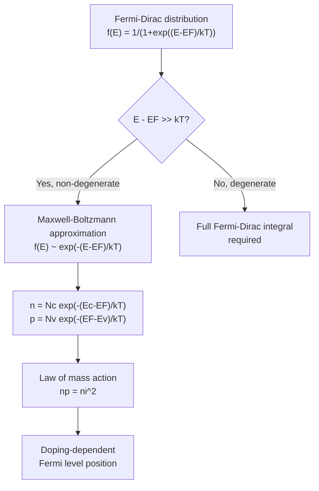

## Fermi-Dirac Distribution and the Fermi Level

### Overview

The Fermi-Dirac distribution function describes the probability that a given quantum energy state is occupied by an electron in a system of fermions at thermal equilibrium. Combined with the density of states, it forms the statistical foundation for calculating carrier concentrations, Fermi level position, and doping-dependent behavior throughout semiconductor physics.

### The Fermi-Dirac Distribution Function

**Mathematical Form**

$$f(E) = \frac{1}{1 + \exp\left(\frac{E - E_F}{k_B T}\right)}$$

where $E_F$ is the **Fermi level** (or Fermi energy), $k_B$ is Boltzmann's constant, and $T$ is absolute temperature.

**Key Points**

- $f(E)$ represents the probability that a state at energy $E$ is occupied by an electron, given thermal equilibrium
- Derived from Fermi-Dirac quantum statistics, which apply to indistinguishable fermions (spin-1/2 particles like electrons) subject to the Pauli exclusion principle
- Range: $0 \leq f(E) \leq 1$ for all $E$, consistent with $f(E)$ being an occupation probability

**Behavior at Key Points**

- At $E = E_F$: $f(E_F) = \frac{1}{2}$ exactly, regardless of temperature (as long as $T > 0$)
- At $T = 0$ K: $f(E)$ becomes a perfect step function — $f(E) = 1$ for $E < E_F$ (all states below $E_F$ filled) and $f(E) = 0$ for $E > E_F$ (all states above $E_F$ empty)
- At $T > 0$ K: the sharp step smooths into a gradual transition over an energy range of approximately a few $k_B T$ around $E_F$

### Fermi-Dirac Distribution Diagram (svg_diagram)



```
<svg xmlns="http://www.w3.org/2000/svg" viewBox="0 0 450 280" width="450" height="280">
  <title>Fermi-Dirac Distribution vs Energy (svg_diagram)</title>
  <rect width="450" height="280" fill="#ffffff" />
  <line x1="60" y1="240" x2="420" y2="240" stroke="#1a202c" stroke-width="1.5" />
  <line x1="60" y1="20" x2="60" y2="240" stroke="#1a202c" stroke-width="1.5" />
  <text x="230" y="265" font-size="12" text-anchor="middle">Energy E</text>
  <text x="25" y="130" font-size="12" transform="rotate(-90 25 130)">f(E)</text>

  <text x="45" y="245" font-size="10">0</text>
  <text x="45" y="25" font-size="10">1</text>

  
  <path d="M 60 30 L 230 30 L 230 240" stroke="#2b6cb0" stroke-width="2.5" fill="none" />
  <text x="100" y="20" font-size="11" fill="#2b6cb0">T = 0 K</text>

  
  <path d="M 60 32 Q 180 32, 200 60 Q 230 130, 260 200 Q 280 235, 400 238" stroke="#e53e3e" stroke-width="2.5" fill="none" />
  <text x="260" y="80" font-size="11" fill="#e53e3e">T &gt; 0 K</text>

  
  <line x1="230" y1="20" x2="230" y2="240" stroke="#4a5568" stroke-dasharray="3,3" />
  <text x="225" y="255" font-size="11" text-anchor="middle">E_F</text>
  <circle cx="230" cy="130" r="3" fill="#1a202c" />
  <text x="240" y="130" font-size="10">f(E_F) = 1/2</text>
</svg>
```

### The Fermi Level: Definition and Physical Meaning

**Formal Definition**

**Key Points**

- The Fermi level $E_F$ is formally the **electrochemical potential** of electrons in the system at thermal equilibrium
- It is the energy at which the occupation probability equals exactly 1/2
- In a system with no applied bias, a single Fermi level applies uniformly throughout the entire material at equilibrium — this is a defining condition of thermal equilibrium
- Under non-equilibrium conditions (e.g., applied bias, illumination), the concept generalizes to separate **quasi-Fermi levels** for electrons ($E_{Fn}$) and holes ($E_{Fp}$)

**Fermi Level Position in Different Materials**

- **Intrinsic semiconductor**: $E_F$ lies very close to mid-gap, with a small correction due to differing effective masses of electrons and holes:

$$E_{Fi} = \frac{E_c + E_v}{2} + \frac{k_BT}{2}\ln\left(\frac{N_v}{N_c}\right) = \frac{E_c+E_v}{2} + \frac{3k_BT}{4}\ln\left(\frac{m_h^*}{m_e^*}\right)$$

- **n-type semiconductor**: $E_F$ shifts toward $E_c$, closer to the conduction band, reflecting the higher electron concentration
- **p-type semiconductor**: $E_F$ shifts toward $E_v$, closer to the valence band
- **Degenerate semiconductor**: heavily doped material where $E_F$ moves into the conduction band (degenerate n-type) or valence band (degenerate p-type), requiring full Fermi-Dirac statistics rather than the Boltzmann approximation

### The Maxwell-Boltzmann Approximation

**Simplification for Non-Degenerate Semiconductors**

**Key Points**

- When $E_F$ lies well within the bandgap, at least a few $k_BT$ away from both $E_c$ and $E_v$ (the **non-degenerate** condition), the Fermi-Dirac function can be approximated by the simpler Maxwell-Boltzmann exponential form:

$$f(E) \approx \exp\left(-\frac{E-E_F}{k_BT}\right), \quad E - E_F \gg k_BT$$

- This approximation dramatically simplifies carrier concentration integrals, yielding the standard exponential relations:

$$n = N_c\exp\left(-\frac{E_c-E_F}{k_BT}\right), \quad p = N_v\exp\left(-\frac{E_F-E_v}{k_BT}\right)$$

- The approximation breaks down for heavily doped (degenerate) semiconductors, where full Fermi-Dirac integrals (Fermi-Dirac integrals of order 1/2, often denoted $F_{1/2}$) must be used instead

### Carrier Concentration from Fermi-Dirac Statistics

**Full Integral Expression**

The electron concentration is obtained by integrating the product of density of states and occupation probability:

$$n = \int_{E_c}^{\infty} g_c(E) f(E) \, dE$$

Under the parabolic band and Maxwell-Boltzmann approximations, this integral evaluates to the effective density of states expression given above, involving $N_c$ and $E_c - E_F$.

**The np Product and Mass-Action Law**

**Key Points**

- Multiplying $n$ and $p$ expressions together, the Fermi level dependence cancels:

$$np = N_cN_v\exp\left(-\frac{E_g}{k_BT}\right) = n_i^2$$

- This is the **law of mass action**, valid at thermal equilibrium regardless of doping level (as long as non-degenerate statistics apply), and is fundamental to relating majority and minority carrier concentrations in doped semiconductors

### Temperature Dependence of the Fermi Level

**Key Points**

- In doped semiconductors, $E_F$ position shifts with temperature: at very low temperatures, incomplete ionization of dopants can pin $E_F$ near the dopant level; at intermediate temperatures (**extrinsic region**), $E_F$ settles at a position determined by the net doping concentration; at very high temperatures, thermally generated intrinsic carriers dominate, and $E_F$ approaches the intrinsic Fermi level $E_{Fi}$ near mid-gap
- This behavior underlies the three characteristic regions of the $\ln(n)$ vs. $1/T$ plot: freeze-out, extrinsic (saturation), and intrinsic regions — a standard diagnostic tool in semiconductor characterization

### Example: Estimating Fermi Level Position

**Example**

For silicon doped n-type with $N_D = 10^{16}$ cm⁻³ (assuming full ionization and non-degenerate statistics), the Fermi level position relative to the conduction band can be estimated using $n \approx N_D$ and $N_c \approx 2.8 \times 10^{19}$ cm⁻³ (300 K):

$$E_c - E_F = k_BT \ln\left(\frac{N_c}{N_D}\right) = k_BT\ln\left(\frac{2.8\times10^{19}}{10^{16}}\right) \approx k_BT \times 7.94$$

At $k_BT \approx 0.0259$ eV (300 K), this gives $E_c - E_F \approx 0.206$ eV, placing the Fermi level about 0.21 eV below the conduction band edge — well within the non-degenerate regime, confirming the Boltzmann approximation's validity for this doping level. [Inference: this is a standard textbook-style estimate; exact values depend sensitively on the precise $N_c$ value and ionization assumptions used.]

### Comparison Table: Fermi Level Regimes

| Condition | Fermi Level Position | Statistics Required |
| --- | --- | --- |
| Intrinsic | Near mid-gap | Boltzmann (non-degenerate) |
| Lightly/moderately doped n-type | Between mid-gap and $E_c$ | Boltzmann (non-degenerate) |
| Lightly/moderately doped p-type | Between mid-gap and $E_v$ | Boltzmann (non-degenerate) |
| Degenerate n-type | Inside conduction band ($E_F > E_c$) | Full Fermi-Dirac |
| Degenerate p-type | Inside valence band ($E_F < E_v$) | Full Fermi-Dirac |

### Mermaid Diagram: Fermi-Dirac Statistics Application Flow



### Conclusion

The Fermi-Dirac distribution function, governing the probability of electron occupation at thermal equilibrium, together with the density of states, provides the complete statistical framework for calculating carrier concentrations in semiconductors. The Fermi level's position — shifting toward the conduction band in n-type material, toward the valence band in p-type material, and remaining near mid-gap intrinsically — serves as the single most important parameter summarizing a semiconductor's doping state and equilibrium carrier statistics, underpinning virtually all subsequent device analysis.

**Related Topics**

- Density of states in conduction and valence bands
- Intrinsic and extrinsic carrier concentration
- Law of mass action and thermal equilibrium
- Degenerate semiconductor statistics
- Quasi-Fermi levels under non-equilibrium conditions
- Temperature-dependent carrier freeze-out and ionization