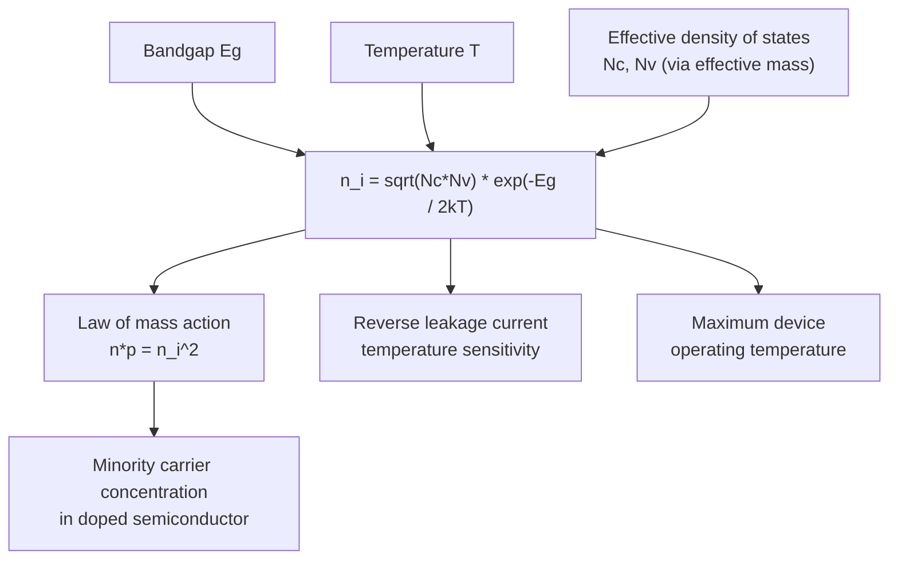

## Intrinsic Carrier Concentration

### Overview

The intrinsic carrier concentration $n_i$ quantifies the equilibrium electron and hole density in a pure, undoped semiconductor generated purely by thermal excitation across the bandgap. It is a fundamental material parameter that sets the baseline for all subsequent doped-semiconductor carrier statistics and directly determines a material's usable temperature range and off-state leakage behavior in devices.

### Physical Origin

**Thermal Generation Across the Bandgap**

**Key Points**

- In a pure (intrinsic) semiconductor at any temperature $T > 0$ K, thermal energy excites some electrons from the valence band across the bandgap into the conduction band
- Each excitation event creates exactly one free electron in the conduction band and leaves exactly one hole in the valence band — electrons and holes are generated in pairs
- Therefore, in an intrinsic semiconductor: $n = p = n_i$
- This is a direct consequence of charge neutrality in a material with no net dopant impurities

### Derivation of $n_i$

**Starting from Carrier Concentration Expressions**

Using the non-degenerate (Boltzmann) approximation and effective density of states $N_c$, $N_v$ (see related topics):

$$n = N_c\exp\left(-\frac{E_c-E_F}{k_BT}\right), \quad p = N_v\exp\left(-\frac{E_F-E_v}{k_BT}\right)$$

Setting $n = p = n_i$ and solving, the intrinsic Fermi level is:

$$E_{Fi} = \frac{E_c+E_v}{2} + \frac{k_BT}{2}\ln\left(\frac{N_v}{N_c}\right)$$

**The Intrinsic Carrier Concentration Formula**

Substituting back, or equivalently taking the geometric mean of the mass-action law $np = n_i^2$:

$$n_i = \sqrt{N_cN_v}\exp\left(-\frac{E_g}{2k_BT}\right)$$

**Key Points**

- $n_i$ depends exponentially on $-E_g/2k_BT$ — this is the single most important functional dependence to internalize, since it means $n_i$ is extraordinarily sensitive to both bandgap magnitude and temperature
- $N_c$ and $N_v$ each scale as $T^{3/2}$, contributing a secondary (much weaker) temperature dependence compared to the dominant exponential term
- A full expression sometimes writes $n_i(T) = C \cdot T^{3/2}\exp\left(-\frac{E_g(T)}{2k_BT}\right)$, where $C$ is a material-specific prefactor combining effective mass terms, and $E_g(T)$ itself has a mild temperature dependence (Varshni equation)

### Room-Temperature Values for Common Semiconductors

| Material | $E_g$ (eV, 300K) | $n_i$ (cm⁻³, 300K) |
| --- | --- | --- |
| Ge | 0.66 | $\sim 2.4 \times 10^{13}$ |
| Si | 1.12 | $\sim 1.0 \times 10^{10}$ |
| GaAs | 1.42 | $\sim 2.1 \times 10^{6}$ |
| GaN | 3.4 | $\sim 10^{-10}$ (extremely small) |

[Unverified — reported $n_i$ values, particularly for silicon, have historically varied somewhat across sources depending on the assumed effective mass values and measurement era; commonly cited modern silicon values range from approximately $9.7\times10^9$ to $1.5\times10^{10}$ cm⁻³ at 300 K.]

**Key Points**

- The roughly six orders of magnitude difference in $n_i$ between Ge and GaAs, despite only about a factor-of-2 difference in bandgap, vividly illustrates the exponential sensitivity of $n_i$ to $E_g$
- Wide-bandgap semiconductors (GaN, SiC, diamond) have astronomically small intrinsic carrier concentrations, which is precisely why they can maintain semiconducting (rather than intrinsic/insulating-dominated) behavior at much higher operating temperatures than Si or Ge — a key motivation for wide-bandgap power electronics

### Temperature Dependence Diagram (svg_diagram)



```
<svg xmlns="http://www.w3.org/2000/svg" viewBox="0 0 450 300" width="450" height="300">
  <title>Intrinsic Carrier Concentration vs Temperature (svg_diagram)</title>
  <rect width="450" height="300" fill="#ffffff" />
  <line x1="60" y1="260" x2="420" y2="260" stroke="#1a202c" stroke-width="1.5" />
  <line x1="60" y1="20" x2="60" y2="260" stroke="#1a202c" stroke-width="1.5" />
  <text x="230" y="285" font-size="12" text-anchor="middle">1/T (increasing rightward = decreasing T)</text>
  <text x="20" y="140" font-size="12" transform="rotate(-90 20 140)">ln(n_i)</text>

  
  <line x1="70" y1="60" x2="400" y2="230" stroke="#2b6cb0" stroke-width="2.5" />
  <text x="300" y="150" font-size="11" fill="#2b6cb0">Ge (Eg=0.66 eV)</text>

  
  <line x1="70" y1="100" x2="400" y2="255" stroke="#e53e3e" stroke-width="2.5" />
  <text x="280" y="200" font-size="11" fill="#e53e3e">Si (Eg=1.12 eV)</text>

  
  <line x1="70" y1="140" x2="330" y2="260" stroke="#38a169" stroke-width="2.5" />
  <text x="200" y="245" font-size="11" fill="#38a169">GaAs (Eg=1.42 eV)</text>

  <text x="70" y="290" font-size="10">High T</text>
  <text x="390" y="290" font-size="10">Low T</text>
</svg>
```

### The Law of Mass Action

**Key Points**

- The relationship $np = n_i^2$ holds at thermal equilibrium for **any** doping level (intrinsic or extrinsic), as long as non-degenerate Boltzmann statistics remain valid
- This allows minority carrier concentration to be calculated directly once majority carrier concentration is known: in n-type material with $n \approx N_D$, the minority hole concentration is $p = n_i^2/N_D$
- This relationship is foundational to p-n junction analysis, where minority carrier injection and diffusion currents are calculated using $n_i^2$-scaled minority concentrations

### Applications and Device Implications

**Reverse-Bias Leakage Current**

**Key Points**

- In a reverse-biased p-n junction, the reverse saturation current has a direct dependence on $n_i^2$ (via minority carrier diffusion currents) or, in the presence of significant generation-recombination current, a dependence on $n_i$ itself (via the depletion region generation current)
- This means junction leakage current increases exponentially with temperature, roughly doubling for every 8-10°C increase in silicon devices near room temperature [Unverified — the exact doubling temperature depends on which leakage mechanism (diffusion vs. generation-recombination) dominates and the specific device]

**Maximum Operating Temperature**

**Example**

A silicon power device begins to lose its ability to be turned "off" (block voltage) at elevated temperatures once $n_i$ approaches the intentional doping concentration $N_D$ or $N_A$, because the material effectively becomes intrinsically conductive regardless of the pn-junction depletion region. This sets a practical maximum operating temperature for silicon devices (typically around 150-200°C for many silicon power devices), whereas wide-bandgap semiconductors like SiC and GaN — with $n_i$ many orders of magnitude smaller at any given temperature — can maintain proper blocking behavior at substantially higher temperatures, a major driver behind wide-bandgap semiconductor adoption in high-temperature power electronics applications.

**Photodetector Dark Current**

Similarly, in narrow-bandgap infrared photodetector materials (e.g., HgCdTe, InSb), the relatively large intrinsic carrier concentration at operating temperature is often the dominant source of "dark current" (detector noise in the absence of light), motivating cryogenic cooling of many infrared detector systems.

### Mermaid Diagram: Intrinsic Carrier Concentration Dependencies



### Conclusion

The intrinsic carrier concentration, arising from thermal generation of electron-hole pairs across the bandgap, follows an exponential dependence on $-E_g/2k_BT$ that makes it exquisitely sensitive to both material bandgap and operating temperature. This single parameter, via the law of mass action, underlies minority carrier concentration calculations in all doped semiconductors and directly explains critical device-level phenomena including reverse-bias leakage current, maximum safe operating temperature, and the fundamental motivation for wide-bandgap semiconductor adoption in high-temperature and high-power applications.

**Related Topics**

- Fermi-Dirac distribution and the Fermi level
- Density of states in conduction and valence bands
- Extrinsic (doped) semiconductor carrier statistics
- Law of mass action and thermal equilibrium
- p-n junction reverse-bias leakage mechanisms
- Wide-bandgap semiconductor power devices (SiC, GaN)