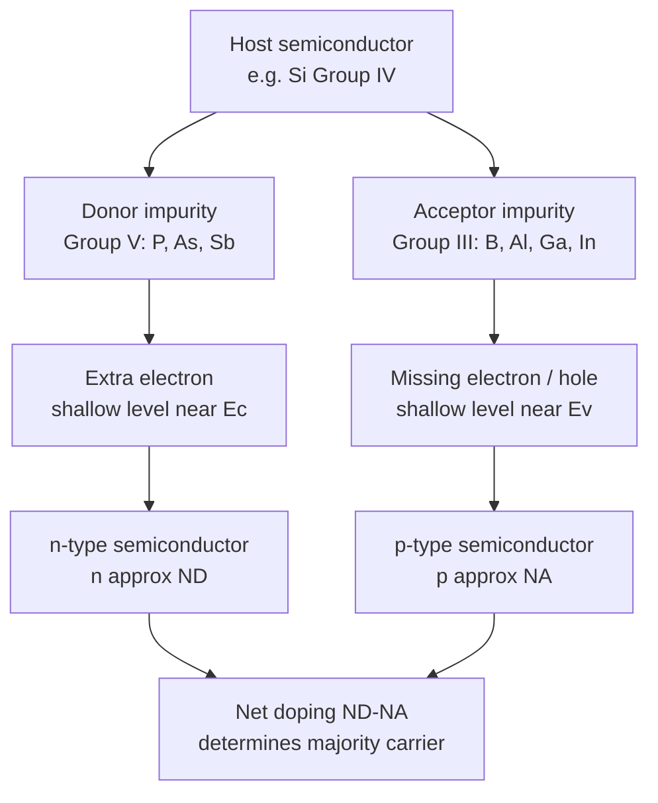

## Donor and Acceptor Doping

### Overview

Doping is the deliberate introduction of controlled impurity atoms into a semiconductor crystal to modify its electrical conductivity by orders of magnitude and control the dominant charge carrier type. Donor impurities contribute free electrons (creating n-type material), while acceptor impurities contribute free holes (creating p-type material), forming the basis for essentially every semiconductor device — diodes, transistors, and integrated circuits alike.

### Donor Doping (n-Type)

**Mechanism**

**Key Points**

- A donor is an impurity atom with **one more valence electron** than the host atom it replaces
- In silicon (Group IV, 4 valence electrons), Group V elements (P, As, Sb) serve as donors, each contributing 5 valence electrons
- Four of the donor's five valence electrons form covalent bonds with the four neighboring Si atoms (replacing the host atom in the tetrahedral bonding network); the fifth electron is left weakly bound, orbiting the now-positively-charged donor ion core

**Hydrogenic Donor Model**

The weakly bound fifth electron can be modeled analogously to a hydrogen atom, but with the free-electron mass and vacuum permittivity replaced by the semiconductor's effective mass $m_e^*$ and dielectric constant $\varepsilon_r$:

$$E_D = \frac{m_e^*}{m_0}\cdot\frac{1}{\varepsilon_r^2}\cdot 13.6\text{ eV}$$

**Key Points**

- This gives a donor ionization energy $E_D$ typically only tens of meV below the conduction band edge $E_c$ — much smaller than the full bandgap
- For silicon: measured donor ionization energies are approximately 45 meV (P), 54 meV (As), 39 meV (Sb) [Unverified — experimental shallow-donor ionization energies show modest spread across sources and measurement techniques]
- Because $E_D$ is small compared to $k_BT$ at room temperature ($\approx 25.9$ meV), most donors are **fully ionized** at room temperature — nearly every donor atom contributes one free electron to the conduction band

### Acceptor Doping (p-Type)

**Mechanism**

**Key Points**

- An acceptor is an impurity atom with **one fewer valence electron** than the host atom it replaces
- In silicon, Group III elements (B, Al, Ga, In) serve as acceptors, each contributing only 3 valence electrons
- The acceptor atom can only form three complete covalent bonds with its four Si neighbors; the fourth bond is missing one electron, creating a "hole" that can be filled by an electron from a neighboring Si-Si bond, effectively allowing the hole to move through the lattice while leaving behind a negatively charged acceptor ion core

**Hydrogenic Acceptor Model**

Analogously, the acceptor ionization energy $E_A$ (measured upward from the valence band edge $E_v$) can be estimated using the same hydrogenic model with the hole effective mass:

$$E_A = \frac{m_h^*}{m_0}\cdot\frac{1}{\varepsilon_r^2}\cdot 13.6\text{ eV}$$

**Key Points**

- For silicon: measured acceptor ionization energies are approximately 45 meV (B), 57 meV (Al), 65 meV (Ga), 160 meV (In) [Unverified — In is a notably deeper acceptor than the others and shows greater spread across literature sources]
- As with donors, most acceptors are fully ionized at room temperature for the shallower species (B, Al, Ga), while deeper acceptors like In show more significant incomplete ionization even near room temperature

### Donor/Acceptor Energy Level Diagram (svg_diagram)



```
<svg xmlns="http://www.w3.org/2000/svg" viewBox="0 0 450 260" width="450" height="260">
  <title>Donor and Acceptor Energy Levels (svg_diagram)</title>
  <rect width="450" height="260" fill="#ffffff" />
  <line x1="60" y1="50" x2="400" y2="50" stroke="#2b6cb0" stroke-width="2" />
  <text x="405" y="55" font-size="12" fill="#2b6cb0">Ec</text>

  <line x1="60" y1="210" x2="400" y2="210" stroke="#e53e3e" stroke-width="2" />
  <text x="405" y="215" font-size="12" fill="#e53e3e">Ev</text>

  
  <line x1="100" y1="75" x2="200" y2="75" stroke="#38a169" stroke-width="2" stroke-dasharray="4,2" />
  <text x="210" y="80" font-size="11" fill="#38a169">Ed (donor level, ~few tens of meV below Ec)</text>
  <line x1="150" y1="50" x2="150" y2="75" stroke="#1a202c" stroke-width="1" />
  <circle cx="150" cy="90" r="4" fill="#1a202c" />
  <text x="160" y="95" font-size="10">ionized electron</text>

  
  <line x1="100" y1="185" x2="200" y2="185" stroke="#805ad5" stroke-width="2" stroke-dasharray="4,2" />
  <text x="210" y="190" font-size="11" fill="#805ad5">Ea (acceptor level, ~few tens of meV above Ev)</text>
  <line x1="150" y1="185" x2="150" y2="210" stroke="#1a202c" stroke-width="1" />
  <circle cx="150" cy="170" r="4" fill="none" stroke="#e53e3e" stroke-width="2" />
  <text x="160" y="175" font-size="10">ionized hole</text>

  <text x="225" y="130" font-size="12" text-anchor="middle" fill="#1a202c">Forbidden gap</text>
</svg>
```

### Doping in Compound Semiconductors

**Additional Complexities**

**Key Points**

- In compound semiconductors, dopant behavior depends on which sublattice the impurity occupies
- **Amphoteric dopants**: some elements can act as either donor or acceptor depending on which sublattice site they occupy — e.g., Si in GaAs acts as a donor when substituting for Ga ($Si_{Ga}$), but as an acceptor when substituting for As ($Si_{As}$); growth conditions determine the preferred site
- **Isoelectronic dopants**: some impurities (same valence as host atom, e.g., N in GaP) don't directly donate or accept carriers but create localized states useful for other purposes (e.g., isoelectronic trap centers historically used to improve luminescence efficiency in indirect-gap LED materials)
- Common donors in GaAs: Si, Se, Te (substituting on Ga or group V sites); common acceptors: Zn, Be, C (substituting on As sites, e.g., carbon is widely used for p-type III-V epitaxy due to low diffusivity)

### Compensation and Net Doping

**Key Points**

- Real semiconductor material often contains both donor and acceptor impurities simultaneously (intentionally, or as unintentional background contamination)
- **Compensation**: donors and acceptors partially cancel each other's effect, since donor electrons can recombine with acceptor holes
- Net doping determines the dominant carrier type and concentration:

$$N_D - N_A > 0 \implies \text{n-type}, \quad N_D - N_A < 0 \implies \text{p-type}$$

- Charge neutrality condition (assuming full ionization): $n + N_A^- = p + N_D^+$

### Carrier Freeze-Out and Ionization Regimes

**Key Points**

- **Freeze-out region** (low temperature): insufficient thermal energy to ionize dopants; carriers remain bound to donor/acceptor sites, and carrier concentration drops sharply as $T$ decreases
- **Extrinsic (saturation) region** (moderate/room temperature): essentially all dopants ionized, carrier concentration $\approx N_D$ (or $N_A$) and remains roughly constant with temperature — this is the normal operating regime for most semiconductor devices
- **Intrinsic region** (high temperature): thermally generated intrinsic carriers ($n_i$) begin to dominate over the fixed dopant concentration, and the material behavior approaches that of an intrinsic semiconductor

### Doping Concentration and Practical Ranges

| Doping Level | Typical $N_D$ or $N_A$ (cm⁻³) | Application Context |
| --- | --- | --- |
| Lightly doped | $10^{14}$–$10^{16}$ | High-voltage power device drift regions |
| Moderately doped | $10^{16}$–$10^{18}$ | Standard CMOS wells, base/collector regions |
| Heavily doped | $10^{18}$–$10^{20}$ | Source/drain regions, ohmic contacts |
| Degenerate | $>10^{19}$–$10^{20}$ | Polysilicon gates, tunnel junctions, laser diode contact layers |

[Unverified — exact regime boundaries and terminology thresholds vary somewhat by source and specific device technology.]

### Doping Techniques (Manufacturing Context)

**Next Steps for Process Understanding**

- **Ion implantation**: precisely controlled dopant introduction via accelerated ion beams, followed by thermal annealing to repair lattice damage and electrically activate dopants — the dominant technique in modern IC fabrication
- **Diffusion**: thermally driven dopant introduction from a solid, liquid, or gaseous source, historically important and still used for certain deep-junction or high-throughput applications
- **In-situ doping during epitaxial growth**: dopant precursor gases introduced during CVD/MOCVD/MBE growth, incorporating dopants directly as the crystal forms — common for compound semiconductor device layers

### Mermaid Diagram: Donor/Acceptor Doping Overview



### Conclusion

Donor and acceptor doping provide the essential mechanism for engineering semiconductor conductivity and carrier type, with shallow hydrogenic-like impurity levels near the band edges ensuring near-complete ionization at room temperature for common dopant species. Understanding donor/acceptor ionization energies, compensation effects, and temperature-dependent freeze-out/extrinsic/intrinsic regimes is foundational to designing and interpreting the behavior of every practical semiconductor device, from simple diodes to advanced CMOS and compound semiconductor technologies.

**Related Topics**

- Fermi-Dirac distribution and Fermi level positioning in doped semiconductors
- Intrinsic carrier concentration and the law of mass action
- Ion implantation and diffusion doping processes
- Compensation and net doping calculations
- Carrier freeze-out, extrinsic, and intrinsic temperature regimes
- Amphoteric and isoelectronic dopants in compound semiconductors