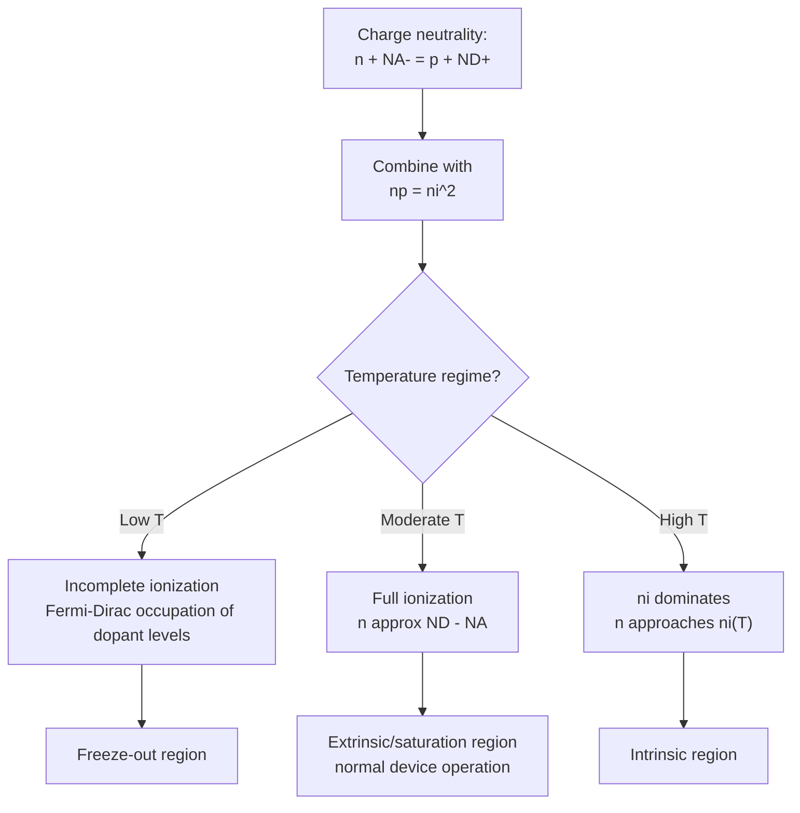

## Extrinsic Carrier Concentration and Ionization

### Overview

Extrinsic carrier concentration describes the equilibrium electron and hole densities in a doped ("extrinsic") semiconductor, where the dominant carrier population is set primarily by ionized dopant impurities rather than intrinsic thermal generation. Accurately calculating extrinsic carrier concentration requires solving the charge neutrality condition self-consistently with dopant ionization statistics and, at high enough temperature, contributions from intrinsic carrier generation.

### Charge Neutrality Condition

**General Formulation**

In thermal equilibrium, a semiconductor must be locally charge-neutral: the total positive charge equals the total negative charge.

$$n + N_A^- = p + N_D^+$$

**Key Points**

- $n$, $p$: free electron and hole concentrations
- $N_D^+$: concentration of ionized (positively charged) donor atoms
- $N_A^-$: concentration of ionized (negatively charged) acceptor atoms
- This equation, combined with the mass-action law $np = n_i^2$ and dopant ionization statistics, fully determines carrier concentrations at any temperature and doping level

### Complete Ionization Approximation

**Simplification at Moderate Temperatures**

**Key Points**

- At room temperature, for shallow dopants (donor/acceptor ionization energies of tens of meV), essentially all dopant atoms are ionized: $N_D^+ \approx N_D$, $N_A^- \approx N_A$
- This is the standard assumption used in most introductory device analysis and is valid across the **extrinsic (saturation) region** of the temperature spectrum

**Solving for Majority Carrier Concentration (n-Type Example)**

Substituting $N_D^+ = N_D$, $N_A^- = N_A$ into the charge neutrality condition, combined with $np = n_i^2$, and solving the resulting quadratic for $n$:

$$n = \frac{(N_D - N_A)}{2} + \sqrt{\left(\frac{N_D-N_A}{2}\right)^2 + n_i^2}$$

**Key Points**

- When $N_D - N_A \gg n_i$ (typical extrinsic region for most doping/temperature combinations): $n \approx N_D - N_A$ (or simply $N_D$ if $N_A = 0$), and minority hole concentration $p = n_i^2/n$
- When $N_D - N_A \ll n_i$ (high-temperature intrinsic regime, or extremely lightly doped material): the intrinsic term dominates, and $n \to n_i$, recovering intrinsic behavior
- The general quadratic formula smoothly interpolates between these two limiting regimes

### Incomplete Ionization at Low Temperature

**Physical Origin**

At sufficiently low temperature, thermal energy $k_BT$ becomes comparable to or smaller than the donor/acceptor ionization energy $E_D$ or $E_A$, and not all dopants ionize — some electrons remain bound to donor sites (or holes remain bound to acceptor sites).

**Ionization Statistics**

The fraction of ionized donors is given by Fermi-Dirac-like occupation statistics, modified by a degeneracy factor $g$ (typically $g=2$ for donors, reflecting spin degeneracy of the bound state):

$$N_D^+ = \frac{N_D}{1 + g\exp\left(\frac{E_F-E_D}{k_BT}\right)}$$

**Key Points**

- As $T \to 0$, this expression shows $N_D^+ \to 0$ — donors remain un-ionized (electrons "frozen out" onto donor sites)
- The Fermi level itself shifts toward the donor level at low temperature, self-consistently coupling ionization and Fermi level position
- Solving self-consistently for both $E_F$ and $N_D^+$ (and correspondingly $n$) as functions of $T$ requires either graphical/numerical solution or the quadratic approximations valid in each limiting regime

### The Three Temperature Regimes

**Freeze-Out Region (Low $T$)**

**Key Points**

- Insufficient thermal energy to ionize dopants
- Carrier concentration $n$ increases steeply with temperature as more dopants become ionized
- On a $\ln(n)$ vs. $1/T$ plot, this region shows a steep slope related to $E_D/2$ (or $E_A/2$)

**Extrinsic (Saturation) Region (Moderate $T$)**

**Key Points**

- Essentially all dopants ionized; $n \approx N_D - N_A$ (or $N_A - N_D$ for p-type), roughly independent of temperature
- This flat, doping-determined plateau is the region in which virtually all semiconductor devices are designed to operate
- Width of this plateau in temperature depends on doping concentration and dopant ionization energy — heavier doping generally extends the freeze-out boundary to lower temperatures but can bring forward the onset of the intrinsic region at lower temperature too, depending on material and doping level [Inference: the precise plateau boundaries depend on the specific combination of doping level, ionization energy, and bandgap]

**Intrinsic Region (High $T$)**

**Key Points**

- Thermally generated intrinsic carriers ($n_i$) exceed the net doping concentration
- Carrier concentration rises steeply again with temperature, now following the intrinsic $n_i(T)$ exponential dependence on $-E_g/2k_BT$
- On the $\ln(n)$ vs. $1/T$ plot, slope in this region relates to $E_g/2$ (steeper than the freeze-out slope, since $E_g \gg E_D, E_A$ typically)

### Carrier Concentration vs. Temperature Diagram (svg_diagram)



```
<svg xmlns="http://www.w3.org/2000/svg" viewBox="0 0 480 300" width="480" height="300">
  <title>Three Temperature Regimes: ln(n) vs 1/T (svg_diagram)</title>
  <rect width="480" height="300" fill="#ffffff" />
  <line x1="60" y1="260" x2="440" y2="260" stroke="#1a202c" stroke-width="1.5" />
  <line x1="60" y1="20" x2="60" y2="260" stroke="#1a202c" stroke-width="1.5" />
  <text x="250" y="285" font-size="12" text-anchor="middle">1/T</text>
  <text x="20" y="140" font-size="12" transform="rotate(-90 20 140)">ln(n)</text>

  
  <path d="M 60 40 L 130 120" stroke="#e53e3e" stroke-width="2.5" fill="none" />
  <text x="70" y="70" font-size="10" fill="#e53e3e">Intrinsic<br />slope ~ -Eg/2k</text>

  
  <path d="M 130 120 L 300 130" stroke="#2b6cb0" stroke-width="2.5" fill="none" />
  <text x="180" y="115" font-size="10" fill="#2b6cb0">Extrinsic (saturation)<br />n ~ ND</text>

  
  <path d="M 300 130 L 420 240" stroke="#38a169" stroke-width="2.5" fill="none" />
  <text x="330" y="200" font-size="10" fill="#38a169">Freeze-out<br />slope ~ -ED/2k</text>

  <text x="70" y="290" font-size="10">High T</text>
  <text x="410" y="290" font-size="10">Low T</text>
</svg>
```

### Multiple Dopant Species and Deep Levels

**Key Points**

- When multiple donor and/or acceptor species are present with different ionization energies, each species has its own occupation statistics, and the overall ionization/charge-neutrality problem must sum contributions from all species
- **Deep-level impurities and traps** (ionization energies far from the band edges, often near mid-gap) behave differently from shallow dopants: they may remain largely un-ionized even at room temperature and often act primarily as recombination centers (Shockley-Read-Hall centers) rather than significant carrier sources
- Deep levels are frequently *unintentional* (contamination, native defects) but are sometimes intentionally introduced (e.g., Au or Pt doping in silicon, historically used to reduce minority carrier lifetime in fast-switching diodes)

### Example: Practical Consequence for Device Operation

**Example**

A silicon device is typically specified to operate within the extrinsic (saturation) temperature region, often -55°C to 150°C or 175°C for many commercial devices. Below this range, dopant freeze-out can reduce carrier concentration and increase resistivity of lightly doped regions (relevant, for example, in some low-temperature cryogenic CMOS behavior), while above this range, approach to the intrinsic regime increases minority carrier concentration and junction leakage current, eventually degrading or eliminating the device's ability to block voltage or maintain designed operating characteristics — directly connecting back to the intrinsic carrier concentration topic's discussion of maximum operating temperature.

### Comparison Table: Regime Characteristics

| Regime | Temperature | Dominant Physics | $n$ Behavior |
| --- | --- | --- | --- |
| Freeze-out | Low | Incomplete dopant ionization | Rises steeply with $T$ |
| Extrinsic (saturation) | Moderate (room temp typical) | Full dopant ionization | Roughly constant, $\approx N_D-N_A$ |
| Intrinsic | High | Thermal generation across $E_g$ dominates | Rises steeply with $T$, follows $n_i(T)$ |

### Mermaid Diagram: Extrinsic Carrier Concentration Determination



### Conclusion

Extrinsic carrier concentration is determined by solving the charge neutrality condition self-consistently with dopant ionization statistics and the mass-action law, producing three distinct temperature regimes: freeze-out at low temperature, a doping-determined extrinsic plateau at moderate/room temperature (the normal operating regime for virtually all devices), and an intrinsic regime at high temperature where thermal generation overwhelms the fixed dopant concentration. Understanding these regimes and their governing ionization energies is essential for predicting semiconductor device behavior across their specified operating temperature range.

**Related Topics**

- Donor and acceptor doping fundamentals
- Intrinsic carrier concentration and the law of mass action
- Fermi-Dirac distribution and Fermi level positioning
- Deep-level traps and Shockley-Read-Hall recombination
- Temperature-dependent device reliability and operating limits
- Compensation and net doping calculations