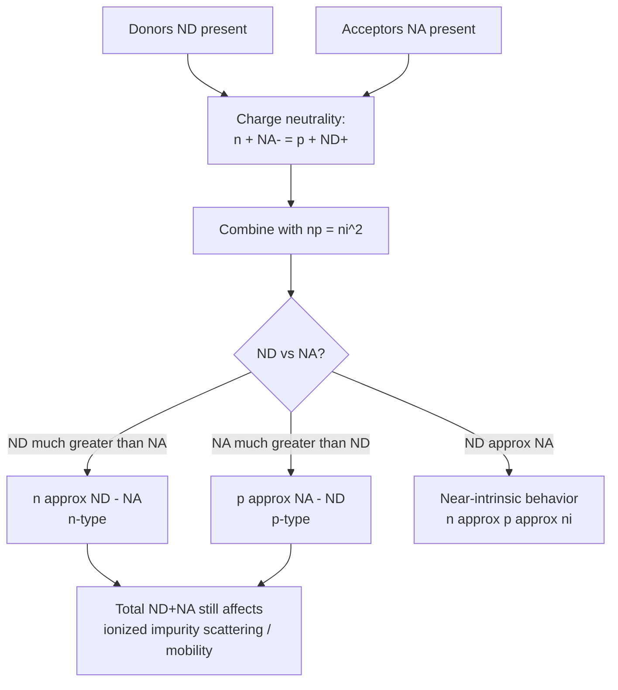

## Compensation and Charge Neutrality

### Overview

Compensation occurs when both donor and acceptor impurities are simultaneously present in a semiconductor, with their opposing electrical effects partially canceling. Combined with the charge neutrality condition, compensation determines the net effective doping concentration, majority carrier type, and equilibrium carrier statistics — a critical consideration in real semiconductor material, where unintentional background impurities frequently coexist with intentional doping.

### The Charge Neutrality Principle

**Formal Statement**

In thermal equilibrium, a semiconductor volume must contain equal amounts of positive and negative charge (assuming no net space charge, i.e., away from depletion regions or interfaces):

$$n + N_A^- = p + N_D^+$$

**Key Points**

- Left side: total negative mobile charge (electrons) plus fixed negative charge (ionized acceptors)
- Right side: total positive mobile charge (holes) plus fixed positive charge (ionized donors)
- This condition holds throughout the bulk of a uniformly doped semiconductor region at equilibrium, and must be solved simultaneously with the mass-action law $np = n_i^2$

### Physical Mechanism of Compensation

**Electron-Hole-Dopant Interaction**

**Key Points**

- When both donors ($N_D$) and acceptors ($N_A$) are present in the same region, electrons donated by donor atoms can be captured by acceptor sites, effectively neutralizing one donor-acceptor pair per captured electron
- This process reduces the number of *free* carriers available compared to what either dopant concentration alone would produce
- The **net doping concentration** is what determines majority carrier behavior:

$$N_{net} = N_D - N_A \quad (\text{n-type if positive}), \quad N_{net} = N_A - N_D \quad (\text{p-type if negative})$$

### Compensation Diagram (svg_diagram)



```
<svg xmlns="http://www.w3.org/2000/svg" viewBox="0 0 480 260" width="480" height="260">
  <title>Donor-Acceptor Compensation Mechanism (svg_diagram)</title>
  <rect width="480" height="260" fill="#ffffff" />

  
  <text x="30" y="40" font-size="12" fill="#2b6cb0" font-weight="bold">Donors (ND)</text>
  <circle cx="60" cy="70" r="10" fill="#2b6cb0" />
  <circle cx="110" cy="70" r="10" fill="#2b6cb0" />
  <circle cx="160" cy="70" r="10" fill="#2b6cb0" />
  <circle cx="210" cy="70" r="10" fill="#2b6cb0" />
  <circle cx="260" cy="70" r="10" fill="#2b6cb0" />

  
  <text x="30" y="140" font-size="12" fill="#e53e3e" font-weight="bold">Acceptors (NA)</text>
  <circle cx="60" cy="170" r="10" fill="#e53e3e" />
  <circle cx="110" cy="170" r="10" fill="#e53e3e" />

  
  <line x1="60" y1="80" x2="60" y2="160" stroke="#805ad5" stroke-width="1.5" stroke-dasharray="3,2" />
  <line x1="110" y1="80" x2="110" y2="160" stroke="#805ad5" stroke-width="1.5" stroke-dasharray="3,2" />
  <text x="30" y="115" font-size="10" fill="#805ad5">e- captured</text>

  
  <circle cx="160" cy="70" r="10" fill="#38a169" opacity="0" />
  <text x="150" y="230" font-size="13" fill="#38a169" font-weight="bold">Net free electrons available: ND - NA = 3</text>
</svg>
```

### Solving for Carrier Concentration with Compensation

**General n-Type Case ($N_D > N_A$)**

Combining charge neutrality (with full ionization assumed) and the mass-action law yields the quadratic solution:

$$n = \frac{N_D-N_A}{2} + \sqrt{\left(\frac{N_D-N_A}{2}\right)^2 + n_i^2}$$


$$p = \frac{n_i^2}{n}$$

**General p-Type Case ($N_A > N_D$)**

By symmetry:

$$p = \frac{N_A-N_D}{2} + \sqrt{\left(\frac{N_A-N_D}{2}\right)^2 + n_i^2}$$


$$n = \frac{n_i^2}{p}$$

**Key Points**

- When $|N_D - N_A| \gg n_i$: the simplified approximation $n \approx N_D - N_A$ (or $p \approx N_A - N_D$) is valid — this is the typical situation for most practically doped semiconductor regions at room temperature
- When $N_D \approx N_A$ (near-perfect compensation): the net doping term becomes small, and the material behaves nearly intrinsically even at moderate temperatures, since $n_i$ dominates the quadratic solution
- Exact compensation ($N_D = N_A$) reduces the material to intrinsic-like behavior ($n = p = n_i$), despite the presence of substantial total impurity concentration — a subtle but important distinction between "undoped" and "compensated" material

### Origins of Unintentional Compensation

**Key Points**

Real semiconductor crystals often contain unintentional compensating impurities from several sources:

- **Growth-related background impurities**: trace contamination from crucible materials, source gas purity, or reactor chamber history during crystal growth or epitaxy
- **Native point defects acting as dopants**: e.g., in compound semiconductors, vacancies or antisite defects can behave as electrically active donors or acceptors (see related topic on point defects), sometimes compensating intentional doping
- **Amphoteric dopant behavior**: in III-V compounds, some dopant species can occupy either sublattice depending on growth conditions, occasionally leading to self-compensation where a fraction of intentionally added dopant atoms occupy the "wrong" site and act as compensating centers rather than contributing the intended carrier type

**Example**

Historically, achieving reliable p-type doping in wide-bandgap II-VI semiconductors like ZnSe proved extremely difficult, in part because native donor-like defects (such as certain vacancy or interstitial complexes) formed preferentially to compensate intentionally introduced acceptor dopants, a phenomenon known as self-compensation — this significantly delayed the development of practical blue-green II-VI laser diodes compared to III-V nitride alternatives.

### Compensation in Device Processing

**Key Points**

- **Counter-doping**: intentional compensation is sometimes used deliberately in device fabrication — for example, forming a p-n junction by implanting or diffusing acceptor dopants into an existing n-type region at a concentration exceeding the background donor concentration, converting the near-surface region to net p-type while leaving deeper regions n-type
- **Junction depth control**: the location where $N_D(x) = N_A(x)$ (net doping crosses zero) defines the metallurgical junction position in diffused or implanted junctions with non-uniform (Gaussian or complementary error function) dopant profiles
- Precise control of compensation profiles is fundamental to defining junction depths, threshold voltages (via channel doping), and resistor values in integrated circuit fabrication

### Mobility Reduction Due to Compensation

**Key Points**

- Even though compensation reduces net free carrier concentration, the *total* ionized impurity concentration ($N_D + N_A$, not just the net difference) still contributes to **ionized impurity scattering**, which reduces carrier mobility
- This means heavily compensated material (large $N_D$ and $N_A$ individually, small net difference) can have significantly lower mobility than lightly doped material with the same net carrier concentration — an important practical consideration when compensation arises from unintentional contamination
- [Inference: the magnitude of this mobility degradation depends on the specific scattering mechanism balance and total impurity concentration, and is material- and temperature-dependent]

### Comparison Table: Compensation Scenarios

| Scenario | $N_D$ vs $N_A$ | Majority Carrier | Behavior |
| --- | --- | --- | --- |
| Uncompensated n-type | $N_D \gg N_A \approx 0$ | Electrons | $n \approx N_D$ |
| Partially compensated n-type | $N_D > N_A$, both significant | Electrons | $n \approx N_D - N_A$, reduced mobility |
| Near-perfect compensation | $N_D \approx N_A$ | Neither dominant | Intrinsic-like, $n \approx p \approx n_i$ |
| Partially compensated p-type | $N_A > N_D$, both significant | Holes | $p \approx N_A - N_D$, reduced mobility |
| Uncompensated p-type | $N_A \gg N_D \approx 0$ | Holes | $p \approx N_A$ |

### Mermaid Diagram: Compensation and Charge Neutrality Logic



### Conclusion

Compensation, arising whenever both donor and acceptor impurities coexist in a semiconductor region, is governed by the charge neutrality condition combined with the mass-action law, with net doping ($N_D - N_A$ or $N_A - N_D$) determining majority carrier type and concentration rather than either dopant concentration alone. Understanding compensation is essential both for interpreting unintentional background impurity effects and mobility degradation, and for the deliberate use of counter-doping in defining p-n junctions and other structures during semiconductor device fabrication.

**Related Topics**

- Donor and acceptor doping fundamentals
- Extrinsic carrier concentration and ionization regimes
- Ionized impurity scattering and carrier mobility
- p-n junction formation via counter-doping/implantation
- Native point defects and self-compensation in compound semiconductors
- Ion implantation and diffusion doping profiles