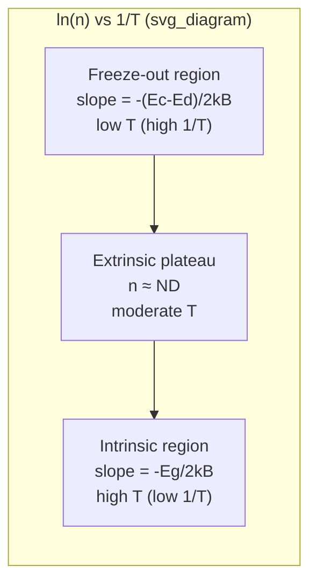

## Temperature Dependence of Carrier Concentration

### Overview

The equilibrium carrier concentration in a semiconductor is not fixed — it depends strongly on temperature through the Fermi-Dirac distribution, the density of states, and the ionization state of dopant atoms. Understanding this dependence is essential for predicting device behavior across operating temperature ranges, designing thermally stable circuits, and interpreting Hall-effect measurements used to characterize doped semiconductors.

At a fixed doping level, the carrier concentration as a function of temperature typically exhibits three distinct regimes: freeze-out at low temperature, an extrinsic (saturation) plateau at moderate temperature, and intrinsic behavior at high temperature.

### Governing Equations

**Intrinsic carrier concentration**

The intrinsic carrier concentration $n_i$ is derived from the product of electron and hole concentrations in the conduction and valence bands:

$$n_i^2 = N_C N_V \exp\left(-\frac{E_g}{k_B T}\right)$$

where $N_C$ and $N_V$ are the effective densities of states in the conduction and valence bands, $E_g$ is the bandgap energy, $k_B$ is Boltzmann's constant, and $T$ is absolute temperature.

The effective densities of states themselves scale with temperature:

$$N_C = 2\left(\frac{2\pi m_e^* k_B T}{h^2}\right)^{3/2}, \quad N_V = 2\left(\frac{2\pi m_h^* k_B T}{h^2}\right)^{3/2}$$

so $N_C, N_V \propto T^{3/2}$. Combining this with the exponential term gives:

$$n_i \propto T^{3/2} \exp\left(-\frac{E_g}{2k_B T}\right)$$

The exponential term dominates over the power-law prefactor across most practical temperature ranges, so $n_i$ increases rapidly and roughly exponentially with temperature. [Inference: the bandgap $E_g$ itself is weakly temperature-dependent via the Varshni relation, which introduces a secondary correction to this trend, discussed below.]

**Extrinsic carrier concentration**

For a doped (extrinsic) semiconductor, the majority carrier concentration depends on both the ionization of dopants and the intrinsic contribution. For an n-type semiconductor with donor concentration $N_D$:

$$n = \frac{N_D}{2}\left[1 + \sqrt{1 + \frac{4N_D}{N_C}\exp\left(\frac{E_C - E_D}{k_B T}\right)}\right]^{-1} \cdot N_D \quad \text{(full ionization statistics)}$$

More commonly, the simplified charge-neutrality approach is used:

$$n - p = N_D^+ - N_A^-$$

$$np = n_i^2$$

These two equations are solved simultaneously across temperature, with $N_D^+$ (ionized donor concentration) itself a function of $T$ through Fermi-Dirac occupation of the donor level.

### The Three Temperature Regimes

**1. Freeze-out region (low T)**

At low temperatures, thermal energy $k_B T$ is insufficient to ionize all dopant atoms. Donor electrons remain bound to their parent atoms rather than being excited into the conduction band. The carrier concentration in this regime is:

$$n \approx \sqrt{\frac{N_C N_D}{2}} \exp\left(-\frac{E_C - E_D}{2k_B T}\right)$$

where $E_C - E_D$ is the donor ionization energy. As $T \to 0$, $n \to 0$: carriers "freeze out" onto dopant sites, and the semiconductor becomes increasingly resistive.

**2. Extrinsic (saturation) region (moderate T)**

As temperature rises, essentially all shallow dopants become ionized ($N_D^+ \approx N_D$), and:

$$n \approx N_D$$

Carrier concentration becomes nearly temperature-independent — a plateau. This is the regime in which most semiconductor devices are designed to operate, since carrier density (and hence conductivity, threshold voltages, etc.) is stable against modest temperature fluctuations.

**3. Intrinsic region (high T)**

At sufficiently high temperature, thermally generated electron-hole pairs across the bandgap ($n_i$) outnumber the fixed dopant concentration. The material behaves as if intrinsic:

$$n \approx n_i(T) \gg N_D$$

Here carrier concentration again rises steeply with temperature, following the $n_i(T)$ relation above. Device behavior becomes unpredictable and dopant control is effectively lost — this sets the practical upper temperature limit for a device's designed operation (e.g., roughly 150–200°C for silicon, though [Unverified] this varies with doping level and specific device geometry).

### Diagram: Carrier Concentration vs. Inverse Temperature

### SVG Illustration: Carrier Concentration Curve

<svg xmlns="http://www.w3.org/2000/svg" viewBox="0 0 640 420" font-family="sans-serif">
<text x="320" y="24" text-anchor="middle" font-size="16" font-weight="bold">ln(n) vs 1/T (svg_diagram)</text>

<line x1="70" y1="360" x2="590" y2="360" stroke="black" stroke-width="2" />
<line x1="70" y1="360" x2="70" y2="50" stroke="black" stroke-width="2" />
<text x="330" y="395" text-anchor="middle" font-size="14">1/T (increasing right, i.e. decreasing temperature)</text>
<text x="30" y="200" text-anchor="middle" font-size="14" transform="rotate(-90 30 200)">ln(n)</text>

<path d="M 90 90 L 220 200" stroke="#c0392b" stroke-width="3" fill="none" />
<text x="100" y="80" font-size="12" fill="#c0392b">Intrinsic: slope = -Eg/2kB</text>

<path d="M 220 200 L 400 210" stroke="#2980b9" stroke-width="3" fill="none" />
<text x="230" y="235" font-size="12" fill="#2980b9">Extrinsic plateau: n ≈ ND</text>

<path d="M 400 210 L 560 330" stroke="#27ae60" stroke-width="3" fill="none" />
<text x="420" y="300" font-size="12" fill="#27ae60">Freeze-out: slope = -(Ec-Ed)/2kB</text>

<line x1="220" y1="50" x2="220" y2="360" stroke="#999" stroke-dasharray="4,4" />
<line x1="400" y1="50" x2="400" y2="360" stroke="#999" stroke-dasharray="4,4" />

<text x="150" y="65" font-size="12" text-anchor="middle" fill="#555">High T</text>

<text x="310" y="65" font-size="12" text-anchor="middle" fill="#555">Moderate T</text>

<text x="480" y="65" font-size="12" text-anchor="middle" fill="#555">Low T</text>

</svg>

### Bandgap Temperature Dependence (Varshni Equation)

The bandgap itself narrows as temperature increases, due to lattice expansion and electron-phonon interactions. The empirical Varshni relation is:

$$E_g(T) = E_g(0) - \frac{\alpha T^2}{T + \beta}$$

where $\alpha$ and $\beta$ are material-specific empirical constants. For silicon, $E_g(0) \approx 1.166\ \text{eV}$, with $\alpha$ and $\beta$ fitted to experimental data [Unverified: exact tabulated values vary slightly by source and measurement method]. This narrowing bandgap contributes an additional (secondary) enhancement to the increase of $n_i$ with temperature beyond the explicit $T^{3/2}\exp(-E_g/2k_BT)$ form, since $E_g$ inside the exponential is itself decreasing.

### Practical Example

Consider silicon doped with $N_D = 10^{15}\ \text{cm}^{-3}$ phosphorus donors.

- **At T = 100 K:** Thermal energy $k_B T \approx 8.6\ \text{meV}$, comparable to the phosphorus donor ionization energy (~45 meV). Significant freeze-out occurs; $n < N_D$.
- **At T = 300 K (room temperature):** $k_B T \approx 25.9\ \text{meV}$, sufficient to fully ionize shallow donors. $n \approx N_D = 10^{15}\ \text{cm}^{-3}$, and $n_i \approx 1.5 \times 10^{10}\ \text{cm}^{-3} \ll N_D$, so extrinsic behavior dominates.
- **At T = 600 K:** $n_i$ has grown by many orders of magnitude (exponential dependence on $-E_g/2k_BT$) and may approach or exceed $10^{15}\ \text{cm}^{-3}$, pushing the material toward intrinsic behavior and degrading the device's designed doping-controlled characteristics.

**Key Points**

- Carrier concentration vs. temperature shows three regimes: freeze-out, extrinsic saturation, intrinsic.
- $n_i \propto T^{3/2}\exp(-E_g/2k_BT)$; exponential term dominates.
- The extrinsic plateau ($n \approx N_D$) is the design-intended operating regime for most devices.
- Bandgap narrowing with temperature (Varshni relation) further amplifies $n_i$ growth at high T.
- The freeze-out-to-extrinsic and extrinsic-to-intrinsic transition temperatures depend on doping concentration and dopant ionization energy — heavily doped materials shift the freeze-out boundary to lower T and the intrinsic boundary to higher T.

**Related Topics**

- Fermi level dependence on temperature and doping concentration
- Extrinsic vs. intrinsic semiconductor behavior
- Donor and acceptor ionization energies
- Effective density of states ($N_C$, $N_V$) derivation
- Varshni equation and bandgap narrowing in heavily doped semiconductors
- Hall effect measurements for carrier concentration vs. temperature characterization
- Mobility temperature dependence (phonon vs. ionized impurity scattering)
- High-temperature semiconductor materials (SiC, GaN) for extended intrinsic-limit operation