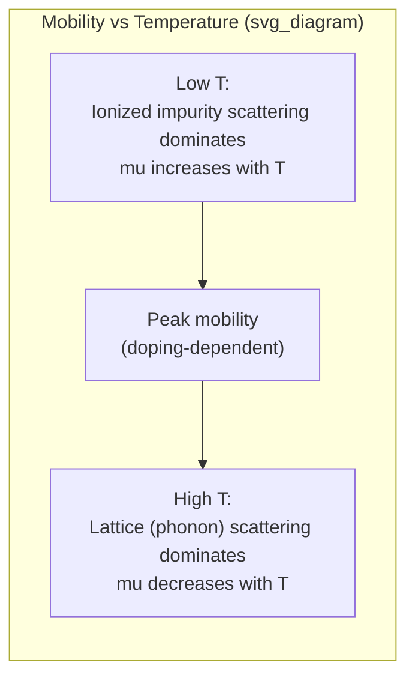

## Drift Current and Carrier Mobility

### Overview

Drift current arises when charge carriers (electrons and holes) move in response to an applied electric field. This is the dominant transport mechanism in most semiconductor devices under normal bias conditions, and it is governed by carrier mobility — a measure of how readily carriers accelerate under a field before being scattered by lattice vibrations, impurities, or defects.

### Basic Drift Velocity Relation

Under a weak-to-moderate electric field $E$, carriers acquire an average drift velocity proportional to the field:

$$v_d = \mu E$$

where $\mu$ is the carrier mobility (units: $\text{cm}^2/\text{V·s}$), distinct for electrons ($\mu_n$) and holes ($\mu_p$) due to their differing effective masses and scattering characteristics.

This linear relationship holds only at low-to-moderate fields; at high fields, drift velocity saturates (discussed below).

### Drift Current Density

The drift current density contributed by each carrier type is:

$$J_n^{drift} = q n \mu_n E$$

$$J_p^{drift} = q p \mu_p E$$

where $q$ is the elementary charge, $n$ and $p$ are electron and hole concentrations. Total drift current density is the sum:

$$J^{drift} = q(n\mu_n + p\mu_p)E = \sigma E$$

This defines the conductivity:

$$\sigma = q(n\mu_n + p\mu_p)$$

and resistivity $\rho = 1/\sigma$. This is simply a microscopic restatement of Ohm's law, $J = \sigma E$.

### Microscopic Origin of Mobility

Mobility is related to the average time between scattering events, the mean free time $\tau$, and the carrier's effective mass $m^*$:

$$\mu = \frac{q\tau}{m^*}$$

Carriers are accelerated by the field between collisions and randomized in direction at each collision (with phonons, ionized impurities, neutral impurities, or crystal defects). The net effect over many collisions is a steady drift velocity superimposed on random thermal motion.

### Scattering Mechanisms and Their Temperature Dependence

**Phonon (lattice) scattering**

Caused by thermal vibrations of the crystal lattice. Increases with temperature, since higher T means more phonons available to scatter carriers:

$$\mu_{lattice} \propto T^{-3/2}$$

**Ionized impurity scattering**

Caused by Coulombic interaction with ionized dopant atoms. Decreases with increasing temperature because faster-moving carriers spend less time near each scattering center (reduced interaction time), so cross-section effectively drops:

$$\mu_{impurity} \propto \frac{T^{3/2}}{N_I}$$

where $N_I$ is the ionized impurity concentration.

**Matthiessen's rule (combining mechanisms)**

When multiple independent scattering mechanisms operate simultaneously, their scattering rates (inverse mobilities) add:

$$\frac{1}{\mu_{total}} = \frac{1}{\mu_{lattice}} + \frac{1}{\mu_{impurity}} + \cdots$$

This means the mechanism producing the *lowest* individual mobility dominates the total mobility (the "weakest link" combines as reciprocal sum, similar to parallel resistances).

### Mobility vs. Temperature and Doping — Combined Behavior

At low temperatures, ionized impurity scattering dominates (mobility increases with T as carriers move faster past scattering centers). At high temperatures, lattice scattering dominates (mobility decreases with T). This produces a peak in mobility at some intermediate temperature, with the peak location and height depending on doping concentration — more heavily doped material has a lower, broader peak shifted to higher T. [Inference: exact peak position and curve shape are material- and doping-specific and are typically obtained from empirical fits such as the Caughey-Thomas model rather than derived analytically.]

### High-Field Behavior: Velocity Saturation

At high electric fields, the linear $v_d = \mu E$ relation breaks down. Carriers gain enough energy between collisions to interact strongly with optical phonons, capping their average velocity at a saturation velocity $v_{sat}$ (approximately $10^7\ \text{cm/s}$ for silicon [Unverified: precise value depends on carrier type and field orientation]). A common empirical model:

$$v_d(E) = \frac{\mu_0 E}{\left[1 + \left(\frac{\mu_0 E}{v_{sat}}\right)^{\beta}\right]^{1/\beta}}$$

where $\mu_0$ is the low-field mobility and $\beta$ is a fitting parameter (often taken as ~1 for holes, ~2 for electrons in silicon [Unverified: values vary by source and model]). This saturation is critical in short-channel MOSFETs, where the effective channel field can be very high despite modest terminal voltages, limiting the maximum achievable drive current.

### SVG Illustration: Drift Velocity vs. Electric Field

<svg xmlns="http://www.w3.org/2000/svg" viewBox="0 0 640 400" font-family="sans-serif">
<text x="320" y="24" text-anchor="middle" font-size="16" font-weight="bold">Drift Velocity vs Electric Field (svg_diagram)</text>
<line x1="70" y1="340" x2="590" y2="340" stroke="black" stroke-width="2" />
<line x1="70" y1="340" x2="70" y2="50" stroke="black" stroke-width="2" />
<text x="330" y="375" text-anchor="middle" font-size="14">Electric Field, E</text>
<text x="30" y="200" text-anchor="middle" font-size="14" transform="rotate(-90 30 200)">Drift Velocity, v_d</text>

<path d="M 70 340 L 220 200" stroke="#2980b9" stroke-width="3" fill="none" />
<text x="90" y="260" font-size="12" fill="#2980b9">Linear: v_d = μE</text>

<path d="M 220 200 Q 320 130 450 120 L 590 118" stroke="#c0392b" stroke-width="3" fill="none" />
<text x="380" y="100" font-size="12" fill="#c0392b">Saturation: v_d ≈ v_sat</text>

<line x1="70" y1="120" x2="590" y2="120" stroke="#999" stroke-dasharray="4,4" />
<text x="80" y="112" font-size="12" fill="#555">v_sat</text>
</svg>

### Worked Example

For n-type silicon at room temperature with $\mu_n = 1350\ \text{cm}^2/\text{V·s}$ and an applied field $E = 100\ \text{V/cm}$ (low-field regime):

$$v_d = \mu_n E = 1350 \times 100 = 1.35 \times 10^5\ \text{cm/s}$$

With electron concentration $n = 10^{16}\ \text{cm}^{-3}$, the drift current density is:

$$J_n = qn\mu_n E = (1.6\times10^{-19})(10^{16})(1350)(100) \approx 216\ \text{A/cm}^2$$

If the field were instead raised to $E = 10^5\ \text{V/cm}$ — well into the saturation regime for silicon — the actual $v_d$ would be much lower than the naive linear prediction ($1.35\times10^8\ \text{cm/s}$), instead approaching $v_{sat} \approx 10^7\ \text{cm/s}$, illustrating why high-field device models must include velocity saturation rather than assume constant mobility throughout.

**Key Points**

- Drift current: $J = q(n\mu_n + p\mu_p)E$, the microscopic form of Ohm's law.
- Mobility $\mu = q\tau/m^*$ depends on scattering rate and effective mass.
- Two dominant scattering mechanisms — lattice (phonon) and ionized impurity — combine via Matthiessen's rule.
- Mobility peaks at an intermediate temperature due to competing scattering mechanisms.
- At high fields, drift velocity saturates, invalidating the simple linear $v_d = \mu E$ model — essential for short-channel device analysis.

**Related Topics**

- Diffusion current and the Einstein relation
- Hall effect and mobility measurement techniques
- Matthiessen's rule and combined scattering rate analysis
- Velocity saturation in short-channel MOSFETs
- Caughey-Thomas empirical mobility model
- Effective mass and band structure curvature
- High-field transport and hot carrier effects
- Piezoresistivity and strain-enhanced mobility (strained silicon)