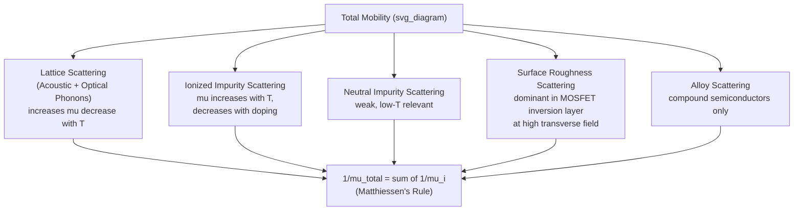

## Scattering Mechanisms and Mobility Limits

### Overview

Carrier mobility is fundamentally limited by scattering events that randomize a carrier's momentum, interrupting its acceleration under an applied field. No single scattering mechanism dominates universally — the relative importance of each depends on temperature, doping concentration, material quality, and device dimensions. This section provides comprehensive coverage of the major scattering mechanisms and how they combine to set practical mobility limits in bulk and nanoscale semiconductor devices.

### Classification of Scattering Mechanisms

Scattering mechanisms are broadly divided into categories based on their physical origin:

1. **Lattice (phonon) scattering** — intrinsic to the crystal, temperature-dependent
2. **Impurity scattering** — extrinsic, dependent on doping/defect density
3. **Carrier-carrier scattering** — significant only at very high carrier densities
4. **Surface/interface scattering** — dominant in thin films and inversion layers
5. **Alloy scattering** — specific to compound/alloy semiconductors (e.g., $\text{Al}_x\text{Ga}_{1-x}\text{As}$)

### 1. Lattice (Phonon) Scattering

Thermal vibrations of the crystal lattice create local perturbations in the periodic potential that scatter carriers. Two sub-types are typically distinguished:

**Acoustic phonon scattering**

Long-wavelength lattice vibrations that produce a deformation potential. Dominant at low-to-moderate temperatures in many materials:

$$\mu_{ac} \propto T^{-3/2}$$

**Optical phonon scattering**

Higher-energy lattice vibrations, particularly significant in polar semiconductors (e.g., GaAs, GaN) via polar optical phonon (Fröhlich) coupling. Becomes increasingly important at higher temperatures and higher carrier energies (relevant to hot-carrier and high-field transport):

$$\mu_{op} \propto \left[\exp\left(\frac{\hbar\omega_{op}}{k_BT}\right) - 1\right]$$

[Inference: the exact functional form and relative weight of acoustic vs. optical phonon scattering is material-specific and typically requires numerical Monte Carlo or full-band simulation for precise prediction rather than closed-form analytical treatment.]

### 2. Ionized Impurity Scattering

Coulombic scattering off charged dopant ions (donors or acceptors that have released/accepted a carrier). Described classically by the Brooks-Herring or Conwell-Weisskopf models:

$$\mu_{II} \propto \frac{T^{3/2}}{N_I \ln\left[1 + \left(\frac{...}{...}\right)\right]}$$

(The logarithmic term arises from screening of the Coulomb potential by free carriers; exact form is model-dependent.) Key behavior: mobility from this mechanism **increases** with temperature (faster carriers are deflected less) and **decreases** with increasing ionized impurity concentration $N_I$ — directly linking mobility degradation to doping level.

### 3. Neutral Impurity Scattering

Occurs when dopants are not ionized (e.g., in the freeze-out regime or with deep-level traps). Generally weaker and less temperature-dependent than ionized impurity scattering, following a model analogous to electron-neutral atom scattering (Erginsoy model). Relevant mainly at cryogenic temperatures where a fraction of dopants remain un-ionized.

### 4. Carrier-Carrier Scattering

Becomes relevant only at very high injection levels or degenerate doping, where carrier-carrier collisions redistribute momentum among carriers of the same or opposite type. This mechanism does not directly change total momentum (carrier-carrier collisions conserve total momentum) but can indirectly affect mobility by redistributing energy and altering the effective distribution function, coupling to other scattering mechanisms.

### 5. Surface and Interface Scattering

Critical in MOSFETs and thin-film devices where carriers are confined near an interface (e.g., Si/SiO2). Sources include:

- **Surface roughness scattering** — dominant at high transverse (gate) fields, where carriers are pushed hard against a rough interface
- **Interface charge/trap scattering** — from fixed oxide charge or interface trap states

Surface roughness scattering mobility typically degrades as:

$$\mu_{sr} \propto \frac{1}{E_{eff}^2}$$

where $E_{eff}$ is the effective transverse field — meaning higher gate overdrive in a MOSFET, while increasing drive current, also degrades channel mobility.

### 6. Alloy Scattering

In compound semiconductor alloys, random placement of different atomic species on lattice sites creates local potential fluctuations even in a perfect crystal (no impurities or defects required). Relevant in ternary/quaternary compounds like $\text{Al}_x\text{Ga}_{1-x}\text{As}$ or $\text{In}_x\text{Ga}_{1-x}\text{As}$, where mobility depends on alloy composition $x$ independent of doping.

### Combining Mechanisms: Matthiessen's Rule

$$\frac{1}{\mu_{total}} = \frac{1}{\mu_{ac}} + \frac{1}{\mu_{op}} + \frac{1}{\mu_{II}} + \frac{1}{\mu_{sr}} + \cdots$$

This reciprocal (parallel-resistance-like) summation means the weakest (lowest-mobility) mechanism dominates the combined result. Matthiessen's rule is an approximation that assumes each scattering mechanism is independent and elastic; it can break down when mechanisms are strongly coupled or when scattering is highly inelastic (e.g., strong optical phonon scattering at high fields). [Inference: the degree of error introduced by this approximation is mechanism- and material-specific and generally requires comparison against full Monte Carlo transport simulation to quantify.]

### Mobility Limits in Practice

**Bulk mobility ceiling**

Even in an ideal, defect-free, undoped crystal, phonon scattering alone sets an upper bound on mobility at any given temperature — this is the intrinsic lattice-limited mobility. Real material mobility can only degrade from this ceiling as impurities, defects, and interfaces are introduced.

**Doping-mobility tradeoff**

Higher doping increases carrier concentration (desirable for conductivity) but also increases ionized impurity scattering (undesirable for mobility). Since conductivity $\sigma = qn\mu$, there is a practical tradeoff: beyond a certain doping level, further increases in $N_D$ or $N_A$ yield diminishing or even negative returns in conductivity as mobility degradation outpaces carrier concentration gains. [Inference: the specific doping level at which this tradeoff becomes unfavorable is material- and application-specific.]

**Nanoscale/short-channel limits**

In modern nanoscale MOSFETs, mobility is further reduced by:

- Surface roughness scattering (as channel confinement increases)
- Remote Coulomb scattering from high-k gate dielectric charges
- Quantum confinement effects altering the effective density of states and scattering rates

This is a major driver behind strain engineering (strained silicon), high-mobility channel materials (SiGe, III-V, Ge), and multi-gate/FinFET architectures — all aimed at recovering mobility lost to aggressive scaling.

### Practical Example

Consider two silicon samples at room temperature:

- **Sample A:** Lightly doped, $N_D = 10^{14}\ \text{cm}^{-3}$. Ionized impurity scattering is weak; mobility is close to the lattice-scattering ceiling, $\mu_n \approx 1350\ \text{cm}^2/\text{V·s}$.
- **Sample B:** Heavily doped, $N_D = 10^{19}\ \text{cm}^{-3}$. Ionized impurity scattering dominates; mobility drops substantially, potentially to $\mu_n \approx 100\text{–}200\ \text{cm}^2/\text{V·s}$ [Unverified: exact value depends on the specific empirical mobility model, e.g., Caughey-Thomas or Masetti, used for the calculation].

This illustrates the fundamental doping-mobility tradeoff: Sample B has ~$10^5\times$ more carriers than Sample A, but proportionally lower mobility per carrier, so its net conductivity gain is far less than a naive linear scaling with $N_D$ would suggest.

**Key Points**

- Multiple independent scattering mechanisms limit mobility; each dominates in a different temperature/doping/field regime.
- Lattice (phonon) scattering sets an intrinsic ceiling on mobility, degraded further by impurities, defects, and interfaces.
- Matthiessen's rule combines mechanisms as a reciprocal sum — the weakest mechanism dominates.
- Surface roughness and alloy scattering become critical in thin-film/nanoscale devices and compound semiconductors respectively.
- Higher doping trades off carrier concentration against mobility, with diminishing conductivity returns at high doping levels.

**Related Topics**

- Drift current and carrier mobility (foundational relations)
- Hall effect mobility measurement
- Empirical mobility models (Caughey-Thomas, Masetti, Arora)
- Strain engineering and high-mobility channel materials
- MOSFET channel mobility degradation and effective field dependence
- Monte Carlo carrier transport simulation
- Compound semiconductor alloy scattering (III-V materials)
- Quantum confinement effects on scattering in ultra-thin channels