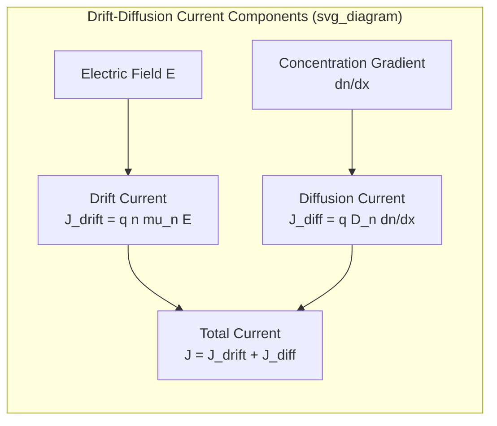

## Diffusion Current and Fick's Law

### Overview

Diffusion current arises whenever there is a spatial gradient in carrier concentration, even in the absence of an applied electric field. Carriers move from regions of high concentration to regions of low concentration due to random thermal motion, analogous to the diffusion of any particle species (gas molecules, ink in water). This is the second fundamental transport mechanism in semiconductors, alongside drift, and it is essential for understanding p-n junction behavior, bipolar transistor action, and minority carrier injection.

### Fick's Law of Diffusion

Fick's first law states that particle flux is proportional to the negative concentration gradient — particles flow "downhill" from high to low concentration:

$$F = -D\frac{d\phi}{dx}$$

where $F$ is the particle flux (particles per unit area per unit time), $\phi$ is concentration, and $D$ is the diffusion coefficient (units: $\text{cm}^2/\text{s}$). The negative sign indicates flux is directed opposite to the gradient (from high to low concentration).

### Application to Semiconductor Carriers

For electrons and holes, this becomes:

$$F_n = -D_n\frac{dn}{dx}, \quad F_p = -D_p\frac{dp}{dx}$$

Converting particle flux to current density requires multiplying by charge. Electrons carry negative charge, so their current flows opposite to their particle flux direction (conventional current is opposite to electron flow):

$$J_n^{diff} = qD_n\frac{dn}{dx}$$

$$J_p^{diff} = -qD_p\frac{dp}{dx}$$

Note the sign difference: electron diffusion current is in the *same* direction as the concentration gradient's positive sense once charge sign is accounted for, while hole diffusion current flows in the direction *opposite* to increasing hole concentration (holes diffuse from high to low concentration and carry positive charge in that direction of motion).

[Clarification of sign convention: physically, both electrons and holes diffuse from high to low concentration. The differing signs in the equations above result purely from the differing signs of the charge carried by each species, not from any difference in diffusion behavior itself.]

### One-Dimensional Example

Consider a hole concentration profile decreasing linearly from $p_1$ at $x=0$ to $p_2$ at $x=L$ (with $p_1 > p_2$):

$$\frac{dp}{dx} = \frac{p_2 - p_1}{L} \quad (\text{negative, since } p_2 < p_1)$$

$$J_p^{diff} = -qD_p\frac{dp}{dx} = -qD_p\left(\frac{p_2-p_1}{L}\right) = qD_p\left(\frac{p_1-p_2}{L}\right)$$

This gives a positive current flowing in the $+x$ direction — from the high-concentration region toward the low-concentration region, consistent with physical intuition: holes diffuse away from where they are concentrated.

### The Einstein Relation

Diffusion and drift are not independent phenomena — both arise from the same underlying random thermal motion of carriers, modulated respectively by a concentration gradient or an electric field. At thermal equilibrium, the Einstein relation links the diffusion coefficient to mobility:

$$\frac{D_n}{\mu_n} = \frac{D_p}{\mu_p} = \frac{k_BT}{q} = V_T$$

where $V_T$ is the thermal voltage (approximately 25.9 mV at T = 300 K). This relation is derived by requiring that, at equilibrium, drift and diffusion currents exactly cancel (no net current flows in a system at uniform Fermi level despite the presence of built-in fields and concentration gradients, e.g., in a graded-doping structure or a p-n junction under zero bias).

Given typical room-temperature silicon mobilities ($\mu_n \approx 1350\ \text{cm}^2/\text{V·s}$, $\mu_p \approx 480\ \text{cm}^2/\text{V·s}$), the Einstein relation yields:

$$D_n \approx 1350 \times 0.0259 \approx 35\ \text{cm}^2/\text{s}$$

$$D_p \approx 480 \times 0.0259 \approx 12.4\ \text{cm}^2/\text{s}$$

### Total Current: Drift Plus Diffusion

In general, both drift and diffusion contribute simultaneously to total current, giving the full carrier transport (drift-diffusion) equations:

$$J_n = q n \mu_n E + qD_n\frac{dn}{dx}$$

$$J_p = q p \mu_p E - qD_p\frac{dp}{dx}$$

$$J_{total} = J_n + J_p$$

These equations, combined with the continuity equations and Poisson's equation, form the drift-diffusion model — the standard semiclassical framework used in most conventional device simulation (SPICE-level and TCAD device models) for describing carrier transport under low-to-moderate field conditions.

### SVG Illustration: Diffusion of Holes Down a Concentration Gradient

<svg xmlns="http://www.w3.org/2000/svg" viewBox="0 0 640 380" font-family="sans-serif">
<text x="320" y="24" text-anchor="middle" font-size="16" font-weight="bold">Hole Diffusion Along a Concentration Gradient (svg_diagram)</text>
<line x1="70" y1="320" x2="590" y2="320" stroke="black" stroke-width="2" />
<line x1="70" y1="320" x2="70" y2="60" stroke="black" stroke-width="2" />
<text x="330" y="355" text-anchor="middle" font-size="14">Position, x</text>
<text x="30" y="190" text-anchor="middle" font-size="14" transform="rotate(-90 30 190)">Hole concentration, p(x)</text>

<path d="M 90 90 L 570 280" stroke="#8e44ad" stroke-width="3" fill="none" />
<text x="100" y="80" font-size="12" fill="#8e44ad">p1 (high)</text>
<text x="500" y="300" font-size="12" fill="#8e44ad">p2 (low)</text>

<line x1="150" y1="150" x2="220" y2="165" stroke="#e67e22" stroke-width="3" marker-end="url(#arrow)" />
<line x1="280" y1="190" x2="350" y2="205" stroke="#e67e22" stroke-width="3" marker-end="url(#arrow)" />
<line x1="400" y1="225" x2="470" y2="240" stroke="#e67e22" stroke-width="3" marker-end="url(#arrow)" />
<text x="250" y="140" font-size="12" fill="`#e67e22`">Hole flux direction (high → low concentration)</text>

</svg>

### Physical Significance in Device Operation

**p-n junction:** At zero bias, a built-in electric field exists across the depletion region due to fixed ionized dopant charges. This field drives a drift current that exactly balances the diffusion current arising from the concentration gradient of majority carriers across the junction — the equilibrium condition with zero net current.

**Bipolar junction transistor (BJT):** Minority carrier diffusion across the base region is the dominant transport mechanism enabling transistor action. Base width and minority carrier diffusion length directly determine current gain and frequency response.

**Solar cells and photodiodes:** Photogenerated minority carriers near the junction diffuse toward the depletion region, where the built-in field sweeps them across — diffusion transport in the quasi-neutral regions is often the limiting factor in collection efficiency.

### Practical Example

A silicon sample has excess hole concentration $\Delta p$ decaying from $10^{15}\ \text{cm}^{-3}$ at $x = 0$ to zero at $x = L = 2\ \mu\text{m}$, approximately linearly. Using $D_p \approx 12.4\ \text{cm}^2/\text{s}$:

$$\frac{dp}{dx} \approx \frac{0 - 10^{15}}{2\times10^{-4}\ \text{cm}} = -5\times10^{18}\ \text{cm}^{-4}$$

$$J_p^{diff} = -qD_p\frac{dp}{dx} = -(1.6\times10^{-19})(12.4)(-5\times10^{18}) \approx 9.9\ \text{A/cm}^2$$

This current flows in the $+x$ direction, consistent with holes diffusing from the high-concentration region ($x=0$) toward the low-concentration region ($x=L$).

**Key Points**

- Diffusion current arises from a concentration gradient, independent of any applied electric field.
- Fick's law: $J_n^{diff} = qD_n\,dn/dx$, $J_p^{diff} = -qD_p\,dp/dx$ — sign differences stem from opposite carrier charges.
- The Einstein relation, $D/\mu = k_BT/q$, links diffusion and drift, both rooted in the same thermal motion.
- Total current in a semiconductor is the sum of drift and diffusion components (the drift-diffusion model).
- Diffusion transport is the dominant mechanism in field-free quasi-neutral regions — central to p-n junctions, BJTs, and photodiodes.

**Related Topics**

- Drift current and carrier mobility (companion transport mechanism)
- Continuity equation and carrier generation-recombination
- p-n junction equilibrium and built-in potential
- Minority carrier injection and diffusion length
- BJT current gain and base transport factor
- Poisson's equation and the drift-diffusion device model
- Quasi-Fermi levels under non-equilibrium conditions
- Photogeneration and carrier collection in solar cells