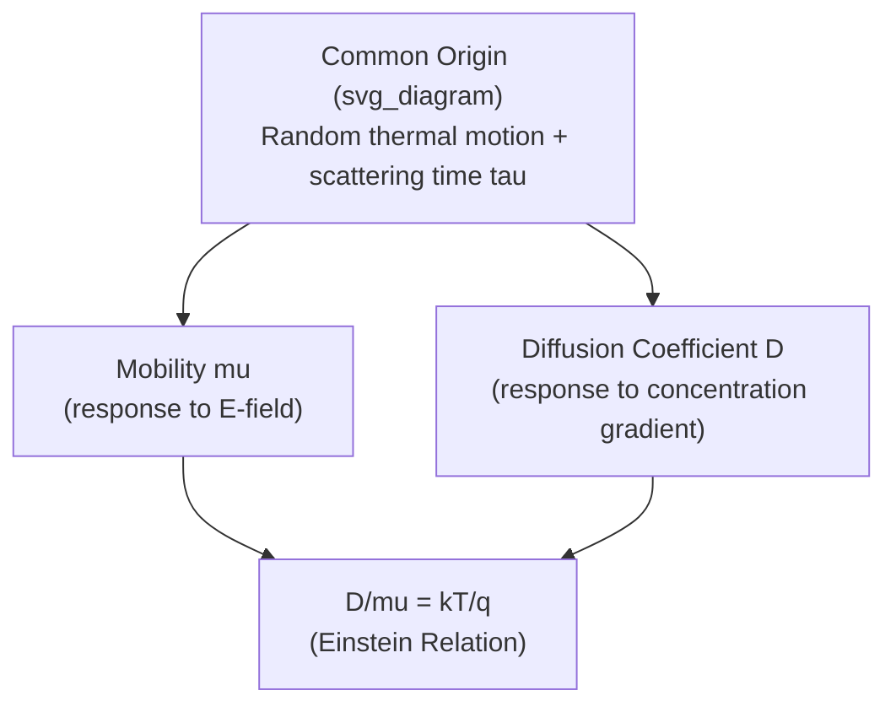

## The Einstein Relation

### Overview

The Einstein relation establishes a fundamental link between two seemingly distinct transport coefficients: carrier mobility $\mu$ (which governs drift under an electric field) and the diffusion coefficient $D$ (which governs diffusion under a concentration gradient). Both parameters describe the same underlying physical process — random thermal motion of carriers interrupted by scattering — viewed from two different driving forces. The Einstein relation shows that these two coefficients are not independent material parameters but are rigidly tied together through thermal energy.

### Statement of the Relation

$$\frac{D_n}{\mu_n} = \frac{D_p}{\mu_p} = \frac{k_BT}{q} = V_T$$

where:

- $D_n$, $D_p$ are electron and hole diffusion coefficients ($\text{cm}^2/\text{s}$)
- $\mu_n$, $\mu_p$ are electron and hole mobilities ($\text{cm}^2/\text{V·s}$)
- $k_B$ is Boltzmann's constant
- $T$ is absolute temperature
- $q$ is the elementary charge
- $V_T = k_BT/q$ is the thermal voltage

At room temperature (T = 300 K), $V_T \approx 25.9\ \text{mV}$, a value that recurs throughout semiconductor device equations (diode ideality equations, BJT transconductance, subthreshold MOSFET slope, etc.).

### Derivation from Equilibrium Conditions

The Einstein relation can be derived by considering a non-uniformly doped semiconductor in thermal equilibrium — for example, a piece of silicon with a doping gradient but no external bias applied. In equilibrium, the Fermi level $E_F$ must be flat (constant with position) throughout the material; otherwise, a net current would flow indefinitely, violating the equilibrium condition.

**Setting up the equilibrium condition**

Consider electron concentration as a function of position, related to the conduction band edge and Fermi level:

$$n(x) = N_C \exp\left(-\frac{E_C(x) - E_F}{k_BT}\right)$$

If doping varies with $x$, then $E_C(x)$ (and hence $n(x)$) varies with position, but $E_F$ remains constant at equilibrium.

**Total current must vanish at equilibrium**

The total electron current is the sum of drift (driven by the built-in field arising from the band bending) and diffusion (driven by the concentration gradient):

$$J_n = qn\mu_n E + qD_n\frac{dn}{dx} = 0 \quad \text{(equilibrium condition)}$$

The built-in electric field relates to the gradient of the conduction band edge:

$$E = \frac{1}{q}\frac{dE_C}{dx}$$

Differentiating $n(x)$ with respect to $x$:

$$\frac{dn}{dx} = -\frac{n}{k_BT}\frac{dE_C}{dx}$$

Substituting both expressions into the zero-current condition and solving:

$$qn\mu_n \left(\frac{1}{q}\frac{dE_C}{dx}\right) + qD_n\left(-\frac{n}{k_BT}\frac{dE_C}{dx}\right) = 0$$

$$n\mu_n\frac{dE_C}{dx} = \frac{qD_n n}{k_BT}\frac{dE_C}{dx}$$

$$\mu_n = \frac{qD_n}{k_BT} \quad \Rightarrow \quad \frac{D_n}{\mu_n} = \frac{k_BT}{q}$$

An analogous derivation for holes yields $D_p/\mu_p = k_BT/q$, confirming the same ratio applies to both carrier types.

### Physical Interpretation

The derivation shows the Einstein relation is a direct consequence of the *same* Fermi-Dirac (Boltzmann, in the non-degenerate limit) statistics governing carrier distribution used for both drift and diffusion — it is not a coincidence but a structural requirement of statistical mechanics. Physically: mobility measures how effectively carriers are swept along by a field between scattering events, while diffusion measures how effectively carriers spread out via random thermal motion between the same scattering events. Since both depend on the same scattering time $\tau$ and the same thermal velocity distribution, they must be related through the thermal energy scale $k_BT$.

### Range of Validity

The simple form $D/\mu = k_BT/q$ assumes **non-degenerate** statistics (Maxwell-Boltzmann approximation to Fermi-Dirac), valid when the Fermi level lies well within the bandgap (several $k_BT$ away from either band edge). This holds for most moderately doped semiconductors under normal operating conditions.

**Degenerate case (heavily doped semiconductors)**

When doping is heavy enough that the Fermi level moves into or very close to a band (degenerate semiconductor), the full Fermi-Dirac statistics must be used, and the Einstein relation generalizes to:

$$\frac{D_n}{\mu_n} = \frac{k_BT}{q}\cdot\frac{n}{ } \cdot \left(\frac{\partial n}{\partial E_F}\right)^{-1}$$

more commonly expressed using the Fermi-Dirac integral of order $1/2$, $\mathcal{F}_{1/2}$:

$$\frac{D_n}{\mu_n} = \frac{k_BT}{q}\cdot\frac{\mathcal{F}_{1/2}(\eta)}{\mathcal{F}_{-1/2}(\eta)}$$

where $\eta = (E_F - E_C)/k_BT$. In this degenerate regime, $D_n/\mu_n$ exceeds $k_BT/q$, and the simple Einstein relation underestimates the diffusion coefficient. [Inference: the magnitude of this deviation depends on how deep into degeneracy the Fermi level sits, and is typically only significant for doping levels approaching or exceeding $\sim 10^{19}\ \text{cm}^{-3}$ in silicon.]

### Practical Applications

**Diode equation derivation:** The Einstein relation is essential in deriving the Shockley diode equation, connecting the diffusion current of minority carriers across a p-n junction to the junction's built-in potential (itself derived from majority carrier concentrations and thermal voltage $V_T$).

**BJT transconductance:** The small-signal transconductance of a bipolar transistor, $g_m = I_C/V_T$, directly uses the thermal voltage that originates from the same $k_BT/q$ term appearing in the Einstein relation.

**MOSFET subthreshold slope:** The subthreshold swing of a MOSFET has a theoretical minimum of $\ln(10)\cdot V_T \approx 60\ \text{mV/decade}$ at room temperature — again tracing back to the thermal voltage scale.

**Device simulation:** TCAD and SPICE-level compact models rely on the Einstein relation to reduce the number of independent transport parameters needed — once mobility (which is more readily measured, e.g., via Hall effect) is known, diffusion coefficients are computed directly rather than measured separately.

### Worked Example

Given room-temperature ($T = 300\ \text{K}$) mobilities for silicon: $\mu_n = 1350\ \text{cm}^2/\text{V·s}$, $\mu_p = 480\ \text{cm}^2/\text{V·s}$.

Thermal voltage:

$$V_T = \frac{k_BT}{q} = \frac{(1.38\times10^{-23})(300)}{1.6\times10^{-19}} \approx 0.0259\ \text{V} = 25.9\ \text{mV}$$

Diffusion coefficients:

$$D_n = \mu_n V_T = 1350 \times 0.0259 \approx 35.0\ \text{cm}^2/\text{s}$$

$$D_p = \mu_p V_T = 480 \times 0.0259 \approx 12.4\ \text{cm}^2/\text{s}$$

These values match standard tabulated room-temperature silicon diffusion coefficients, confirming the practical utility of the relation: a single mobility measurement (obtainable via Hall-effect or conductivity measurements) yields the diffusion coefficient without needing a separate, more difficult direct diffusion measurement.

### SVG Illustration: Einstein Relation as a Bridge Between Transport Coefficients

<svg xmlns="http://www.w3.org/2000/svg" viewBox="0 0 640 320" font-family="sans-serif">
<text x="320" y="24" text-anchor="middle" font-size="16" font-weight="bold">Einstein Relation Bridge (svg_diagram)</text>
<rect x="60" y="100" width="180" height="80" rx="10" fill="#eaf2f8" stroke="#2980b9" stroke-width="2" />
<text x="150" y="135" text-anchor="middle" font-size="14" fill="#2980b9">Mobility, μ</text>
<text x="150" y="155" text-anchor="middle" font-size="12" fill="#2980b9">(drift response to E)</text>
<rect x="400" y="100" width="180" height="80" rx="10" fill="#fdedec" stroke="#c0392b" stroke-width="2" />
<text x="490" y="135" text-anchor="middle" font-size="14" fill="#c0392b">Diffusion Coeff., D</text>
<text x="490" y="155" text-anchor="middle" font-size="12" fill="#c0392b">(response to ∇n)</text>
<line x1="240" y1="140" x2="400" y2="140" stroke="#333" stroke-width="2" marker-end="url(#arrow2)" marker-start="url(#arrow2)" />
<text x="320" y="125" text-anchor="middle" font-size="13" font-weight="bold">D/μ = kT/q</text>
<text x="320" y="230" text-anchor="middle" font-size="12" fill="#555">Both governed by the same scattering time τ and thermal energy k_BT</text>

</svg>

**Key Points**

- $D/\mu = k_BT/q = V_T$ — links diffusion coefficient and mobility through thermal voltage.
- Derived by requiring zero net current at thermal equilibrium in a non-uniformly doped semiconductor.
- Valid in the non-degenerate (Maxwell-Boltzmann) limit; requires Fermi-Dirac integral correction for heavily doped, degenerate semiconductors.
- Thermal voltage $V_T \approx 25.9\ \text{mV}$ at 300 K underlies diode equations, BJT transconductance, and MOSFET subthreshold slope.
- Practically allows diffusion coefficients to be computed from more easily measured mobility values.

**Related Topics**

- Drift current and carrier mobility
- Diffusion current and Fick's law
- Fermi-Dirac statistics and degenerate semiconductors
- p-n junction built-in potential derivation
- Shockley diode equation
- BJT small-signal parameters and transconductance
- MOSFET subthreshold conduction and swing
- Quasi-Fermi levels under non-equilibrium bias