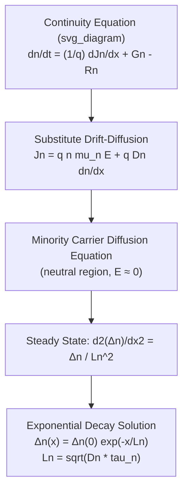

## Continuity Equations for Carriers

### Overview

The continuity equation expresses conservation of charge carriers: the rate of change of carrier concentration at any point in a semiconductor equals the net rate at which carriers flow into that point (via current) plus the net rate at which carriers are generated or consumed by generation-recombination processes. Together with the drift-diffusion current equations and Poisson's equation, the continuity equations form the complete set of coupled partial differential equations that govern semiconductor device behavior — the foundation of all TCAD device simulation.

### General Form

For electrons, the continuity equation in one dimension is:

$$\frac{\partial n}{\partial t} = \frac{1}{q}\frac{\partial J_n}{\partial x} + G_n - R_n$$

For holes:

$$\frac{\partial p}{\partial t} = -\frac{1}{q}\frac{\partial J_p}{\partial x} + G_p - R_p$$

where:

- $n$, $p$ are electron and hole concentrations
- $J_n$, $J_p$ are electron and hole current densities
- $G_n$, $G_p$ are generation rates (carriers created per unit volume per unit time — thermal, optical, or impact ionization generation)
- $R_n$, $R_p$ are recombination rates (carriers annihilated per unit volume per unit time)

The sign difference in the current divergence term ($+\partial J_n/\partial x$ for electrons vs. $-\partial J_p/\partial x$ for holes) arises from the opposite sign of the charge carried by each species.

### Derivation from Charge Conservation

Consider a thin slab of semiconductor of cross-sectional area $A$ and thickness $dx$. The number of electrons in this slab is $n \cdot A \cdot dx$. The rate of change of electron count equals: electrons flowing in minus electrons flowing out, plus net generation:

$$A\,dx\,\frac{\partial n}{\partial t} = \frac{1}{q}\left[J_n(x+dx) - J_n(x)\right]A + (G_n - R_n)A\,dx$$

Dividing through by $A\,dx$ and taking the limit $dx \to 0$:

$$\frac{\partial n}{\partial t} = \frac{1}{q}\frac{\partial J_n}{\partial x} + G_n - R_n$$

This is a direct statement of particle number conservation, analogous to the continuity equation in fluid dynamics or electromagnetism (charge conservation, $\nabla \cdot J = -\partial \rho/\partial t$), adapted here to include internal generation and recombination source/sink terms specific to semiconductors.

### Substituting the Drift-Diffusion Current

Expanding $J_n$ and $J_p$ using the drift-diffusion equations gives the full minority-carrier diffusion equation, one of the most widely used forms in device analysis. For electrons:

$$J_n = qn\mu_n E + qD_n\frac{\partial n}{\partial x}$$

Substituting into the continuity equation:

$$\frac{\partial n}{\partial t} = \mu_n\frac{\partial(nE)}{\partial x} + D_n\frac{\partial^2 n}{\partial x^2} + G_n - R_n$$

For the common case of minority carriers in a quasi-neutral region with a small or negligible electric field (typical assumption in the base region of a BJT or the neutral regions of a diode), the drift term vanishes and this simplifies to the **minority carrier diffusion equation**:

$$\frac{\partial \Delta n_p}{\partial t} = D_n\frac{\partial^2 \Delta n_p}{\partial x^2} - \frac{\Delta n_p}{\tau_n} + G_n$$

where $\Delta n_p$ is the excess minority electron concentration in p-type material, and $\tau_n$ is the minority carrier lifetime (from $R_n = \Delta n_p/\tau_n$ under low-level injection with simple recombination).

### Steady-State Simplification

Under steady-state conditions ($\partial n/\partial t = 0$), with no external generation ($G_n = 0$) and constant lifetime recombination, the minority carrier diffusion equation reduces to:

$$D_n\frac{d^2 \Delta n_p}{dx^2} - \frac{\Delta n_p}{\tau_n} = 0$$

This is a standard second-order linear ODE with solution:

$$\Delta n_p(x) = \Delta n_p(0)\exp\left(-\frac{x}{L_n}\right)$$

where $L_n = \sqrt{D_n \tau_n}$ is the **minority carrier diffusion length** — the characteristic distance over which excess minority carrier concentration decays to $1/e$ of its initial value due to recombination. This exponential decay solution is central to p-n junction diode current derivation (Shockley equation) and BJT base transport analysis.

### Generation-Recombination Terms

The net recombination rate $R_n - G_n$ (often written as a single net term $U$) can take several forms depending on the dominant physical mechanism:

**Low-level injection, simple lifetime model:**

$$U = \frac{\Delta n}{\tau_n}$$

**Shockley-Read-Hall (SRH) recombination** (via trap/defect states):

$$U_{SRH} = \frac{pn - n_i^2}{\tau_p(n+n_1) + \tau_n(p+p_1)}$$

**Radiative recombination** (direct band-to-band, significant in direct-bandgap materials like GaAs):

$$U_{rad} = B(np - n_i^2)$$

**Auger recombination** (three-particle process, dominant at high carrier densities):

$$U_{Auger} = (C_n n + C_p p)(np - n_i^2)$$

Total recombination is typically modeled as the sum of contributions from all significant mechanisms, with the dominant mechanism depending on doping level, injection level, material (direct vs. indirect bandgap), and defect density. [Inference: identifying which mechanism dominates in a specific device requires knowledge of specific material quality and operating conditions rather than a universal rule.]

### Full Coupled System (Drift-Diffusion Model)

The complete semiconductor device model used in numerical simulation (TCAD) couples three equations:

1. **Poisson's equation:** $\nabla^2\psi = -\dfrac{q}{\epsilon_s}(p - n + N_D^+ - N_A^-)$
2. **Electron continuity equation:** $\dfrac{\partial n}{\partial t} = \dfrac{1}{q}\nabla\cdot J_n + G_n - R_n$
3. **Hole continuity equation:** $\dfrac{\partial p}{\partial t} = -\dfrac{1}{q}\nabla\cdot J_p + G_p - R_p$

with $J_n$ and $J_p$ given by the drift-diffusion relations. These three coupled nonlinear PDEs are solved self-consistently (typically via Newton-Raphson iteration on a discretized mesh) in device simulators to predict I-V characteristics, transient response, and internal carrier/field distributions. [Behavioral note: actual solver convergence and accuracy depend heavily on meshing, boundary conditions, and the specific numerical scheme used by a given simulation tool, and results should be validated against known analytical limits or experimental data.]

### Practical Example: Diffusion Length Calculation

For a p-type silicon region with minority electron mobility $\mu_n = 1350\ \text{cm}^2/\text{V·s}$ (using the Einstein relation, $D_n \approx 35\ \text{cm}^2/\text{s}$) and a minority carrier lifetime $\tau_n = 1\ \mu\text{s}$:

$$L_n = \sqrt{D_n \tau_n} = \sqrt{35 \times 10^{-6}} \approx \sqrt{3.5\times10^{-5}}\ \text{cm} \approx 5.9\times10^{-3}\ \text{cm} = 59\ \mu\text{m}$$

This diffusion length determines, for example, how far minority carriers can travel in the quasi-neutral region of a diode before recombining — directly setting the effective "collection width" relevant to solar cell design and the reverse saturation current magnitude in the Shockley diode equation.

**Key Points**

- Continuity equations state carrier conservation: rate of concentration change = current divergence + net generation.
- Substituting drift-diffusion current gives the minority carrier diffusion equation, central to diode and BJT analysis.
- Steady-state, field-free solutions yield exponential decay characterized by the diffusion length $L_n = \sqrt{D_n\tau_n}$.
- Recombination can follow SRH, radiative, or Auger mechanisms, with the dominant one depending on material and injection conditions.
- Continuity equations, coupled with Poisson's equation and drift-diffusion currents, form the complete numerical device simulation (TCAD) framework.

**Related Topics**

- Diffusion current and Fick's law
- The Einstein relation
- Shockley-Read-Hall recombination and trap-assisted processes
- Minority carrier diffusion length and lifetime measurement
- Shockley diode equation derivation
- BJT base transport and current gain
- Poisson's equation and self-consistent device simulation
- Auger and radiative recombination in direct-bandgap materials