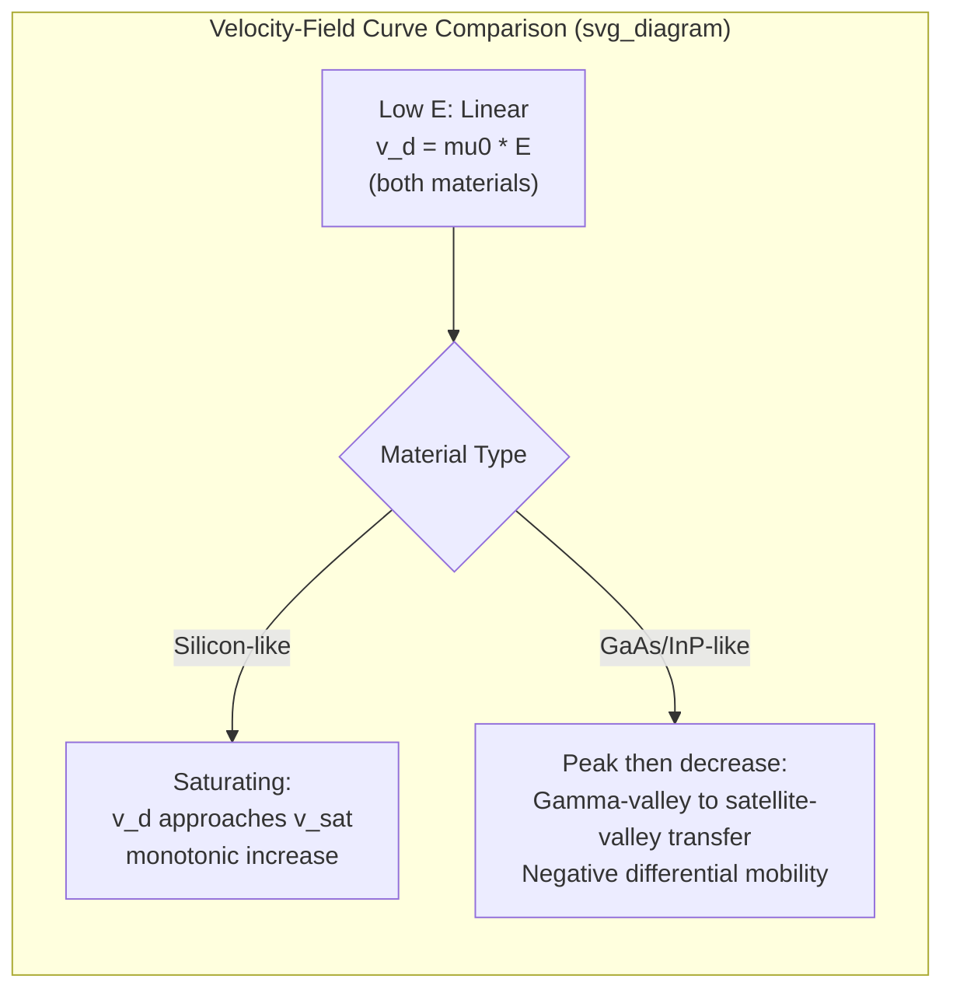

## High Field Transport and Velocity Saturation

### Overview

At low-to-moderate electric fields, carrier drift velocity increases linearly with field strength, governed by a constant mobility. As field strength increases, this linear relationship breaks down: carriers gain enough kinetic energy between scattering events to interact strongly with high-energy optical phonons, capping their average velocity. This phenomenon — velocity saturation — is a critical non-ideal effect in modern short-channel devices, where the internal electric fields can reach levels far beyond those assumed by simple long-channel device models.

### Breakdown of the Linear Drift Model

The simple relation $v_d = \mu E$ assumes mobility is field-independent, which holds only when carriers remain near thermal equilibrium with the lattice (i.e., their average kinetic energy is close to the equilibrium thermal value $\frac{3}{2}k_BT$). At higher fields, carriers absorb more energy from the field between collisions than they can dissipate through low-energy acoustic phonon emission alone, causing their effective temperature (carrier temperature $T_e$) to rise above the lattice temperature — carriers become "hot."

### Hot Carrier Effects

Once carriers become hot, previously negligible scattering mechanisms become significant:

- **Optical phonon emission** becomes the dominant energy-loss mechanism, since hot carriers now have enough energy to emit optical phonons (which have a minimum threshold energy $\hbar\omega_{op}$)
- **Intervalley scattering** in materials with multiple conduction band valleys (e.g., GaAs, silicon's six equivalent X-valleys) allows carriers to transfer to higher-energy, lower-mobility valleys — this underlies the negative differential mobility seen in GaAs (Gunn effect)
- **Impact ionization** becomes possible at sufficiently high fields, where carriers gain enough energy to generate additional electron-hole pairs by breaking covalent bonds — relevant to avalanche breakdown and avalanche photodiodes

### Empirical Velocity-Field Models

**Basic saturation model (silicon-like, monotonic saturation):**

$$v_d(E) = \frac{\mu_0 E}{\left[1 + \left(\dfrac{\mu_0 E}{v_{sat}}\right)^{\beta}\right]^{1/\beta}}$$

where $\mu_0$ is the low-field mobility, $v_{sat}$ is the saturation velocity, and $\beta$ is an empirical fitting exponent (commonly $\beta \approx 2$ for electrons, $\beta \approx 1$ for holes in silicon [Unverified: exact values vary across literature and specific fitting datasets]).

As $E \to \infty$: $v_d \to v_{sat}$, independent of $\mu_0$.

As $E \to 0$: $v_d \to \mu_0 E$, recovering the standard linear drift relation.

**Simplified two-region model (common in compact device models):**

$$v_d(E) = \begin{cases} \mu_0 E & E \leq E_{sat} \\ v_{sat} & E > E_{sat} \end{cases}$$

where $E_{sat} = v_{sat}/\mu_0$ is the field at which the two regions meet. This piecewise-linear approximation, while less physically smooth, is widely used in analytical short-channel MOSFET current models (e.g., in deriving saturation current expressions accounting for velocity saturation).

### Negative Differential Mobility (GaAs, InP, and Other Direct-Gap Materials)

In materials with a central conduction band valley (Γ-valley, high mobility, low effective mass) and satellite valleys (L-valley or X-valley, lower mobility, higher effective mass) separated by a small energy gap, high-field transport shows a distinctive non-monotonic behavior:

$$v_d(E) \text{ increases, peaks, then } \textbf{decreases} \text{ as } E \text{ increases further}$$

This occurs because, above a threshold field, enough carriers gain sufficient energy to transfer from the high-mobility Γ-valley into the low-mobility satellite valleys, reducing the average drift velocity even as the field continues to increase. This negative differential resistance is the physical basis of the **Gunn effect**, exploited in Gunn diodes for microwave oscillator applications. [Inference: silicon does not exhibit this behavior as prominently due to its indirect bandgap structure and different valley configuration, so the standard saturating (non-negative-differential) model is typically used for silicon devices.]

### SVG Illustration: Velocity-Field Curves — Silicon vs. GaAs

<svg xmlns="http://www.w3.org/2000/svg" viewBox="0 0 640 400" font-family="sans-serif">
<text x="320" y="24" text-anchor="middle" font-size="16" font-weight="bold">Velocity-Field Curves: Si vs GaAs (svg_diagram)</text>
<line x1="70" y1="340" x2="590" y2="340" stroke="black" stroke-width="2" />
<line x1="70" y1="340" x2="70" y2="50" stroke="black" stroke-width="2" />
<text x="330" y="375" text-anchor="middle" font-size="14">Electric Field, E</text>
<text x="30" y="200" text-anchor="middle" font-size="14" transform="rotate(-90 30 200)">Drift Velocity, v_d</text>

<path d="M 70 340 L 200 200 Q 300 130 590 120" stroke="#2980b9" stroke-width="3" fill="none" />
<text x="420" y="105" font-size="12" fill="#2980b9">Silicon (saturating)</text>

<path d="M 70 340 L 170 130 Q 220 90 260 100 Q 350 130 590 200" stroke="#c0392b" stroke-width="3" fill="none" />
<text x="180" y="80" font-size="12" fill="#c0392b">GaAs (peak then NDM)</text>

<text x="260" y="115" font-size="10" fill="#555">peak</text>

</svg>

### Impact on Device Behavior: Short-Channel MOSFETs

In a MOSFET with a short channel length $L$, the lateral electric field $E = V_{DS}/L$ can become very large even at modest drain voltages as $L$ scales down. Velocity saturation modifies the classical long-channel square-law current model:

**Long-channel saturation current (no velocity saturation):**

$$I_{Dsat} = \frac{\mu_0 C_{ox} W}{2L}(V_{GS}-V_{TH})^2$$

**Short-channel, velocity-saturated current:**

When the channel field reaches $E_{sat}$ before the classical pinch-off condition would occur, the drain current saturates at a lower value than the square-law model predicts, and importantly becomes closer to a **linear** (rather than quadratic) function of gate overdrive:

$$I_{Dsat} \approx W C_{ox} v_{sat}(V_{GS} - V_{TH})$$

[Inference: the precise transition between square-law and velocity-saturated linear behavior depends on the specific channel length, oxide thickness, and doping profile, and real devices exhibit a smooth transition captured by more detailed compact models such as BSIM rather than a sharp switch between the two limiting forms.]

This reduced quadratic dependence has significant circuit design implications: transconductance $g_m$ scales differently with device dimensions and bias than the long-channel model predicts, affecting analog circuit design equations, and overall drive current per unit width saturates rather than continuing to improve with further gate length scaling — one of several effects motivating the industry shift toward alternative device architectures (FinFETs, gate-all-around) and strained/high-mobility channel materials to recover performance.

### Practical Example

For silicon with $\mu_n \approx 1350\ \text{cm}^2/\text{V·s}$ and $v_{sat} \approx 1\times10^7\ \text{cm/s}$:

$$E_{sat} = \frac{v_{sat}}{\mu_n} = \frac{1\times10^7}{1350} \approx 7.4\times10^3\ \text{V/cm}$$

For a MOSFET with channel length $L = 0.1\ \mu\text{m} = 1\times10^{-5}\ \text{cm}$ and $V_{DS} = 1\ \text{V}$:

$$E = \frac{V_{DS}}{L} = \frac{1}{1\times10^{-5}} = 1\times10^5\ \text{V/cm}$$

This is more than an order of magnitude above $E_{sat}$, confirming that velocity saturation dominates transport in this device — the long-channel square-law $I$-$V$ model would substantially overestimate the actual saturation current, underscoring why velocity saturation must be incorporated into any realistic short-channel device model.

**Key Points**

- Velocity saturation caps drift velocity at high fields as carriers become "hot" and lose energy predominantly via optical phonon emission.
- Empirical models (e.g., $v_d = \mu_0E/[1+(\mu_0E/v_{sat})^\beta]^{1/\beta}$) capture the transition from linear drift to saturated velocity.
- GaAs and similar direct-gap materials show negative differential mobility due to intervalley carrier transfer — the basis of the Gunn effect.
- Short-channel MOSFETs routinely operate in the velocity-saturated regime, converting the classical quadratic $I$-$V$ relation toward a more linear dependence on gate overdrive.
- Velocity saturation is a key driver behind modern device scaling challenges and strain/mobility engineering solutions.

**Related Topics**

- Drift current and carrier mobility
- Scattering mechanisms and mobility limits
- Short-channel MOSFET effects (channel length modulation, DIBL)
- Gunn effect and negative differential resistance devices
- Impact ionization and avalanche breakdown
- Strained silicon and high-mobility channel engineering
- BSIM and other compact MOSFET models
- Hot carrier degradation and reliability