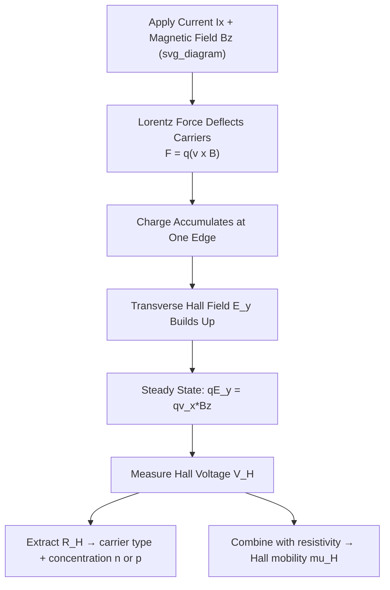

## The Hall Effect and Magnetotransport

### Overview

The Hall effect describes the generation of a transverse voltage across a current-carrying conductor or semiconductor when subjected to a perpendicular magnetic field. This phenomenon is one of the most important characterization tools in semiconductor physics, providing direct experimental access to carrier type, concentration, and mobility — quantities that are otherwise difficult to disentangle from a simple resistivity measurement alone. Magnetotransport more broadly encompasses the full range of transport phenomena that emerge when a magnetic field couples to moving charge carriers.

### Physical Origin of the Hall Effect

Consider a rectangular semiconductor sample carrying current density $J_x$ in the $x$-direction, with a magnetic field $B_z$ applied perpendicular to the sample plane (in the $z$-direction). Carriers moving with drift velocity $v_x$ experience a Lorentz force:

$$\vec{F} = q\vec{v} \times \vec{B}$$

For carriers moving in the $+x$ direction with field $B_z$, this force has a component in the $y$-direction, deflecting carriers toward one edge of the sample. This deflection continues until the resulting charge accumulation creates a transverse electric field $E_y$ (the Hall field) that exactly balances the magnetic force in steady state:

$$qE_y = qv_xB_z \quad \Rightarrow \quad E_y = v_xB_z$$

This transverse field manifests as a measurable voltage across the sample width — the **Hall voltage** $V_H$.

### Hall Voltage and Hall Coefficient

For a sample of thickness $t$ carrying current $I_x$:

$$V_H = \frac{I_xB_z}{qnt} \quad \text{(n-type, electrons)}$$

$$V_H = \frac{I_xB_z}{qpt} \quad \text{(p-type, holes)}$$

The **Hall coefficient** $R_H$ is defined as:

$$R_H = \frac{E_y}{J_xB_z}$$

which evaluates to:

$$R_H = -\frac{1}{qn} \quad \text{(n-type)}, \qquad R_H = \frac{1}{qp} \quad \text{(p-type)}$$

**Critically, the sign of $R_H$ directly reveals the majority carrier type** — negative for electrons, positive for holes — making the Hall effect a definitive method for distinguishing n-type from p-type material, which a simple resistivity measurement alone cannot do (resistivity depends on the product $n\mu_n$ or $p\mu_p$ and cannot separate carrier type from concentration or mobility).

### Extracting Carrier Concentration and Mobility

**Carrier concentration** is obtained directly from the measured Hall coefficient:

$$n = \frac{1}{q|R_H|}\quad \text{or}\quad p = \frac{1}{q|R_H|}$$

**Hall mobility** is then obtained by combining the Hall measurement with a separate resistivity measurement:

$$\mu_H = |R_H|\sigma = \frac{|R_H|}{\rho}$$

This is the standard experimental technique (the **van der Pauw method** combined with Hall measurement, in practice) for determining both carrier concentration and mobility from a single sample without needing to know the doping profile a priori — an essential tool in semiconductor material characterization and process control.

### SVG Illustration: Hall Effect Geometry

<svg xmlns="http://www.w3.org/2000/svg" viewBox="0 0 640 420" font-family="sans-serif">
<text x="320" y="24" text-anchor="middle" font-size="16" font-weight="bold">Hall Effect Sample Geometry (svg_diagram)</text>

<rect x="180" y="150" width="280" height="120" fill="#eaf2f8" stroke="#2980b9" stroke-width="2" />
<text x="320" y="215" text-anchor="middle" font-size="13" fill="#2980b9">Semiconductor Sample</text>

<line x1="150" y1="210" x2="180" y2="210" stroke="#c0392b" stroke-width="3" marker-end="url(#arrowh)" />
<text x="130" y="200" font-size="12" fill="#c0392b">I_x</text>
<line x1="460" y1="210" x2="490" y2="210" stroke="#c0392b" stroke-width="3" marker-end="url(#arrowh)" />

<circle cx="320" cy="180" r="3" fill="black" />
<text x="335" y="185" font-size="12">B_z (out of page)</text>

<line x1="320" y1="150" x2="320" y2="120" stroke="#27ae60" stroke-width="3" marker-end="url(#arrowh)" />
<text x="330" y="115" font-size="12" fill="#27ae60">+ (accumulated charge)</text>
<line x1="320" y1="270" x2="320" y2="300" stroke="#27ae60" stroke-width="3" />
<text x="280" y="320" font-size="12" fill="#27ae60">V_H measured across width</text>
</svg>

### The Hall Angle and Magnetoresistance

**Hall angle** $\theta_H$ characterizes the tilt of the current flow relative to the applied field direction due to the magnetic deflection:

$$\tan\theta_H = \mu_H B_z$$

At low magnetic fields, $\mu_H B_z \ll 1$ and the Hall angle is small; the classical Hall effect analysis above applies well. At high fields or high-mobility materials (e.g., high-mobility 2D electron gases in GaAs/AlGaAs heterostructures), $\mu_H B_z$ can approach or exceed 1, requiring more careful tensor treatment of the conductivity.

**Ordinary magnetoresistance** is a secondary effect: the longitudinal resistivity itself can change (typically increase) in the presence of a magnetic field, distinct from the transverse Hall voltage. This arises because carriers with a spread of velocities (not all moving exactly along $v_x$) experience slightly different degrees of magnetic deflection, effectively increasing the average path length and reducing net conductivity. [Inference: the magnitude of this magnetoresistance effect depends on the details of the carrier velocity distribution and scattering anisotropy, and is generally weaker in simple single-carrier semiconductors than in multi-carrier or multi-valley systems.]

### Multi-Carrier and Multi-Valley Effects

In semiconductors with both electron and hole populations contributing to conduction (e.g., near-intrinsic material, or specific device regions), the simple single-carrier Hall formula must be replaced by a two-carrier model:

$$R_H = \frac{p\mu_p^2 - n\mu_n^2}{q(p\mu_p + n\mu_n)^2}$$

This expression shows that the measured Hall coefficient in mixed-conduction material is a weighted combination reflecting both carrier types, weighted by mobility squared — meaning the higher-mobility carrier type can dominate the Hall signal even if it is the minority species in concentration. [Inference: precise decomposition into individual $n$, $p$, $\mu_n$, $\mu_p$ values from a two-carrier Hall measurement generally requires additional measurements (e.g., field-dependent Hall data) since a single-field measurement alone under-determines the four unknowns.]

### The Quantum Hall Effect (Brief Note)

At very low temperatures and very high magnetic fields, in high-mobility two-dimensional electron systems (such as the inversion layer of a MOSFET or a semiconductor heterostructure), the classical Hall effect gives way to the **quantum Hall effect**, where the Hall resistance is quantized in precise steps:

$$R_{xy} = \frac{h}{ie^2}, \quad i = 1, 2, 3, \ldots$$

where $h$ is Planck's constant and $i$ is an integer (integer quantum Hall effect) — a phenomenon so precisely reproducible that it now underlies the international standard for electrical resistance. [Unverified: the fractional quantum Hall effect, involving non-integer $i$, arises from more complex many-body electron correlations and is generally considered beyond the scope of standard semiconductor device physics coursework.]

### Practical Example

A silicon Hall bar sample, thickness $t = 500\ \mu\text{m}$, carries $I_x = 1\ \text{mA}$ under a magnetic field $B_z = 0.5\ \text{T}$, producing a measured Hall voltage $V_H = 2\ \text{mV}$, with the polarity indicating electron conduction (n-type).

$$n = \frac{I_xB_z}{qV_Ht} = \frac{(10^{-3})(0.5)}{(1.6\times10^{-19})(2\times10^{-3})(500\times10^{-6})}$$

$$n = \frac{5\times10^{-4}}{1.6\times10^{-25}} \approx 3.1\times10^{21}\ \text{m}^{-3} = 3.1\times10^{15}\ \text{cm}^{-3}$$

If a companion resistivity measurement gives $\rho = 2\ \Omega\cdot\text{cm}$, then:

$$\mu_H = \frac{|R_H|}{\rho} = \frac{1/(qn)}{\rho} = \frac{1}{(1.6\times10^{-19})(3.1\times10^{15})(2)} \approx 1008\ \text{cm}^2/\text{V·s}$$

This combined measurement fully characterizes the sample's carrier type, concentration, and mobility from two straightforward electrical measurements — illustrating why Hall characterization is a standard step in semiconductor process qualification.

**Key Points**

- The Hall effect produces a transverse voltage from the Lorentz force on drifting carriers in a magnetic field.
- The sign of the Hall coefficient $R_H$ directly identifies majority carrier type (n vs. p).
- Combined with resistivity, Hall measurements yield both carrier concentration and Hall mobility — the standard characterization technique.
- Multi-carrier (mixed n/p conduction) samples require a weighted two-carrier Hall model, complicating simple interpretation.
- At low temperature and high field in 2D systems, the quantum Hall effect produces precisely quantized Hall resistance, underlying the resistance metrology standard.

**Related Topics**

- Drift current and carrier mobility
- Scattering mechanisms and mobility limits
- Van der Pauw resistivity and Hall measurement method
- Two-dimensional electron gas (2DEG) in heterostructures
- Quantum Hall effect and Landau level quantization
- Magnetoresistance in multi-valley semiconductors
- Semiconductor material characterization techniques
- Cyclotron resonance and effective mass measurement