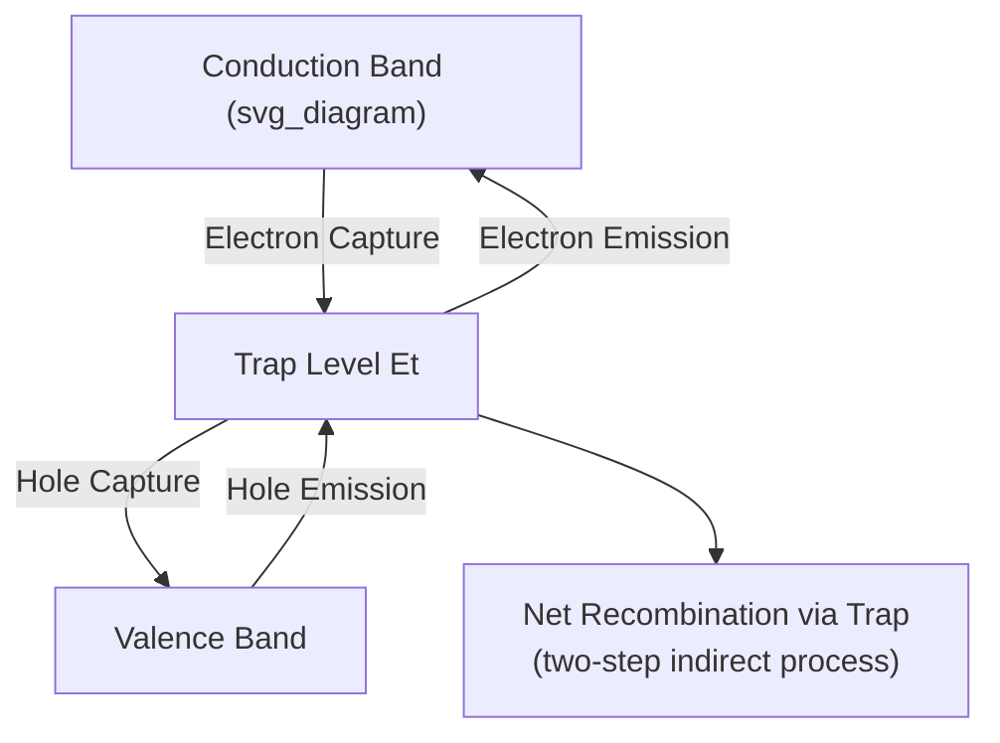

## Shockley Read Hall Recombination

### Overview

Shockley-Read-Hall (SRH) recombination describes carrier recombination mediated by localized trap states within the bandgap, typically arising from crystal defects, dislocations, or unintentional impurity atoms. Unlike direct band-to-band recombination (where an electron drops directly from the conduction band to the valence band), SRH recombination is a two-step indirect process via an intermediate trap energy level, and it is the dominant recombination mechanism in indirect-bandgap semiconductors like silicon under most practical operating conditions.

### The Two-Step Recombination Process

A trap state at energy $E_t$ within the bandgap facilitates recombination through two sequential steps:

1. **Electron capture:** A conduction band electron is captured by the empty trap, and the trap becomes occupied
2. **Hole capture:** A valence band hole is captured by the now-occupied trap (equivalently, the trapped electron falls into the valence band, annihilating a hole)

Each of these steps can also proceed in reverse (electron emission and hole emission), giving four possible transition rates in total, all mediated by the same trap level. The net recombination rate is determined by the balance of these four processes as a function of trap energy, trap density, and capture cross-sections.

### The SRH Recombination Rate Equation

The steady-state net recombination rate, derived by Shockley, Read, and Hall independently in the early 1950s, is:

$$U_{SRH} = \frac{\sigma_n\sigma_p v_{th}N_t(pn - n_i^2)}{\sigma_n\left[n + n_i\exp\left(\dfrac{E_t - E_i}{k_BT}\right)\right] + \sigma_p\left[p + n_i\exp\left(-\dfrac{E_t - E_i}{k_BT}\right)\right]}$$

This is commonly rewritten in a more compact form using minority carrier lifetimes:

$$U_{SRH} = \frac{pn - n_i^2}{\tau_p(n+n_1) + \tau_n(p+p_1)}$$

where:

- $\tau_n = 1/(\sigma_n v_{th}N_t)$, $\tau_p = 1/(\sigma_p v_{th}N_t)$ are the fundamental electron and hole capture lifetimes
- $\sigma_n$, $\sigma_p$ are the electron and hole capture cross-sections of the trap
- $v_{th}$ is the carrier thermal velocity
- $N_t$ is the trap density
- $n_1 = n_i\exp\left(\dfrac{E_t-E_i}{k_BT}\right)$, $p_1 = n_i\exp\left(-\dfrac{E_t-E_i}{k_BT}\right)$ are auxiliary concentrations representing the electron and hole densities that would exist if the Fermi level were pinned exactly at the trap energy $E_t$

**Sign and physical meaning:** When $pn > n_i^2$ (excess carriers present, e.g., under forward bias or illumination), $U_{SRH} > 0$, representing net recombination. When $pn < n_i^2$ (carrier depletion, e.g., in a reverse-biased depletion region), $U_{SRH} < 0$, representing net generation — this is precisely the mechanism responsible for generation current in reverse-biased diode depletion regions.

### The Critical Role of Trap Energy: Midgap Traps Dominate

The denominator of the SRH rate equation depends exponentially on $(E_t - E_i)$, the trap energy's offset from the intrinsic Fermi level (near midgap). This has a profound consequence: **traps located near the middle of the bandgap are far more effective recombination centers than traps near either band edge.**

This occurs because $n_1$ and $p_1$ are minimized when $E_t = E_i$ (midgap), which maximizes the recombination rate $U_{SRH}$ for a given trap density $N_t$. Traps near the band edges have either $n_1$ or $p_1$ very large, which suppresses the recombination rate — such shallow traps behave more like transient carrier "traps" that temporarily capture and re-emit carriers rather than efficient recombination centers.

This is precisely why semiconductor material engineering emphasizes **gettering** of deep-level midgap impurities (particularly transition metals like Au, Fe, Cu in silicon, which introduce midgap-like levels) — even trace concentrations of such deep-level defects can dominate the recombination lifetime.

### Low-Level Injection Simplification

Under low-level injection conditions (excess carrier concentration much smaller than the majority carrier concentration), the general SRH expression simplifies considerably. For a p-type semiconductor ($p_0 \gg n_0$, $p_0 \gg \Delta n$):

$$U_{SRH} \approx \frac{\Delta n}{\tau_n}$$

where $\tau_n$ is the minority carrier (electron) lifetime — recovering the simple linear recombination model used throughout basic diode and BJT analysis. This is the regime relevant to most conventional diode and transistor operation under normal bias conditions.

### High-Level Injection Behavior

Under high-level injection (excess carrier concentration comparable to or exceeding equilibrium majority concentration), $n \approx p \gg n_0, p_0$, and the SRH rate approaches:

$$U_{SRH} \approx \frac{\Delta n}{\tau_n + \tau_p}$$

The effective lifetime becomes the *sum* of electron and hole capture lifetimes rather than being dominated by the minority carrier lifetime alone — an important distinction for power devices and solar cells operating under high injection conditions, where the simple low-injection lifetime approximation no longer applies. [Inference: the precise injection level at which this transition occurs is doping- and trap-density-dependent, and intermediate injection regimes require the full SRH expression rather than either limiting approximation.]

### Temperature Dependence

SRH recombination rate depends on temperature through multiple channels:

- Thermal velocity $v_{th} \propto \sqrt{T}$
- Capture cross-sections $\sigma_n$, $\sigma_p$ may themselves be temperature-dependent (particularly for multiphonon-assisted capture at deep-level defects)
- The exponential terms $n_1$, $p_1$ are strongly temperature-dependent through $n_i(T)$ and the Boltzmann factor

[Inference: because capture cross-section temperature dependence varies significantly between different defect species, deep-level transient spectroscopy (DLTS) measurements are typically required to characterize a specific trap's temperature behavior rather than relying on a universal analytical form.]

### SVG Illustration: SRH Rate vs. Trap Energy Position

<svg xmlns="http://www.w3.org/2000/svg" viewBox="0 0 640 380" font-family="sans-serif">
<text x="320" y="24" text-anchor="middle" font-size="16" font-weight="bold">SRH Recombination Rate vs Trap Position (svg_diagram)</text>
<line x1="70" y1="320" x2="590" y2="320" stroke="black" stroke-width="2" />
<line x1="70" y1="320" x2="70" y2="60" stroke="black" stroke-width="2" />
<text x="330" y="355" text-anchor="middle" font-size="14">Trap Energy, Et (Ev to Ec)</text>
<text x="30" y="190" text-anchor="middle" font-size="14" transform="rotate(-90 30 190)">U_SRH (recombination rate)</text>

<path d="M 90 300 Q 200 300 250 150 Q 330 70 410 150 Q 460 300 570 300" stroke="#c0392b" stroke-width="3" fill="none" />
<line x1="330" y1="60" x2="330" y2="320" stroke="#999" stroke-dasharray="4,4" />
<text x="330" y="50" text-anchor="middle" font-size="12" fill="#555">Ei (midgap)</text>

<text x="90" y="335" font-size="11" text-anchor="middle">Ev</text>

<text x="570" y="335" font-size="11" text-anchor="middle">Ec</text>

<text x="330" y="90" text-anchor="middle" font-size="12" fill="`#c0392b`">Max recombination (midgap traps most effective)</text>

</svg>

### Practical Applications

**Depletion region generation current:** In a reverse-biased p-n junction, $pn \ll n_i^2$ within the depletion region, making $U_{SRH}$ negative (net generation). This generation current adds to the ideal reverse saturation current and is often the dominant leakage mechanism in real silicon diodes, particularly at elevated temperature.

**Non-ideality factor in diode I-V characteristics:** SRH recombination within the depletion region (rather than purely in the quasi-neutral regions, as assumed by the ideal Shockley diode model) contributes a component of diode current with ideality factor $n \approx 2$ rather than the ideal $n=1$, explaining commonly observed departures from ideal diode behavior at low forward bias.

**Solar cell efficiency limits:** SRH recombination at bulk defects and surface states is a primary non-radiative loss mechanism limiting solar cell efficiency, motivating extensive materials purification and surface passivation efforts in photovoltaic manufacturing.

**Gettering and defect engineering:** Semiconductor process design deliberately incorporates gettering steps (e.g., phosphorus diffusion gettering, backside damage gettering) to relocate midgap-level metallic impurities away from active device regions, directly leveraging the understanding that midgap traps dominate SRH recombination.

### Practical Example

A silicon sample has a midgap trap with $N_t = 10^{13}\ \text{cm}^{-3}$, $\sigma_n = \sigma_p = 10^{-15}\ \text{cm}^2$, and thermal velocity $v_{th} \approx 10^7\ \text{cm/s}$ at room temperature. The fundamental lifetime is:

$$\tau_n = \tau_p = \frac{1}{\sigma_n v_{th}N_t} = \frac{1}{(10^{-15})(10^7)(10^{13})} = \frac{1}{10^5} = 10\ \mu\text{s}$$

Under low-level injection in p-type material with excess carrier concentration $\Delta n = 10^{13}\ \text{cm}^{-3}$:

$$U_{SRH} \approx \frac{\Delta n}{\tau_n} = \frac{10^{13}}{10\times10^{-6}} = 10^{18}\ \text{cm}^{-3}\text{s}^{-1}$$

This recombination rate directly determines the minority carrier lifetime that would be measured experimentally (e.g., via photoconductance decay), and, combined with the diffusion coefficient, sets the diffusion length relevant to device design.

**Key Points**

- SRH recombination proceeds via an intermediate trap state, involving sequential electron and hole capture — the dominant recombination path in indirect-bandgap semiconductors like silicon.
- The recombination rate depends exponentially on trap energy offset from midgap; traps near $E_i$ are far more effective recombination centers than shallow traps.
- Low-level injection simplifies SRH to the familiar $U \approx \Delta n/\tau_n$ form; high-level injection gives $U \approx \Delta n/(\tau_n+\tau_p)$.
- Negative $U_{SRH}$ in depletion regions (where $pn < n_i^2$) represents net generation, contributing to diode reverse leakage and non-ideality.
- Gettering of deep-level (near-midgap) metallic impurities is a key process technique motivated directly by SRH theory.

**Related Topics**

- Continuity equations for carriers
- Minority carrier lifetime and diffusion length
- Radiative and Auger recombination mechanisms
- Diode ideality factor and non-ideal I-V behavior
- Deep-level transient spectroscopy (DLTS)
- Gettering techniques in silicon processing
- Surface recombination velocity
- Solar cell recombination losses and passivation strategies