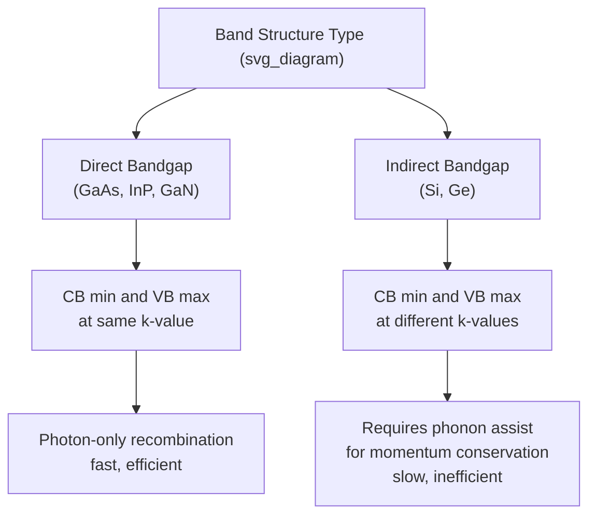

## Radiative Recombination

### Overview

Radiative recombination is the direct annihilation of an electron-hole pair with the simultaneous emission of a photon whose energy approximately equals the semiconductor's bandgap energy. Unlike Shockley-Read-Hall recombination, which proceeds via intermediate trap states, radiative recombination is a direct band-to-band process — an electron in the conduction band recombines directly with a hole in the valence band, releasing energy as light rather than heat or phonons. This mechanism is fundamental to all light-emitting semiconductor devices (LEDs, laser diodes) and is a key factor in solar cell and photodetector design.

### Direct vs. Indirect Bandgap Requirement

Radiative recombination efficiency depends critically on the semiconductor's band structure:

**Direct bandgap materials** (e.g., GaAs, InP, GaN): the conduction band minimum and valence band maximum occur at the same crystal momentum ($k$-value). An electron can recombine with a hole while conserving both energy and momentum through photon emission alone, since photons carry negligible momentum compared to the electron's crystal momentum. This makes radiative recombination fast and efficient.

**Indirect bandgap materials** (e.g., Si, Ge): the conduction band minimum and valence band maximum occur at different $k$-values. Direct recombination would violate momentum conservation unless a phonon simultaneously participates to absorb or supply the momentum difference. This three-particle process (electron, hole, phonon) is much less probable than the two-particle process in direct-gap materials, making radiative recombination in silicon inherently weak and inefficient. [This is the fundamental physical reason silicon is a poor light emitter and why compound semiconductors dominate optoelectronic applications.]

### The Radiative Recombination Rate Equation

The net radiative recombination rate is proportional to the product of electron and hole concentrations, offset by the equilibrium value:

$$U_{rad} = B(np - n_i^2)$$

where $B$ is the radiative recombination coefficient (units: $\text{cm}^3/\text{s}$), a material-specific parameter that is orders of magnitude larger in direct-bandgap materials than in indirect-bandgap materials. [Unverified: typical tabulated values are on the order of $B \sim 10^{-10}\ \text{cm}^3/\text{s}$ for GaAs and $B \sim 10^{-14}\ \text{cm}^3/\text{s}$ or lower for silicon, though exact values depend on measurement conditions and material quality and vary across literature sources.]

At thermal equilibrium, $np = n_i^2$ and $U_{rad} = 0$ (generation and recombination balance). Under excess carrier injection (forward bias or optical excitation), $np > n_i^2$ and net radiative recombination occurs, emitting photons.

### Radiative Lifetime

Under low-level injection in, for example, p-type material ($p \approx p_0$, $\Delta n \ll p_0$):

$$U_{rad} \approx Bp_0\Delta n = \frac{\Delta n}{\tau_{rad}}$$

$$\tau_{rad} = \frac{1}{Bp_0}$$

This shows the radiative lifetime is inversely proportional to the majority carrier concentration — heavily doped material has a shorter radiative lifetime (faster radiative recombination) than lightly doped material, all else being equal. This doping dependence is an important design consideration in LED and laser diode active region engineering.

### Competition with Non-Radiative Mechanisms

In any real semiconductor, radiative recombination competes with non-radiative pathways (primarily SRH recombination via defects, and Auger recombination at high carrier densities). The total recombination rate is the sum of all mechanisms:

$$U_{total} = U_{SRH} + U_{rad} + U_{Auger}$$

The **internal quantum efficiency** (IQE) of light emission is the fraction of recombination events that are radiative:

$$\eta_{IQE} = \frac{U_{rad}}{U_{total}} = \frac{1/\tau_{rad}}{1/\tau_{rad} + 1/\tau_{nonrad}}$$

This relation is central to LED and laser design: achieving high quantum efficiency requires minimizing non-radiative recombination (via high material purity, defect reduction, surface passivation) relative to the intrinsically fixed radiative rate set by the material's band structure and doping level.

### Spontaneous vs. Stimulated Emission

Radiative recombination as described above is **spontaneous emission** — each recombination event is an independent, random process producing a photon with random phase and direction, characteristic of LED operation.

Under sufficiently high carrier injection (population inversion, where the quasi-Fermi level separation exceeds the photon energy) and in the presence of an optical cavity providing feedback, **stimulated emission** can dominate: an incident photon triggers a coherent, phase-matched, directionally correlated photon emission from a recombining electron-hole pair. This is the operating principle of semiconductor laser diodes, requiring:

1. **Population inversion** — sufficient injected carrier density that stimulated emission exceeds absorption
2. **Optical confinement** — a waveguide structure (e.g., a double heterostructure or quantum well) to confine both carriers and photons in the active region
3. **Optical feedback** — mirrors (cleaved facets or distributed Bragg reflectors) forming a resonant cavity

[Inference: the detailed threshold current calculation for laser operation requires solving coupled rate equations for carrier density and photon density, which is beyond simple analytical treatment and depends on specific cavity and active region design.]

### SVG Illustration: Direct Radiative Recombination Process

<svg xmlns="http://www.w3.org/2000/svg" viewBox="0 0 640 380" font-family="sans-serif">
<text x="320" y="24" text-anchor="middle" font-size="16" font-weight="bold">Direct Radiative Recombination (svg_diagram)</text>
<line x1="100" y1="80" x2="540" y2="80" stroke="#2980b9" stroke-width="3" />
<text x="550" y="85" font-size="13" fill="#2980b9">Ec</text>
<line x1="100" y1="300" x2="540" y2="300" stroke="#c0392b" stroke-width="3" />
<text x="550" y="305" font-size="13" fill="#c0392b">Ev</text>

<circle cx="320" cy="80" r="8" fill="#333" />
<text x="335" y="70" font-size="12">electron</text>

<circle cx="320" cy="300" r="8" fill="none" stroke="#333" stroke-width="2" />
<text x="335" y="320" font-size="12">hole</text>

<line x1="320" y1="90" x2="320" y2="290" stroke="#f39c12" stroke-width="2" stroke-dasharray="6,4" marker-end="url(#arrowph)" />
<text x="340" y="200" font-size="13" fill="#f39c12">Photon hv ≈ Eg</text>
<text x="320" y="345" text-anchor="middle" font-size="12" fill="#555">Same k-value: momentum conserved by photon alone</text>

</svg>

### Photon Energy and Wavelength

The emitted photon energy approximately equals the bandgap energy (with small corrections for carrier thermal distribution, band tailing, and exciton binding in some materials):

$$h\nu \approx E_g$$

$$\lambda = \frac{hc}{E_g} = \frac{1240\ \text{nm·eV}}{E_g\ (\text{eV})}$$

This relation is the basis for engineering LED and laser emission wavelength via bandgap engineering — alloying compound semiconductors (e.g., $\text{Al}_x\text{Ga}_{1-x}\text{As}$, $\text{In}_x\text{Ga}_{1-x}\text{N}$) allows continuous tuning of $E_g$ and hence emission color across the visible and infrared spectrum.

### Practical Example

For a GaAs LED with $E_g \approx 1.42\ \text{eV}$:

$$\lambda = \frac{1240}{1.42} \approx 873\ \text{nm}$$

This falls in the near-infrared, consistent with GaAs's well-known use in infrared LEDs (e.g., remote control emitters) rather than visible-light applications, which instead require wider-bandgap materials such as GaN ($E_g \approx 3.4\ \text{eV}$, emitting near 365 nm, and alloyed with In to reach visible blue/green wavelengths) or AlGaInP (for red/amber/yellow visible LEDs).

Given a radiative coefficient $B \approx 2\times10^{-10}\ \text{cm}^3/\text{s}$ (typical order of magnitude for GaAs [Unverified]) and majority carrier concentration $p_0 = 10^{17}\ \text{cm}^{-3}$:

$$\tau_{rad} = \frac{1}{Bp_0} = \frac{1}{(2\times10^{-10})(10^{17})} = \frac{1}{2\times10^{7}} = 50\ \text{ns}$$

This nanosecond-scale radiative lifetime, orders of magnitude faster than typical silicon SRH lifetimes (microseconds), reflects why direct-bandgap materials so strongly outperform silicon for light-emission applications.

**Key Points**

- Radiative recombination is a direct band-to-band process emitting a photon of energy approximately equal to the bandgap.
- Direct-bandgap materials (GaAs, GaN, InP) support efficient two-particle radiative recombination; indirect-bandgap materials (Si, Ge) require inefficient phonon-assisted three-particle processes.
- $U_{rad} = B(np - n_i^2)$; radiative lifetime $\tau_{rad} = 1/(Bp_0)$ decreases with increasing doping.
- Internal quantum efficiency depends on the competition between radiative and non-radiative (SRH, Auger) recombination rates.
- Spontaneous emission underlies LEDs; stimulated emission with population inversion and optical feedback underlies laser diodes.

**Related Topics**

- Shockley-Read-Hall recombination
- Auger recombination
- Direct vs. indirect bandgap semiconductors
- LED design and internal/external quantum efficiency
- Semiconductor laser diode operation and threshold condition
- Bandgap engineering in III-V compound alloys
- Photoluminescence characterization techniques
- Population inversion and quasi-Fermi level splitting