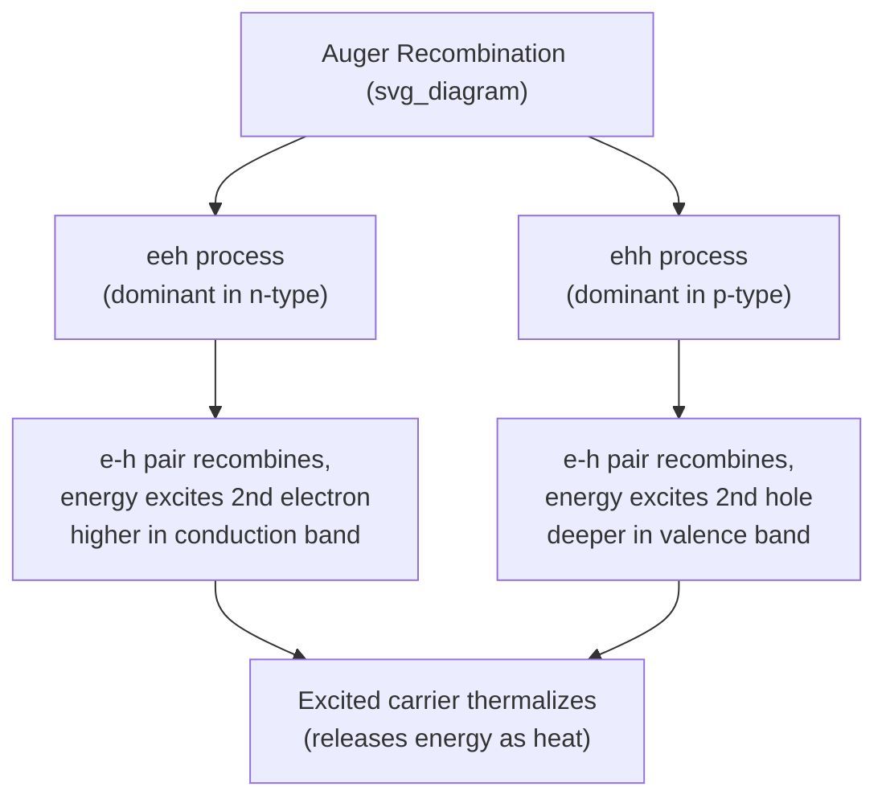
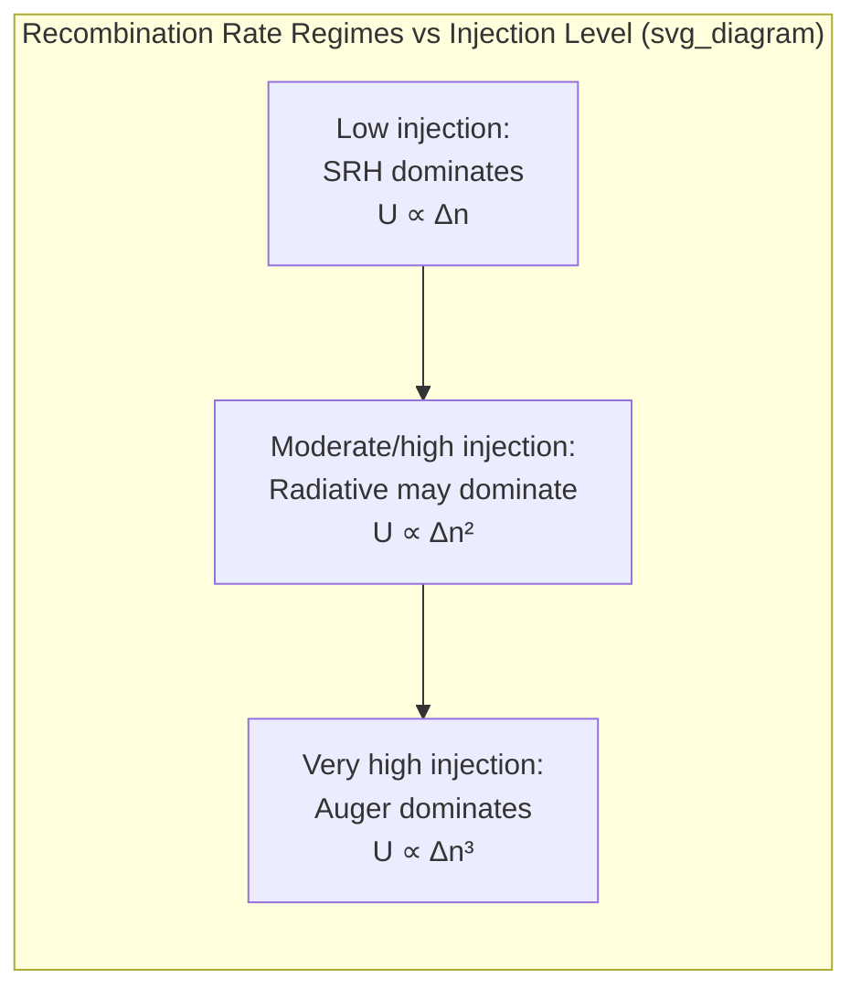

## Auger Recombination

### Overview

Auger recombination is a non-radiative recombination process in which an electron-hole pair recombines and transfers its released energy directly to a third carrier (either an electron or a hole), which is then excited to a higher energy state within its band, rather than emitting a photon or phonon. This third carrier subsequently relaxes back down through rapid thermalization, releasing the energy as heat. Because it is an intrinsically three-particle process, Auger recombination's rate scales with the square of carrier concentration, making it the dominant recombination mechanism at high carrier densities — a critical consideration in high-injection devices such as high-power LEDs, laser diodes, and heavily doped regions of power devices.

### The Three-Particle Process

Two distinct Auger processes are possible, depending on which carrier type absorbs the released energy:

**eeh process (two electrons, one hole):** An electron and hole recombine; the released energy excites a second electron higher into the conduction band. This process dominates in n-type material, where electrons are abundant.

**ehh process (one electron, two holes):** An electron and hole recombine; the released energy excites a second hole deeper into the valence band. This process dominates in p-type material, where holes are abundant.

### The Auger Recombination Rate Equation

The net Auger recombination rate is:

$$U_{Auger} = (C_nn + C_pp)(np - n_i^2)$$

where $C_n$ and $C_p$ are the Auger coefficients for the eeh and ehh processes respectively (units: $\text{cm}^6/\text{s}$). At thermal equilibrium, $np = n_i^2$ and $U_{Auger} = 0$, consistent with detailed balance.

**Key scaling behavior:** because the rate depends on the product of carrier concentration terms $(C_nn + C_pp)$ and the excess-carrier term $(np - n_i^2)$, under high-level injection where $n \approx p = \Delta n$ (with $\Delta n$ well above equilibrium levels):

$$U_{Auger} \approx (C_n + C_p)\Delta n^3$$

This **cubic dependence on excess carrier concentration** is the defining signature of Auger recombination, distinguishing it clearly from linear SRH recombination ($U \propto \Delta n$) and quadratic radiative recombination ($U \propto \Delta n^2$ under high injection). [Unverified: typical tabulated Auger coefficients are on the order of $C_n, C_p \sim 10^{-30}\ \text{cm}^6/\text{s}$ for silicon and somewhat higher for narrower-bandgap III-V materials, though exact values vary substantially across measurement methods and literature sources.]

### Auger Lifetime and High-Injection Dominance

Under low-level injection, Auger recombination contributes a lifetime:

$$\tau_{Auger} = \frac{1}{(C_nn_0 + C_pp_0)}$$

This lifetime decreases sharply (recombination rate increases sharply) with increasing majority carrier concentration — meaning Auger recombination becomes increasingly significant in heavily doped material even before high-level injection is reached.

Under high-level injection, comparing the three recombination mechanisms' dependence on excess carrier density $\Delta n$:

$$U_{SRH} \propto \Delta n, \qquad U_{rad} \propto \Delta n^2, \qquad U_{Auger} \propto \Delta n^3$$

This ordering explains why total recombination rate transitions through distinct regimes as injection level increases: at low injection, SRH (linear) typically dominates; at moderate-to-high injection, radiative (quadratic) can dominate in direct-gap materials; at very high injection or high doping, Auger (cubic) inevitably dominates because it grows fastest with carrier density. This is a general consequence of the differing power-law scaling, not a coincidence specific to any one material system.

### The "Efficiency Droop" Phenomenon in LEDs

A major practical consequence of Auger recombination is **efficiency droop** — the well-documented decline in internal quantum efficiency of high-brightness LEDs (particularly III-nitride blue/green LEDs) as drive current density increases. At low current density, radiative recombination efficiency rises with injection (since $U_{rad}/U_{total}$ improves as SRH's linear term becomes relatively less significant). But at sufficiently high current density, the cubic Auger term overtakes both SRH and radiative recombination, causing the fraction of recombination events that are radiative to decline — carriers increasingly recombine non-radiatively via Auger processes instead of emitting light.

[Inference: while Auger recombination is widely cited as a leading contributor to efficiency droop in III-nitride LEDs, the relative contribution of Auger recombination versus other proposed mechanisms (such as carrier leakage out of the active quantum well region) remains an area of ongoing research and is not settled by simple analytical treatment alone — device-specific experimental characterization is generally needed to apportion the causes definitively.]

### SVG Illustration: LED Efficiency Droop Curve

<svg xmlns="http://www.w3.org/2000/svg" viewBox="0 0 640 380" font-family="sans-serif">
<text x="320" y="24" text-anchor="middle" font-size="16" font-weight="bold">LED Internal Quantum Efficiency vs Current Density (svg_diagram)</text>
<line x1="70" y1="320" x2="590" y2="320" stroke="black" stroke-width="2" />
<line x1="70" y1="320" x2="70" y2="60" stroke="black" stroke-width="2" />
<text x="330" y="355" text-anchor="middle" font-size="14">Current Density, J</text>
<text x="30" y="190" text-anchor="middle" font-size="14" transform="rotate(-90 30 190)">Internal Quantum Efficiency, IQE</text>

<path d="M 90 300 Q 200 100 300 90 Q 420 100 570 250" stroke="#27ae60" stroke-width="3" fill="none" />

<text x="180" y="80" font-size="12" fill="`#27ae60`">SRH-limited rise (low J)</text>

<text x="440" y="230" font-size="12" fill="`#c0392b`">Auger-driven droop (high J, U ∝ Δn³)</text>

<line x1="300" y1="60" x2="300" y2="320" stroke="#999" stroke-dasharray="4,4" />
<text x="300" y="50" text-anchor="middle" font-size="12" fill="#555">Peak efficiency</text>
</svg>

### Auger Effects in Other Devices

**Solar cells:** Auger recombination sets a fundamental upper limit on achievable efficiency in heavily doped emitter regions and under high-concentration illumination, motivating careful doping profile optimization to balance series resistance against Auger loss.

**Bipolar transistors:** In heavily doped emitter regions (common in modern BJT designs to boost injection efficiency), Auger recombination can limit minority carrier lifetime, indirectly affecting current gain and high-injection behavior.

**Avalanche photodiodes and impact ionization (related but distinct process):** Auger recombination is the inverse process of impact ionization — while Auger recombination has one electron-hole pair recombine to excite a third carrier, impact ionization has an energetic carrier lose energy to create a new electron-hole pair. Both are three-particle Coulomb-interaction-mediated processes, but operate in opposite energy-transfer directions.

### Practical Example

For a silicon power device region with $C_n \approx 2.8\times10^{-31}\ \text{cm}^6/\text{s}$, $C_p \approx 0.99\times10^{-31}\ \text{cm}^6/\text{s}$ [Unverified: representative literature values for silicon, precise numbers vary by source], and heavily doped n-type material with $n_0 = 10^{19}\ \text{cm}^{-3}$:

$$\tau_{Auger} = \frac{1}{C_nn_0^2} = \frac{1}{(2.8\times10^{-31})(10^{19})^2} = \frac{1}{2.8\times10^{-31}\times10^{38}} = \frac{1}{2.8\times10^{7}} \approx 36\ \text{ns}$$

Comparing to a typical SRH lifetime of order 1–10 $\mu\text{s}$ in moderately doped silicon, this demonstrates how dramatically Auger recombination shortens carrier lifetime in heavily doped regions — a key reason why heavily doped emitter regions in BJTs and solar cells exhibit inherently short minority carrier lifetimes regardless of material purity or defect density.

**Key Points**

- Auger recombination is a three-particle process: an electron-hole pair recombines, transferring energy to a third carrier that thermalizes non-radiatively.
- Rate follows $U_{Auger} = (C_nn+C_pp)(np-n_i^2)$, scaling as $\Delta n^3$ under high-level injection — the fastest-growing term among the three recombination mechanisms.
- Auger recombination dominates at high carrier density (heavy doping or high injection), regardless of material's direct/indirect bandgap character.
- A leading proposed contributor to LED "efficiency droop" at high drive currents, particularly in III-nitride LEDs.
- Sets fundamental efficiency limits in solar cells and lifetime limits in heavily doped BJT emitter regions.

**Related Topics**

- Shockley-Read-Hall recombination
- Radiative recombination
- LED efficiency droop and quantum well active region design
- Impact ionization and avalanche breakdown
- High-level injection carrier dynamics
- Heavily doped emitter effects in BJTs
- Solar cell efficiency limits (Shockley-Queisser and beyond)
- Carrier lifetime measurement techniques (photoconductance decay, TRPL)