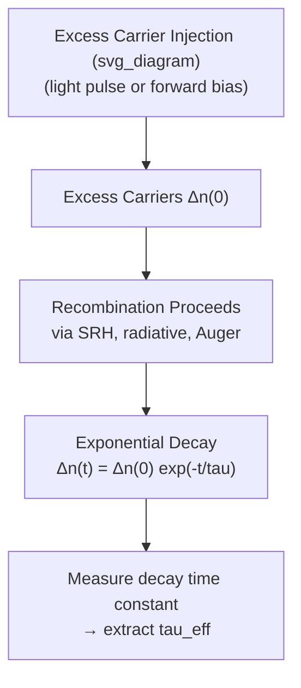

## Carrier Lifetime and Diffusion Length

### Overview

Carrier lifetime and diffusion length are two closely related parameters that quantify how long excess minority carriers survive before recombining and how far they travel during that time. Together, they are among the most practically important material and device parameters in semiconductor engineering, governing diode reverse current, BJT current gain, solar cell collection efficiency, and the design rules for numerous device geometries.

### Defining Carrier Lifetime

Minority carrier lifetime $\tau$ is defined as the average time an excess minority carrier survives before recombining. For a simple linear (SRH-dominated, low-injection) recombination model:

$$U = \frac{\Delta n}{\tau_n} \quad \text{(electrons in p-type)}, \qquad U = \frac{\Delta p}{\tau_p} \quad \text{(holes in n-type)}$$

This lifetime is an **effective** lifetime combining contributions from all active recombination mechanisms operating in parallel:

$$\frac{1}{\tau_{eff}} = \frac{1}{\tau_{SRH}} + \frac{1}{\tau_{rad}} + \frac{1}{\tau_{Auger}} + \frac{1}{\tau_{surface}}$$

This reciprocal-sum combination rule mirrors Matthiessen's rule for mobility — the fastest (shortest-lifetime) mechanism dominates the effective lifetime. In most practical silicon devices under normal operating conditions, SRH recombination via bulk defects typically dominates unless the material is extremely pure or heavily doped (where Auger becomes significant) or surface effects are significant (thin films, small devices).

### Transient Decay Interpretation

If excess carriers are injected instantaneously (e.g., by a light pulse) and then recombination proceeds with no further generation, the excess carrier population decays exponentially:

$$\Delta n(t) = \Delta n(0)\exp\left(-\frac{t}{\tau_n}\right)$$

This exponential decay is the basis of direct experimental lifetime measurement techniques, such as photoconductance decay (PCD) and time-resolved photoluminescence (TRPL), where the measured signal decay time constant directly yields $\tau_n$.

### Defining Diffusion Length

Diffusion length $L$ is the characteristic distance an excess minority carrier travels (via diffusion) during its lifetime before recombining. It emerges naturally from the steady-state solution of the minority carrier diffusion equation:

$$D_n\frac{d^2\Delta n}{dx^2} - \frac{\Delta n}{\tau_n} = 0 \quad \Rightarrow \quad \Delta n(x) = \Delta n(0)\exp\left(-\frac{x}{L_n}\right)$$

$$L_n = \sqrt{D_n\tau_n}, \qquad L_p = \sqrt{D_p\tau_p}$$

$L_n$ represents the distance over which the excess carrier concentration decays to $1/e$ ($\approx 37\%$) of its value at the injection point, in a field-free (quasi-neutral) region with no additional generation. It directly combines both transport (diffusion coefficient $D$) and recombination (lifetime $\tau$) physics into a single length scale.

### Relationship Between Lifetime, Diffusion Coefficient, and Diffusion Length

Since $D_n$ is related to mobility via the Einstein relation ($D_n = \mu_n k_BT/q$), the diffusion length can also be written as:

$$L_n = \sqrt{\mu_n\left(\frac{k_BT}{q}\right)\tau_n}$$

This shows diffusion length depends on three underlying material/device parameters: mobility (transport), temperature (via thermal voltage), and lifetime (recombination) — all of which can vary with doping level, temperature, and material quality, making $L_n$ itself a doping- and temperature-dependent quantity even though the formula appears simple.

### Typical Order-of-Magnitude Values

For silicon at room temperature, using $D_n \approx 35\ \text{cm}^2/\text{s}$ and lifetimes ranging from nanoseconds (heavily doped or defective material) to milliseconds (high-purity, well-passivated material):

| Lifetime $\tau_n$ | Diffusion Length $L_n = \sqrt{D_n\tau_n}$ |
| --- | --- |
| 1 ns | $\approx 0.6\ \mu\text{m}$ |
| 1 $\mu$s | $\approx 59\ \mu\text{m}$ |
| 1 ms | $\approx 1.9\ \text{mm}$ |

[Unverified: these figures use representative $D_n$ and illustrative lifetime values; actual diffusion length in a specific device depends on the material's true lifetime, which must be measured or otherwise characterized rather than assumed.]

This wide range illustrates why lifetime control (via material purity, defect engineering, and gettering) is such a critical semiconductor process parameter — it directly sets the length scale over which minority carriers remain "useful" for device operation.

### SVG Illustration: Diffusion Length as Decay Distance

<svg xmlns="http://www.w3.org/2000/svg" viewBox="0 0 640 380" font-family="sans-serif">
<text x="320" y="24" text-anchor="middle" font-size="16" font-weight="bold">Excess Carrier Decay and Diffusion Length (svg_diagram)</text>
<line x1="70" y1="320" x2="590" y2="320" stroke="black" stroke-width="2" />
<line x1="70" y1="320" x2="70" y2="60" stroke="black" stroke-width="2" />
<text x="330" y="355" text-anchor="middle" font-size="14">Position, x</text>
<text x="30" y="190" text-anchor="middle" font-size="14" transform="rotate(-90 30 190)">Excess Carrier Conc., Δn(x)</text>

<path d="M 90 90 Q 200 200 300 260 Q 400 295 570 315" stroke="#8e44ad" stroke-width="3" fill="none" />

<text x="95" y="80" font-size="12" fill="`#8e44ad`">Δn(0)</text>

<line x1="250" y1="60" x2="250" y2="320" stroke="#999" stroke-dasharray="4,4" />
<text x="250" y="50" text-anchor="middle" font-size="12" fill="#555">x = Ln</text>
<line x1="70" y1="220" x2="250" y2="220" stroke="#999" stroke-dasharray="4,4" />
<text x="30" y="225" font-size="11" fill="#555">Δn(0)/e</text>
</svg>

### Measurement Techniques

**Photoconductance decay (PCD):** A light pulse generates excess carriers; the resulting change in sample conductivity is monitored over time (typically via microwave or RF reflectance), and the decay of conductivity directly yields the effective minority carrier lifetime.

**Time-resolved photoluminescence (TRPL):** In direct-bandgap materials, a pulsed laser generates excess carriers; the decay of the resulting photoluminescence intensity directly tracks the radiative recombination decay, providing lifetime information (though extraction of purely radiative lifetime versus total effective lifetime requires care when non-radiative channels are also active).

**Surface photovoltage (SPV):** Used to extract diffusion length directly by measuring the wavelength-dependent photovoltage response, since longer-wavelength (weakly absorbed) light probes carrier generation deeper in the material, and the resulting photovoltage decay with generation depth relates directly to $L_n$ or $L_p$.

**Electron-beam induced current (EBIC):** In a scanning electron microscope, a focused electron beam generates carriers at a controlled position near a p-n junction; the resulting collected current as a function of beam position directly maps the diffusion length via the spatial decay of collection efficiency.

### Practical Significance in Device Design

**p-n junction diode reverse saturation current:** The Shockley diode equation's saturation current $I_0$ depends directly on the diffusion lengths of minority carriers on each side of the junction:

$$I_0 = qA\left(\frac{D_p p_{n0}}{L_p} + \frac{D_n n_{p0}}{L_n}\right)$$

Longer diffusion lengths (longer lifetimes) increase $I_0$ — somewhat counterintuitively, *higher-quality* material with longer lifetime produces *more* reverse leakage current in this simple long-base diode model, because it enables minority carriers to diffuse further and contribute more to the collected current at the junction edge. [This effect is specific to the long-base diode approximation; short-base diodes, where the quasi-neutral region is much shorter than $L$, behave differently since virtually all minority carriers reach the junction regardless of the exact lifetime value.]

**Solar cells:** Diffusion length must exceed the relevant absorption depth of incident light for efficient photocarrier collection — this drives the emphasis on high-lifetime (highly pure, well-passivated) material in high-efficiency solar cell design.

**BJT base transport factor:** The base transport factor, which measures what fraction of injected minority carriers successfully cross the base without recombining, depends directly on the ratio of base width to minority carrier diffusion length in the base — a base width much smaller than $L$ ensures high transport factor and hence high current gain.

### Practical Example

A solar cell's p-type base region has minority electron lifetime $\tau_n = 10\ \mu\text{s}$ and $D_n \approx 30\ \text{cm}^2/\text{s}$:

$$L_n = \sqrt{D_n\tau_n} = \sqrt{30 \times 10\times10^{-6}} = \sqrt{3\times10^{-4}}\ \text{cm} \approx 0.0173\ \text{cm} = 173\ \mu\text{m}$$

If the base region thickness is $150\ \mu\text{m}$ (thinner than $L_n$), most photogenerated minority carriers can successfully diffuse to the junction and be collected before recombining, supporting good quantum efficiency for that portion of the device. If instead $\tau_n$ degraded to $0.1\ \mu\text{s}$ (e.g., due to introduced defects), $L_n$ would fall to about $17\ \mu\text{m}$, far shorter than the base thickness, and collection efficiency would be severely compromised — illustrating directly why lifetime control is central to solar cell performance.

**Key Points**

- Effective minority carrier lifetime combines all active recombination mechanisms via a reciprocal sum, with the fastest mechanism dominating.
- Diffusion length $L = \sqrt{D\tau}$ combines transport (via $D$) and recombination (via $\tau$) into a single characteristic length scale.
- Silicon lifetimes span nanoseconds to milliseconds depending on purity and doping, yielding diffusion lengths from sub-micron to millimeter scale.
- Multiple experimental techniques (PCD, TRPL, SPV, EBIC) extract lifetime or diffusion length directly from measurable transient or spatial responses.
- Diffusion length governs diode reverse current, BJT current gain via base transport factor, and solar cell collection efficiency.

**Related Topics**

- Continuity equations for carriers
- Shockley-Read-Hall recombination
- Radiative and Auger recombination
- Shockley diode equation and reverse saturation current
- BJT base transport factor and current gain
- Solar cell quantum efficiency and collection probability
- Surface recombination velocity
- Semiconductor lifetime characterization techniques (PCD, TRPL, EBIC)