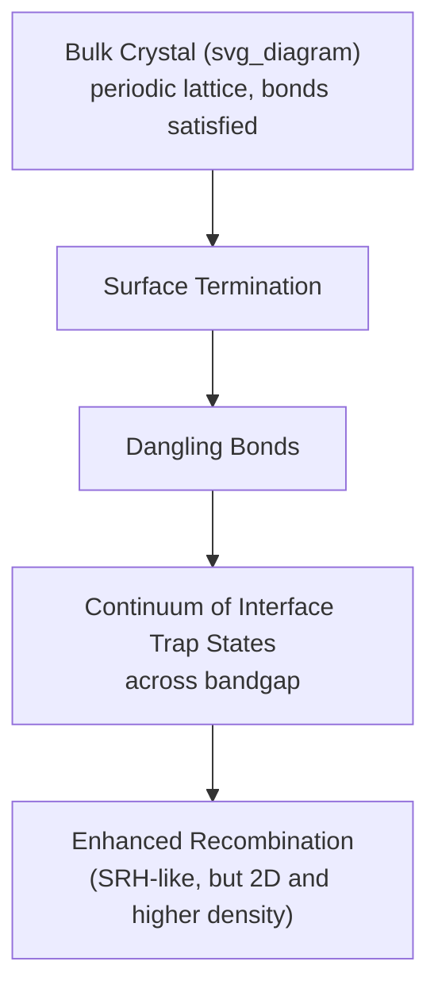

## Surface Recombination and Passivation

### Overview

A crystal surface represents an abrupt termination of the periodic lattice structure, leaving behind unsatisfied (dangling) chemical bonds. These dangling bonds introduce a high density of localized electronic states within the bandgap, concentrated at the surface rather than distributed through the bulk. Because these surface states act as highly effective SRH-like recombination centers, semiconductor surfaces are typically regions of dramatically enhanced recombination compared to the bulk — a phenomenon with major consequences for solar cells, small-geometry devices, and any structure with a high surface-to-volume ratio.

### Physical Origin: Dangling Bonds and Interface States

At an ideal, infinite semiconductor crystal, every atom's bonding requirements are satisfied by neighboring atoms. At a surface, atoms have fewer neighbors, leaving unpaired (dangling) bonds. These unsatisfied bonds create localized electronic states with energy levels often spread continuously across the bandgap (rather than existing at a single discrete energy like an idealized bulk trap), because the diversity of local bonding environments at a real, non-uniform surface produces a broad distribution of trap energies.

This is functionally analogous to bulk SRH recombination, but concentrated in a two-dimensional plane (the surface) rather than distributed through the three-dimensional bulk, and generally has a much higher areal density of trap states than would be found by projecting the bulk trap density onto that same area.

### Surface Recombination Velocity

Because surface recombination occurs at a boundary rather than throughout a volume, it is characterized differently from bulk recombination. Instead of a volumetric rate (carriers per unit volume per unit time), surface recombination is described by a **surface recombination velocity** $S$ (units: cm/s), defined through the boundary condition on minority carrier flux at the surface:

$$D_n\frac{d\Delta n}{dx}\bigg|_{surface} = S \cdot \Delta n(surface)$$

This states that the diffusive flux of minority carriers arriving at the surface equals the local recombination rate there, with $S$ acting as an effective "recombination rate constant" for the surface. Physically, $S$ can be understood as the effective velocity at which minority carriers are "absorbed" by the surface — a high $S$ means the surface is a very efficient recombination sink (heavily damaged or unpassivated surface), while $S \to 0$ represents an ideal, recombination-free surface.

The surface recombination velocity itself depends on the density of interface trap states $D_{it}$ (per unit area per unit energy), capture cross-sections, and the surface potential (band bending), analogous to how bulk SRH lifetime depends on trap density and capture cross-section:

$$S \approx \sigma v_{th} N_{it}$$

where $N_{it}$ is the areal interface trap density.

### Impact on Effective Lifetime

For a finite-thickness sample or device region with both bulk and surface recombination active simultaneously, the measured **effective lifetime** combines both contributions. For a simple one-dimensional approximation (uniform generation, thin sample, low surface recombination velocity limit):

$$\frac{1}{\tau_{eff}} = \frac{1}{\tau_{bulk}} + \frac{2S}{W}$$

where $W$ is the sample or device layer thickness, and the factor of 2 accounts for two surfaces (front and back) each with recombination velocity $S$ (assuming both surfaces have equal $S$; in general, front and back surface velocities can differ and are treated separately).

This relation reveals the critical dependence on device geometry: **thinner samples/devices are increasingly dominated by surface recombination** relative to bulk recombination, since the $2S/W$ term grows as thickness $W$ shrinks. This is precisely why surface passivation becomes progressively more critical as device dimensions scale down (thin-film solar cells, nanoscale MOSFETs, quantum well/wire/dot structures).

### SVG Illustration: Effective Lifetime vs. Sample Thickness

<svg xmlns="http://www.w3.org/2000/svg" viewBox="0 0 640 380" font-family="sans-serif">
<text x="320" y="24" text-anchor="middle" font-size="16" font-weight="bold">Effective Lifetime vs Thickness (svg_diagram)</text>
<line x1="70" y1="320" x2="590" y2="320" stroke="black" stroke-width="2" />
<line x1="70" y1="320" x2="70" y2="60" stroke="black" stroke-width="2" />
<text x="330" y="355" text-anchor="middle" font-size="14">Sample Thickness, W</text>
<text x="30" y="190" text-anchor="middle" font-size="14" transform="rotate(-90 30 190)">Effective Lifetime, tau_eff</text>

<path d="M 90 300 Q 200 150 350 100 Q 470 85 570 82" stroke="#2980b9" stroke-width="3" fill="none" />
<line x1="70" y1="80" x2="590" y2="80" stroke="#999" stroke-dasharray="4,4" />
<text x="500" y="70" font-size="12" fill="#555">tau_bulk (limit as W → ∞)</text>

<text x="120" y="290" font-size="12" fill="`#c0392b`">Surface-limited (thin samples)</text>

</svg>

### Surface Passivation Strategies

Surface passivation reduces effective recombination velocity $S$ through two complementary mechanisms:

**Chemical passivation:** Directly reduces the density of interface trap states $N_{it}$ by chemically satisfying dangling bonds. Examples include:

- Thermal oxidation of silicon (forming SiO2), where hydrogen annealing further reduces remaining trap density by bonding to residual dangling bonds
- Atomic layer deposition (ALD) of Al2O3 for silicon solar cell passivation
- Amorphous silicon (a-Si:H) passivating layers (used in heterojunction solar cell technology)

**Field-effect passivation:** Reduces the concentration of the minority carrier species at the surface (rather than reducing trap density directly), thereby reducing recombination rate even if trap density remains. Achieved by:

- Fixed charge within a passivating dielectric layer (e.g., negative fixed charge in Al2O3 repels electrons from a p-type silicon surface, reducing electron availability for recombination with surface-trapped holes)
- Heavily doped surface regions (e.g., a $p^+$ back-surface field in solar cells) that repel minority carriers away from the surface via the resulting built-in field

Both approaches are often combined in modern high-efficiency device fabrication (e.g., PERC and heterojunction solar cell architectures use both chemical passivation via a dielectric stack and field-effect passivation via fixed charge or doping gradients).

### Practical Applications

**Solar cells:** Surface recombination at the front (illuminated) and rear surfaces is a major loss mechanism, particularly since front-surface recombination competes directly with photocarrier collection near the point of generation (shallow absorption depth for high-energy photons). Passivated Emitter and Rear Cell (PERC) and heterojunction technologies specifically target reduction of rear and front surface recombination respectively, and are widely used in commercial photovoltaic manufacturing. [Unverified: exact efficiency gains attributable to specific passivation schemes vary by manufacturer and process generation.]

**MOSFETs:** The Si/SiO2 interface quality directly determines interface trap density $D_{it}$, which affects threshold voltage stability, subthreshold slope, and 1/f noise. High-quality thermal oxidation (combined with hydrogen annealing) is essential for achieving low $D_{it}$ in modern CMOS processes.

**III-V and compound semiconductor devices:** Surface states in III-V materials are often more problematic than in silicon (native oxides tend to be of lower quality and higher defect density than SiO2), motivating specialized passivation approaches (e.g., sulfur passivation, or epitaxial wide-bandgap capping layers such as AlGaAs on GaAs) to suppress surface recombination in devices like GaAs solar cells and laser diodes.

**Nanostructures (nanowires, quantum dots):** Extremely high surface-to-volume ratio makes these structures acutely sensitive to surface recombination, often requiring core-shell passivation architectures (e.g., a wider-bandgap shell material grown around a narrower-bandgap core) to achieve usable minority carrier lifetimes.

### Practical Example

A silicon wafer of thickness $W = 200\ \mu\text{m} = 0.02\ \text{cm}$ has bulk lifetime $\tau_{bulk} = 100\ \mu\text{s}$ and equal front/back surface recombination velocity $S = 100\ \text{cm/s}$ (representative of a well-passivated surface):

$$\frac{1}{\tau_{eff}} = \frac{1}{\tau_{bulk}} + \frac{2S}{W} = \frac{1}{100\times10^{-6}} + \frac{2\times100}{0.02}$$

$$= 10^4 + 10^4 = 2\times10^4\ \text{s}^{-1}$$

$$\tau_{eff} = \frac{1}{2\times10^4} = 50\ \mu\text{s}$$

Here surface and bulk recombination contribute equally, meaning even a well-passivated surface ($S = 100\ \text{cm/s}$, quite low by unpassivated standards) still limits the effective lifetime to half of what bulk alone would allow. If instead $S$ were unpassivated at $S = 10^4\ \text{cm/s}$, the surface term would dominate overwhelmingly ($2S/W = 10^6\ \text{s}^{-1}$), reducing $\tau_{eff}$ to roughly $1\ \mu\text{s}$ — a 100-fold degradation from bulk lifetime alone, illustrating why passivation quality can be the limiting factor in overall device performance regardless of bulk material purity.

**Key Points**

- Surface dangling bonds create a high density of interface trap states, causing dramatically enhanced recombination at semiconductor surfaces.
- Surface recombination velocity $S$ (cm/s) characterizes recombination as a boundary condition on minority carrier flux, analogous to a bulk SRH rate constant.
- Effective lifetime combines bulk and surface contributions as $1/\tau_{eff} = 1/\tau_{bulk} + 2S/W$ — thinner devices are increasingly surface-limited.
- Passivation reduces $S$ via chemical (dangling bond termination) and field-effect (minority carrier repulsion) mechanisms, often combined in practice.
- Surface passivation is critical in solar cells, MOSFET gate oxide interfaces, III-V optoelectronic devices, and high-surface-area nanostructures.

**Related Topics**

- Shockley-Read-Hall recombination
- Carrier lifetime and diffusion length
- MOS interface trap density and threshold voltage stability
- Solar cell PERC and heterojunction passivation architectures
- III-V surface passivation techniques
- Core-shell nanostructure passivation
- Photoconductance decay lifetime measurement
- Gettering and bulk defect engineering