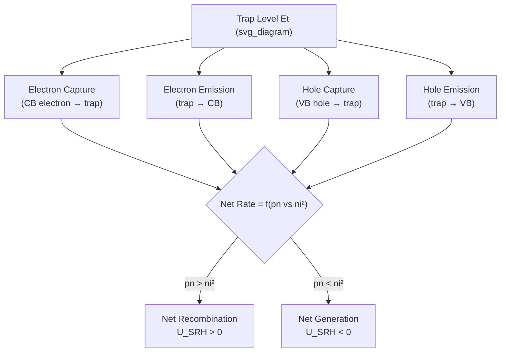
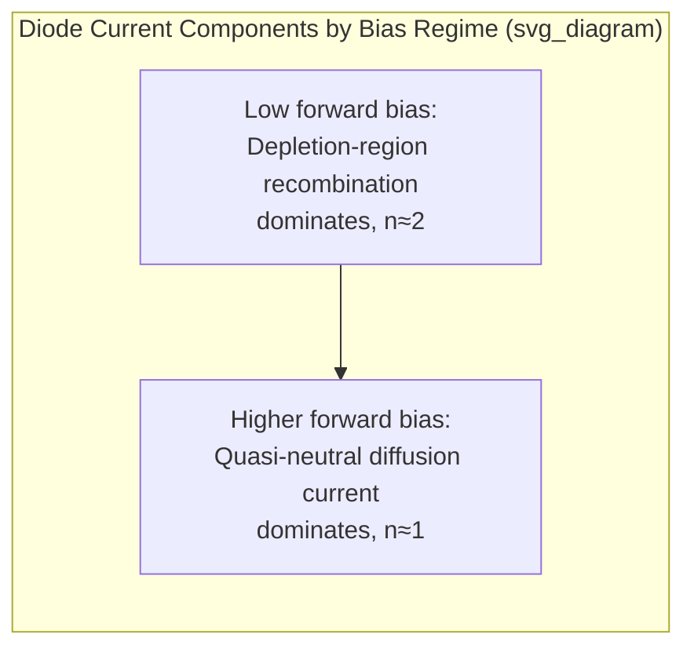

## Trap Assisted Generation and Recombination

### Overview

Trap-assisted processes describe how localized energy states within the semiconductor bandgap — arising from crystal defects, dislocations, or impurity atoms — mediate both carrier recombination and carrier generation. While Shockley-Read-Hall (SRH) theory is most commonly introduced in the context of recombination (net carrier loss under excess-carrier conditions), the same underlying trap physics governs net carrier generation when carrier concentrations fall below their equilibrium product. This dual generation/recombination character of traps is essential to understanding reverse-bias diode leakage, depletion region behavior, and non-ideal diode characteristics.

### Unified Trap Kinetics: Four Transition Rates

A single trap at energy $E_t$ can participate in four distinct transition processes, each occurring at its own characteristic rate:

1. **Electron capture** — a conduction band electron is captured by an empty trap
2. **Electron emission** — a trapped electron is thermally re-emitted to the conduction band
3. **Hole capture** — a valence band hole is captured by an occupied trap (equivalent to the trapped electron falling into the valence band)
4. **Hole emission** — a trapped hole is thermally re-emitted to the valence band (equivalent to a valence electron being captured by an empty trap)

The **net** recombination or generation rate through the trap is the balance of these four rates, and its sign depends entirely on whether the product $pn$ exceeds or falls below the equilibrium value $n_i^2$:

$$U_{SRH} = \frac{pn - n_i^2}{\tau_p(n+n_1) + \tau_n(p+p_1)}$$

### Recombination Regime: pn > ni²

When carrier concentrations exceed their equilibrium product — as occurs under forward bias injection, optical excitation, or in any region with excess carriers — the trap preferentially captures both an electron and a hole in sequence more often than it emits them, producing net recombination ($U_{SRH} > 0$). This is the regime covered extensively in standard SRH recombination treatment: traps annihilate excess carrier pairs, converting their energy to heat via multi-phonon emission during the capture events, returning the system toward equilibrium.

### Generation Regime: pn < ni²

When carrier concentrations fall below their equilibrium product — most notably within the depletion region of a reverse-biased p-n junction, where both electron and hole concentrations are strongly suppressed by the built-in/applied field — traps preferentially emit carriers more often than they capture them, producing net generation ($U_{SRH} < 0$, or equivalently, a positive generation rate $G = -U_{SRH}$). This is the physical origin of **generation current** in reverse-biased junctions.

In the depletion region, where $n, p \ll n_i$, the generation rate simplifies (assuming a midgap trap and $\tau_n \approx \tau_p \approx \tau_0$) to approximately:

$$G \approx \frac{n_i}{2\tau_0}$$

This generation rate is maximized for midgap traps (same physical reason midgap traps maximize recombination — the exponential trap-energy dependence in the SRH denominator is minimized at $E_t = E_i$), meaning the same trap species responsible for the shortest recombination lifetimes in the bulk quasi-neutral regions also produces the largest generation currents in depletion regions.

### Depletion Region Generation Current

Integrating the generation rate across the depletion region width $W_d$ gives the total generation current density:

$$J_{gen} = qGW_d \approx \frac{qn_iW_d}{2\tau_0}$$

This generation current adds to (and in many practical silicon diodes, dominates over) the ideal diffusion-based reverse saturation current predicted by the Shockley diode equation, particularly:

- At low temperature, where $n_i$ diffusion-based currents fall exponentially fast (via $n_i^2$ dependence) but the generation current (linear in $n_i$) falls off more slowly, making generation current relatively more significant
- In wider-bandgap semiconductors, where $n_i$ is intrinsically much smaller, making both diffusion and generation currents extremely small, but generation current's weaker ($n_i$ vs. $n_i^2$) dependence means it can still dominate the (even smaller) diffusion contribution
- In material with significant defect density (poor gettering, contamination, or radiation damage introducing new mid-gap trap states)

### Diode Ideality Factor Connection

The total reverse-bias diode current is the sum of the ideal diffusion current (ideality factor $n=1$) and the depletion-region generation current (ideality factor $n=2$ under forward bias, where the analogous trap-assisted recombination occurs within the depletion region rather than the quasi-neutral regions). The measured diode ideality factor in a real device is therefore a composite value reflecting the relative contributions of these two current pathways:

$$I = I_{01}\left[\exp\left(\frac{qV}{k_BT}\right)-1\right] + I_{02}\left[\exp\left(\frac{qV}{2k_BT}\right)-1\right]$$

At low forward bias, the $n=2$ (depletion-region recombination) term often dominates because it depends on $n_i$ (rather than $n_i^2$) and thus falls off less steeply with reduced excess-carrier concentration; at higher forward bias, the ideal $n=1$ diffusion term typically takes over. This bias-dependent crossover is a commonly observed feature of real silicon diode I-V curves and is directly attributable to trap-assisted depletion-region recombination/generation.

### SVG Illustration: Generation vs. Recombination via the Same Trap

<svg xmlns="http://www.w3.org/2000/svg" viewBox="0 0 640 400" font-family="sans-serif">
<text x="320" y="24" text-anchor="middle" font-size="16" font-weight="bold">Trap-Assisted Recombination vs Generation (svg_diagram)</text>

<rect x="60" y="60" width="230" height="280" fill="#eafaf1" stroke="#27ae60" stroke-width="2" />
<text x="175" y="85" text-anchor="middle" font-size="13" fill="#27ae60">Quasi-neutral region</text>
<text x="175" y="105" text-anchor="middle" font-size="11" fill="#27ae60">pn &gt; ni²</text>
<text x="175" y="200" text-anchor="middle" font-size="12">Excess carriers captured</text>
<text x="175" y="220" text-anchor="middle" font-size="12">Net Recombination</text>
<text x="175" y="240" text-anchor="middle" font-size="12" fill="#27ae60">U_SRH &gt; 0</text>

<rect x="350" y="60" width="230" height="280" fill="#fdedec" stroke="#c0392b" stroke-width="2" />
<text x="465" y="85" text-anchor="middle" font-size="13" fill="#c0392b">Depletion region (reverse bias)</text>
<text x="465" y="105" text-anchor="middle" font-size="11" fill="#c0392b">pn &lt; ni²</text>
<text x="465" y="200" text-anchor="middle" font-size="12">Carriers emitted from traps</text>
<text x="465" y="220" text-anchor="middle" font-size="12">Net Generation</text>
<text x="465" y="240" text-anchor="middle" font-size="12" fill="#c0392b">U_SRH &lt; 0</text>
</svg>

### Practical Relevance

**Reverse leakage current in silicon diodes:** Real silicon p-n junction diodes typically show reverse currents far exceeding the ideal Shockley diffusion prediction, with the excess attributed to depletion-region generation current — a direct consequence of trap-assisted generation.

**Temperature dependence of leakage:** Because generation current scales with $n_i$ (roughly $\exp(-E_g/2k_BT)$) rather than $n_i^2$ (roughly $\exp(-E_g/k_BT)$) as in ideal diffusion current, generation-dominated leakage has a weaker temperature dependence than diffusion-dominated leakage — a useful diagnostic when analyzing measured leakage current vs. temperature data to identify the dominant leakage mechanism in a given device.

**CCD and image sensor dark current:** Trap-assisted generation in depletion regions of photodiodes (as used in CCD and CMOS image sensors) is a principal source of "dark current" — signal accumulated even without illumination — motivating stringent defect control requirements in image sensor fabrication.

**Radiation damage effects:** High-energy particle or photon irradiation introduces new point defects and displacement damage, creating additional midgap-like trap states. This directly increases both bulk recombination (reducing carrier lifetime) and depletion-region generation current (increasing leakage) — a well-documented degradation mechanism in devices operating in radiation environments (satellites, particle detectors, nuclear instrumentation).

### Practical Example

A silicon photodiode has a depletion region width $W_d = 2\ \mu\text{m}$ under reverse bias, with $\tau_0 = 1\ \mu\text{s}$ (representative fundamental trap lifetime) and $n_i \approx 1.5\times10^{10}\ \text{cm}^{-3}$ at room temperature:

$$G \approx \frac{n_i}{2\tau_0} = \frac{1.5\times10^{10}}{2\times10^{-6}} = 7.5\times10^{15}\ \text{cm}^{-3}\text{s}^{-1}$$

$$J_{gen} = qGW_d = (1.6\times10^{-19})(7.5\times10^{15})(2\times10^{-4}) \approx 2.4\times10^{-7}\ \text{A/cm}^2$$

This generation current density, while small in absolute terms, is typically much larger than the ideal diffusion-based reverse saturation current density in a comparable well-designed silicon diode (often several orders of magnitude smaller in an ideal case), confirming that depletion-region generation, not ideal diffusion, usually sets the practical reverse leakage floor in real silicon devices.

**Key Points**

- The same trap level mediates both recombination (when $pn > n_i^2$) and generation (when $pn < n_i^2$) through four underlying capture/emission transitions.
- Depletion-region trap-assisted generation is the dominant source of reverse-bias leakage current in most real silicon diodes, exceeding the ideal diffusion-based prediction.
- Generation current scales linearly with $n_i$, giving it weaker temperature dependence than diffusion current's $n_i^2$ scaling — a useful diagnostic signature.
- The diode ideality factor transitions from $n\approx2$ (depletion-region recombination-dominated) at low forward bias to $n\approx1$ (diffusion-dominated) at higher forward bias.
- Trap-assisted generation is the principal source of dark current in image sensors and is worsened by radiation-induced defect creation.

**Related Topics**

- Shockley-Read-Hall recombination
- Carrier lifetime and diffusion length
- Diode ideality factor and non-ideal I-V characteristics
- p-n junction depletion region and built-in potential
- Image sensor dark current mechanisms
- Radiation damage and displacement defects in semiconductors
- Gettering and defect engineering
- Continuity equations for carriers