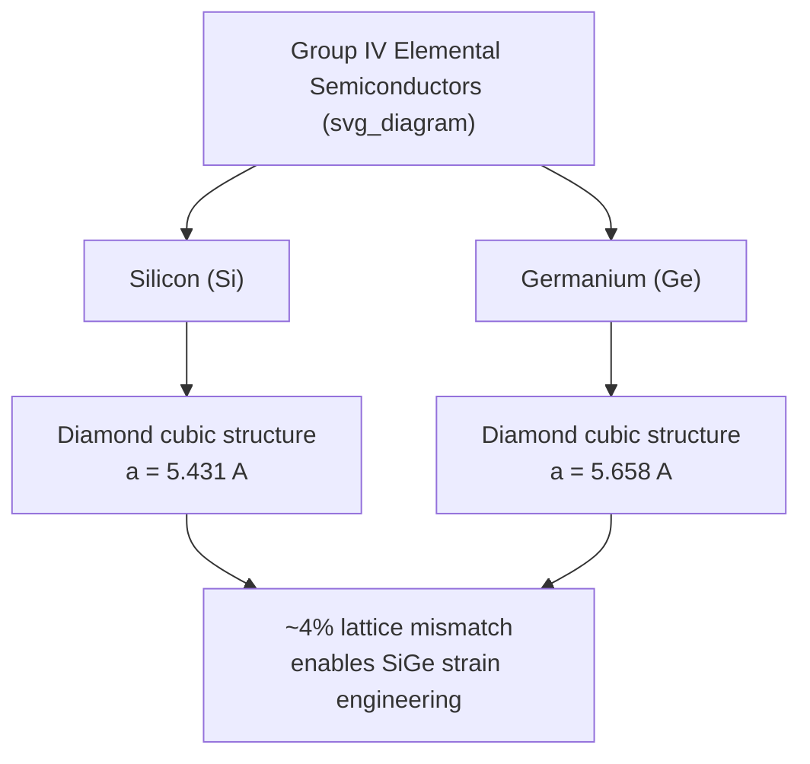

## Silicon and Germanium Properties

### Overview

Silicon and germanium are the two foundational elemental (Group IV) semiconductors, sharing the same diamond cubic crystal structure and indirect bandgap character while differing significantly in bandgap energy, carrier mobility, thermal properties, and native oxide behavior. Silicon's superior native oxide quality made it the dominant material for the modern semiconductor industry, while germanium — historically the first semiconductor material to enable practical transistors — has seen renewed interest in strained-layer and SiGe heterostructure applications where its higher mobility is advantageous.

### Crystal Structure

Both silicon and germanium crystallize in the **diamond cubic structure**: each atom is tetrahedrally bonded to four nearest neighbors via covalent bonds, with the lattice describable as two interpenetrating face-centered cubic (FCC) sublattices offset by one-quarter of the body diagonal.

**Lattice constants:**

- Silicon: $a \approx 5.431\ \text{Å}$
- Germanium: $a \approx 5.658\ \text{Å}$

The larger germanium lattice constant (about 4% larger than silicon) is directly relevant to strain engineering in SiGe heterostructures, where the lattice mismatch between Si and Ge (or SiGe alloys) is deliberately exploited to introduce controlled strain in epitaxial layers, modifying band structure and carrier mobility.

### Bandgap and Band Structure

Both materials are **indirect bandgap** semiconductors — the conduction band minimum and valence band maximum occur at different points in momentum space, requiring phonon participation for band-to-band optical transitions.

**Bandgap energies at 300 K:**

- Silicon: $E_g \approx 1.12\ \text{eV}$ (conduction band minima along $\Delta$ direction, near the X point)
- Germanium: $E_g \approx 0.66\ \text{eV}$ (conduction band minima at the L point)

Germanium's substantially smaller bandgap has direct practical consequences: higher intrinsic carrier concentration $n_i$ at a given temperature, greater sensitivity to thermal carrier generation (limiting maximum operating temperature for Ge devices), but also a natural match to certain infrared detection wavelength ranges.

**Intrinsic carrier concentration at 300 K:**

- Silicon: $n_i \approx 1.5\times10^{10}\ \text{cm}^{-3}$
- Germanium: $n_i \approx 2.4\times10^{13}\ \text{cm}^{-3}$

Germanium's intrinsic carrier concentration is roughly three orders of magnitude higher than silicon's at room temperature — a direct consequence of its smaller bandgap through the exponential $n_i \propto \exp(-E_g/2k_BT)$ dependence. This is a primary reason germanium devices historically suffered from excessive leakage current and thermal instability at room temperature and above, contributing to silicon's displacement of germanium as the dominant semiconductor material starting in the 1960s.

### Effective Masses and Mobility

| Property | Silicon | Germanium |
| --- | --- | --- |
| Electron mobility $\mu_n$ (cm²/V·s) | ~1350 | ~3900 |
| Hole mobility $\mu_p$ (cm²/V·s) | ~480 | ~1900 |
| Electron effective mass (density of states) | $m_e^* \approx 1.08\,m_0$ | $m_e^* \approx 0.55\,m_0$ |
| Hole effective mass (density of states) | $m_h^* \approx 0.81\,m_0$ | $m_h^* \approx 0.37\,m_0$ |

[Unverified: exact tabulated mobility and effective mass values vary slightly across reference sources depending on measurement conditions and averaging conventions, particularly for the anisotropic effective mass tensors involved in multi-valley band structures.]

Germanium's substantially higher intrinsic mobility for both carrier types (roughly 3x for electrons, 4x for holes compared to silicon) reflects its smaller effective masses and different scattering characteristics. This mobility advantage is a key motivation for incorporating germanium (as strained Ge or SiGe alloys) into high-performance transistor channels in advanced CMOS technology nodes.

### Native Oxide: The Decisive Practical Difference

**Silicon dioxide (SiO2):** Silicon forms an exceptionally stable, high-quality native oxide through thermal oxidation, with a low density of interface trap states, excellent electrical insulation properties, and straightforward selective etching/patterning compatibility. This oxide is the foundation of the planar MOSFET technology that underlies virtually all modern digital electronics.

**Germanium oxide (GeO2):** Germanium's native oxide is water-soluble and thermally unstable at typical processing temperatures, decomposing into volatile GeO, making it unsuitable as a robust gate dielectric or passivation layer using conventional silicon-style thermal oxidation approaches.

[This oxide quality disparity, more than any single semiconducting property difference, is widely credited as the primary historical reason silicon supplanted germanium as the dominant semiconductor material for integrated circuit manufacturing, despite germanium's superior intrinsic carrier mobility.]

### Thermal Properties

| Property | Silicon | Germanium |
| --- | --- | --- |
| Melting point | ~1414°C | ~938°C |
| Thermal conductivity | ~150 W/m·K | ~60 W/m·K |
| Density | ~2.33 g/cm³ | ~5.32 g/cm³ |

[Unverified: precise thermal conductivity values are temperature- and purity-dependent; the figures above are representative room-temperature values from standard references.]

Silicon's higher melting point and thermal conductivity provide greater processing latitude (higher-temperature diffusion, oxidation, and annealing steps) and better heat dissipation in high-power device applications, both practically important advantages for large-scale semiconductor manufacturing.

### SVG Illustration: Band Structure Comparison (Indirect Gap Character)

<svg xmlns="http://www.w3.org/2000/svg" viewBox="0 0 640 380" font-family="sans-serif">
<text x="320" y="24" text-anchor="middle" font-size="16" font-weight="bold">Indirect Bandgap: Si vs Ge (svg_diagram)</text>

<text x="160" y="55" text-anchor="middle" font-size="13" font-weight="bold">Silicon (Eg ≈ 1.12 eV)</text>

<line x1="60" y1="100" x2="260" y2="100" stroke="`#2980b9`" stroke-width="2" />

<path d="M 60 200 Q 160 100 200 90" stroke="`#2980b9`" stroke-width="2" fill="none" />

<text x="60" y="215" font-size="11">Γ (VB max)</text>

<text x="200" y="80" font-size="11">X (CB min)</text>

<line x1="60" y1="200" x2="260" y2="200" stroke="`#c0392b`" stroke-width="2" />

<text x="480" y="55" text-anchor="middle" font-size="13" font-weight="bold">Germanium (Eg ≈ 0.66 eV)</text>

<line x1="380" y1="130" x2="580" y2="130" stroke="`#2980b9`" stroke-width="2" />

<path d="M 380 250 Q 480 130 560 120" stroke="`#2980b9`" stroke-width="2" fill="none" />

<text x="380" y="265" font-size="11">Γ (VB max)</text>

<text x="560" y="110" font-size="11">L (CB min)</text>

<line x1="380" y1="250" x2="580" y2="250" stroke="`#c0392b`" stroke-width="2" />

<text x="320" y="330" text-anchor="middle" font-size="12" fill="#555">Both indirect: CB min and VB max at different k-points</text>

</svg>

### SiGe Alloys and Heterostructure Applications

Silicon-germanium alloys ($\text{Si}_{1-x}\text{Ge}_x$) allow continuous tuning of lattice constant and bandgap between the pure silicon and pure germanium limits, enabling **strain engineering**: growing a thin SiGe layer epitaxially on a silicon substrate (or vice versa) forces the epitaxial layer to adopt the substrate's in-plane lattice constant, inducing biaxial strain that modifies the band structure and can substantially enhance carrier mobility.

**Key applications:**

- **Strained-Si CMOS:** A thin strained silicon layer grown on relaxed SiGe enhances electron mobility, used in high-performance logic technology nodes
- **SiGe heterojunction bipolar transistors (HBTs):** A narrower-bandgap SiGe base region improves injection efficiency and frequency response compared to homojunction silicon BJTs, widely used in RF and high-speed communication ICs
- **SiGe photodetectors:** Germanium's smaller bandgap extends photodetection sensitivity into near-infrared wavelengths (up to ~1.6 μm) inaccessible to pure silicon, useful for silicon-photonics-integrated optical communication systems

### Practical Example: Intrinsic Carrier Concentration Comparison

Using $n_i \propto T^{3/2}\exp(-E_g/2k_BT)$, comparing silicon and germanium at $T = 300\ \text{K}$ with $k_BT \approx 0.0259\ \text{eV}$:

For silicon ($E_g = 1.12\ \text{eV}$): $\exp(-1.12/(2\times0.0259)) = \exp(-21.6) \approx 4\times10^{-10}$

For germanium ($E_g = 0.66\ \text{eV}$): $\exp(-0.66/(2\times0.0259)) = \exp(-12.7) \approx 3\times10^{-6}$

The ratio of these exponential factors is roughly $10^4$, consistent with the observed roughly $10^3$–$10^4$ difference in tabulated $n_i$ values between the two materials — directly illustrating how sensitively intrinsic carrier concentration depends on the specific bandgap energy through the exponential Boltzmann factor.

**Key Points**

- Silicon and germanium share the diamond cubic crystal structure and indirect bandgap character but differ substantially in bandgap energy (1.12 eV vs. 0.66 eV).
- Germanium's smaller bandgap yields roughly $10^3$–$10^4$ higher intrinsic carrier concentration at room temperature, historically limiting its practical device temperature range.
- Germanium has higher intrinsic electron and hole mobility than silicon, motivating renewed interest via SiGe strain engineering.
- Silicon's high-quality, stable native oxide (SiO2) versus germanium's unstable, water-soluble oxide (GeO2) is widely regarded as the decisive practical factor favoring silicon for integrated circuit manufacturing.
- SiGe alloys enable strain engineering, heterojunction bipolar transistors, and near-infrared photodetection, combining benefits of both elements.

**Related Topics**

- Temperature dependence of carrier concentration
- Scattering mechanisms and mobility limits
- Direct vs. indirect bandgap semiconductors
- Strained silicon and SiGe heterostructure engineering
- SiGe heterojunction bipolar transistors (HBTs)
- MOS gate dielectric quality and interface trap density
- III-V compound semiconductors (GaAs, InP, GaN properties)
- Silicon photonics and near-infrared photodetection