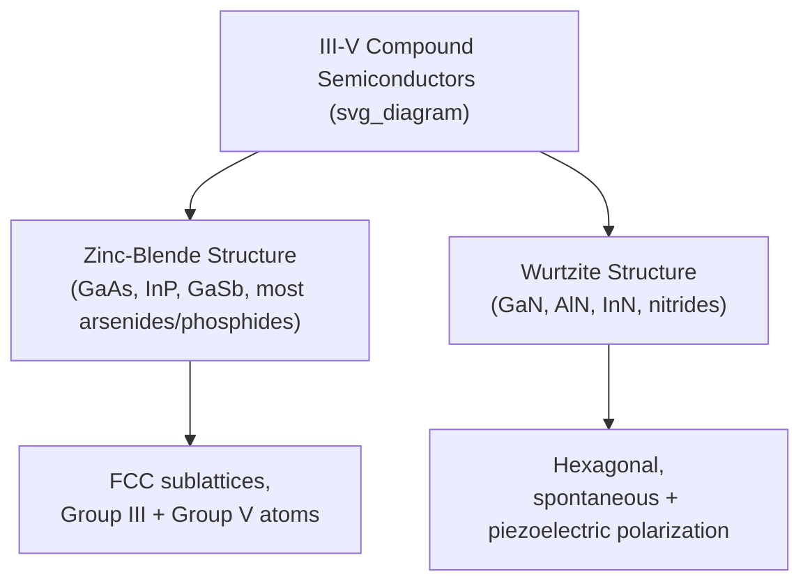

## III-V Compound Semiconductors

### Overview

III-V compound semiconductors are formed by combining elements from Group III (B, Al, Ga, In) with elements from Group V (N, P, As, Sb) of the periodic table, producing zinc-blende or wurtzite crystal structures with electronic properties distinct from — and in many respects complementary to — elemental Group IV semiconductors like silicon. Their direct bandgaps, tunable band structures through alloying, and superior electron transport properties make them indispensable for optoelectronics, high-frequency electronics, and specialized high-power applications where silicon is fundamentally limited.

### Crystal Structure

Most III-V compounds crystallize in the **zinc-blende structure**, structurally identical to the diamond cubic lattice of silicon and germanium but with the two interpenetrating FCC sublattices occupied by different atomic species (Group III on one sublattice, Group V on the other) rather than identical atoms. This structural relationship allows III-V semiconductors to often be grown epitaxially on silicon or germanium substrates when lattice constants are sufficiently well-matched.

Some III-V nitrides (notably GaN, AlN, InN) instead favor the **wurtzite structure**, a hexagonal arrangement, which introduces additional considerations such as spontaneous and piezoelectric polarization fields not present in cubic zinc-blende materials — these polarization effects are technologically exploited in GaN high-electron-mobility transistors (HEMTs).

### Direct Bandgap: The Defining Advantage

The overwhelming majority of III-V compounds are **direct bandgap** semiconductors — the conduction band minimum and valence band maximum occur at the same crystal momentum ($\Gamma$-point in most cases). This enables highly efficient radiative recombination without requiring phonon-assisted momentum transfer, making III-V materials the near-universal choice for LEDs, laser diodes, and high-efficiency photodetectors — applications where indirect-bandgap silicon is fundamentally inefficient.

### Key Binary III-V Compounds and Properties

| Material | Bandgap (eV, 300K) | Type | Key Application |
| --- | --- | --- | --- |
| GaAs | ~1.42 | Direct | High-speed electronics, solar cells, LEDs |
| InP | ~1.35 | Direct | High-speed electronics, telecom lasers |
| GaN | ~3.4 | Direct | Blue/UV LEDs, power electronics, RF (HEMT) |
| InAs | ~0.36 | Direct | Infrared detectors, quantum devices |
| GaSb | ~0.73 | Direct | Infrared optoelectronics |
| AlAs | ~2.16 | Indirect | Heterostructure barrier layers (with GaAs) |

[Unverified: precise bandgap values vary slightly across literature sources depending on measurement method and temperature correction conventions; the values above represent commonly cited room-temperature figures.]

Notably, AlAs is itself indirect, illustrating that direct bandgap character is not universal even within the III-V family — the specific band structure depends on the particular combination of elements and their relative electronegativities and atomic radii.

### Ternary and Quaternary Alloys: Continuous Bandgap Engineering

A defining strength of the III-V material system is the ability to alloy across compositions to achieve continuously tunable bandgap and lattice constant, described by Vegard's law (approximate linear interpolation of lattice constant with composition) and more complex bandgap bowing relations:

$$E_g(\text{Al}_x\text{Ga}_{1-x}\text{As}) \approx E_g(\text{GaAs})(1-x) + E_g(\text{AlAs})x - bx(1-x)$$

where $b$ is a material-specific bowing parameter capturing the deviation from simple linear interpolation.

**Common alloy systems:**

- $\text{Al}_x\text{Ga}_{1-x}\text{As}$ — nearly lattice-matched to GaAs across the full composition range, widely used for heterostructure barriers and quantum wells
- $\text{In}_x\text{Ga}_{1-x}\text{As}$ — lattice-matched to InP at $x \approx 0.53$, used extensively in telecom-wavelength (1.3–1.55 μm) laser diodes and photodetectors
- $\text{In}_x\text{Ga}_{1-x}\text{N}$ — spans a very wide bandgap range from InN (~0.7 eV, though historically debated [Unverified]) to GaN (~3.4 eV), enabling visible-spectrum LEDs from red through blue/violet
- $\text{In}_x\text{Ga}_{1-x}\text{P}$ — lattice-matched to GaAs at $x \approx 0.49$, used in red/orange/yellow LEDs and multi-junction solar cells

This continuous tunability is the foundation of **bandgap engineering** — designing heterostructures with precisely tailored band alignments for quantum wells, superlattices, and graded-composition layers.

### SVG Illustration: Bandgap vs. Lattice Constant Map

<svg xmlns="http://www.w3.org/2000/svg" viewBox="0 0 640 420" font-family="sans-serif">
<text x="320" y="24" text-anchor="middle" font-size="16" font-weight="bold">Bandgap vs Lattice Constant (svg_diagram)</text>
<line x1="70" y1="360" x2="590" y2="360" stroke="black" stroke-width="2" />
<line x1="70" y1="360" x2="70" y2="50" stroke="black" stroke-width="2" />
<text x="330" y="395" text-anchor="middle" font-size="14">Lattice Constant (Å)</text>
<text x="30" y="200" text-anchor="middle" font-size="14" transform="rotate(-90 30 200)">Bandgap Energy (eV)</text>

<circle cx="200" cy="120" r="5" fill="#c0392b" />
<text x="205" y="115" font-size="11">GaN (3.4 eV)</text>
<circle cx="330" cy="200" r="5" fill="#2980b9" />
<text x="335" y="195" font-size="11">GaAs (1.42 eV)</text>
<circle cx="360" cy="215" r="5" fill="#27ae60" />
<text x="365" y="230" font-size="11">InP (1.35 eV)</text>
<circle cx="450" cy="320" r="5" fill="#8e44ad" />
<text x="455" y="315" font-size="11">InAs (0.36 eV)</text>

<line x1="330" y1="200" x2="450" y2="320" stroke="#999" stroke-dasharray="4,4" />
<text x="370" y="280" font-size="10" fill="#555">InGaAs alloy line</text>
</svg>

### High-Frequency and High-Power Electronics

III-V materials, especially GaAs, InP, and GaN, offer significant advantages over silicon for RF and power electronics:

**Higher electron mobility and saturation velocity:** GaAs electron mobility (~8500 cm²/V·s) substantially exceeds silicon's (~1350 cm²/V·s), enabling faster transistor switching and higher cutoff frequencies. Similarly, GaAs and InP-based HEMTs (High Electron Mobility Transistors) dominate low-noise, high-frequency amplifier applications (satellite communications, radar).

**Wide bandgap power devices (GaN):** GaN's wide bandgap (3.4 eV) enables much higher breakdown electric field than silicon, allowing GaN power transistors to achieve lower on-resistance for a given breakdown voltage, higher switching frequency, and reduced device size — increasingly used in power supplies, electric vehicle inverters, and RF power amplifiers.

**Semi-insulating substrates:** GaAs substrates can be grown semi-insulating (undoped, high-resistivity), enabling monolithic microwave integrated circuits (MMICs) with reduced substrate parasitic loss compared to silicon.

### Optoelectronic Applications

**LEDs and displays:** InGaN spans blue and green emission, AlGaInP spans red/amber/yellow, together enabling full-color LED displays and general illumination (combined with phosphor conversion for white light).

**Laser diodes:** GaAs-based lasers (780–850 nm) are used in optical storage and pump lasers; InGaAsP/InP-based lasers cover the critical telecom wavelength windows (1.3 μm, 1.55 μm) essential for fiber-optic communication, exploiting the low-loss and low-dispersion windows of silica fiber.

**Photodetectors:** InGaAs photodiodes cover near-infrared telecom wavelengths inaccessible to silicon; GaN-based UV photodetectors serve flame detection and UV monitoring applications.

**Multi-junction solar cells:** Stacked III-V junctions (e.g., InGaP/GaAs/Ge triple-junction cells) achieve substantially higher conversion efficiency than single-junction silicon by capturing different portions of the solar spectrum in bandgap-matched sub-cells, used in space and concentrated photovoltaic applications where cost is secondary to efficiency and weight.

### Practical Challenges and Trade-offs

**Cost and substrate availability:** III-V single-crystal substrates (GaAs, InP, GaN) are substantially more expensive than silicon and available in smaller wafer diameters, limiting economies of scale compared to silicon CMOS manufacturing.

**Native oxide quality:** Unlike silicon's excellent SiO2, most III-V materials lack a naturally stable, high-quality native oxide, historically complicating MOSFET-style gate dielectric integration (though modern high-k dielectric deposition techniques have substantially mitigated this limitation in research and specialized production settings). [Inference: the degree to which this limitation has been overcome varies by specific material system and remains an active area of process development rather than a fully solved problem across all III-V platforms.]

**Toxicity and processing hazards:** Arsenic-containing compounds (GaAs, InAs) require careful handling and waste management protocols distinct from silicon processing, adding regulatory and safety considerations to III-V manufacturing.

### Practical Example: Lattice-Matching Calculation

For $\text{In}_x\text{Ga}_{1-x}\text{As}$ to be lattice-matched to InP (lattice constant $a_{InP} \approx 5.869\ \text{Å}$), using Vegard's law with $a_{GaAs} \approx 5.653\ \text{Å}$ and $a_{InAs} \approx 6.058\ \text{Å}$:

$$a(x) = xa_{InAs} + (1-x)a_{GaAs} = 5.869$$

$$x(6.058 - 5.653) = 5.869 - 5.653$$

$$x = \frac{0.216}{0.405} \approx 0.53$$

This confirms the well-known lattice-matching composition $x \approx 0.53$ for $\text{In}_{0.53}\text{Ga}_{0.47}\text{As}$ on InP substrates, widely used in telecom photodetectors and high-speed transistors — a standard illustrative calculation in III-V heterostructure design.

**Key Points**

- III-V compounds combine Group III and Group V elements in zinc-blende (most materials) or wurtzite (nitrides) crystal structures.
- The overwhelming majority are direct-bandgap semiconductors, enabling efficient light emission unavailable in indirect-gap silicon.
- Ternary/quaternary alloying enables continuous bandgap and lattice constant tuning, foundational to heterostructure and quantum well engineering.
- Higher electron mobility (GaAs, InP) and wide bandgap (GaN) properties make III-V materials essential for high-frequency and high-power electronics beyond silicon's practical limits.
- Cost, substrate availability, and native oxide quality remain practical trade-offs limiting III-V displacement of silicon in mainstream digital logic.

**Related Topics**

- Silicon and germanium properties
- Radiative recombination
- Bandgap engineering and heterostructure design
- HEMT device physics and high-frequency electronics
- GaN power electronics
- Multi-junction solar cell design
- Quantum well and superlattice structures
- LED and laser diode active region design