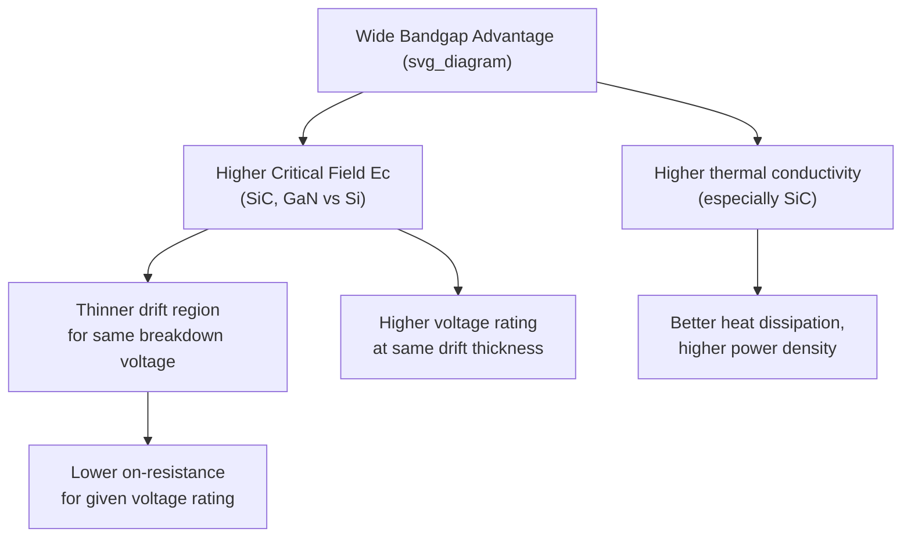
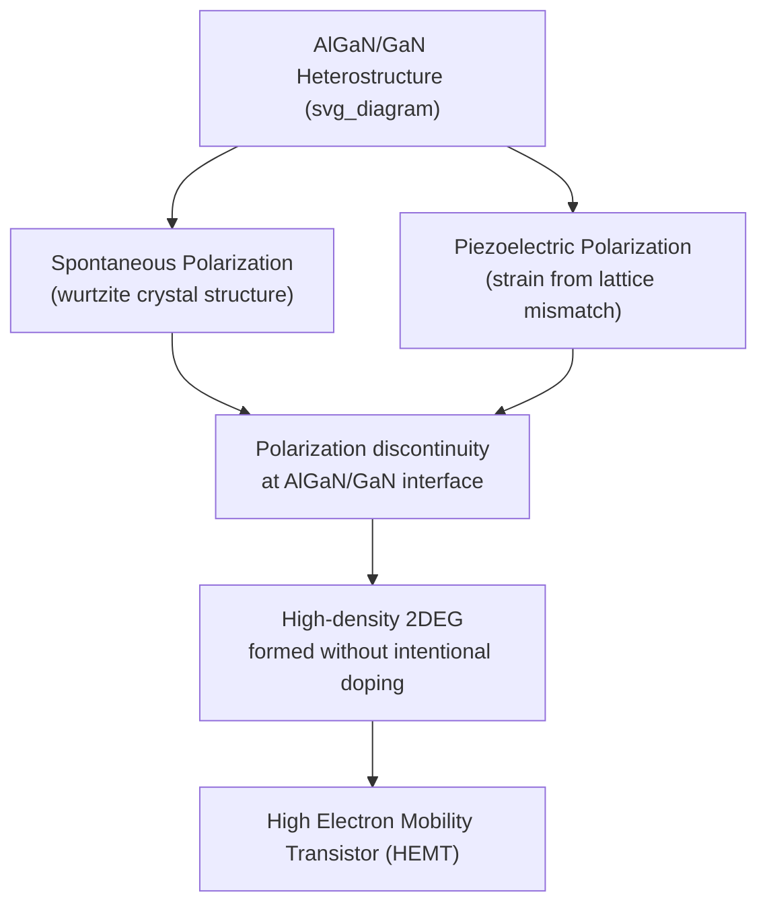

## Wide Bandgap Semiconductors: Silicon Carbide and Gallium Nitride

### Overview

Silicon carbide (SiC) and gallium nitride (GaN) are the two commercially dominant wide bandgap (WBG) semiconductors, each offering bandgap energies roughly 3x that of silicon along with substantially higher critical electric field strength, thermal conductivity (SiC especially), and high-temperature stability. These properties enable power and RF devices that fundamentally outperform silicon in efficiency, switching speed, and operating conditions, driving rapid adoption in electric vehicles, renewable energy systems, and 5G/radar RF applications.

### Fundamental Material Properties Comparison

| Property | Silicon | 4H-SiC | GaN |
| --- | --- | --- | --- |
| Bandgap $E_g$ (eV) | 1.12 | ~3.26 | ~3.4 |
| Critical electric field $E_c$ (MV/cm) | ~0.3 | ~2.5–3 | ~3–3.3 |
| Electron mobility (cm²/V·s, bulk) | ~1350 | ~900–1000 | ~1000–2000 (bulk); much higher in 2DEG |
| Thermal conductivity (W/m·K) | ~150 | ~370–490 | ~130–230 |
| Saturation velocity (cm/s) | ~1×10⁷ | ~2×10⁷ | ~2.5×10⁷ |

[Unverified: exact tabulated values vary meaningfully across literature sources, crystal polytype, doping level, and measurement conditions; the figures above represent commonly cited representative ranges rather than precise fixed constants.]

The critical electric field — the field strength at which avalanche breakdown occurs — is the single most consequential parameter for power device design, since breakdown voltage for a given drift region thickness scales with $E_c$, while on-resistance for a given breakdown voltage scales inversely with a high power of $E_c$ (commonly cited as $E_c^3$ in simplified unipolar figure-of-merit analyses [Inference: this specific power-law dependence is a simplified figure-of-merit approximation, and precise scaling depends on the specific device structure and doping profile]).

### Silicon Carbide (SiC): Crystal Structure and Polytypism

SiC is unusual among semiconductors in exhibiting **polytypism** — the same chemical composition can crystallize in multiple distinct stacking sequences of Si-C bilayers, each polytype having distinct electronic properties despite identical stoichiometry:

- **3C-SiC** (cubic, zinc-blende-like stacking) — smallest bandgap among common polytypes (~2.36 eV)
- **4H-SiC** (hexagonal, 4-layer stacking) — the dominant commercial polytype for power devices, bandgap ~3.26 eV
- **6H-SiC** (hexagonal, 6-layer stacking) — historically used for early blue LEDs before GaN dominance, bandgap ~3.02 eV

4H-SiC's combination of relatively high, more isotropic mobility (compared to 6H-SiC) and well-established growth processes has made it the standard commercial choice for SiC power devices (MOSFETs, Schottky diodes).

### SiC Device Applications

**Schottky barrier diodes:** SiC's wide bandgap enables Schottky diodes with much higher reverse breakdown voltage than silicon Schottky diodes, while retaining the fast switching and low forward voltage drop characteristic of majority-carrier Schottky devices — eliminating minority-carrier reverse recovery losses inherent to silicon PN junction diodes at high voltage.

**Power MOSFETs:** SiC power MOSFETs achieve significantly lower on-resistance per unit area than silicon MOSFETs at equivalent voltage ratings (600V–1700V+ range), enabling smaller, more efficient power converters. A persistent engineering challenge is the SiC/SiO2 interface, which historically exhibits higher interface trap density than the silicon/SiO2 interface, degrading channel mobility below the material's bulk potential. [Inference: interface quality has improved substantially through process refinement over successive device generations, though the SiC/SiO2 interface reportedly still underperforms relative to silicon's native interface quality.]

**Applications:** Electric vehicle traction inverters and onboard chargers, solar inverters, industrial motor drives, and high-voltage power supplies — domains where SiC's efficiency and thermal advantages translate directly into smaller, lighter, more efficient power electronics.

### Gallium Nitride (GaN): The Two-Dimensional Electron Gas (2DEG)

GaN's most technologically significant device structure exploits **spontaneous and piezoelectric polarization** inherent to its wurtzite crystal structure. When a thin AlGaN layer is grown epitaxially on GaN, the polarization discontinuity at the heterojunction interface creates an extremely high sheet charge density two-dimensional electron gas (2DEG) at the interface — without requiring intentional doping.

This 2DEG exhibits very high electron mobility (since electrons are confined away from ionized dopant scattering centers, similar in principle to modulation-doped structures in other III-V material systems) combined with very high sheet carrier density — a combination that enables **GaN High Electron Mobility Transistors (HEMTs)** with exceptional power density and RF performance.

### GaN Device Applications

**RF power amplifiers:** GaN HEMTs dominate high-power, high-frequency RF applications (radar, 5G base stations, satellite communications) due to their combination of high breakdown voltage, high electron velocity, and high thermal conductivity relative to competing technologies (GaAs, LDMOS), enabling higher power density per unit chip area.

**Power switching devices:** GaN-on-Si power transistors (lateral HEMT structures grown on cost-effective silicon substrates) serve fast-switching power conversion applications — USB-C fast chargers, data center power supplies, and increasingly automotive power electronics — leveraging GaN's high switching frequency capability to shrink passive component (inductor, capacitor) size in power converter designs.

**Optoelectronics:** As discussed in the III-V compound semiconductor context, InGaN/GaN heterostructures underpin virtually all commercial blue and white LED technology, as well as blue/violet laser diodes (e.g., for optical storage).

### SVG Illustration: AlGaN/GaN HEMT Cross-Section

<svg xmlns="http://www.w3.org/2000/svg" viewBox="0 0 640 380" font-family="sans-serif">
<text x="320" y="24" text-anchor="middle" font-size="16" font-weight="bold">AlGaN/GaN HEMT Structure (svg_diagram)</text>

<rect x="100" y="280" width="440" height="50" fill="#d5d8dc" stroke="#555" stroke-width="1" />
<text x="320" y="310" text-anchor="middle" font-size="12">Substrate (Si, SiC, or Sapphire)</text>

<rect x="100" y="180" width="440" height="100" fill="#eafaf1" stroke="#27ae60" stroke-width="2" />
<text x="320" y="235" text-anchor="middle" font-size="13" fill="#27ae60">GaN Buffer Layer</text>

<line x1="100" y1="180" x2="540" y2="180" stroke="#f39c12" stroke-width="4" />
<text x="320" y="170" text-anchor="middle" font-size="12" fill="#f39c12" font-weight="bold">2DEG</text>

<rect x="100" y="140" width="440" height="40" fill="#eaf2f8" stroke="#2980b9" stroke-width="2" />
<text x="320" y="165" text-anchor="middle" font-size="12" fill="#2980b9">AlGaN Barrier</text>

<rect x="130" y="110" width="60" height="30" fill="#7f8c8d" />
<text x="160" y="105" text-anchor="middle" font-size="11">Source</text>
<rect x="290" y="110" width="60" height="30" fill="#7f8c8d" />
<text x="320" y="105" text-anchor="middle" font-size="11">Gate</text>
<rect x="450" y="110" width="60" height="30" fill="#7f8c8d" />
<text x="480" y="105" text-anchor="middle" font-size="11">Drain</text>
</svg>

### Comparative Trade-offs: SiC vs. GaN

**SiC advantages:** Superior thermal conductivity enables better heat dissipation in high-power vertical device structures; vertical device architecture supports very high voltage ratings (multi-kV) with robust avalanche ruggedness; mature substrate and device manufacturing ecosystem for power applications.

**GaN advantages:** Higher electron mobility and saturation velocity enable higher switching frequencies and better RF performance; lateral HEMT structure on silicon substrates offers a potential cost advantage and compatibility with existing silicon fabrication infrastructure; generally lower device capacitance benefits high-frequency switching efficiency.

**Application segmentation:** [Inference: as a general industry pattern rather than an absolute rule] SiC tends to be favored for higher-voltage (600V+), higher-power vertical power devices (EV traction inverters, industrial drives) where thermal management and voltage rating are paramount, while GaN tends to be favored for lower-to-medium voltage, higher-frequency applications (fast chargers, RF power amplifiers, some data center power supplies) where switching speed and power density are paramount. Significant overlap and evolving competition exists between the two technologies in the mid-voltage range.

### Practical Example: Drift Region Thickness Comparison

Using a simplified unipolar power device figure of merit, the minimum drift region thickness $W$ required to support breakdown voltage $V_B$ scales approximately as $W \propto V_B/E_c$. Comparing silicon and 4H-SiC for a device rated at $V_B = 1200\ \text{V}$:

$$\frac{W_{Si}}{W_{SiC}} \approx \frac{E_{c,SiC}}{E_{c,Si}} \approx \frac{2.5\ \text{MV/cm}}{0.3\ \text{MV/cm}} \approx 8.3$$

This indicates the silicon drift region would need to be roughly 8x thicker than the equivalent SiC drift region to support the same breakdown voltage — directly translating to substantially higher on-resistance (and hence conduction losses) for the silicon device at this voltage rating, illustrating quantitatively why SiC dramatically outperforms silicon in medium-to-high-voltage power device efficiency. [Inference: this simplified scaling omits doping profile optimization and other second-order design factors that affect the precise thickness in a real fabricated device.]

**Key Points**

- SiC and GaN offer roughly 3x the bandgap and roughly an order of magnitude higher critical electric field than silicon, enabling thinner drift regions and lower on-resistance at a given voltage rating.
- SiC exhibits polytypism (3C, 4H, 6H), with 4H-SiC the dominant commercial choice for power devices due to favorable mobility and established processing.
- GaN HEMTs exploit spontaneous and piezoelectric polarization to form a high-mobility 2DEG without intentional doping, enabling exceptional RF and power switching performance.
- SiC's superior thermal conductivity and vertical device architecture favor high-voltage, high-power applications; GaN's higher electron velocity and lateral HEMT structure favor high-frequency and power-dense applications.
- Both technologies are rapidly displacing silicon in electric vehicle power electronics, renewable energy inverters, and RF power amplifier markets.

**Related Topics**

- Silicon and germanium properties
- III-V compound semiconductors
- Velocity saturation and high-field transport
- Power MOSFET and IGBT device structures
- HEMT device physics and 2DEG formation
- Avalanche breakdown and critical electric field
- Piezoelectric and spontaneous polarization in wurtzite crystals
- Power electronics figures of merit (Baliga FOM)