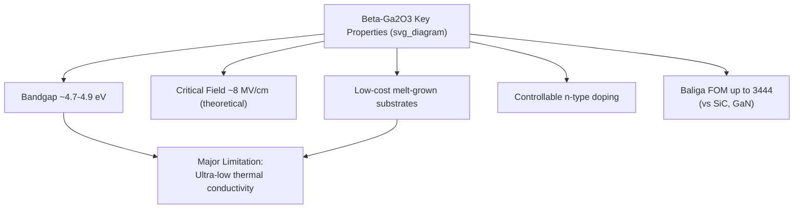
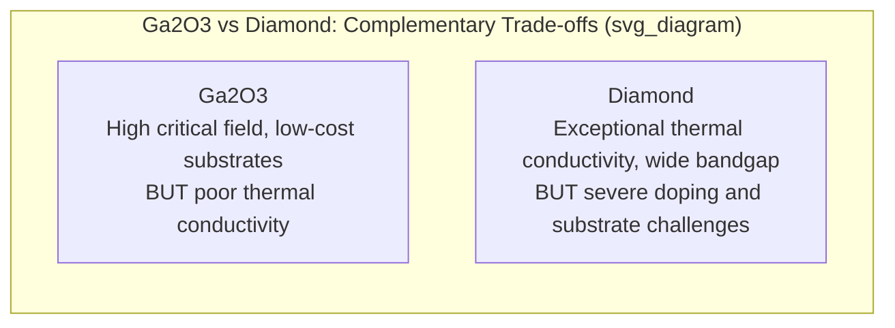

## Ultra Wide Bandgap Materials: Gallium Oxide and Diamond

### Overview

Beyond the now-commercial wide bandgap materials (SiC, GaN) lies a class of ultra-wide bandgap (UWBG) semiconductors — most prominently gallium oxide (Ga2O3) and diamond — offering bandgap energies of roughly 4.5–5.5 eV, dramatically higher critical electric fields, and (in diamond's case) exceptional thermal conductivity. These materials target the next tier of high-voltage, high-power, and extreme-environment applications beyond what SiC and GaN can economically address, though each carries distinct, currently unresolved materials engineering challenges that separate laboratory promise from commercial deployment.

### Gallium Oxide (Ga2O3): Material Properties

Gallium oxide, particularly its most stable monoclinic **β-phase** (β-Ga2O3), has emerged as a leading UWBG candidate. Reported properties include a bandgap of 4.7–4.9 eV, a critical electric field strength of 8 MV/cm, and a Baliga figure of merit (BFOM) of up to 3444, reported as roughly 10 times higher than SiC and 4 times higher than GaN. Some sources report the bandgap ranging somewhat more broadly, with one review citing an ultra-wide bandgap ranging from 4.5 eV to 5.16 eV depending on measurement method and crystal quality. [PubMed Central](https://pmc.ncbi.nlm.nih.gov/articles/PMC11052528/)[PubMed Central](https://pmc.ncbi.nlm.nih.gov/articles/PMC11997563/)

A major practical advantage is manufacturability: β-Ga2O3 benefits from controllable n-type doping with shallow dopants across a wide concentration range, and the availability of large-diameter wafers grown by low-cost melt-growth techniques. This melt-growth compatibility (unlike SiC or GaN, which typically require more complex and costly growth methods) is a significant potential cost advantage — 4-inch commercial wafers have already been achieved, with 6-inch wafer-scale production targeted by 2027. [IOPscience](https://iopscience.iop.org/article/10.35848/1347-4065/acb3d3)[IOPscience](https://iopscience.iop.org/article/10.35848/1347-4065/acb3d3)

### Gallium Oxide: The Thermal Conductivity Bottleneck

Ga2O3's principal engineering barrier is thermal management. Its thermal conductivity is reported at approximately 0.27 W/cm·K, a value that severely constrains heat dissipation in high-power operation — for comparison, this is roughly one to two orders of magnitude below silicon (~1.5 W/cm·K) and SiC (~3.7–4.9 W/cm·K). This thermal limitation means that despite Ga2O3's superior electrical figure of merit, self-heating during high-power switching can quickly become the limiting factor in real device performance. [Patsnap](https://www.patsnap.com/resources/blog/articles/gallium-oxide-4-9-ev-bandgap-for-power-electronics/)

A widely proposed mitigation strategy is **heterogeneous integration**: growing or bonding a thin Ga2O3 active device layer onto a substrate with much higher thermal conductivity. A 2023 study on Ga2O3-on-SiC MOSFETs explicitly identifies the thermal conductivity issue as severe and proposes heterogeneous integration onto SiC substrates as a mitigation strategy, while cautioning that premature breakdown at the Ga2O3/SiC interface must be carefully managed. [Patsnap](https://www.patsnap.com/resources/blog/articles/gallium-oxide-4-9-ev-bandgap-for-power-electronics/)

A second significant limitation is the lack of effective p-type doping methods, which hinders the fabrication of complex device structures — as a result, most Ga2O3 device research has focused on unipolar devices (Schottky diodes, MOSFETs, HEMTs) rather than bipolar structures, with breakthroughs still emerging in recent years. [PubMed Central](https://pmc.ncbi.nlm.nih.gov/articles/PMC11997563/)[PubMed Central](https://pmc.ncbi.nlm.nih.gov/articles/PMC11052528/)

### Gallium Oxide: Commercialization Trajectory

Ga2O3 device development has progressed from early proof-of-concept demonstrations toward circuit-level integration. Timeline analysis describes the field moving from device proof-of-concept in 2014 through performance benchmarking (2017-2019) and community roadmapping (2022) to circuit-level commercialization readiness in 2025. A notable indicator of maturation is a 2025 patent from FLOSFIA Inc. disclosing a power conversion circuit incorporating gallium oxide-based semiconductor switching elements, with a control unit designed to detect short-circuit states and execute shutdown in under 1.4 microseconds — a timing constraint specifically engineered to suppress characteristic degradation in Ga2O3 devices under fault conditions, indicating material-specific circuit-level design work rather than purely device-level research. [Patsnap](https://www.patsnap.com/resources/blog/articles/gallium-oxide-4-9-ev-bandgap-for-power-electronics/)[Patsnap](https://www.patsnap.com/resources/blog/articles/gallium-oxide-4-9-ev-bandgap-for-power-electronics/)

A pragmatic near-term commercialization pathway mirrors how SiC itself entered the market: a hybrid inverter topology combining silicon switches operated at low switching frequency with Ga2O3 switches operated at high switching frequency, extracting performance benefits while managing the cost and availability constraints of early-stage UWBG devices, an approach directly analogous to earlier Si/SiC hybrid module architectures that bridged the commercialization gap for silicon carbide. [Patsnap](https://www.patsnap.com/resources/blog/articles/gallium-oxide-4-9-ev-bandgap-vs-sic-and-gan/)[Patsnap](https://www.patsnap.com/resources/blog/articles/gallium-oxide-4-9-ev-bandgap-vs-sic-and-gan/)

### Diamond: Material Properties

Diamond represents an even more extreme UWBG semiconductor. Reported intrinsic properties include a bandgap of 5.47 eV, an extremely high breakdown field of 10 MV/cm, the highest thermal conductivity among bulk materials at approximately 2200 W/m·K, and very high radiation tolerance — combined with excellent electron and hole mobilities of approximately 4500 and 3800 cm²/V·s respectively. This combination — simultaneously the widest bandgap, highest thermal conductivity, and high carrier mobility among semiconductor candidates — makes diamond, in principle, an exceptional material for high-power, high-frequency, and extreme-environment electronics. [ScienceDirect](https://www.sciencedirect.com/science/article/abs/pii/S136980012400920X)[ScienceDirect](https://www.sciencedirect.com/science/article/abs/pii/S136980012400920X)

Diamond's thermal conductivity is among the highest reported for any bulk material, which is critical for efficient heat dissipation during device operation — the inverse of Ga2O3's central weakness, making the two materials interesting complements when compared side by side. [nih](https://www.ncbi.nlm.nih.gov/pmc/articles/PMC13514444/)

### Diamond: The Doping Bottleneck

Diamond's central engineering barrier is the inverse of Ga2O3's — not thermal management, but achieving practical, stable carrier doping. Because of diamond's very wide bandgap, common dopants have much higher ionization energies than in narrow-bandgap semiconductors, so many dopant atoms remain electrically inactive at room temperature, and carrier transport can be limited by incomplete dopant ionization or carrier freeze-out. This directly echoes the freeze-out physics covered generally for carrier concentration temperature dependence, but pushed to a far more severe regime given diamond's exceptionally large bandgap. [DOI](https://doi.org/10.3390/ma19163529)

Introducing dopants is itself difficult: ion implantation can introduce dopants into diamond, but it often produces shallow doped regions only a few tens of nanometers deep, and creates lattice damage that must be reduced through high-temperature annealing; thermal diffusion has also been investigated as an alternative route. Boron is the primary established p-type dopant, and a p-type semiconducting-to-metallic transition can be achieved through changes in boron doping concentration, but achieving comparably effective n-type doping remains substantially harder, constraining most diamond devices to unipolar (predominantly p-type or hydrogen-terminated surface-channel) architectures rather than conventional bipolar p-n structures. [DOI](https://doi.org/10.3390/ma19163529)[ScienceDirect](https://www.sciencedirect.com/science/article/abs/pii/S136980012400920X)

More broadly across UWBG materials generally, p-type doping has long been challenging due to the relatively large activation energy and strong compensation of acceptor states, which drastically hinders applications in ultraviolet optoelectronic devices — for context, the activation energy of the magnesium acceptor in gallium nitride is about 200 meV, and nitrogen in zinc oxide is around 170 meV, both well above the room-temperature thermal energy of about 26 meV, illustrating that this doping-activation problem, while especially acute in diamond, is a general feature of very wide bandgap materials rather than unique to any single one. [nih](https://www.ncbi.nlm.nih.gov/pmc/articles/PMC4555170/)[nih](https://www.ncbi.nlm.nih.gov/pmc/articles/PMC4555170/)

### Diamond and Ga2O3 Device Architectures

**Diamond devices:** Progress has been made in hydrogen-terminated field-effect transistors, MOSFETs, Schottky and p-i-n diodes, and related power-device architectures. Hydrogen-terminated diamond surfaces create a naturally occurring p-type surface conducting channel (via surface transfer doping from adsorbed atmospheric species), circumventing some bulk doping difficulties for specific lateral device geometries. [DOI](https://doi.org/10.3390/ma19163529)

**Diamond-GaN heterojunctions:** Because efficient doping in UWBG materials is typically limited to either n-type or p-type, constraining application to unipolar devices, and lattice mismatch and thermal expansion differences hinder pn junction realization through direct heterogeneous integration of complementary UWBG semiconductors, researchers have explored combining diamond with other materials. A recent demonstration reports diamond-GaN heterojunction p-n diodes fabricated via grafting, with a p+ diamond nanomembrane integrated onto epitaxially grown n-/n+ GaN via an ultrathin ALD-Al2O3 interlayer, achieving diodes with an ideality factor of 1.55 and a rectification ratio of approximately 10^4 — this pairs diamond's p-type capability with GaN's more mature n-type doping and processing ecosystem. [arxiv](https://arxiv.org/pdf/2510.25028)[arxiv](https://arxiv.org/pdf/2510.25028)

**Emerging diamond applications beyond conventional power switching** include ultraviolet photodetectors, multifunctional electronics, memory-oriented devices, vacuum switching structures, electron-emission devices, radiation detectors, traveling-wave tube components, and thermionic energy-conversion systems, reflecting diamond's radiation hardness and extreme-environment tolerance as much as its raw electronic figures of merit. [nih](https://www.ncbi.nlm.nih.gov/pmc/articles/PMC13514444/)

### SVG Illustration: UWBG Materials Landscape

<svg xmlns="http://www.w3.org/2000/svg" viewBox="0 0 640 400" font-family="sans-serif">
<text x="320" y="24" text-anchor="middle" font-size="16" font-weight="bold">Bandgap vs Thermal Conductivity Trade-off (svg_diagram)</text>
<line x1="70" y1="340" x2="590" y2="340" stroke="black" stroke-width="2" />
<line x1="70" y1="340" x2="70" y2="50" stroke="black" stroke-width="2" />
<text x="330" y="375" text-anchor="middle" font-size="14">Bandgap Energy (eV)</text>
<text x="30" y="200" text-anchor="middle" font-size="14" transform="rotate(-90 30 200)">Thermal Conductivity</text>
<circle cx="150" cy="280" r="6" fill="#7f8c8d" />
<text x="160" y="285" font-size="11">Si (1.12 eV)</text>
<circle cx="230" cy="180" r="6" fill="#2980b9" />
<text x="240" y="175" font-size="11">SiC (3.26 eV)</text>
<circle cx="260" cy="220" r="6" fill="#27ae60" />
<text x="270" y="235" font-size="11">GaN (3.4 eV)</text>
<circle cx="400" cy="320" r="6" fill="#e67e22" />
<text x="405" y="315" font-size="11">Ga2O3 (~4.8 eV) low thermal cond.</text>
<circle cx="520" cy="80" r="6" fill="#8e44ad" />
<text x="470" y="70" font-size="11">Diamond (5.47 eV) highest thermal cond.</text>
</svg>

### Practical Example: Figure of Merit Comparison

Using the Baliga figure of merit (proportional to $\mu\varepsilon_s E_c^3$, favoring materials that combine high mobility and high critical field for minimizing conduction loss in unipolar devices), the reported BFOM of up to 3444 for β-Ga2O3, roughly 10 times that of SiC and 4 times that of GaN, indicates substantial theoretical potential for reduced on-resistance at a given voltage rating relative to already-commercial WBG materials. However, this figure of merit does not capture thermal management, so a full efficiency comparison in a real high-power application requires accounting for Ga2O3's much lower thermal conductivity separately from its excellent unipolar electrical figure of merit — precisely the tension that heterogeneous substrate integration approaches are attempting to resolve. [PubMed Central](https://pmc.ncbi.nlm.nih.gov/articles/PMC11052528/)

**Key Points**

- Gallium oxide (β-Ga2O3) offers an ultra-wide bandgap of roughly 4.7–4.9 eV, a very high critical field near 8 MV/cm, and a leading Baliga figure of merit, alongside low-cost melt-grown substrate availability.
- Ga2O3's central limitation is very low thermal conductivity (~0.27 W/cm·K), motivating heterogeneous integration onto higher-conductivity substrates like SiC.
- Diamond offers the widest bandgap (~5.47 eV), highest known bulk thermal conductivity, and excellent carrier mobilities, but suffers from severe dopant ionization and activation challenges due to its extreme bandgap.
- Both materials currently lack mature, efficient bipolar (p-n junction) device capability — Ga2O3 due to absent effective p-type doping, diamond due to difficulty achieving practical n-type doping.
- Near-term commercialization for both materials favors hybrid approaches: Si/Ga2O3 hybrid inverter topologies, and diamond-GaN heterojunction devices combining complementary doping strengths.

**Related Topics**

- Wide bandgap semiconductors: silicon carbide and gallium nitride
- Temperature dependence of carrier concentration (dopant freeze-out)
- Baliga figure of merit and power device design
- Heterojunction and heterogeneous integration techniques
- p-type doping challenges in wide bandgap materials
- Radiation-hard and extreme-environment semiconductor devices
- Schottky barrier diode physics
- Thermal management in power semiconductor packaging