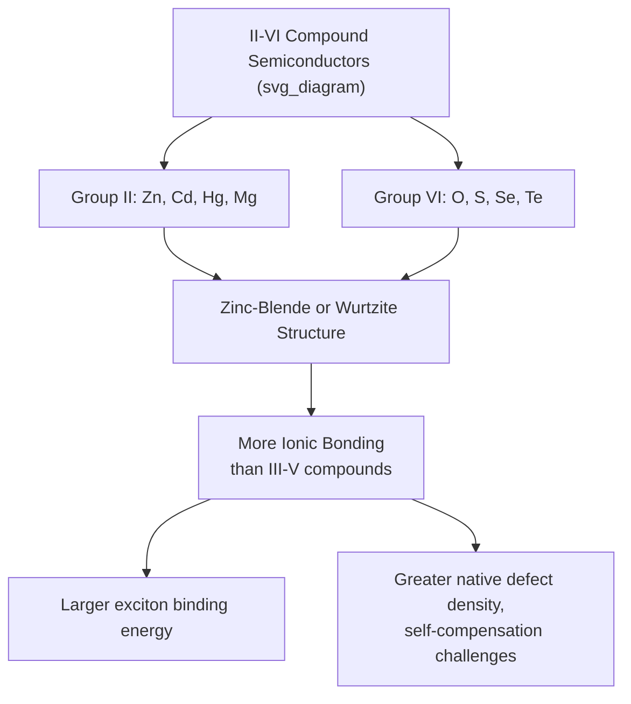
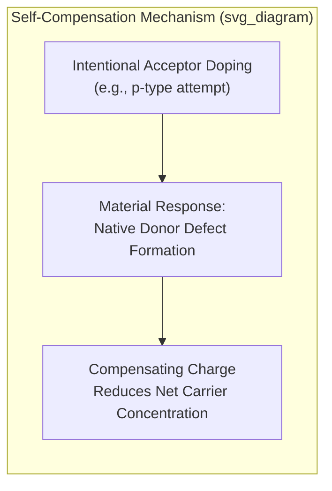

## II-VI Compound Semiconductors

### Overview

II-VI compound semiconductors combine elements from Group II (Zn, Cd, Hg, Mg) with elements from Group VI (O, S, Se, Te) of the periodic table. This material family spans an unusually wide range of bandgap energies — from near-zero-gap semimetal-like HgTe to wide-bandgap ZnO and ZnS — while generally exhibiting more ionic bonding character than III-V compounds, which shapes their distinct defect physics, doping challenges, and application niches in optoelectronics, radiation detection, and infrared imaging.

### Crystal Structure and Bonding Character

Most II-VI compounds crystallize in either the **zinc-blende** (cubic) or **wurtzite** (hexagonal) structure, often with a given material capable of existing in either polytype depending on growth conditions (e.g., ZnS and CdS are known to occur in both forms). Compared to III-V compounds, II-VI materials generally exhibit greater ionic bonding character due to the larger electronegativity difference between Group II and Group VI elements. This increased ionicity has direct physical consequences: generally larger exciton binding energies (favorable for room-temperature exciton-based optical effects), but also a greater propensity for native point defects and self-compensation effects that complicate controllable doping.

### Key Binary II-VI Compounds and Properties

| Material | Bandgap (eV, 300K) | Type | Notable Application |
| --- | --- | --- | --- |
| ZnO | ~3.37 | Direct | UV LEDs, transparent electronics, varistors |
| ZnS | ~3.6 | Direct | Phosphors, blue/UV optoelectronics |
| ZnSe | ~2.7 | Direct | Blue/green LEDs and lasers (historical) |
| CdS | ~2.42 | Direct | Photoconductors, solar cell buffer layers |
| CdSe | ~1.74 | Direct | Quantum dots, photodetectors |
| CdTe | ~1.5 | Direct | Thin-film solar cells, gamma-ray detectors |
| HgTe | ~-0.3 (semimetal) | — | Infrared detector alloying (with CdTe) |

[Unverified: precise bandgap values vary across literature sources depending on measurement method, temperature correction, and crystal polytype; the figures above represent commonly cited representative values.]

Notably, HgTe is technically a **zero-gap semimetal** rather than a conventional semiconductor, with the conduction and valence bands touching at zero energy separation — a property exploited specifically through alloying with CdTe (discussed below) rather than used in its pure form.

### Direct Bandgap Character and Optoelectronic Relevance

Like most III-V compounds, the majority of II-VI semiconductors are direct-bandgap materials, enabling efficient radiative recombination without phonon assistance. This made II-VI materials (particularly ZnSe-based structures) historically important in the early development of blue and green semiconductor lasers, before GaN-based III-nitride technology proved more commercially viable due to superior material stability and defect tolerance. [Inference: the specific reasons GaN ultimately displaced ZnSe for commercial blue laser diodes involve materials degradation and defect propagation issues in ZnSe-based laser structures under operating current densities, a subject requiring more detailed device physics and reliability analysis than a general property comparison can capture.]

### Doping Challenges: The Self-Compensation Problem

A defining characteristic distinguishing II-VI compounds from III-V and Group IV semiconductors is a pronounced tendency toward **self-compensation** — the material's tendency to spontaneously generate native point defects (vacancies, interstitials) that counteract intentional doping. For example, attempting to dope a wide-bandgap II-VI material heavily p-type can trigger the formation of compensating native donor defects that partially or substantially cancel the intended acceptor doping, limiting the achievable net carrier concentration and complicating fabrication of both n-type and p-type material simultaneously in the same compound. [Inference: the microscopic origin and severity of self-compensation vary by specific material and doping approach and depend on growth conditions, defect formation energies, and Fermi level pinning effects, and are generally studied through combined experimental characterization and first-principles defect calculations rather than a single universal explanation.]

ZnO exemplifies this challenge: reliable, stable p-type doping of ZnO has proven extremely difficult despite decades of research effort, due to combined effects of deep acceptor levels, strong native defect compensation, and hydrogen incorporation acting as an unintentional donor — a persistent bottleneck limiting ZnO's use in bipolar (p-n junction) optoelectronic devices despite its otherwise favorable wide-bandgap properties.

### Mercury Cadmium Telluride (MCT, HgCdTe): Infrared Detection Workhorse

The alloy $\text{Hg}_{1-x}\text{Cd}_x\text{Te}$ (mercury cadmium telluride, commonly abbreviated MCT) is arguably the most technologically important II-VI compound system, exploiting the continuous tunability between semimetal HgTe (zero/negative gap) and semiconductor CdTe (~1.5 eV) to achieve **continuously adjustable bandgap** spanning the entire infrared spectrum relevant to thermal imaging and infrared astronomy.

$$E_g(x) \approx -0.3(1-x) + 1.5x + \text{bowing correction}$$

By selecting composition $x$, MCT detectors can be tailored to specific infrared bands:

- **Short-wave infrared (SWIR, ~1–3 μm):** higher $x$ compositions
- **Mid-wave infrared (MWIR, ~3–5 μm):** intermediate compositions
- **Long-wave infrared (LWIR, ~8–14 μm):** lower $x$ compositions, approaching the HgTe-rich limit

This tunability, combined with high absorption coefficients and achievable high quantum efficiency, has made MCT the dominant material for high-performance military, astronomical, and scientific infrared imaging systems for decades, despite significant manufacturing challenges (mercury's high vapor pressure complicates controlled epitaxial growth, and compositional uniformity across a wafer is difficult to achieve at the tight tolerances infrared detector arrays require).

### Cadmium Telluride (CdTe): Thin-Film Photovoltaics

CdTe has achieved significant commercial success as a thin-film solar cell absorber material, exploiting its near-ideal bandgap (~1.5 eV, close to the theoretical optimum for single-junction solar cell efficiency under the Shockley-Queisser limit) combined with a very high optical absorption coefficient, allowing effective light absorption in a film only a few micrometers thick — dramatically less semiconductor material than crystalline silicon solar cells require. This has enabled CdTe to become one of the few thin-film photovoltaic technologies achieving significant commercial market share alongside crystalline silicon, particularly in utility-scale solar installations. [Inference: relative market share and cost-competitiveness between CdTe and crystalline silicon photovoltaics fluctuates with silicon pricing, manufacturing scale, and policy factors, and should be verified against current market data rather than assumed static.]

### Quantum Dots: Nanoscale II-VI Applications

CdSe and related II-VI compounds (often core-shell structures such as CdSe/ZnS) are widely used as **colloidal quantum dots** — nanoscale crystals small enough that quantum confinement effects dominate their electronic structure, allowing the effective bandgap (and hence emission color) to be tuned by particle size alone, independent of bulk composition. This size-tunable emission underlies quantum dot display technology (QLED displays) and various biological imaging and labeling applications. [Inference: while cadmium-based quantum dots dominated early commercial development, regulatory and environmental concerns around cadmium toxicity have driven significant research into cadmium-free alternatives (e.g., indium phosphide-based quantum dots) for consumer display applications; the current state of this material transition should be verified against recent industry sources.]

### SVG Illustration: MCT Bandgap Tunability for Infrared Bands

<svg xmlns="http://www.w3.org/2000/svg" viewBox="0 0 640 380" font-family="sans-serif">
<text x="320" y="24" text-anchor="middle" font-size="16" font-weight="bold">HgCdTe Bandgap Tuning for IR Bands (svg_diagram)</text>
<line x1="70" y1="320" x2="590" y2="320" stroke="black" stroke-width="2" />
<line x1="70" y1="320" x2="70" y2="60" stroke="black" stroke-width="2" />
<text x="330" y="355" text-anchor="middle" font-size="14">Cd fraction, x (HgTe → CdTe)</text>
<text x="30" y="190" text-anchor="middle" font-size="14" transform="rotate(-90 30 190)">Bandgap Energy, Eg</text>
<path d="M 90 300 Q 300 280 570 90" stroke="#c0392b" stroke-width="3" fill="none" />
<line x1="70" y1="300" x2="590" y2="300" stroke="#999" stroke-dasharray="4,4" />
<text x="95" y="315" font-size="11">HgTe (x=0) semimetal</text>
<text x="540" y="80" font-size="11">CdTe (x=1) ~1.5 eV</text>

<text x="200" y="270" font-size="11" fill="`#c0392b`">LWIR region</text>

<text x="350" y="200" font-size="11" fill="`#c0392b`">MWIR region</text>

<text x="470" y="130" font-size="11" fill="`#c0392b`">SWIR region</text>

</svg>

### Radiation Detection: CdZnTe

Cadmium zinc telluride ($\text{Cd}_{1-x}\text{Zn}_x\text{Te}$, CZT) is a wide-bandgap II-VI alloy exploited primarily for room-temperature gamma-ray and X-ray radiation detection. Its relatively wide bandgap (~1.6 eV, tunable with Zn content) enables low intrinsic carrier concentration and hence low thermal noise even at room temperature (unlike narrower-gap detector materials such as germanium, which typically require cryogenic cooling to suppress thermally generated leakage current), combined with high atomic number constituents providing good stopping power for high-energy photons — making CZT valuable for portable radiation detection instruments, medical imaging (SPECT), and nuclear security applications.

### Practical Example: Bandgap Interpolation for HgCdTe LWIR Design

For a long-wave infrared detector targeting peak response near 10 μm, the required bandgap is approximately:

$$E_g = \frac{hc}{\lambda} = \frac{1240\ \text{nm·eV}}{10{,}000\ \text{nm}} \approx 0.124\ \text{eV}$$

Using a simplified linear interpolation between HgTe ($E_g \approx -0.3\ \text{eV}$) and CdTe ($E_g \approx 1.5\ \text{eV}$) [Unverified: real MCT bandgap composition dependence requires a more accurate empirical bowing model such as the Hansen-Schmit-Casselman relation rather than simple linear interpolation, so this is illustrative only]:

$$0.124 = -0.3(1-x) + 1.5x \quad \Rightarrow \quad 0.124 = -0.3 + 1.8x \quad \Rightarrow \quad x \approx 0.236$$

This illustrates, at an approximate level, why LWIR-optimized MCT detectors use compositions with relatively low Cd fraction (closer to the HgTe-rich end), consistent with commercial LWIR MCT detector formulations reported in the literature.

**Key Points**

- II-VI compounds combine Group II and Group VI elements, generally exhibiting more ionic bonding and larger exciton binding energies than III-V compounds.
- Self-compensation via native point defects is a defining doping challenge in II-VI materials, most notably limiting stable p-type ZnO doping.
- HgCdTe (MCT) provides continuously tunable bandgap across the infrared spectrum, dominating high-performance infrared imaging despite significant epitaxial growth challenges.
- CdTe's near-ideal bandgap and high absorption coefficient underpin its commercial success as a thin-film photovoltaic material.
- CdSe-based quantum dots exploit quantum confinement for size-tunable emission in display and imaging applications; CdZnTe serves room-temperature radiation detection.

**Related Topics**

- III-V compound semiconductors
- Radiative recombination and direct bandgap materials
- Infrared photodetector design and imaging systems
- Thin-film photovoltaic technologies
- Quantum confinement and colloidal quantum dot synthesis
- Native point defects and self-compensation in wide bandgap semiconductors
- Radiation detector materials and gamma-ray spectroscopy
- Shockley-Queisser limit and solar cell bandgap optimization