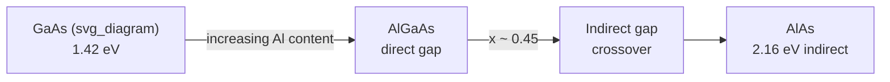

## Alloy Systems and Bandgap Tuning

### Overview

Semiconductor alloys combine two or more binary (or elemental) semiconductors into a single crystalline lattice, allowing continuous variation of electronic, optical, and structural properties. The central design lever is bandgap engineering: by adjusting alloy composition, engineers tailor the bandgap energy ($E_g$), lattice constant, and band alignment to target specific device requirements — from infrared detectors to blue laser diodes.

### Fundamental Concepts

#### Solid Solutions in Semiconductors

Most technologically important alloys are pseudobinary or pseudoternary solid solutions, where atoms of one sublattice are substitutionally replaced by atoms of the same valence group. For a III-V ternary such as $Al_xGa_{1-x}As$, Al and Ga atoms randomly occupy the group-III sublattice while As fully occupies the group-V sublattice.

**Key Points**

- Substitution must preserve the zinc-blende (or wurtzite) crystal structure
- Random alloy statistics dominate unless growth is deliberately ordered
- Composition $x$ is the primary tuning parameter, typically $0 \le x \le 1$

#### Vegard's Law

Lattice constant varies approximately linearly with composition:

$$a(x) = x \cdot a_{AB} + (1-x) \cdot a_{CB}$$

For $Al_xGa_{1-x}As$, since AlAs and GaAs have nearly identical lattice constants (5.661 Å vs 5.653 Å), this system is nearly lattice-matched across the entire composition range — a major reason for its widespread use.

### Bandgap Bowing

Bandgap does not vary perfectly linearly with composition; it follows a quadratic "bowing" relation:

$$E_g(x) = x \cdot E_g(A) + (1-x) \cdot E_g(B) - b \cdot x(1-x)$$

where $b$ is the bowing parameter, an empirical or first-principles-derived constant capturing deviation from linear (Vegard-like) interpolation, arising from disorder-induced band mixing and differences in bond lengths/ionicities.

[Inference] Bowing parameters are generally alloy-specific and sometimes composition-dependent themselves, requiring higher-order polynomial fits in some systems (e.g., InGaN).

**Example**

For $Al_xGa_{1-x}As$: $E_g(x) \approx 1.424 + 1.247x$ eV (direct gap regime, $x < 0.45$), with bowing effects small enough to often be neglected in this particular system — though bowing is significant in others like InGaAs.

### Major Alloy Systems

#### III-V Arsenides: AlGaAs

- Nearly lattice-matched to GaAs across full composition range
- Direct-to-indirect bandgap crossover near $x \approx 0.45$
- Used in heterostructure lasers, HBTs, and DBR mirrors

#### III-V Phosphides/Arsenides: InGaAsP

- Quaternary system grown lattice-matched to InP substrates
- Independent tuning of bandgap (0.75–1.35 eV) and lattice constant via two composition parameters
- Backbone of 1.3–1.55 μm telecom lasers and photodetectors

#### III-Nitrides: InGaN and AlGaN

- InGaN: spans nearly the entire visible spectrum (GaN ~3.4 eV to InN ~0.7 eV), enabling blue/green LEDs and laser diodes
- Large bowing parameter (~1.4–3 eV depending on source) due to significant lattice mismatch between InN and GaN
- AlGaN: used for UV LEDs/lasers and high-power AlGaN/GaN HEMTs due to spontaneous/piezoelectric polarization

**Key Points**

- Nitride alloys suffer from phase separation and compositional inhomogeneity at high In content
- Strong internal polarization fields (quantum-confined Stark effect) complicate simple bandgap-composition relations

#### Group IV Alloys: SiGe and SiGeSn

- SiGe: strain-engineered on Si substrates; used for high-mobility p-channel MOSFETs, heterojunction bipolar transistors, and Si-based photonics
- Bandgap decreases from Si (1.12 eV) toward Ge (0.66 eV) with Ge fraction
- GeSn/SiGeSn alloys: [Speculation] emerging as a route to direct-bandgap group-IV materials for monolithic Si photonics, though Sn incorporation above a few percent remains challenging due to low solid solubility and phase segregation

#### II-VI Alloys: CdZnTe, HgCdTe

- HgCdTe (MCT): premier tunable infrared material; bandgap tunable from ~0 eV (semimetal HgTe) to 1.5 eV (CdTe), covering MWIR to LWIR and beyond
- CdZnTe: used primarily as a lattice-matched substrate for HgCdTe epitaxy and as a room-temperature gamma/X-ray detector material

### Band Alignment and Heterostructures

Alloy composition also controls conduction- and valence-band offsets at heterojunctions, governed by the electron affinity rule or more accurately by model-solid theory band-alignment calculations. This determines:

- Type-I alignment (straddling gap) — used for quantum wells/carrier confinement
- Type-II alignment (staggered gap) — used for interband tunneling devices, some infrared detectors
- Type-III (broken gap) — e.g., InAs/GaSb, used in interband cascade structures

### Strain Effects

When alloy lattice constant deviates from the substrate, epitaxial strain modifies the bandgap beyond compositional bowing:

$$\Delta E_g^{strain} = \Delta E_g^{hydrostatic} + \Delta E_g^{shear}$$

Biaxial strain splits the heavy-hole/light-hole degeneracy at the valence band maximum, an effect deliberately exploited in strained-layer lasers to reduce threshold current and in strained-Si/SiGe for mobility enhancement.

**Key Points**

- Critical thickness limits how much strained alloy can be grown before dislocation-mediated relaxation occurs
- Matthews-Blakeslee model gives an approximate critical thickness as a function of lattice mismatch

### Ordering and Clustering Effects

Real alloys can deviate from the random-alloy assumption:

- **CuPt-type ordering**: observed in InGaP and other III-V alloys grown by MOCVD, reducing bandgap below the random-alloy value
- **Clustering/phase separation**: prevalent in InGaN at high In content, creating localized potential minima that affect luminescence efficiency and linewidth

[Unverified] The precise degree of ordering is highly growth-condition-dependent (substrate orientation, growth temperature, V/III ratio) and can vary significantly between reported studies.

### Composition-Bandgap Diagram (Schematic)

### Practical Design Workflow

1. Select target bandgap/wavelength from application requirements
2. Choose alloy system compatible with available substrates
3. Solve bowing equation for required composition $x$
4. Check lattice mismatch against substrate; compute critical thickness if strained
5. Verify band alignment supports intended carrier confinement/type
6. Cross-check against experimental composition-bandgap calibration curves (photoluminescence, XRD)

**Related Topics**

- Heterojunction band offset calculation (model-solid theory)
- Strained-layer epitaxy and critical thickness (Matthews-Blakeslee model)
- Quantum well and superlattice bandgap engineering
- MOCVD/MBE growth of compositionally graded alloys
- Ordering phenomena in III-V ternary/quaternary alloys
- Direct-to-indirect bandgap transitions in group IV and III-V systems