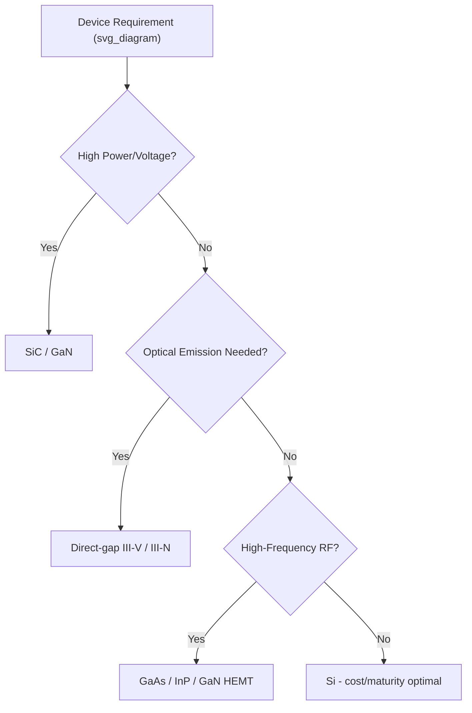

## Material Selection Criteria for Devices

### Overview

Semiconductor material selection is a multi-constraint optimization problem balancing electronic, optical, thermal, mechanical, and economic factors against target device performance. No single material dominates across all applications; selection depends on matching intrinsic material properties to the physics of the intended device function.

### Electronic Properties

#### Bandgap Energy

Determines operating voltage, leakage current, and optical absorption/emission wavelength.

**Key Points**

- Wide bandgap ($E_g > 2$ eV, e.g., SiC, GaN, diamond) → high breakdown voltage, high-temperature operation, power electronics
- Narrow bandgap ($E_g < 0.5$ eV, e.g., InSb, HgCdTe) → infrared detection, low-power switching
- Mid-range bandgap (Si, GaAs) → general-purpose logic, RF, and visible/near-IR optoelectronics

#### Carrier Mobility

High electron/hole mobility reduces resistive loss and enables high-frequency operation.

$$\mu = \frac{q\tau}{m^*}$$

where $\tau$ is scattering time and $m^*$ is effective mass. GaAs and InP offer substantially higher electron mobility than Si, favoring RF and high-speed digital applications, though Si's mature processing ecosystem often outweighs this for mainstream logic.

#### Breakdown Field and Saturation Velocity

Critical for power devices: higher breakdown field ($E_{crit}$) allows thinner drift regions at a given blocking voltage, reducing on-resistance. Materials figure of merit (Baliga FOM) captures this trade-off:

$$BFOM = \varepsilon_r \mu E_{crit}^3$$

SiC and GaN substantially outperform Si on this metric, driving their adoption in power converters.

### Optical Properties

#### Direct vs. Indirect Bandgap

- Direct-gap materials (GaAs, InP, GaN) → efficient photon emission, used in LEDs/lasers
- Indirect-gap materials (Si, Ge) → poor radiative efficiency, generally unsuitable for light emitters without engineering (e.g., strained Ge, quantum confinement)

**Key Points**

- Absorption coefficient and emission wavelength must match target application (detectors: absorb strongly at signal wavelength; emitters: efficient radiative recombination)
- Refractive index affects waveguide design and optical confinement in photonic devices

### Thermal Properties

#### Thermal Conductivity

Determines heat dissipation capacity, critical in high-power-density devices.

| Material | Thermal Conductivity (W/m·K) |
| --- | --- |
| Diamond | ~2000 |
| SiC | ~370–490 |
| GaN | ~130 |
| Si | ~150 |
| GaAs | ~55 |

[Inference] Values vary with doping, defect density, and temperature; the ordering above is broadly consistent with commonly cited literature ranges.

#### Maximum Operating Temperature

Governed by intrinsic carrier concentration crossing over doping concentration; wider-bandgap materials sustain higher junction temperatures before intrinsic conduction dominates.

### Mechanical and Structural Properties

- **Lattice constant**: dictates epitaxial compatibility and substrate availability
- **Thermal expansion coefficient**: mismatch with substrate/packaging causes stress, cracking, or delamination during thermal cycling
- **Hardness/fracture toughness**: affects wafer handling, dicing yield, and mechanical reliability
- **Crystal defect density**: dislocations and stacking faults degrade minority carrier lifetime and device reliability

### Substrate Availability and Cost

Practical selection is constrained by:

- Wafer size availability (Si up to 300–450 mm; GaN/SiC historically limited to smaller diameters, though this is expanding)
- Native substrate existence (GaN often grown heteroepitaxially on sapphire or SiC due to lack of large native substrates)
- Cost per unit area and yield economics
- Maturity of associated process infrastructure (doping, etching, contact formation, passivation)

**Key Points**

- Mature ecosystems (Si CMOS) lower switching cost due to established design rules, foundry access, and reliability data
- Emerging materials often face a "chicken-and-egg" cost barrier until volume production justifies infrastructure investment

### Doping and Defect Engineering

- Achievable doping range (both n-type and p-type) must support the device's junction design
- Some materials exhibit doping asymmetry (e.g., historical difficulty achieving stable p-type ZnO or high-quality p-type GaN prior to Mg-activation breakthroughs)
- Deep-level defects and trap states affect carrier lifetime, critical for minority-carrier devices (bipolar transistors, solar cells)

### Reliability and Degradation Mechanisms

- Electromigration resistance in metallization
- Hot-carrier degradation sensitivity
- Radiation hardness (important for aerospace/space applications — wide bandgap materials often show intrinsic radiation tolerance)
- Chemical stability (oxidation behavior, moisture sensitivity)

### Decision Framework by Application Class

### Worked Example: Power MOSFET Material Choice

**Example**

For a 650V power switching application: Si superjunction MOSFETs are cost-competitive but approach theoretical on-resistance limits (Si's Baliga FOM ceiling). GaN HEMTs offer lower switching losses and higher frequency operation, ideal for compact high-efficiency converters, while SiC MOSFETs provide superior thermal conductivity and higher voltage headroom for industrial/automotive traction applications. The final choice balances switching frequency target, thermal budget, and system-level cost — not device FOM alone.

### Summary Selection Checklist

- Target bandgap for voltage/wavelength requirements
- Required carrier mobility for speed/frequency
- Thermal budget and expected junction temperature
- Substrate/epitaxy compatibility and lattice matching
- Doping range achievability for both polarities
- Cost, wafer size, and foundry process maturity
- Reliability requirements (radiation, hot-carrier, long-term stability)

**Related Topics**

- Baliga figure of merit and power device benchmarking
- Wide-bandgap semiconductor manufacturing challenges (SiC/GaN substrate defects)
- Heteroepitaxy and substrate engineering (buffer layers, lattice-mismatch mitigation)
- Thermal management and packaging for high-power devices
- Radiation-hardened semiconductor design for aerospace