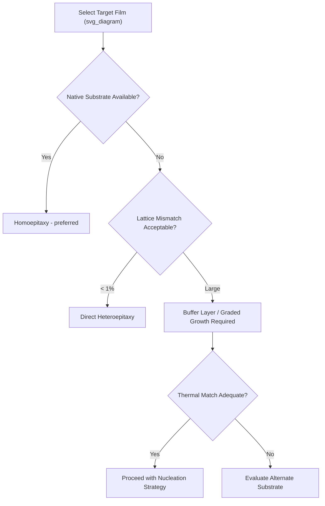

## Substrate and Epitaxial Compatibility

### Overview

Epitaxial growth requires close matching between substrate and film in crystal structure, lattice constant, and thermal expansion behavior. Mismatches in any of these parameters introduce defects, strain, or stress that degrade device performance, making substrate selection one of the most consequential decisions in heterostructure design.

### Homoepitaxy vs. Heteroepitaxy

#### Homoepitaxy

Growth of a film on a substrate of the same material (e.g., Si on Si, GaAs on GaAs). Provides near-perfect lattice and thermal matching, enabling low-defect-density films used for high-performance devices.

#### Heteroepitaxy

Growth of a film on a chemically/structurally different substrate. Necessary when native substrates are unavailable, too costly, or too small (e.g., GaN on sapphire or SiC, since bulk GaN substrates are limited in size and expensive).

**Key Points**

- Heteroepitaxy always introduces some degree of lattice and/or thermal mismatch
- Buffer layers and graded transition layers are standard mitigation strategies

### Lattice Matching

#### Lattice Mismatch Parameter

$$f = \frac{a_{film} - a_{substrate}}{a_{substrate}}$$

Small $|f|$ (ideally < 0.1%) permits thick, low-defect epitaxial growth. Larger mismatch forces the film to accommodate strain elastically up to a critical thickness, beyond which misfit dislocations nucleate to relax the strain plastically.

**Example**

$Al_xGa_{1-x}As$ on GaAs: since AlAs and GaAs lattice constants differ by only ~0.15%, arbitrary composition $x$ can be grown nearly defect-free across the full range — a major reason this system underpins so much optoelectronic device design. In contrast, $In_xGa_{1-x}As$ on GaAs has significant mismatch that grows with In content, limiting achievable thickness before relaxation.

#### Critical Thickness

The Matthews-Blakeslee model estimates the maximum strained-layer thickness before dislocation formation becomes energetically favorable:

$$h_c \approx \frac{b}{8\pi f}\left(1 - \nu\cos^2\theta\right)\ln\left(\frac{h_c}{b}\right)/(1+\nu)$$

where $b$ is the Burgers vector magnitude, $\nu$ is Poisson's ratio, and $\theta$ is the dislocation character angle. [Inference] In practice, empirical calibration curves are more commonly used in process design than direct solution of this implicit equation, since it must be solved iteratively.

### Thermal Expansion Mismatch

Even lattice-matched systems can develop stress during cooldown from growth temperature if thermal expansion coefficients ($\alpha$) differ:

$$\sigma \approx \frac{E}{1-\nu}\Delta\alpha \cdot \Delta T$$

**Key Points**

- GaN on sapphire: large lattice mismatch (~16%) *and* thermal mismatch, historically requiring low-temperature nucleation layers to manage defect density
- GaN on SiC: better thermal conductivity match, favored for high-power RF devices despite higher substrate cost
- Wafer bow and cracking are common failure modes from uncontrolled thermal mismatch stress

### Crystal Structure and Polarity Matching

Substrate and film must share compatible crystal symmetry (e.g., zinc-blende on zinc-blende, or wurtzite on wurtzite) or a well-defined orientation relationship must exist (e.g., cubic-on-hexagonal epitaxial relationships in some GaAs-on-Si work).

- **Polar vs. nonpolar surfaces**: III-N materials grown along the c-axis exhibit polarization discontinuities at interfaces, influencing 2DEG formation in HEMTs
- **Antiphase domains**: arise when growing polar materials (e.g., GaAs) on nonpolar substrates (e.g., Si), requiring offcut substrates or specialized nucleation schemes to suppress

### Common Substrate/Film Pairings

| Film | Common Substrate(s) | Mismatch Character |
| --- | --- | --- |
| GaAs | GaAs (native) | Homoepitaxial |
| InGaAsP | InP (native) | Lattice-matched at specific composition |
| GaN | Sapphire, SiC, Si | Heteroepitaxial, large mismatch |
| SiGe | Si (native, strained) | Compositionally graded buffers |
| III-V on Si | Si | Large lattice + thermal + polarity mismatch |

### Buffer and Transition Layer Strategies

#### Graded Buffer Layers

Composition is gradually varied (e.g., step-graded or linearly graded SiGe on Si) to progressively accommodate lattice mismatch, confining most dislocations to the buffer rather than the active device layer.

#### Low-Temperature Nucleation Layers

Thin, low-temperature-grown seed layers (common in GaN-on-sapphire MOCVD) promote favorable nucleation and reduce threading dislocation density before high-temperature growth resumes.

#### Aspect Ratio Trapping / Selective Area Growth

Growing epitaxial material within narrow trenches allows dislocations to terminate on sidewalls rather than propagate to the surface — used for integrating III-V or Ge on Si in CMOS-compatible processes.

**Key Points**

- Threading dislocation density is a key epitaxial quality metric, often characterized via etch-pit density or transmission electron microscopy
- Dislocations act as non-radiative recombination centers, degrading minority carrier lifetime and optoelectronic efficiency

### Compatibility Assessment Workflow

### Characterization Techniques for Compatibility Verification

- **X-ray diffraction (XRD)**: reciprocal space mapping to quantify strain relaxation and lattice constant
- **Transmission electron microscopy (TEM)**: direct imaging of dislocation networks and interface abruptness
- **Atomic force microscopy (AFM)**: surface morphology, cross-hatch patterns indicating relaxation
- **Photoluminescence (PL)**: indirect assessment of defect density via non-radiative recombination signatures

### Summary Considerations

- Lattice mismatch dictates achievable defect-free thickness
- Thermal expansion mismatch drives post-growth stress and wafer bow
- Crystal symmetry/polarity compatibility avoids antiphase and polarization-related defects
- Buffer engineering extends compatibility beyond naturally matched systems, at the cost of added process complexity

**Related Topics**

- Strain relaxation and misfit dislocation dynamics
- MOCVD/MBE nucleation layer engineering for III-N growth
- Aspect ratio trapping for III-V-on-Si integration
- Wafer bonding as an alternative to direct heteroepitaxy
- Threading dislocation density reduction techniques