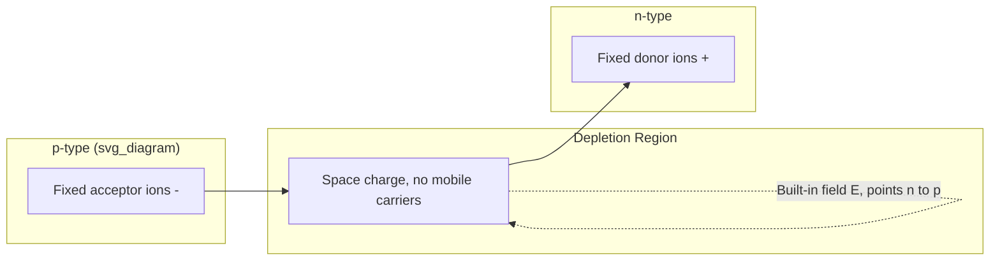

## Junction Formation and the Depletion Approximation

### Overview

The p-n junction forms when p-type and n-type semiconductor regions are brought into intimate contact within a single crystal. Carrier diffusion across the metallurgical junction establishes a space-charge region, and the depletion approximation provides the standard analytical framework for modeling this region's electrostatics.

### Physical Formation Process

#### Initial Contact and Diffusion

At the instant of junction formation (conceptually, or via fabrication processes like diffusion/implantation into a single crystal), large carrier concentration gradients exist:

- Electrons diffuse from n-side (high concentration) to p-side (low concentration)
- Holes diffuse from p-side to n-side

This diffusion leaves behind fixed, ionized dopant charges: positively charged donor ions ($N_D^+$) on the n-side and negatively charged acceptor ions ($N_A^-$) on the p-side, since the mobile carriers that originally neutralized them have departed.

#### Built-In Electric Field

The exposed fixed charges create an electric field pointing from n-side to p-side, which opposes further diffusion by exerting a drift force on carriers in the opposite direction. Equilibrium is reached when diffusion current and drift current exactly cancel for both carrier types.

**Key Points**

- No net current flows at equilibrium (detailed balance between drift and diffusion)
- The field region is depleted of mobile carriers, hence "depletion region"
- Equilibrium Fermi level is flat (constant) across the entire structure

### The Depletion Approximation

#### Core Assumption

The depletion approximation idealizes the space-charge region as:

- A region of width $W = x_n + x_p$ where mobile carrier concentration is negligible, charge density equals the fixed ionized dopant density
- Abrupt boundaries: outside this region, the semiconductor is assumed perfectly neutral ($\rho = 0$)

This replaces the physically gradual transition (carriers don't vanish infinitely sharply) with a simplified step-function charge profile, enabling closed-form solutions of Poisson's equation.

$$\rho(x) = \begin{cases} -qN_A & -x_p < x < 0 \\ +qN_D & 0 < x < x_n \\ 0 & \text{elsewhere} \end{cases}$$

**Key Points**

- Valid when the depletion width is large compared to the actual transition (Debye length) region
- [Inference] Accuracy degrades for very heavily doped junctions where the actual carrier transition is not sharp relative to the total depletion width

### Poisson's Equation and Field Profile

Integrating Poisson's equation, $\frac{d^2\phi}{dx^2} = -\rho(x)/\varepsilon_s$, across the depletion approximation charge profile yields a triangular (piecewise-linear) electric field:

$$E(x) = -\frac{qN_A}{\varepsilon_s}(x + x_p) \quad \text{for } -x_p < x < 0$$

$$E(x) = -\frac{qN_D}{\varepsilon_s}(x_n - x) \quad \text{for } 0 < x < x_n$$

Peak field occurs at the metallurgical junction ($x=0$):

$$E_{max} = \frac{qN_D x_n}{\varepsilon_s} = \frac{qN_A x_p}{\varepsilon_s}$$

### Charge Neutrality Condition

Since the total positive charge must equal total negative charge across the depletion region:

$$N_A x_p = N_D x_n$$

This shows the depletion width extends further into the more lightly doped side — a key design implication for asymmetric junctions ($p^+n$ or $n^+p$).

### Built-In Potential

Integrating the electric field gives the built-in potential $V_{bi}$, equal to the total band bending required to equalize Fermi levels:

$$V_{bi} = \frac{kT}{q}\ln\left(\frac{N_A N_D}{n_i^2}\right)$$

**Example**

For Si at 300 K with $N_A = N_D = 10^{17}\ \text{cm}^{-3}$ and $n_i \approx 1.5\times10^{10}\ \text{cm}^{-3}$: $V_{bi} \approx 0.026 \times \ln(10^{34}/2.25\times10^{20}) \approx 0.82$ V.

### Depletion Width Expressions

Combining charge neutrality and the potential relation gives the total depletion width under equilibrium (zero applied bias):

$$W_0 = \sqrt{\frac{2\varepsilon_s V_{bi}}{q}\left(\frac{1}{N_A}+\frac{1}{N_D}\right)}$$

Individual partition into each side:

$$x_n = W_0 \cdot \frac{N_A}{N_A+N_D}, \qquad x_p = W_0 \cdot \frac{N_D}{N_A+N_D}$$

**Key Points**

- Lightly doped side dominates the total depletion width
- One-sided step junctions ($N_A \gg N_D$ or vice versa) are common in practice (e.g., $p^+n$ diodes) and simplify to $W_0 \approx \sqrt{2\varepsilon_s V_{bi}/(qN_{light})}$

### Band Diagram Under the Depletion Approximation

### Charge, Field, and Potential Profile (Schematic)

<svg xmlns="http://www.w3.org/2000/svg" viewBox="0 0 700 420">
<text x="350" y="25" font-size="16" text-anchor="middle" font-weight="bold">Depletion Approximation Profiles (svg_diagram)</text>

<text x="20" y="60" font-size="13">Charge density ρ(x)</text>

<line x1="50" y1="110" x2="650" y2="110" stroke="black" stroke-width="1" />

<rect x="200" y="70" width="150" height="40" fill="`#d9534f`" opacity="0.6" />

<text x="275" y="95" font-size="11" text-anchor="middle" fill="white">-qN_A</text>

<rect x="350" y="110" width="150" height="40" fill="`#428bca`" opacity="0.6" />

<text x="425" y="135" font-size="11" text-anchor="middle" fill="white">+qN_D</text>

<line x1="350" y1="70" x2="350" y2="150" stroke="black" stroke-dasharray="4" />

<text x="352" y="165" font-size="10">x=0</text>

<text x="20" y="210" font-size="13">Electric field E(x)</text>

<line x1="50" y1="260" x2="650" y2="260" stroke="black" stroke-width="1" />

<polygon points="200,260 350,190 500,260" fill="none" stroke="#333" stroke-width="2" />

<text x="350" y="180" font-size="10" text-anchor="middle">E_max</text>

<text x="20" y="310" font-size="13">Potential φ(x)</text>

<path d="M 200 400 Q 275 400 350 360 Q 425 320 500 320" fill="none" stroke="#333" stroke-width="2" />

<line x1="50" y1="400" x2="650" y2="400" stroke="black" stroke-width="1" />

<text x="510" y="315" font-size="10">V_bi</text>

<text x="200" y="415" font-size="10">x_p</text>

<text x="490" y="415" font-size="10">x_n</text>

</svg>

### Limitations of the Approximation

- Assumes complete carrier depletion within $W$ and complete neutrality outside — real carrier concentration transitions smoothly over a Debye length ($L_D \sim$ few nm for typical doping)
- Ignores band-bending curvature at the depletion edges (a more exact solution shows rounded, not sharp, transitions)
- Breaks down under very high doping (degenerate semiconductors) or very high injection conditions where excess carrier concentrations become comparable to doping density

**Related Topics**

- Built-in potential and Fermi level alignment derivation
- One-sided (step) vs. linearly graded junction models
- Depletion capacitance and C-V profiling
- Reverse-bias depletion width modulation
- Avalanche and Zener breakdown field limits