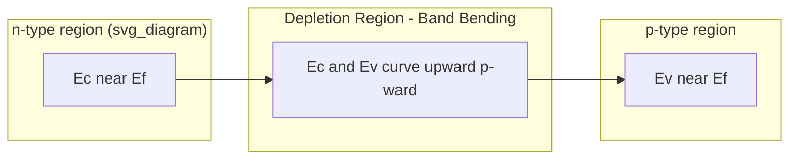

## Built-In Potential and Band Bending

### Overview

When p-type and n-type regions form a junction, their originally distinct Fermi levels must align at equilibrium, producing a characteristic bending of the energy bands across the space-charge region. The magnitude of this bending is quantified by the built-in potential, $V_{bi}$, a central parameter governing junction electrostatics, capacitance, and current-voltage behavior.

### Origin of Band Bending

#### Fermi Level Alignment Requirement

In isolation, p-type material has its Fermi level ($E_F$) near the valence band, while n-type material has $E_F$ near the conduction band. At equilibrium, no net current can flow, which requires a single, spatially constant Fermi level throughout the junction (a direct consequence of detailed balance in the absence of external bias or illumination).

Since the vacuum level and band positions relative to $E_F$ are fixed properties of each doped region far from the junction, aligning the Fermi levels forces the conduction and valence bands to bend continuously through the transition region.

**Key Points**

- Band bending is not arbitrary — it is uniquely determined by the requirement of a flat equilibrium Fermi level
- The direction of bending: bands bend upward moving from n-side to p-side (energy increases), consistent with the built-in field direction

#### Relation to the Built-In Electric Field

The band bending directly reflects the electrostatic potential profile established by the depletion region's fixed charge (see depletion approximation). Since $E(x) = -d\phi/dx$ and band energy $= -q\phi(x) + \text{const}$, the field and band curvature are two descriptions of the same physical quantity.

### Deriving the Built-In Potential

#### From Carrier Concentration Ratios

Far from the junction, carrier concentrations follow:

$$p_{p0} = N_A, \qquad n_{n0} = N_D$$

$$n_{p0} = \frac{n_i^2}{N_A}, \qquad p_{n0} = \frac{n_i^2}{N_D}$$

The built-in potential is the potential difference required to produce the majority-to-minority concentration ratio on each side, derived from the equilibrium condition that drift and diffusion currents cancel:

$$V_{bi} = \frac{kT}{q}\ln\left(\frac{N_A N_D}{n_i^2}\right)$$

**Key Points**

- $kT/q$ is the thermal voltage, ≈ 0.0259 V at 300 K
- $V_{bi}$ increases with doping concentration (logarithmically) and decreases with increasing $n_i$ (i.e., decreases at higher temperature, since $n_i$ rises with T)

#### From Work Function Difference

Equivalently, $V_{bi}$ equals the difference between the work functions of the p-type and n-type materials before contact:

$$qV_{bi} = W_p - W_n = (E_{vac} - E_{F,p}) - (E_{vac} - E_{F,n})$$

This formulation is especially useful for heterojunctions and metal-semiconductor junctions, where the semiconductor doping-based formula must be replaced or supplemented by band-offset considerations.

### Band Diagram Construction

#### Flat-Band (Isolated) Reference

Before contact, each region's band diagram is drawn independently relative to a common vacuum level, with:

- n-type: $E_F$ close to $E_C$, offset $= \frac{kT}{q}\ln(N_C/N_D)$ below $E_C$
- p-type: $E_F$ close to $E_V$, offset $= \frac{kT}{q}\ln(N_V/N_A)$ above $E_V$

#### Equilibrium Junction Diagram

**Example**

For Si with $N_A = N_D = 10^{17}\ \text{cm}^{-3}$: each side's Fermi level sits roughly 0.15–0.2 eV from its respective band edge (using $N_C \approx 2.8\times10^{19}$, $N_V \approx 1.04\times10^{19}\ \text{cm}^{-3}$). Total band bending equals $V_{bi} \approx 0.82$ eV, distributed as upward-curving bands from n-side to p-side, symmetric in this equal-doping case.

### Quantitative Band Bending Profile

Since $\phi(x)$ is piecewise parabolic under the depletion approximation (integrating the triangular field profile), the conduction band edge follows:

$$E_C(x) = E_C(-\infty) + q\phi(x)$$

with $\phi(x)$ quadratic within each side of the depletion region and flat outside it — producing the smoothly curved (parabolic-segment) band diagram typical of textbook p-n junction illustrations.

<svg xmlns="http://www.w3.org/2000/svg" viewBox="0 0 700 320">
<text x="350" y="25" font-size="16" text-anchor="middle" font-weight="bold">Equilibrium Band Diagram (svg_diagram)</text>

<line x1="50" y1="160" x2="650" y2="160" stroke="#888" stroke-dasharray="6,4" stroke-width="1.5" />
<text x="655" y="164" font-size="12">E_F</text>

<path d="M 50 90 L 250 90 Q 350 90 350 160 Q 350 230 450 230 L 650 230" fill="none" stroke="#428bca" stroke-width="2.5" />
<text x="60" y="80" font-size="12" fill="#428bca">E_C</text>

<path d="M 50 200 L 250 200 Q 350 200 350 270 Q 350 300 450 300 L 650 300" fill="none" stroke="#d9534f" stroke-width="2.5" />
<text x="60" y="215" font-size="12" fill="#d9534f">E_V</text>

<text x="130" y="130" font-size="13" text-anchor="middle">n-type</text>

<text x="560" y="250" font-size="13" text-anchor="middle">p-type</text>

<text x="350" y="140" font-size="11" text-anchor="middle">Depletion</text>

<line x1="500" y1="90" x2="500" y2="230" stroke="black" stroke-width="1" />
<text x="510" y="160" font-size="12">qV_bi</text>
</svg>

### Dependence on Bias

#### Forward Bias

Applying forward bias $V_F$ lowers the effective barrier: total band bending becomes $q(V_{bi} - V_F)$, reducing the field and depletion width, and exponentially increasing diffusion current (majority carriers overcome a smaller barrier).

#### Reverse Bias

Reverse bias $V_R$ increases total band bending to $q(V_{bi} + V_R)$, widening the depletion region and increasing the peak field — the basis of voltage-variable capacitance (varactor) behavior.

**Key Points**

- $V_{bi}$ itself is a fixed material/doping property; only the *additional* bending imposed by external bias changes
- The generalized depletion width formula becomes $W = \sqrt{\dfrac{2\varepsilon_s (V_{bi} - V_A)}{q}\left(\dfrac{1}{N_A}+\dfrac{1}{N_D}\right)}$, where $V_A$ is positive for forward bias and negative for reverse bias

### Practical Notes and Common Pitfalls

[Inference] $V_{bi}$ is *not* directly measurable as an open-circuit terminal voltage — measuring across the diode terminals under open-circuit equilibrium yields zero volts, since the built-in field is exactly balanced by contact potentials at the metal-semiconductor interfaces; $V_{bi}$ is only accessible indirectly, e.g., via capacitance-voltage extrapolation.

- $V_{bi}$ is typically 0.6–0.9 V for Si p-n junctions, ~1.0–1.4 V for GaAs, and larger for wide-bandgap materials (SiC, GaN), scaling roughly with bandgap
- Heavily doped ($p^+n^+$) junctions approach a practical ceiling near $E_g/q$, since $N_A N_D$ cannot exceed values consistent with non-degenerate approximations without requiring Fermi-Dirac (rather than Boltzmann) statistics corrections

**Related Topics**

- Depletion approximation and space-charge electrostatics
- Junction capacitance and C-V profiling techniques
- Forward and reverse bias current-voltage characteristics
- Metal-semiconductor (Schottky) junction band bending
- Heterojunction band offsets and built-in potential complications