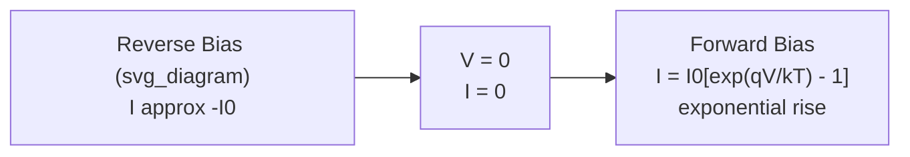

## The Ideal Diode Equation

### Overview

The ideal diode equation (Shockley diode equation) describes the current-voltage relationship of a p-n junction under the idealized assumptions of the depletion approximation, low-level injection, and no generation-recombination within the depletion region itself. It forms the foundational I-V model from which real-diode deviations are measured.

### Derivation Framework

#### Governing Assumptions

- Depletion approximation holds (abrupt space-charge boundaries)
- Low-level injection: injected minority carrier concentration remains small relative to majority carrier concentration
- No generation-recombination current within the depletion region
- Quasi-neutral regions outside the depletion region carry current purely by diffusion
- Boltzmann (non-degenerate) statistics apply

**Key Points**

- These assumptions collectively define the "ideal" regime; real diodes deviate from them at very low and very high current levels
- The derivation combines the minority carrier diffusion equation with boundary conditions set by the law of the junction

#### Law of the Junction

Under applied bias $V$, the minority carrier concentrations at the depletion region edges are related to their equilibrium values by:

$$n_p(x_p) = n_{p0}\exp\left(\frac{qV}{kT}\right), \qquad p_n(x_n) = p_{n0}\exp\left(\frac{qV}{kT}\right)$$

This relation quantifies how forward bias exponentially increases minority carrier injection at the depletion edges, directly linking the electrostatic band-bending reduction to excess carrier populations.

#### Minority Carrier Diffusion Equation

In the quasi-neutral p-region (steady-state, no generation):

$$D_n \frac{d^2 \Delta n_p}{dx^2} - \frac{\Delta n_p}{\tau_n} = 0$$

Solving with boundary conditions (excess carriers → 0 far from junction, and the law-of-the-junction value at $x_p$) yields an exponentially decaying excess carrier profile characterized by diffusion length $L_n = \sqrt{D_n \tau_n}$.

### The Ideal Diode Equation

Combining the diffusion current at each depletion edge:

$$I = I_0\left[\exp\left(\frac{qV}{kT}\right) - 1\right]$$

where the saturation current $I_0$ is:

$$I_0 = qA\left(\frac{D_p p_{n0}}{L_p} + \frac{D_n n_{p0}}{L_n}\right) = qA n_i^2\left(\frac{D_p}{L_p N_D} + \frac{D_n}{L_n N_A}\right)$$

**Key Points**

- $I_0$ depends strongly on $n_i^2$, making it highly temperature-sensitive (since $n_i$ grows exponentially with T)
- $I_0$ scales inversely with doping concentration — more heavily doped diodes exhibit lower saturation current
- Junction area $A$ scales $I_0$ linearly, as expected for a bulk diffusion-limited process

### Forward and Reverse Bias Regimes

#### Forward Bias ($V > 0$, several $kT/q$)

The exponential term dominates: $I \approx I_0 \exp(qV/kT)$, giving the characteristic rapidly rising forward current with increasing voltage — current roughly increases by a factor of $e \approx 2.72$ for every $kT/q \approx 26$ mV increase at 300 K.

#### Reverse Bias ($V < 0$, magnitude greater than a few $kT/q$)

The exponential term vanishes: $I \to -I_0$, a small, essentially voltage-independent reverse saturation current under ideal conditions.

**Example**

For a Si diode with $I_0 = 10^{-14}$ A at 300 K: at $V = 0.6$ V forward bias, $I \approx 10^{-14}\exp(0.6/0.026) \approx 10^{-14} \times 8.9\times10^9 \approx 89$ μA. At $V = -0.6$ V, $I \approx -10^{-14}$ A (negligible).

### I-V Characteristic Curve

<svg xmlns="http://www.w3.org/2000/svg" viewBox="0 0 700 380">
<text x="350" y="25" font-size="16" text-anchor="middle" font-weight="bold">Ideal Diode I-V Characteristic (svg_diagram)</text>

<line x1="80" y1="300" x2="650" y2="300" stroke="black" stroke-width="1.5" />
<line x1="350" y1="60" x2="350" y2="340" stroke="black" stroke-width="1.5" />
<text x="660" y="305" font-size="12">V</text>
<text x="355" y="70" font-size="12">I</text>

<line x1="80" y1="310" x2="350" y2="310" stroke="#d9534f" stroke-width="2" />
<text x="120" y="330" font-size="11" fill="#d9534f">-I₀ (reverse saturation)</text>

<path d="M 350 300 Q 400 295 430 250 Q 460 180 500 100 Q 520 75 540 65" fill="none" stroke="#428bca" stroke-width="2.5" />
<text x="480" y="100" font-size="11" fill="#428bca">Exponential rise</text>

<text x="330" y="320" font-size="11">0</text>

</svg>

### Total Saturation Current Components

$I_0$ combines contributions from both sides of the junction:

$$I_0 = I_{0,p} + I_{0,n}$$

where $I_{0,p} = qAD_p p_{n0}/L_p$ (hole injection into n-side) and $I_{0,n} = qAD_n n_{p0}/L_n$ (electron injection into p-side).

**Key Points**

- In asymmetric junctions (e.g., $p^+n$), the more heavily doped side contributes negligibly to injected minority carrier current, so $I_0$ is dominated by the lightly doped side's term
- This asymmetry is deliberately exploited in devices like bipolar transistors, where emitter injection efficiency depends on this doping ratio

### Departures from Ideal Behavior

Real diodes deviate from the ideal equation due to effects excluded from the derivation:

- **Generation-recombination current** in the depletion region (dominant at low forward bias and in reverse bias for narrow-gap or defect-rich material) — modeled with an ideality factor $n \approx 2$ term
- **High-level injection** (deviation at high forward current, where injected carrier density approaches or exceeds doping density) — slope approaches $n \approx 2$ behavior
- **Series resistance** — causes I-V curve to bend over at high forward current, deviating from pure exponential behavior
- **Reverse breakdown** (avalanche or Zener) — not captured by the ideal equation, which predicts an unphysical constant $-I_0$ at all reverse voltages

The generalized empirical form incorporating ideality factor $n$ (typically 1–2):

$$I = I_0\left[\exp\left(\frac{qV}{nkT}\right) - 1\right]$$

[Inference] $n \approx 1$ indicates diffusion-current-dominated behavior (close to ideal), while $n \approx 2$ indicates recombination-current dominance; intermediate values reflect a mixture of both mechanisms across the operating current range.

### Temperature Dependence

Since $I_0 \propto n_i^2 \propto \exp(-E_g/kT)$, saturation current is highly temperature-sensitive — as a common rule of thumb, $I_0$ roughly doubles for every 8–10°C rise in Si diodes. This drives the well-known negative temperature coefficient of forward voltage at constant current (~-2 mV/°C for Si).

**Related Topics**

- Minority carrier diffusion length and lifetime measurement
- Generation-recombination current and ideality factor extraction
- High-level injection effects and diode I-V rollover
- Diode reverse breakdown mechanisms (avalanche, Zener, tunneling)
- Temperature dependence of diode forward voltage