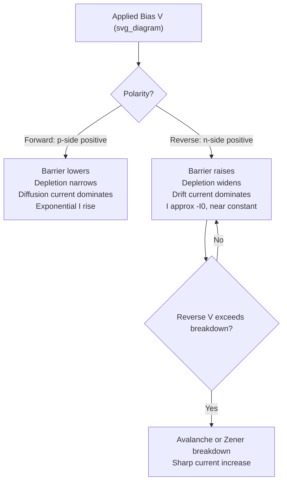

## Forward and Reverse Bias Behavior

### Overview

Applying an external voltage across a p-n junction disturbs the equilibrium balance between drift and diffusion currents, producing dramatically asymmetric current response depending on bias polarity. This asymmetry — large current under forward bias, negligible current under reverse bias (until breakdown) — is the defining functional behavior of the diode.

### Equilibrium Baseline

At zero bias, drift and diffusion currents for each carrier type exactly cancel, yielding zero net current despite the presence of a substantial built-in field and potential $V_{bi}$. This balance is disturbed asymmetrically by external bias because the applied voltage primarily modulates the *diffusion* component (barrier height dependent) while leaving the *drift* component largely unchanged (limited by minority carrier generation rate, not barrier height).

### Forward Bias

#### Mechanism

Applying positive voltage to the p-side relative to the n-side reduces the total band bending from $qV_{bi}$ to $q(V_{bi}-V)$. This lowers the energy barrier majority carriers must overcome to diffuse across the junction.

**Key Points**

- Depletion width narrows: $W = W_0\sqrt{1 - V/V_{bi}}$
- Peak electric field decreases proportionally
- Majority carrier diffusion current increases exponentially with $V$, since it depends on $\exp(-q(V_{bi}-V)/kT)$
- Minority carrier drift current remains essentially constant (still limited by thermal generation rate, not barrier height)

#### Injection of Minority Carriers

As the barrier lowers, majority carriers are injected across the junction in excess of their equilibrium minority concentration on the opposite side — this excess minority carrier population diffuses away and recombines, sustaining the current in the quasi-neutral regions per the ideal diode equation.

**Example**

At forward bias $V = 0.7$ V for a Si diode with $V_{bi} = 0.8$ V: only $0.1$ V of the original barrier remains, allowing substantial carrier diffusion. The current follows $I \approx I_0\exp(qV/kT)$, rising by roughly an order of magnitude for every ~60 mV increase at room temperature (for ideality factor $n=1$).

### Reverse Bias

#### Mechanism

Applying negative voltage to the p-side (positive to n-side) increases total band bending to $q(V_{bi}+|V_R|)$, raising the barrier further and *widening* the depletion region.

**Key Points**

- Depletion width grows: $W = W_0\sqrt{1 + |V_R|/V_{bi}}$
- Peak electric field increases, approaching breakdown field at sufficiently high $|V_R|$
- Majority carrier diffusion current is essentially extinguished (barrier too high to overcome)
- Reverse current is dominated by minority carrier drift — carriers thermally generated within a diffusion length of the depletion edge (or within the depletion region itself) are swept across by the field

#### Saturation Current Behavior

Under the ideal diode model, reverse current saturates at $-I_0$, independent of the magnitude of reverse voltage, because it is limited by the rate of minority carrier generation, not by the barrier height (once the barrier is high enough to fully block diffusion, further increases don't matter).

[Inference] In practice, reverse current in real diodes typically increases slowly with reverse voltage rather than truly saturating, due to depletion-region generation current (proportional to depletion width, which grows with $\sqrt{V_R}$) and surface leakage paths not captured in the ideal model.

### Depletion Width and Capacitance Under Bias

$$W(V) = \sqrt{\frac{2\varepsilon_s(V_{bi}-V)}{q}\left(\frac{1}{N_A}+\frac{1}{N_D}\right)}$$

where $V$ is positive for forward bias, negative for reverse bias (consistent sign convention with $V_{bi}-V$ representing total band bending).

The depletion (junction) capacitance follows from this width, behaving as a parallel-plate capacitor:

$$C_j = \frac{\varepsilon_s A}{W(V)}$$

**Key Points**

- $C_j$ decreases with increasing reverse bias — exploited in varactor diodes for voltage-tunable capacitance applications
- $C_j$ increases as forward bias approaches $V_{bi}$, though the ideal formula becomes less accurate near and beyond this point since $W \to 0$

### Comparative I-V Behavior

### Reverse Breakdown Mechanisms

Although the ideal diode equation predicts indefinite saturation, real junctions break down at sufficiently high reverse bias:

- **Avalanche breakdown**: carriers accelerated by the high field gain enough kinetic energy to generate electron-hole pairs via impact ionization, triggering a multiplicative cascade — dominant in lightly doped junctions with wider depletion regions
- **Zener breakdown**: direct quantum-mechanical tunneling of electrons across a narrow depletion region at high field — dominant in heavily doped junctions where $W$ is small enough for significant tunneling probability

**Key Points**

- Breakdown voltage decreases with increasing doping concentration (narrower depletion region reaches critical field at lower applied voltage)
- Avalanche breakdown typically dominates above ~6 V (Si); Zener dominates at lower breakdown voltages
- [Unverified] The ~6V crossover is a commonly cited rule of thumb for silicon Zener diodes; exact transition depends on doping profile and can vary by device design

### Junction Behavior Summary Table

| Parameter | Forward Bias | Reverse Bias |
| --- | --- | --- |
| Depletion width | Narrows | Widens |
| Peak field | Decreases | Increases |
| Dominant current | Majority carrier diffusion | Minority carrier drift/generation |
| Current magnitude | Exponentially large | Small, near-constant ($I_0$) until breakdown |
| Junction capacitance | Increases (approaching $V_{bi}$) | Decreases |

### Practical Deviations from Ideal Behavior

- **Series resistance**: causes I-V curve to bend at high forward current (ohmic-like behavior superimposed on exponential)
- **Recombination current**: adds an $n \approx 2$ component at low forward bias, most visible in wide-bandgap or defect-rich materials
- **Temperature sensitivity**: both forward voltage (at fixed current) and reverse leakage current shift substantially with temperature due to $n_i$'s exponential temperature dependence

**Related Topics**

- Ideal diode equation and saturation current derivation
- Junction capacitance and varactor diode design
- Avalanche and Zener breakdown physics
- Series resistance effects on diode I-V curves
- Temperature coefficient of diode forward voltage