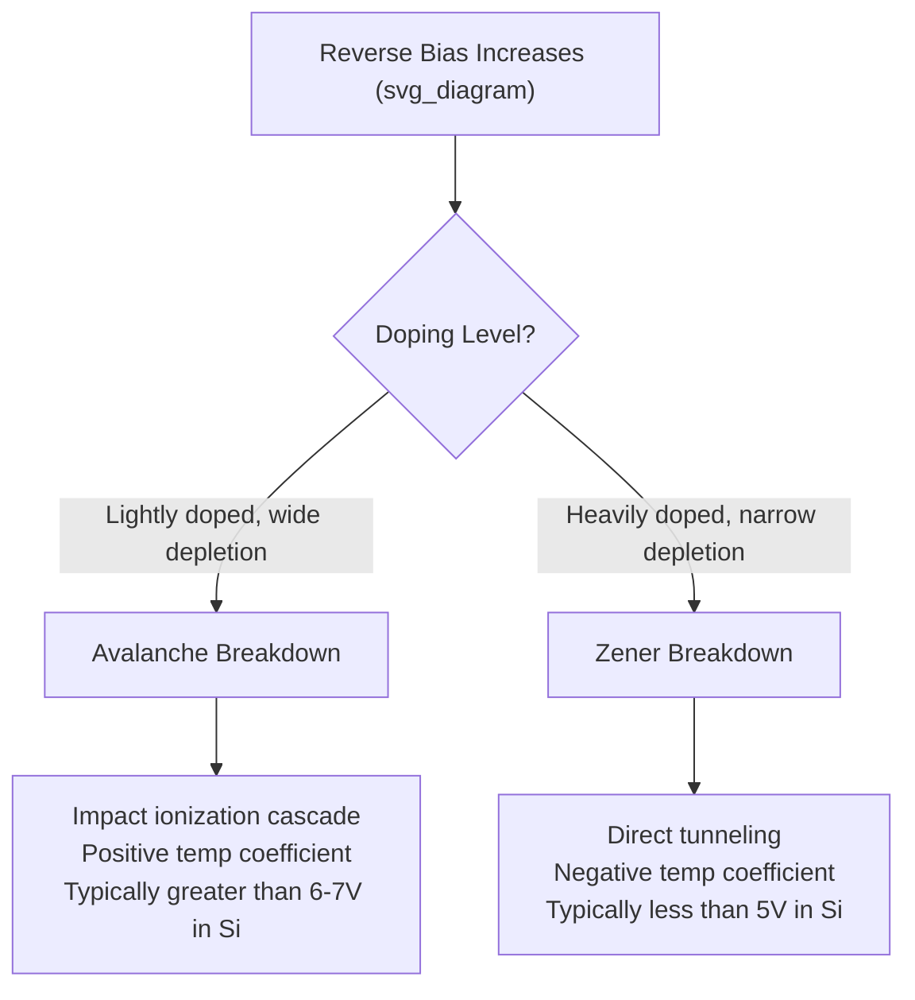

## Junction Breakdown: Avalanche and Zener Mechanisms

### Overview

Under sufficiently high reverse bias, p-n junctions transition from the near-constant saturation current predicted by the ideal diode equation into a sharply rising breakdown current. Two distinct physical mechanisms — avalanche multiplication and Zener tunneling — govern this transition, with the dominant mechanism determined primarily by doping concentration and resulting depletion width.

### Reverse Bias Field Buildup

As reverse bias increases, the depletion width grows and the peak electric field at the metallurgical junction rises:

$$E_{max} = \sqrt{\frac{2q(V_{bi}+|V_R|)}{\varepsilon_s}\cdot\frac{N_AN_D}{N_A+N_D}}$$

Breakdown occurs when $E_{max}$ reaches a critical field $E_{crit}$, characteristic of the semiconductor material, at which point one of the two breakdown mechanisms activates.

**Key Points**

- $E_{crit}$ is material-dependent: roughly 3×10⁵ V/cm for Si, higher for wide-bandgap materials (SiC ~2-3×10⁶ V/cm, GaN similarly elevated)
- Higher doping concentration produces narrower depletion width for a given voltage, reaching $E_{crit}$ at lower applied reverse bias — hence breakdown voltage decreases with increasing doping

### Avalanche Breakdown

#### Physical Mechanism

At high field, carriers traversing the depletion region are accelerated to high kinetic energy between collisions. When a carrier gains sufficient energy (exceeding the semiconductor's bandgap, accounting for momentum conservation), a collision with the lattice can generate a new electron-hole pair via impact ionization. Each newly generated carrier is itself accelerated and can generate further pairs, producing an exponentially multiplying cascade.

#### Multiplication Factor

The avalanche multiplication factor is commonly modeled empirically as:

$$M = \frac{1}{1-(V_R/V_B)^n}$$

where $V_B$ is the breakdown voltage and $n$ is an empirical exponent (typically 3–6, material and carrier-type dependent). As $V_R \to V_B$, $M \to \infty$, representing the onset of sustained avalanche multiplication.

**Key Points**

- Avalanche breakdown dominates in lightly doped junctions, where wider depletion regions allow carriers to accelerate over longer distances between collisions
- Both electrons and holes contribute to impact ionization, though ionization coefficients ($\alpha_n$, $\alpha_p$) generally differ between carrier types and depend strongly on field strength
- [Inference] The self-sustaining condition for avalanche breakdown is typically expressed as an ionization integral reaching unity, though the simplified empirical multiplication formula above is more commonly used in device-level analysis

#### Temperature Dependence

Avalanche breakdown voltage exhibits a *positive* temperature coefficient: as temperature rises, increased phonon scattering reduces the mean free path between collisions, requiring higher field (and thus higher voltage) for carriers to gain sufficient energy for impact ionization between scattering events.

### Zener Breakdown

#### Physical Mechanism

In heavily doped junctions, the depletion region becomes narrow enough that electrons can directly tunnel from the valence band on the p-side to the conduction band on the n-side through the thin energy barrier, a purely quantum-mechanical process requiring no carrier acceleration or impact ionization.

$$T \propto \exp\left(-\frac{4\sqrt{2m^*}E_g^{3/2}}{3q\hbar E}\right)$$

where $T$ is tunneling probability and $E$ is the local electric field — tunneling current rises sharply once the field is high enough for appreciable barrier penetration probability.

**Key Points**

- Zener breakdown dominates in heavily doped junctions ($N_A, N_D$ typically $>10^{18}\ \text{cm}^{-3}$ in Si) where depletion width is narrow (tens of Å) even at modest reverse bias
- Requires band-to-band alignment such that filled valence band states on the p-side align energetically with empty conduction band states on the n-side — a direct consequence of the large total band bending under reverse bias
- Exhibits a *negative* temperature coefficient: increasing temperature narrows the bandgap $E_g$, which increases tunneling probability at a given field, thereby lowering the breakdown voltage

#### Temperature Coefficient as a Diagnostic

**Example**

Diodes with breakdown voltage below ~5 V typically show negative temperature coefficient (Zener-dominated), while those above ~6-7 V show positive temperature coefficient (avalanche-dominated). Near this crossover region, the two mechanisms partially cancel, producing diodes with very low net temperature coefficient — a property specifically exploited in precision voltage reference design.

### Comparative Mechanism Summary

### Breakdown Voltage vs. Doping

<svg xmlns="http://www.w3.org/2000/svg" viewBox="0 0 700 380">
<text x="350" y="25" font-size="16" text-anchor="middle" font-weight="bold">Breakdown Voltage vs Doping Concentration (svg_diagram)</text>
<line x1="80" y1="320" x2="650" y2="320" stroke="black" stroke-width="1.5" />
<line x1="80" y1="320" x2="80" y2="60" stroke="black" stroke-width="1.5" />
<text x="660" y="325" font-size="12">N (doping)</text>
<text x="40" y="55" font-size="12">V_B</text>
<path d="M 100 90 Q 250 150 350 220 Q 450 270 600 300" fill="none" stroke="#428bca" stroke-width="2.5" />
<line x1="350" y1="220" x2="350" y2="320" stroke="black" stroke-dasharray="4" />
<text x="200" y="130" font-size="12" fill="#428bca">Avalanche-dominated</text>
<text x="450" y="290" font-size="12" fill="#d9534f">Zener-dominated</text>
<text x="330" y="335" font-size="10">crossover region</text>
</svg>

### Device Design Implications

- **Power devices**: designed to avoid breakdown under normal operation; breakdown voltage rating is a key datasheet parameter set by drift-region doping and thickness
- **Zener reference diodes**: deliberately operated in breakdown to provide a stable reference voltage; low-voltage devices (Zener-dominated) combined with slight avalanche contribution can yield near-zero temperature coefficient references
- **Avalanche photodiodes (APDs)**: exploit controlled avalanche multiplication to provide internal gain for weak optical signal detection
- **ESD protection devices**: rely on fast, controlled avalanche or Zener breakdown to clamp transient voltage spikes

**Key Points**

- Breakdown is not inherently destructive if current is externally limited; damage occurs from excessive power dissipation ($I \times V$) at the breakdown point, not from the breakdown mechanism itself
- Thermal runaway can occur if localized heating further increases carrier generation, potentially leading to second breakdown and permanent device failure

### Wide-Bandgap Material Considerations

[Inference] Because $E_{crit}$ scales strongly with bandgap, wide-bandgap materials (SiC, GaN) sustain much higher breakdown voltages at a given doping/thickness combination than Si, which is the primary physical basis for their advantage in high-voltage power device applications (also reflected in the Baliga figure of merit).

**Related Topics**

- Ideal diode equation and reverse saturation current
- Baliga figure of merit and power device material selection
- Avalanche photodiode design and gain-bandwidth trade-offs
- Zener voltage reference circuit design
- Impact ionization coefficients and field-dependent carrier transport