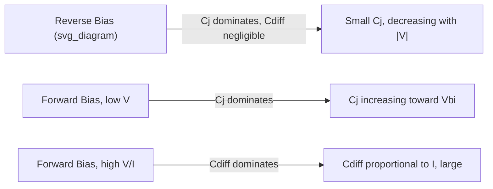

## Junction and Diffusion Capacitance

### Overview

A p-n junction exhibits two distinct capacitive effects that govern its dynamic (frequency- and switching-dependent) behavior: junction (depletion) capacitance, arising from charge stored in the space-charge region, and diffusion capacitance, arising from excess minority carrier charge stored in the quasi-neutral regions under forward bias. Both are essential for modeling diode switching speed, high-frequency response, and small-signal AC behavior.

### Junction (Depletion) Capacitance

#### Physical Origin

The depletion region separates fixed ionized charge ($N_A^-$ on p-side, $N_D^+$ on n-side) across a dielectric-like space-charge layer, analogous to a parallel-plate capacitor. Since this stored charge changes with applied voltage, the structure exhibits capacitance.

$$C_j(V) = \frac{dQ}{dV} = \frac{\varepsilon_s A}{W(V)}$$

where $W(V)$ is the bias-dependent depletion width.

#### Step Junction Formula

For an abrupt (step) junction:

$$C_j(V) = A\sqrt{\frac{q\varepsilon_s}{2(V_{bi}-V)}\cdot\frac{N_AN_D}{N_A+N_D}} = \frac{C_{j0}}{\sqrt{1-V/V_{bi}}}$$

where $C_{j0}$ is the zero-bias junction capacitance.

**Key Points**

- $C_j$ decreases with increasing reverse bias (wider depletion width → smaller effective capacitor spacing → less capacitance)
- $C_j$ increases as forward bias approaches $V_{bi}$, though the formula becomes inaccurate as $W \to 0$ (diffusion capacitance dominates in this regime anyway)
- Junction capacitance dominates diode behavior under reverse bias and small-signal forward bias below significant conduction

#### Linearly Graded Junction

For junctions where doping varies linearly through the transition region (more representative of diffused junctions than the abrupt approximation):

$$C_j(V) = \frac{C_{j0}}{(1-V/V_{bi})^{1/3}}$$

**Key Points**

- The general empirical form is $C_j = C_{j0}/(1-V/V_{bi})^m$, with $m = 1/2$ for step junctions and $m = 1/3$ for linearly graded junctions
- Real diffused or implanted junctions often fall between these idealized grading profiles; $m$ is frequently extracted empirically from measured C-V data

### Varactor Diode Application

The voltage-tunable nature of $C_j$ is directly exploited in varactor diodes for voltage-controlled oscillators, tunable filters, and frequency synthesizers.

**Example**

A hyperabrupt junction varactor (doping profile engineered to increase $m$ beyond 1/2) provides a more linear frequency-vs-voltage tuning characteristic than a standard step or graded junction, desirable for VCO linearity in phase-locked loop applications.

### Diffusion Capacitance

#### Physical Origin

Under forward bias, excess minority carriers are injected into the quasi-neutral regions and diffuse away from the junction before recombining, per the law of the junction. This stored excess minority carrier charge, which changes with applied voltage, constitutes a second capacitive mechanism distinct from the depletion-region charge.

$$Q_{diff} = q A \int_0^\infty \Delta p_n(x)\, dx \propto I \cdot \tau_p$$

where $\tau_p$ is the minority carrier lifetime.

#### Diffusion Capacitance Formula

$$C_{diff} = \frac{dQ_{diff}}{dV} \approx \frac{q I \tau_p}{kT}$$

(for a one-sided junction dominated by hole injection; a symmetric expression with $\tau_n$ applies for the electron-injection component in the opposite region.)

**Key Points**

- $C_{diff}$ is directly proportional to forward current $I$ — negligible at low forward bias, dominant at high forward bias
- $C_{diff}$ depends on minority carrier lifetime $\tau$, which is a strong function of material quality (defect density) and doping
- Unlike $C_j$, diffusion capacitance is essentially zero under reverse bias (no significant excess minority carrier storage)

### Total Small-Signal Capacitance

$$C_{total}(V) = C_j(V) + C_{diff}(V)$$

### Capacitance vs. Voltage Profile

<svg xmlns="http://www.w3.org/2000/svg" viewBox="0 0 700 380">
<text x="350" y="25" font-size="16" text-anchor="middle" font-weight="bold">Total Diode Capacitance vs Bias (svg_diagram)</text>
<line x1="80" y1="320" x2="650" y2="320" stroke="black" stroke-width="1.5" />
<line x1="350" y1="320" x2="350" y2="60" stroke="black" stroke-width="1.5" />
<text x="660" y="325" font-size="12">V</text>
<text x="355" y="55" font-size="12">C</text>

<path d="M 100 290 Q 250 270 350 240 Q 420 220 460 190" fill="none" stroke="#428bca" stroke-width="2.5" />
<text x="150" y="270" font-size="11" fill="#428bca">C_j (depletion)</text>

<path d="M 460 190 Q 500 150 540 90 Q 560 65 580 55" fill="none" stroke="#d9534f" stroke-width="2.5" />
<text x="500" y="130" font-size="11" fill="#d9534f">C_diff (diffusion)</text>
<line x1="460" y1="60" x2="460" y2="320" stroke="black" stroke-dasharray="4" />
<text x="465" y="335" font-size="10">approaching V_bi</text>
</svg>

### Switching Speed Implications

#### Storage Time and Reverse Recovery

When a forward-conducting diode is abruptly switched to reverse bias, the stored diffusion charge ($Q_{diff}$) must first be removed (via recombination or extraction as reverse current) before the diode can support reverse voltage — this delay is the **reverse recovery time** ($t_{rr}$), a critical parameter in switching diode and power rectifier applications.

$$t_{rr} \approx \tau_p \ln\left(1 + \frac{I_F}{I_R}\right)$$

[Inference] This is a simplified approximation; exact reverse recovery behavior depends on the specific current waveform and carrier lifetime profile, and more detailed charge-control models are typically used in power electronics design.

**Key Points**

- Fast-switching diodes (e.g., Schottky diodes, which lack minority carrier storage entirely) avoid reverse recovery delay, a major advantage in high-frequency rectification
- Gold or platinum doping, electron irradiation, or other lifetime-killing techniques are used to deliberately reduce $\tau$ and speed up recovery in fast-recovery diode design, at the cost of increased forward voltage drop

### Small-Signal Equivalent Circuit

A complete small-signal diode model combines:

- Dynamic (small-signal) junction conductance $g_d = dI/dV$ from the ideal diode equation
- Total capacitance $C_j + C_{diff}$ in parallel
- Series resistance $R_s$ from bulk/contact resistance

This RC network sets the diode's cutoff frequency and determines high-frequency rectification efficiency (relevant for RF detector and mixer diode design).

**Related Topics**

- Reverse recovery time and fast-recovery diode design
- Varactor diode design for voltage-controlled oscillators
- Minority carrier lifetime engineering (doping, irradiation)
- Schottky diode capacitance (majority-carrier-only device)
- Small-signal AC diode modeling and RF applications