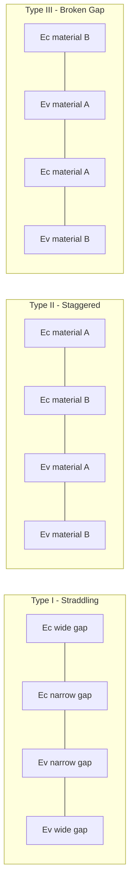

## Heterojunctions and Band Offsets

### Introduction

A heterojunction is an interface formed between two dissimilar semiconductor materials with different bandgaps, such as GaAs/AlGaAs, Si/SiGe, or GaN/AlGaN. Unlike a homojunction (e.g., a Si p-n junction), where the bandgap is continuous across the junction, a heterojunction introduces a discontinuity in the band structure at the interface. This discontinuity — the band offset — is the central physical feature that makes heterojunctions useful for engineering carrier confinement, optical transitions, and transport properties beyond what is possible with a single material.

### Origin of Band Offsets

When two semiconductors with different bandgaps $E_{g1}$ and $E_{g2}$ are joined, the difference in bandgap $\Delta E_g = E_{g2} - E_{g1}$ is distributed between the conduction band and valence band edges. This produces two quantities:

- Conduction band offset: $\Delta E_c$
- Valence band offset: $\Delta E_v$

These satisfy:

$$\Delta E_g = \Delta E_c + \Delta E_v$$

The relative magnitudes of $\Delta E_c$ and $\Delta E_v$ are not fixed by $\Delta E_g$ alone — they depend on the detailed electronic structure of both materials at the interface, including atomic orbital alignment, strain, and interface chemistry. Determining this split is one of the central problems in heterojunction physics.

### Band Alignment Types

Heterojunctions are classified by how the conduction and valence bands of the two materials line up relative to each other.

**Type I (Straddling Gap)**

The bandgap of the narrower-gap material lies entirely within the bandgap of the wider-gap material. Both electrons and holes are confined to the same (narrow-gap) layer. This is the most common configuration, exemplified by GaAs/AlGaAs.

**Type II (Staggered Gap)**

The conduction and valence band edges of one material are both offset in the same direction relative to the other, so that electrons are confined in one layer while holes are confined in the adjacent layer. Example: InAs/GaSb (which can even become "broken gap," see below).

**Type III (Broken Gap)**

An extreme case of Type II where the conduction band minimum of one material lies below the valence band maximum of the other, so the bandgaps do not overlap at all. Example: InAs/GaSb heterojunction under certain conditions.

Band diagram schematic (Type I straddling alignment):

<svg xmlns="http://www.w3.org/2000/svg" viewBox="0 0 640 300" font-family="sans-serif">
<text x="320" y="20" font-size="14" text-anchor="middle" font-weight="bold">Type I Heterojunction Band Diagram (svg_diagram)</text>

<line x1="60" y1="60" x2="220" y2="60" stroke="black" stroke-width="2" />
<line x1="60" y1="220" x2="220" y2="220" stroke="black" stroke-width="2" />
<text x="140" y="45" text-anchor="middle" font-size="12">Ec (wide-gap)</text>
<text x="140" y="240" text-anchor="middle" font-size="12">Ev (wide-gap)</text>

<line x1="220" y1="60" x2="260" y2="100" stroke="black" stroke-width="2" />
<line x1="220" y1="220" x2="260" y2="180" stroke="black" stroke-width="2" />

<line x1="260" y1="100" x2="420" y2="100" stroke="black" stroke-width="2" />
<line x1="260" y1="180" x2="420" y2="180" stroke="black" stroke-width="2" />
<text x="340" y="90" text-anchor="middle" font-size="12">Ec (narrow-gap)</text>
<text x="340" y="200" text-anchor="middle" font-size="12">Ev (narrow-gap)</text>

<line x1="420" y1="100" x2="460" y2="60" stroke="black" stroke-width="2" />
<line x1="420" y1="180" x2="460" y2="220" stroke="black" stroke-width="2" />

<line x1="460" y1="60" x2="600" y2="60" stroke="black" stroke-width="2" />
<line x1="460" y1="220" x2="600" y2="220" stroke="black" stroke-width="2" />

<line x1="240" y1="60" x2="240" y2="100" stroke="red" stroke-width="1.5" stroke-dasharray="3,3" />
<text x="248" y="82" font-size="11" fill="red">ΔEc</text>

<line x1="240" y1="180" x2="240" y2="220" stroke="blue" stroke-width="1.5" stroke-dasharray="3,3" />
<text x="248" y="205" font-size="11" fill="blue">ΔEv</text>

<circle cx="340" cy="112" r="6" fill="red" />
<text x="340" y="130" text-anchor="middle" font-size="10" fill="red">e⁻</text>
<circle cx="340" cy="168" r="6" fill="blue" />
<text x="340" y="160" text-anchor="middle" font-size="10" fill="blue">h⁺</text>

<text x="320" y="270" text-anchor="middle" font-size="11">Both electrons and holes confined in narrow-gap layer (quantum well)</text>

</svg>

### Theoretical Models for Predicting Band Offsets

**Electron Affinity Rule (Anderson's Model)**

The simplest model, proposed by R.L. Anderson, aligns the vacuum levels of the two semiconductors and computes the conduction band offset directly from the difference in electron affinities $\chi$:

$$\Delta E_c = \chi_1 - \chi_2$$

$$\Delta E_v = \Delta E_g - \Delta E_c$$

While conceptually simple and widely taught, Anderson's model is known to be inaccurate in many real systems because it ignores interface dipoles, chemical bonding effects, and strain — it treats the vacuum level as a universal reference, which is not physically valid at an atomically abrupt interface. [Inference: the degree of error varies significantly by material system and is generally larger for highly polar or lattice-mismatched interfaces.]

**Common Anion Rule**

An empirical heuristic stating that when two semiconductors share the same anion (e.g., AlAs/GaAs, both containing As), the valence band offset tends to be small because the valence band is primarily derived from anion p-orbitals. This rule works reasonably well for some III-V systems but has known exceptions.

**Model-Solid Theory (Van de Walle)**

A more rigorous approach that establishes an absolute energy reference ("model solid" reference energy) computed from first-principles pseudopotential calculations for each material's average valence band energy, referenced to a common hydrogenic level. Band offsets are then obtained by aligning these absolute references and explicitly including strain-induced shifts via deformation potential theory. This model is considered significantly more accurate than Anderson's rule for lattice-mismatched, strained heterostructures.

**Self-Consistent / First-Principles (ab initio) Methods**

Modern band offset determination increasingly relies on density functional theory (DFT), often with hybrid functionals or GW corrections to address DFT's well-known bandgap underestimation. These calculations explicitly model the interface dipole formed by charge redistribution at the atomic interface, which is the dominant physical contribution missing from simpler models.

### Strain Effects on Band Offsets

In lattice-mismatched heterojunctions (e.g., SiGe grown on Si, or InGaAs on GaAs), the epitaxial layer is strained to match the in-plane lattice constant of the substrate (pseudomorphic growth), provided the layer thickness is below the critical thickness for dislocation formation. This strain:

- Splits degenerate valence bands (heavy-hole/light-hole degeneracy lifted at $k=0$)
- Shifts conduction band valleys differently depending on their symmetry (e.g., splitting of $\Delta_2$ and $\Delta_4$ valleys in strained Si)
- Modifies the effective band offsets through deformation potentials

The strain-modified band offset can be written schematically as:

$$\Delta E_c^{strained} = \Delta E_c^{unstrained} + \delta E_c^{strain}$$

where $\delta E_c^{strain}$ is computed from the hydrostatic and shear deformation potentials of the conduction band, and the in-plane and perpendicular strain components.

### Measurement Techniques

**Key Points**

- **X-ray Photoelectron Spectroscopy (XPS):** The most widely used direct method. Core-level binding energy differences between the two materials, combined with a thin heterojunction sample, allow extraction of the valence band offset via the Kraut method.
- **Capacitance-Voltage (C-V) Profiling:** Extracts band offset information indirectly from the capacitance response of a heterojunction diode structure.
- **Optical Absorption / Photoluminescence:** In quantum well structures, transition energies between confined states depend on both $\Delta E_c$ and $\Delta E_v$, allowing offsets to be inferred by fitting a particle-in-a-box (or more accurate envelope function) model to measured transition energies.
- **Internal Photoemission (IPE):** Measures the threshold photon energy for photoexcited carriers to surmount the interface barrier, directly giving the offset relevant to that carrier type.

### Device Applications

**Heterojunction Bipolar Transistors (HBTs)**

Using a wider-gap emitter (e.g., AlGaAs) with a narrower-gap base (e.g., GaAs) allows a large valence band offset to suppress hole injection from base to emitter, decoupling the emitter injection efficiency from base doping. This permits heavy base doping (lowering base resistance) without sacrificing current gain — a key advantage over homojunction BJTs.

**High Electron Mobility Transistors (HEMTs)**

A heterojunction (e.g., AlGaN/GaN or AlGaAs/GaAs) creates a triangular quantum well at the interface where a two-dimensional electron gas (2DEG) forms. Because the electrons are spatially separated from their parent dopant atoms (modulation doping), ionized impurity scattering is greatly reduced, yielding very high electron mobility.

**Quantum Well Lasers and LEDs**

Type I heterojunctions confine both electrons and holes in the same narrow-gap active region, increasing radiative recombination efficiency and enabling wavelength tuning via well thickness (quantum confinement) independent of bulk material choice.

**Double Heterostructure (DH) Lasers**

A narrow-gap active layer sandwiched between two wider-gap cladding layers provides both carrier confinement (via band offsets) and optical confinement (via the refractive index step that typically accompanies the bandgap step), which was the key innovation enabling continuous-wave room-temperature semiconductor lasers.

### Worked Example

**Example**

Consider a GaAs/Al$_{0.3}$Ga$_{0.7}$As heterojunction at 300 K.

Given (typical accepted values):

- $E_g$(GaAs) $\approx 1.42$ eV
- $E_g$(Al$_{0.3}$Ga$_{0.7}$As) $\approx 1.42 + 1.247(0.3) \approx 1.79$ eV (linear interpolation, valid for $x < 0.45$)
- Standard empirical band offset ratio for this system: $\Delta E_c : \Delta E_v \approx 65:35$

Calculation:

$$\Delta E_g = 1.79 - 1.42 = 0.37 \text{ eV}$$

$$\Delta E_c = 0.65 \times 0.37 \approx 0.24 \text{ eV}$$

$$\Delta E_v = 0.35 \times 0.37 \approx 0.13 \text{ eV}$$

[Unverified: the 65:35 split is a widely cited empirical approximation for the GaAs/AlGaAs system, but reported values in the literature range roughly from 60:40 to 68:32 depending on measurement technique and Al composition.]

### Common Pitfalls

- Assuming Anderson's electron affinity rule gives accurate quantitative offsets — it is a useful conceptual starting point but not reliable for precision device design.
- Neglecting strain contributions in lattice-mismatched systems, which can shift offsets by tens to hundreds of meV.
- Confusing band offset (a static, equilibrium band-structure property of the heterojunction) with the built-in potential of a p-n junction (which depends on doping and is a electrostatic/Fermi-level quantity) — the two are related but distinct concepts.

### Conclusion

Band offsets at heterojunctions arise from the redistribution of the bandgap difference between conduction and valence bands, governed by interface dipoles, chemical bonding, and strain. While simple models like Anderson's electron affinity rule provide qualitative intuition, accurate device-grade values require either empirical measurement (XPS, optical spectroscopy) or first-principles theory (model-solid theory, DFT). Band offsets are the foundational parameter enabling heterostructure devices — HBTs, HEMTs, quantum well lasers — that exploit engineered carrier and optical confinement unavailable in homojunction devices.

**Related Topics**

- Quantum wells and envelope function approximation
- Modulation doping and the two-dimensional electron gas (2DEG)
- Strained-layer epitaxy and critical thickness (Matthews-Blakeslee model)
- Heterojunction bipolar transistor (HBT) operation
- Double heterostructure laser diodes
- Kraut method for XPS-based band offset extraction
- Deformation potential theory