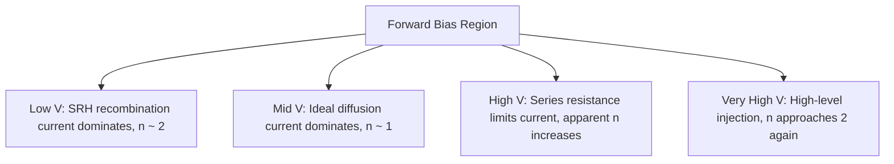

## Non-Ideal Diode Effects

### Introduction

The ideal diode equation, $I = I_0\left(e^{qV/kT} - 1\right)$, is derived under a set of simplifying assumptions: low-level injection, no recombination within the depletion region, no series resistance, and no high-field breakdown mechanisms. Real p-n junction diodes deviate from this ideal behavior in several well-characterized ways. Understanding these non-idealities is essential for accurate circuit modeling, device diagnostics, and technology characterization (e.g., extracting the ideality factor from measured I-V data).

### The Ideality Factor

The most common way non-ideal behavior is quantified is through the ideality factor $n$, introduced into the diode equation as:

$$I = I_0\left(e^{qV/nkT} - 1\right)$$

- $n = 1$: current dominated by ideal diffusion of minority carriers (Shockley diffusion current)
- $n = 2$: current dominated by recombination within the depletion (space-charge) region
- $1 < n < 2$: a mixture of both mechanisms, common in real devices
- $n > 2$: often indicates additional non-ideal mechanisms such as high-level injection, series resistance effects, or tunneling

$n$ is typically extracted from the slope of a semi-log plot of $\ln(I)$ vs. $V$ in the forward-bias region:

$$n = \frac{q}{kT}\left(\frac{dV}{d(\ln I)}\right)$$

### Recombination in the Depletion Region (Sah-Noyce-Shockley)

**Key Points**

- The ideal diode equation only accounts for diffusion current from minority carriers injected into the quasi-neutral regions.
- In practice, generation-recombination centers (deep-level traps) exist within the depletion region itself, especially in indirect-bandgap semiconductors like Si.
- Under forward bias, carriers recombine directly within the space-charge region via Shockley-Read-Hall (SRH) statistics, adding a recombination current component:

$$I_{rec} = I_{02}\left(e^{qV/2kT} - 1\right)$$

- This gives $n \approx 2$ and dominates at low forward-bias voltages, where the diffusion current ($n=1$) is still small.
- Total current is often modeled as the sum of both components:

$$I_{total} = I_{01}\left(e^{qV/kT} - 1\right) + I_{02}\left(e^{qV/2kT} - 1\right)$$

At low V, the $n=2$ recombination term dominates; at higher V, the $n=1$ diffusion term takes over — producing the characteristic "knee" or slope change seen in real semi-log I-V plots.

### High-Level Injection

The ideal diode equation assumes low-level injection: injected minority carrier concentration is much smaller than the majority carrier (doping) concentration. At sufficiently high forward bias, injected carrier density becomes comparable to or exceeds the background doping concentration on the lightly doped side.

Under high-level injection, both electron and hole concentrations must be considered together (ambipolar transport), and the current-voltage relationship transitions toward:

$$I \propto e^{qV/2kT}$$

giving an apparent ideality factor approaching $n = 2$ at high current — but for a different physical reason than depletion-region recombination. This can make it difficult to distinguish high-level injection effects from recombination-current effects using ideality factor alone without additional analysis (e.g., temperature-dependent measurements).

### Series Resistance Effects

Real diodes have parasitic series resistance $R_s$ from the quasi-neutral bulk regions, ohmic contacts, and interconnect. This resistance causes a portion of the applied voltage to be dropped resistively rather than across the junction:

$$V_{applied} = V_{junction} + I R_s$$

The modified diode equation becomes:

$$I = I_0\left(e^{q(V - IR_s)/nkT} - 1\right)$$

**Effects on I-V characteristics:**

- At low current, $IR_s \ll V$, so the effect is negligible and the ideal exponential behavior holds.
- At high current, the $IR_s$ term becomes significant, causing the semi-log I-V curve to bend away from the ideal exponential slope — current increases more slowly than exponential prediction, and eventually the diode behaves nearly resistively (linear I-V).
- Series resistance is commonly extracted using methods such as the Cheung method or Norde's method, which use the slope deviation at high forward current.

### Junction (Shunt) Leakage and Parallel Resistance

Real devices often exhibit a parallel leakage path (shunt resistance $R_{sh}$) due to surface leakage currents, edge effects at the junction perimeter, or crystal defects/dislocations providing low-resistance current paths. This is modeled as a resistor in parallel with the ideal diode:

$$I = I_0\left(e^{qV/nkT} - 1\right) + \frac{V}{R_{sh}}$$

Shunt resistance primarily affects behavior at low forward bias and under reverse bias, where it causes the reverse leakage current to increase roughly linearly with voltage rather than saturating, and can significantly degrade solar cell fill factor and diode rectification ratio.

**Equivalent Circuit Model (Single-Diode Model with Parasitics)**

<svg xmlns="http://www.w3.org/2000/svg" viewBox="0 0 640 260" font-family="sans-serif">
<text x="320" y="20" font-size="14" text-anchor="middle" font-weight="bold">Non-Ideal Diode Equivalent Circuit (svg_diagram)</text>

<line x1="40" y1="130" x2="90" y2="130" stroke="black" stroke-width="2" />
<text x="30" y="125" font-size="11" text-anchor="end">V_applied</text>

<rect x="90" y="115" width="60" height="30" fill="none" stroke="black" stroke-width="2" />
<text x="120" y="105" font-size="11" text-anchor="middle">Rs</text>
<line x1="150" y1="130" x2="200" y2="130" stroke="black" stroke-width="2" />

<circle cx="200" cy="130" r="3" fill="black" />

<line x1="200" y1="130" x2="200" y2="70" stroke="black" stroke-width="2" />
<line x1="200" y1="70" x2="320" y2="70" stroke="black" stroke-width="2" />
<polygon points="330,70 345,63 345,77" fill="black" />
<line x1="345" y1="60" x2="345" y2="80" stroke="black" stroke-width="2" />
<text x="337" y="50" font-size="11" text-anchor="middle">Ideal Diode (n=1)</text>
<line x1="345" y1="70" x2="460" y2="70" stroke="black" stroke-width="2" />

<line x1="200" y1="130" x2="200" y2="130" stroke="black" stroke-width="2" />
<line x1="220" y1="130" x2="320" y2="130" stroke="black" stroke-width="2" />
<polygon points="330,130 345,123 345,137" fill="black" />
<line x1="345" y1="120" x2="345" y2="140" stroke="black" stroke-width="2" />
<text x="337" y="150" font-size="11" text-anchor="middle">Recomb. Diode (n=2)</text>
<line x1="345" y1="130" x2="460" y2="130" stroke="black" stroke-width="2" />

<line x1="220" y1="190" x2="320" y2="190" stroke="black" stroke-width="2" />
<rect x="320" y="175" width="60" height="30" fill="none" stroke="black" stroke-width="2" />
<text x="350" y="220" font-size="11" text-anchor="middle">Rsh</text>
<line x1="380" y1="190" x2="460" y2="190" stroke="black" stroke-width="2" />
<line x1="200" y1="130" x2="200" y2="190" stroke="black" stroke-width="2" />
<line x1="200" y1="190" x2="220" y2="190" stroke="black" stroke-width="2" />

<line x1="460" y1="70" x2="480" y2="70" stroke="black" stroke-width="2" />
<line x1="460" y1="130" x2="480" y2="130" stroke="black" stroke-width="2" />
<line x1="460" y1="190" x2="480" y2="190" stroke="black" stroke-width="2" />
<line x1="480" y1="70" x2="480" y2="190" stroke="black" stroke-width="2" />
<line x1="480" y1="130" x2="530" y2="130" stroke="black" stroke-width="2" />
<text x="545" y="125" font-size="11">Output</text>
</svg>

### Reverse Breakdown Mechanisms

At sufficiently large reverse bias, the ideal diode's reverse saturation current $-I_0$ no longer holds, and current increases rapidly. Two dominant physical mechanisms:

**Avalanche (Impact Ionization) Breakdown**

Carriers accelerated by the strong depletion-region electric field gain enough kinetic energy to generate electron-hole pairs through impact ionization, which themselves can generate further pairs — a multiplicative process. This dominates in lightly to moderately doped junctions with wide depletion regions and is the mechanism behind Zener diodes rated above roughly 6-7 V (a naming convention retained even though avalanche, not Zener tunneling, is the actual mechanism at these voltages).

**Zener (Tunneling) Breakdown**

In heavily doped junctions with narrow depletion regions, the electric field can become large enough (typically $> 10^6$ V/cm) for direct quantum-mechanical band-to-band tunneling of electrons from the valence band of the p-side to the conduction band of the n-side. This dominates in heavily doped junctions with breakdown voltages below approximately 5 V. [Unverified: the exact voltage crossover point between tunneling-dominated and avalanche-dominated breakdown depends on doping profile and temperature, and different references cite it in the 4-8 V range.]

Both mechanisms show characteristic temperature dependence with opposite signs, which is used experimentally to distinguish them: avalanche breakdown voltage increases with temperature (phonon scattering reduces carrier mean free path, requiring higher field for ionization), while Zener tunneling breakdown voltage decreases with temperature (bandgap narrowing increases tunneling probability).

### Temperature Dependence of Non-Idealities

**Key Points**

- $I_0$ has strong exponential temperature dependence through $n_i^2$, dominating over the linear $T$ dependence elsewhere in the diode equation.
- The ideality factor itself can appear temperature-dependent in measured data if multiple recombination mechanisms with different activation energies contribute at different temperatures — a phenomenon sometimes attributed to trap-assisted tunneling or interface state effects, particularly at low temperature.
- Series resistance typically decreases with increasing temperature in lightly doped semiconductors (due to increased intrinsic carrier concentration and mobility changes), though the sign of this dependence can reverse depending on doping level and scattering mechanisms. [Behavior may vary by material system and doping.]

### High-Frequency / Charge Storage Effects

Non-ideal transient behavior arises from charge storage in the diode:

- **Diffusion capacitance:** Under forward bias, minority carrier charge stored in the quasi-neutral regions gives rise to a capacitance that dominates over depletion capacitance, becoming important for switching speed and reverse recovery time.
- **Reverse recovery:** When a forward-conducting diode is suddenly reverse-biased, stored minority charge must be removed before the diode can block reverse current, producing a brief reverse current spike before the diode fully turns off. This is a critical non-ideality in power electronics and rectifier circuit design.

### Practical Diagnostic Summary

| Region of I-V curve | Dominant non-ideal mechanism | Typical signature |
| --- | --- | --- |
| Low forward V | Depletion-region SRH recombination | $n \approx 2$ |
| Mid forward V | Ideal diffusion current | $n \approx 1$ |
| High forward V | Series resistance | Log(I) vs V bends, saturates |
| Very high forward V | High-level injection | $n \to 2$ again |
| Small reverse V | Shunt/surface leakage | Linear I vs V (ohmic) |
| Large reverse V | Avalanche or Zener breakdown | Sharp current increase |

### Conclusion

Real p-n junction diodes deviate from the ideal Shockley equation through several distinct, physically-grounded mechanisms: depletion-region recombination (SRH), high-level injection, series and shunt resistance parasitics, and reverse breakdown via avalanche multiplication or tunneling. Each of these leaves a characteristic signature in the diode's I-V curve, particularly its ideality factor and its deviation from ideal exponential behavior at current extremes. Correctly identifying which mechanism dominates in a given bias regime is essential both for accurate circuit-level modeling (e.g., SPICE diode parameter extraction) and for diagnosing fabrication quality (e.g., high shunt leakage often indicates poor surface passivation or crystal defects).

**Related Topics**

- Shockley-Read-Hall (SRH) recombination statistics
- Avalanche multiplication and impact ionization coefficients
- SPICE diode model parameters (Is, N, Rs, BV, IBV)
- Solar cell fill factor degradation from parasitic resistances
- Diode reverse recovery time and switching losses
- Trap-assisted tunneling in reverse-biased junctions