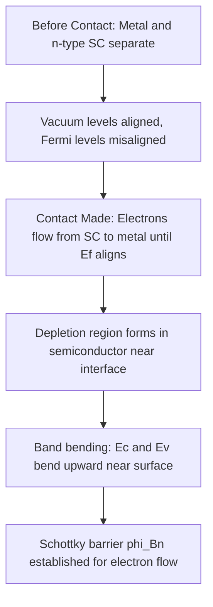

## Schottky Barrier Formation

### Introduction

A Schottky barrier is the potential energy barrier formed at the interface between a metal and a semiconductor when they are brought into contact. Unlike an ohmic contact, which allows current to flow freely in both directions with negligible resistance, a Schottky contact exhibits rectifying behavior similar to a p-n junction diode. This barrier arises from the difference in work functions between the metal and semiconductor, and its formation is foundational to metal-semiconductor (MS) contact physics, Schottky diodes, and MESFET gate design.

### Work Function Alignment: The Basic Picture

Before contact, the metal and semiconductor are characterized by their own vacuum-referenced energy levels:

- Metal work function: $\phi_m$ (energy from Fermi level to vacuum level)
- Semiconductor work function: $\phi_s$
- Semiconductor electron affinity: $\chi_s$ (energy from conduction band minimum to vacuum level)

When the metal and an n-type semiconductor are brought into contact, charge transfer occurs until the Fermi levels align at equilibrium (a requirement of thermodynamic equilibrium with no net current flow). If $\phi_m > \phi_s$ for an n-type semiconductor, electrons flow from the semiconductor (lower work function, easier to remove electrons from) into the metal, leaving behind a positively charged depletion region of ionized donors near the semiconductor surface. This produces:

- Band bending in the semiconductor near the interface (upward, for n-type with $\phi_m > \phi_s$)
- A barrier to electron flow from metal to semiconductor and vice versa
- A built-in potential $V_{bi}$ across the depletion region

### The Schottky-Mott Rule

The idealized (Schottky-Mott) model predicts the barrier height directly from the work function difference, assuming no interface states and perfect vacuum-level alignment:

**For n-type semiconductor (barrier to electrons):**

$$\phi_{Bn} = \phi_m - \chi_s$$

**For p-type semiconductor (barrier to holes):**

$$\phi_{Bp} = E_g/q - (\phi_m - \chi_s)$$

These two relations are consistent with each other since, for the same metal-semiconductor pair:

$$\phi_{Bn} + \phi_{Bp} = E_g/q$$

**Key Points**

- $\phi_{Bn}$ increases with increasing metal work function $\phi_m$ — using a higher work function metal raises the electron barrier.
- The Schottky-Mott rule predicts a linear dependence of barrier height on metal work function with unity slope, which is rarely observed experimentally in real, covalently-bonded semiconductors (see Fermi-level pinning below).

### Band Diagram: Before and After Contact

<svg xmlns="http://www.w3.org/2000/svg" viewBox="0 0 640 320" font-family="sans-serif">
<text x="320" y="20" font-size="14" text-anchor="middle" font-weight="bold">Schottky Barrier (Metal / n-type Semiconductor) (svg_diagram)</text>

<rect x="60" y="60" width="120" height="200" fill="#dddddd" stroke="black" stroke-width="1.5" />
<text x="120" y="280" text-anchor="middle" font-size="12">Metal</text>

<line x1="60" y1="150" x2="180" y2="150" stroke="black" stroke-width="2" stroke-dasharray="4,2" />
<text x="65" y="145" font-size="10">Ef (metal)</text>

<path d="M 180 90 Q 250 90 320 150" fill="none" stroke="black" stroke-width="2" />
<line x1="320" y1="150" x2="580" y2="150" stroke="black" stroke-width="2" />
<text x="590" y="155" font-size="11">Ec</text>

<line x1="180" y1="90" x2="180" y2="60" stroke="black" stroke-width="1" stroke-dasharray="2,2" />
<text x="185" y="55" font-size="10">q·phi_Bn</text>
<line x1="180" y1="60" x2="180" y2="90" stroke="red" stroke-width="2" />

<path d="M 180 230 Q 250 230 320 290" fill="none" stroke="black" stroke-width="2" />
<line x1="320" y1="290" x2="580" y2="290" stroke="black" stroke-width="2" />
<text x="590" y="295" font-size="11">Ev</text>

<line x1="180" y1="150" x2="580" y2="150" stroke="blue" stroke-width="1.5" stroke-dasharray="6,3" />
<text x="500" y="145" font-size="10" fill="blue">Ef (equilibrium, flat)</text>

<text x="250" y="310" text-anchor="middle" font-size="11">Depletion region (ionized donors)</text>

<line x1="180" y1="300" x2="320" y2="300" stroke="black" stroke-width="1" />

<line x1="180" y1="295" x2="180" y2="305" stroke="black" stroke-width="1" />

<line x1="320" y1="295" x2="320" y2="305" stroke="black" stroke-width="1" />

</svg>

### Depletion Region and Built-In Potential

The Schottky barrier's depletion region is mathematically analogous to a one-sided ($n^+p$ or $p^+n$-like) step junction, since the metal has an effectively infinite carrier density compared to the semiconductor. For an n-type semiconductor with donor concentration $N_D$:

$$W = \sqrt{\frac{2\varepsilon_s V_{bi}}{qN_D}}$$

$$V_{bi} = \phi_{Bn} - \phi_n$$

where $\phi_n = (E_c - E_F)/q$ in the bulk semiconductor (analogous to the n-side quasi-Fermi level offset in a p-n junction). Applying reverse bias $V_R$ increases the depletion width and barrier for the semiconductor side, while applying forward bias reduces it — this is the origin of the diode's rectifying I-V characteristic. Note that unlike a p-n junction, the barrier from the metal side ($\phi_{Bn}$ itself) remains essentially fixed with applied bias since the metal has negligible band bending due to its very high free-carrier density.

### Fermi-Level Pinning and Interface States

**Key Points**

- Real metal-semiconductor interfaces often show barrier heights that deviate substantially from the simple Schottky-Mott prediction and are much less sensitive to the choice of metal than the ideal theory predicts.
- This is attributed to a high density of interface states (surface states) within the semiconductor bandgap at the interface, arising from dangling bonds, defects, or metal-induced gap states (MIGS).
- If the interface state density is sufficiently high, the Fermi level becomes "pinned" near a specific energy within the gap (the charge neutrality level, CNL), largely independent of the metal's work function — the barrier height becomes determined primarily by the semiconductor's intrinsic surface properties rather than the metal choice.
- Covalent semiconductors like Si and GaAs show strong Fermi-level pinning; more ionic semiconductors (e.g., some oxides, SiC in some cases) show behavior closer to the ideal Schottky-Mott limit. [Inference: the degree of pinning is understood to correlate with the ionicity/covalency of the bonding, though quantitative prediction requires interface-specific surface-state calculations.]

The Bardeen model incorporates interface state density $D_{it}$ explicitly, interpolating between the Schottky-Mott limit (low $D_{it}$) and the fully pinned limit (high $D_{it}$):

$$\phi_{Bn} = \gamma(\phi_m - \chi_s) + (1-\gamma)(E_g/q - \phi_0)$$

where $\gamma$ is an interface-specific pinning parameter ($\gamma \to 1$ recovers Schottky-Mott; $\gamma \to 0$ gives complete pinning) and $\phi_0$ relates to the charge neutrality level.

### Image-Force Barrier Lowering (Schottky Effect)

Under applied bias, the effective barrier height is slightly reduced due to the image-charge attraction between an electron near the metal surface and its induced image charge in the metal. This is known as the Schottky effect (distinct from, but related to, the general term "Schottky barrier"):

$$\Delta\phi_B = \sqrt{\frac{qE_{max}}{4\pi\varepsilon_s}}$$

where $E_{max}$ is the maximum electric field at the interface. This barrier lowering increases with reverse bias (since $E_{max}$ increases with reverse bias), contributing to the soft, non-saturating reverse leakage current observed in real Schottky diodes rather than the ideal sharp saturation predicted by simple thermionic emission theory alone.

### Current Transport Mechanisms

Unlike p-n junctions (minority carrier diffusion dominated), Schottky diodes are majority-carrier devices, and their current is dominated by:

**Thermionic Emission (dominant in moderately doped semiconductors)**

$$J = A^*T^2 e^{-q\phi_{Bn}/kT}\left(e^{qV/kT} - 1\right)$$

where $A^*$ is the effective Richardson constant (material-dependent, incorporating the semiconductor's effective mass).

**Thermionic Field Emission and Field Emission (tunneling)**

In heavily doped semiconductors, the depletion width becomes thin enough that carriers can tunnel through the barrier rather than surmounting it thermally. This transitions the device from rectifying (diode-like) toward ohmic behavior, which is the basis for how ohmic contacts to semiconductors are practically engineered — by using very heavy doping at the contact interface to force tunneling-dominated transport even when a nonzero Schottky barrier is physically present.

### Ohmic vs. Rectifying Contacts

Whether a given metal-semiconductor pair forms a rectifying (Schottky) or ohmic contact depends on the sign of the barrier relationship:

- **n-type, rectifying:** $\phi_m > \phi_s$ (barrier to electrons from semiconductor side)
- **n-type, ohmic (ideal, unpinned case):** $\phi_m < \phi_s$ (no barrier; electrons flow freely)
- **p-type, rectifying:** $\phi_m < \phi_s$
- **p-type, ohmic (ideal, unpinned case):** $\phi_m > \phi_s$

In practice, due to Fermi-level pinning, true ohmic contacts to many semiconductors (especially Si and GaAs) are rarely achieved through work function selection alone; instead, heavy doping (degenerate doping, $>10^{19}$ cm$^{-3}$) is used near the contact to thin the depletion region sufficiently for tunneling-dominated ohmic conduction regardless of the nominal barrier height.

### Common Pitfalls

- Assuming the Schottky-Mott rule gives quantitatively accurate barrier heights for real Si or GaAs contacts — Fermi-level pinning typically dominates in these covalent materials.
- Treating $\phi_{Bn}$ as bias-dependent — the barrier height itself (metal-to-semiconductor-conduction-band-edge) is approximately constant with bias in the ideal picture; it is the depletion width and band bending on the semiconductor side that change with applied voltage.
- Confusing the built-in potential $V_{bi}$ with the barrier height $\phi_{Bn}$ — they differ by the bulk semiconductor's Fermi level position ($\phi_n$), and are only numerically close when doping is light.

### Conclusion

Schottky barrier formation arises from Fermi-level alignment at a metal-semiconductor junction, producing a potential barrier and a depletion region within the semiconductor analogous in structure to a one-sided p-n junction. While the idealized Schottky-Mott model predicts barrier height directly from the work function difference, real interfaces are strongly influenced by interface states and Fermi-level pinning, making the semiconductor's intrinsic surface properties often more important than the metal's work function in practice. This barrier governs both the rectifying behavior of Schottky diodes (via thermionic emission) and the design strategy for ohmic contacts (via heavy doping to induce tunneling transport).

**Related Topics**

- Schottky diode I-V characteristics and thermionic emission theory
- Ohmic contact formation via heavy doping and tunneling transport
- Metal-induced gap states (MIGS) and the Bardeen model
- MESFET gate design and depletion-mode operation
- Richardson constant and thermionic emission measurement
- Image-force barrier lowering and reverse leakage current