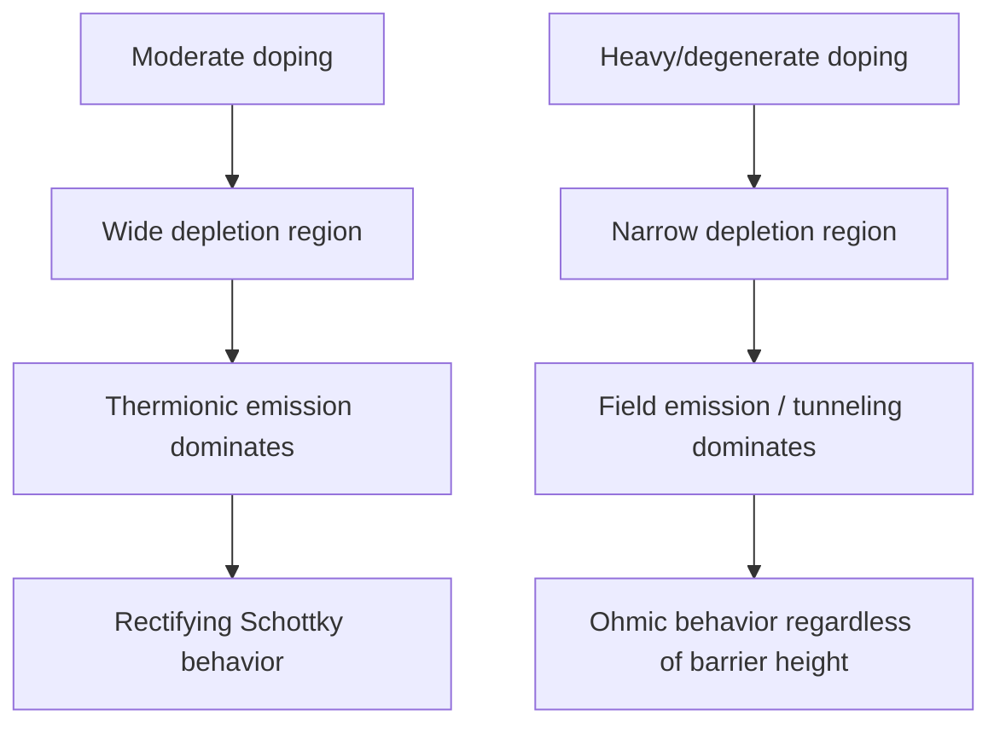

## Ohmic Contact Formation

### Introduction

An ohmic contact is a metal-semiconductor junction designed to have a linear, symmetric current-voltage relationship with negligible resistance, in contrast to the rectifying behavior of a Schottky contact. Ohmic contacts are essential to every semiconductor device, providing the low-resistance electrical connection between the semiconductor and external circuitry without introducing significant voltage drop, non-linearity, or noise. This topic builds directly on the barrier physics established in Schottky barrier formation.

### The Ideal (Low Work-Function-Difference) Case

In the idealized, unpinned Schottky-Mott picture, an ohmic contact forms naturally when there is no barrier to majority carrier flow:

- **n-type semiconductor:** ohmic if $\phi_m < \phi_s$ (metal work function less than semiconductor work function), so electrons can flow freely from metal to semiconductor without an opposing barrier.
- **p-type semiconductor:** ohmic if $\phi_m > \phi_s$

In this ideal case, no depletion region barrier forms, or forms in the "wrong" direction (accumulation rather than depletion), and current flows freely in both directions.

**Key Points**

- As established under Schottky barrier formation, real covalent semiconductors (Si, GaAs, GaN) exhibit strong Fermi-level pinning due to interface states, meaning the barrier height is largely independent of the metal's work function in practice.
- Because of this, simply choosing a low or high work-function metal is generally insufficient to produce a truly ohmic contact on these materials — an alternative strategy is needed.

### The Practical Strategy: Tunneling via Heavy Doping

The dominant practical method for forming ohmic contacts on pinned, covalent semiconductors does not try to eliminate the Schottky barrier — it instead makes the barrier's width thin enough that carriers tunnel through it, regardless of the nominal barrier height.

**Physical Mechanism**

The depletion width of a Schottky contact scales as:

$$W = \sqrt{\frac{2\varepsilon_s V_{bi}}{qN_D}}$$

By heavily doping the semiconductor near the contact surface (typically $N_D > 10^{19}$ cm$^{-3}$ for degenerate doping), $W$ becomes very thin — on the order of a few nanometers. At this thickness, the tunneling probability for carriers through the barrier becomes very high, and the contact resistance drops dramatically, effectively "shorting out" the rectifying behavior.

### Current Transport Regimes

As doping concentration increases, the dominant conduction mechanism transitions through three regimes:

**Thermionic Emission (TE)** — low to moderate doping ($N_D \lesssim 10^{17}$ cm$^{-3}$)

Carriers surmount the barrier thermally; contact is rectifying (standard Schottky diode behavior).

**Thermionic Field Emission (TFE)** — intermediate doping ($10^{17} - 10^{19}$ cm$^{-3}$)

Carriers are thermally excited partway up the barrier and then tunnel through the remaining, thinner portion. This is a mixed regime, common in many practical "near-ohmic" contacts.

**Field Emission (FE)** — heavy/degenerate doping ($N_D \gtrsim 10^{19}$ cm$^{-3}$)

Carriers tunnel directly through the barrier near the Fermi level without needing significant thermal excitation. This regime gives the lowest, most linear (most truly ohmic) contact resistance and is the target regime for practical ohmic contact fabrication.

### Specific Contact Resistance

The figure of merit for an ohmic contact is the specific contact resistance $\rho_c$ (units: $\Omega\cdot\text{cm}^2$), defined as:

$$\rho_c = \left(\frac{\partial J}{\partial V}\right)^{-1}_{V=0}$$

For the field-emission (tunneling) regime, $\rho_c$ depends exponentially on doping concentration and barrier height:

$$\rho_c \propto \exp\left(\frac{2\sqrt{\varepsilon_s m^*}\phi_{Bn}}{\hbar\sqrt{N_D}}\right)$$

**Key Points**

- $\rho_c$ decreases exponentially with increasing doping $N_D$ — this is the central design lever for lowering contact resistance.
- $\rho_c$ increases exponentially with barrier height $\phi_{Bn}$ — lower barrier metals are still preferred even in the tunneling-dominated regime, since they reduce the required doping level or further reduce $\rho_c$ at a given doping.
- Target values of $\rho_c$ for modern device technologies are typically in the $10^{-6}$ to $10^{-8}$ $\Omega\cdot\text{cm}^2$ range for competitive device performance, though acceptable values are strongly application- and technology-node-dependent.

### Fabrication Techniques

**Key Points**

- **Heavy ion implantation and annealing:** a shallow, highly-doped ($n^+$ or $p^+$) region is formed at the contact surface via ion implantation (e.g., As or P for $n^+$ Si) followed by activation annealing, then metal is deposited on top.
- **Alloyed contacts:** the metal is deposited and then annealed (alloyed) at elevated temperature, causing interdiffusion of metal and semiconductor species. A classic example is Au-Ge-Ni on GaAs, where Ge acts as an n-type dopant that diffuses into the GaAs during annealing, creating the heavily doped interfacial layer needed for tunneling.
- **Self-aligned silicide (salicide) contacts:** in modern Si CMOS technology, a refractory metal (e.g., Ti, Co, Ni) is deposited and reacted with Si to form a low-resistance silicide (e.g., NiSi), which forms directly on heavily doped source/drain regions, self-aligned to the gate.
- **Regrowth / epitaxial contact layers:** particularly in III-V technology, a heavily doped, often narrower-bandgap contact layer (e.g., InGaAs cap on GaAs/InP-based devices) is epitaxially grown specifically to reduce the effective barrier and enable low-resistance ohmic contact formation.

### Transmission Line Model (TLM) for Contact Resistance Measurement

The Transmission Line Model (also called Transfer Length Method) is the standard technique for experimentally extracting specific contact resistance. A series of ohmic contact pads with varying spacing $d$ is fabricated on a resistive semiconductor layer, and total resistance is measured between adjacent pads:

$$R_{total}(d) = R_c + R_{sheet}\frac{d}{W}$$

where $R_{sheet}$ is the semiconductor sheet resistance and $W$ is the contact width. Plotting $R_{total}$ vs. $d$ and extrapolating to $d = 0$ gives $2R_c$ (twice the individual contact resistance), while the slope gives $R_{sheet}/W$. The x-intercept of this line gives $-2L_T$, where $L_T$ is the transfer length — the characteristic distance over which current transfers from the metal into the semiconductor — related to $\rho_c$ and $R_{sheet}$ by:

$$L_T = \sqrt{\frac{\rho_c}{R_{sheet}}}$$

<svg xmlns="http://www.w3.org/2000/svg" viewBox="0 0 640 280" font-family="sans-serif">
<text x="320" y="20" font-size="14" text-anchor="middle" font-weight="bold">TLM Structure and Resistance Extraction (svg_diagram)</text>

<rect x="60" y="60" width="50" height="60" fill="#999999" stroke="black" stroke-width="1.5" />
<rect x="150" y="60" width="50" height="60" fill="#999999" stroke="black" stroke-width="1.5" />
<rect x="260" y="60" width="50" height="60" fill="#999999" stroke="black" stroke-width="1.5" />
<rect x="390" y="60" width="50" height="60" fill="#999999" stroke="black" stroke-width="1.5" />
<line x1="40" y1="140" x2="460" y2="140" stroke="black" stroke-width="1" />
<text x="250" y="155" text-anchor="middle" font-size="11">Semiconductor (resistive layer)</text>
<text x="80" y="135" text-anchor="middle" font-size="9">d1</text>
<text x="180" y="135" text-anchor="middle" font-size="9">d2</text>
<text x="330" y="135" text-anchor="middle" font-size="9">d3 (increasing spacing)</text>

<line x1="80" y1="250" x2="560" y2="250" stroke="black" stroke-width="1.5" />
<line x1="80" y1="250" x2="80" y2="180" stroke="black" stroke-width="1.5" />
<text x="320" y="270" text-anchor="middle" font-size="11">Pad spacing d</text>
<text x="40" y="215" text-anchor="middle" font-size="11" transform="rotate(-90 40 215)">R_total</text>

<line x1="150" y1="230" x2="520" y2="195" stroke="red" stroke-width="2" />
<circle cx="150" cy="230" r="3" fill="black" />
<text x="130" y="248" font-size="9">-2Lt</text>
<line x1="80" y1="242" x2="560" y2="242" stroke="black" stroke-width="0.5" stroke-dasharray="2,2" />
<text x="95" y="238" font-size="9">2Rc (y-intercept)</text>
</svg>

### Ohmic Contacts in Wide-Bandgap Semiconductors

Wide-bandgap materials such as SiC and GaN present additional challenges for ohmic contact formation because their large bandgap tends to produce inherently larger barrier heights, and achieving sufficiently high doping ($>10^{19}$ cm$^{-3}$) can be more difficult than in Si. Specialized approaches are used:

- **SiC:** Ni-based contacts annealed at high temperature (typically 900-1000°C) to form nickel silicides and carbon-related phases that reduce effective barrier height. [Inference: the exact mechanism and optimal anneal conditions are material- and process-specific, and are an active area of process development.]
- **GaN:** Ti/Al-based metal stacks, exploiting Al's low work function and the formation of interfacial TiN and AlN phases upon annealing, combined with n$^+$ GaN or AlGaN cap/regrowth layers to promote tunneling transport.

### Common Pitfalls

- Attempting to form an ohmic contact purely by choosing a low work-function metal on a strongly pinned semiconductor (e.g., Si, GaAs) — this generally fails to produce sufficiently low resistance because Fermi-level pinning makes the effective barrier largely independent of metal choice.
- Confusing "ohmic" (low-resistance, linear I-V by design) with "no barrier exists" — in the tunneling-dominated regime, a physical Schottky barrier is still present; it is simply thin enough to be electrically transparent to carriers.
- Neglecting sheet resistance contributions when interpreting TLM data — the total measured resistance includes both contact resistance and the resistive semiconductor between pads, and only proper linear extrapolation separates the two.

### Conclusion

Ohmic contact formation on real, Fermi-level-pinned semiconductors is achieved not by eliminating the Schottky barrier through work function selection, but by using heavy, often degenerate doping at the contact interface to narrow the depletion region sufficiently for field-emission (tunneling) transport to dominate over thermionic emission. This produces a contact with low, linear specific contact resistance regardless of the nominal barrier height. Practical fabrication relies on techniques such as ion implantation, alloying, silicidation, or epitaxial regrowth of heavily doped contact layers, with contact quality experimentally verified using the Transmission Line Model.

**Related Topics**

- Transmission Line Model (TLM) and transfer length extraction
- Self-aligned silicide (salicide) processes in CMOS technology
- Specific contact resistance scaling with doping concentration
- Fermi-level pinning and metal-induced gap states (MIGS)
- Alloyed III-V ohmic contacts (AuGeNi, PdGeAu)
- Wide-bandgap semiconductor contact engineering (SiC, GaN)