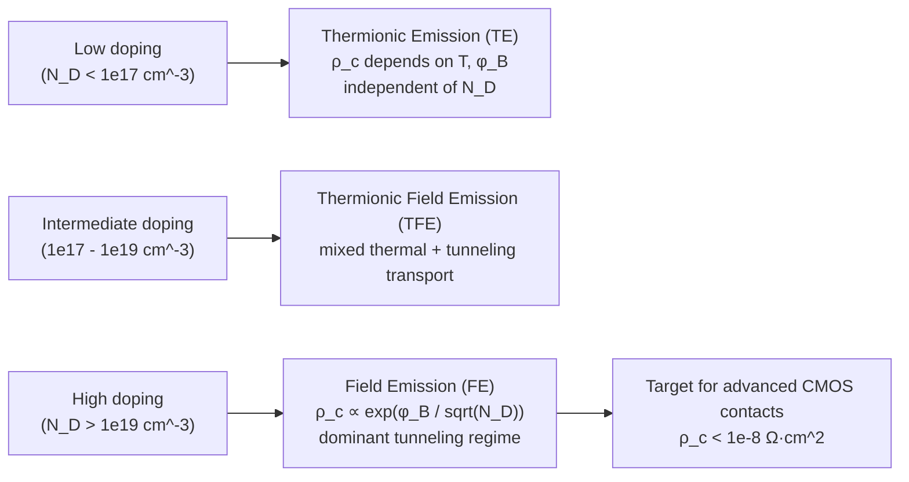

## Specific Contact Resistivity

### Definition

Specific contact resistivity (also called specific contact resistance), denoted $\rho_c$, quantifies the intrinsic resistance of a metal-semiconductor interface normalized to unit area. It is defined as:

$$\rho_c=\left(\frac{\partial J}{\partial V}\right)^{-1}_{V=0}$$

where $J$ is the current density across the interface and $V$ is the applied voltage. Units are $\Omega\cdot\text{cm}^2$. Unlike bulk resistivity ($\Omega\cdot\text{cm}$), $\rho_c$ is an area-normalized quantity because contact resistance scales inversely with contact area, not length.

The total contact resistance $R_c$ for a contact of area $A$ relates to $\rho_c$ as:

$$R_c=\frac{\rho_c}{A}$$

This inverse-area scaling is why $\rho_c$, not $R_c$, is the fundamental figure of merit used to compare contact technologies across different device geometries and technology nodes.

### Physical Origin

$\rho_c$ arises from the transport mechanism governing carrier flow across the metal-semiconductor junction. Three regimes dominate depending on the semiconductor doping concentration $N_D$ (or $N_A$) and temperature:

**Thermionic Emission (TE)** — dominant at low doping ($N_D\lesssim10^{17}\text{cm}^{-3}$), where carriers surmount the Schottky barrier thermally:

$$\rho_c=\frac{k}{qA^{*}T}\exp\left(\frac{q\phi_B}{kT}\right)$$

Here $A^{*}$ is the effective Richardson constant, $\phi_B$ is the Schottky barrier height, $k$ is Boltzmann's constant, $q$ is elementary charge, and $T$ is temperature. In this regime, $\rho_c$ is strongly temperature-dependent and independent of doping.

**Thermionic Field Emission (TFE)** — intermediate doping ($10^{17}$–$10^{19}\text{cm}^{-3}$), where carriers are thermally excited partway up the barrier and then tunnel through the remaining width.

**Field Emission (FE)** — dominant at high doping ($N_D\gtrsim10^{19}\text{cm}^{-3}$), where the depletion width becomes thin enough ($\sim$few nm) for direct quantum-mechanical tunneling at or near the Fermi level:

$$\rho_c\propto\exp\left(\frac{2\sqrt{\epsilon_s m^{*}}}{\hbar}\cdot\frac{\phi_B}{\sqrt{N_D}}\right)$$

This is the technologically critical regime: $\rho_c$ depends exponentially on $\phi_B/\sqrt{N_D}$, meaning it can be reduced dramatically either by lowering the barrier height or by increasing doping at the contact interface. This is why heavily doped contact implants (source/drain regions, contact plugs) are standard practice — modern CMOS contacts rely on degenerate doping ($>10^{20}\text{cm}^{-3}$) to push transport into the FE regime.

### Barrier Height Dependence

Since $\phi_B$ enters exponentially in both TE and FE regimes, $\rho_c$ is exquisitely sensitive to barrier height, which itself depends on:

- Metal work function $\phi_M$ and semiconductor electron affinity $\chi$ (ideal Schottky-Mott limit: $\phi_{Bn}=\phi_M-\chi$)
- Fermi-level pinning from interface states, which in practice dominates over the Schottky-Mott prediction for many metal/semiconductor pairs (notably Si, Ge, and most III-V systems)
- Interfacial layers (native oxide, silicide/germanide phase) that modify the effective barrier

[Inference] The degree of Fermi-level pinning is material- and process-dependent and is often only empirically characterized rather than predicted from first principles for a given metal-semiconductor pair.

### Measurement Techniques

**Transmission Line Method (TLM)** — the standard technique. A series of contact pads with varying spacing $d$ are patterned on a resistive layer; total resistance between adjacent pads is measured and plotted versus $d$:

$$R_T=R_{sh}\frac{d}{W}+2R_c$$

where $R_{sh}$ is the sheet resistance of the semiconductor layer, $W$ is the contact width, and $R_c$ is the contact resistance per pad. Extrapolating the linear fit to $d=0$ gives $2R_c$; the x-intercept gives the transfer length $L_T$. From these:

$$\rho_c=R_c\cdot W\cdot L_T$$

**Circular Transmission Line Method (CTLM)** — avoids mesa isolation/edge current-crowding errors inherent to linear TLM by using concentric circular contacts, useful for planar structures without device isolation.

**Cross-Bridge Kelvin Resistor (CBKR)** — a four-terminal Kelvin structure that directly forces current through a contact and senses voltage separately, eliminating parasitic resistance from probe/pad leads. Preferred for very low $\rho_c$ values ($<10^{-7}\ \Omega\cdot\text{cm}^2$) where TLM extraction error becomes significant.

### Transfer Length

The transfer length $L_T$ characterizes the effective distance over which current crowds into the contact from the semiconductor:

$$L_T=\sqrt{\frac{\rho_c}{R_{sh}}}$$

If the physical contact length $L\gg L_T$, most current transfers within a distance $\sim L_T$ from the contact edge, and further contact length contributes negligibly to reducing resistance — a key layout consideration, since making contacts longer than a few $L_T$ wastes area without improving $R_c$.

### Technological Significance

As transistor contact areas shrink with each technology node, $R_c=\rho_c/A$ increases even if $\rho_c$ stays constant, making contact resistance an increasingly dominant fraction of total parasitic resistance in scaled devices. This has driven substantial process innovation:

- **Silicidation/germanidation** (e.g., NiSi, TiSi₂, NiGe) to form low-barrier, low-resistivity interfacial compounds
- **Dopant segregation techniques** at the silicide/semiconductor interface to pile up dopants and thin the depletion width, pushing transport toward FE
- **Interface dipole engineering** using thin insulating layers to de-pin the Fermi level and tailor effective barrier height [Inference] — an active research area rather than a fully standardized production technique across all foundries

Typical target values for advanced logic nodes are $\rho_c<10^{-8}\ \Omega\cdot\text{cm}^2$, values which push TLM measurement resolution limits and motivate CBKR usage.

### Example

For a contact with $\rho_c=1\times10^{-8}\ \Omega\cdot\text{cm}^2$ and area $A=100\ \text{nm}\times100\ \text{nm}=10^{-10}\ \text{cm}^2$:

$$R_c=\frac{10^{-8}}{10^{-10}}=100\ \Omega$$

This illustrates why area scaling alone, without corresponding $\rho_c$ reduction, causes contact resistance to dominate device performance at advanced nodes.

### Diagram: TLM Structure and Resistance Extraction

<svg xmlns="http://www.w3.org/2000/svg" viewBox="0 0 640 320" font-family="sans-serif">
<text x="20" y="24" font-size="15" font-weight="bold">TLM Test Structure and R vs d Extraction (svg_diagram)</text>

<g transform="translate(20,50)">
<rect x="0" y="0" width="300" height="60" fill="#dcdcdc" stroke="#333" />
<text x="150" y="-6" font-size="11" text-anchor="middle">Semiconductor mesa (sheet resistance R_sh)</text>
<rect x="10" y="10" width="30" height="40" fill="#888" stroke="#000" />
<rect x="70" y="10" width="30" height="40" fill="#888" stroke="#000" />
<rect x="150" y="10" width="30" height="40" fill="#888" stroke="#000" />
<rect x="250" y="10" width="30" height="40" fill="#888" stroke="#000" />
<text x="25" y="68" font-size="9" text-anchor="middle">pad1</text>
<text x="85" y="68" font-size="9" text-anchor="middle">pad2</text>
<text x="165" y="68" font-size="9" text-anchor="middle">pad3</text>
<text x="265" y="68" font-size="9" text-anchor="middle">pad4</text>
<line x1="40" y1="30" x2="70" y2="30" stroke="#000" stroke-dasharray="3,2" />
<text x="55" y="22" font-size="8" text-anchor="middle">d1</text>
<line x1="100" y1="30" x2="150" y2="30" stroke="#000" stroke-dasharray="3,2" />
<text x="125" y="22" font-size="8" text-anchor="middle">d2</text>
<line x1="180" y1="30" x2="250" y2="30" stroke="#000" stroke-dasharray="3,2" />
<text x="215" y="22" font-size="8" text-anchor="middle">d3</text>
</g>

<g transform="translate(360,50)">
<line x1="0" y1="200" x2="0" y2="0" stroke="#000" />
<line x1="0" y1="200" x2="260" y2="200" stroke="#000" />
<text x="-10" y="-6" font-size="10">R_T</text>
<text x="265" y="212" font-size="10">d (spacing)</text>



```
<line x1="30" y1="160" x2="230" y2="20" stroke="#1a5fb4" stroke-width="2" />

<line x1="30" y1="160" x2="0" y2="185" stroke="#1a5fb4" stroke-width="2" stroke-dasharray="4,3" />

<circle cx="0" cy="185" r="3" fill="#c00" />
<text x="6" y="188" font-size="9" fill="#c00">2R_c (y-intercept)</text>

<line x1="0" y1="200" x2="0" y2="200" stroke="#c00" />
<circle cx="-40" cy="200" r="3" fill="#c00" transform="translate(0,0)" />
<line x1="-40" y1="0" x2="-40" y2="200" stroke="#c00" stroke-dasharray="2,2" transform="translate(0,0)" />
<text x="-70" y="215" font-size="9" fill="#c00">-2L_T</text>

<text x="120" y="80" font-size="10">slope = R_sh / W</text>
```

</g>

<text x="20" y="300" font-size="11">ρ_c = R_c · W · L_T, L_T = √(ρ_c / R_sh)</text>

</svg>

### Diagram: Transport Regime vs Doping



### Key Points

- $\rho_c$ is area-normalized ($\Omega\cdot\text{cm}^2$), fundamentally distinct from sheet or bulk resistivity
- FE regime (heavy doping, thin depletion width) is the practically relevant regime for modern low-resistance contacts
- $\rho_c$ depends exponentially on barrier height and inversely on $\sqrt{N_D}$ in the FE regime — small barrier or doping changes cause large $\rho_c$ swings
- TLM is the standard extraction method; CBKR is preferred for ultra-low $\rho_c$ where TLM parasitic errors dominate
- Transfer length $L_T$ sets the effective contact length beyond which additional contact area is wasted

### Related Topics

- Schottky Barrier Height and Fermi-Level Pinning
- Silicide/Germanide Formation for Contact Engineering
- Dopant Segregation at Metal-Semiconductor Interfaces
- Sheet Resistance and Van der Pauw Measurement
- Ohmic Contact Formation Strategies
- Parasitic Resistance Scaling in Advanced CMOS Nodes